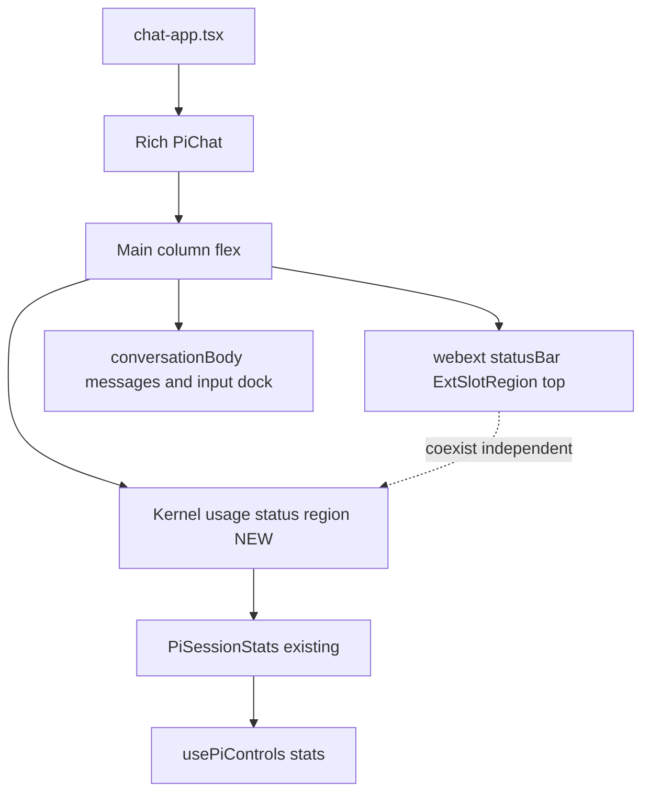
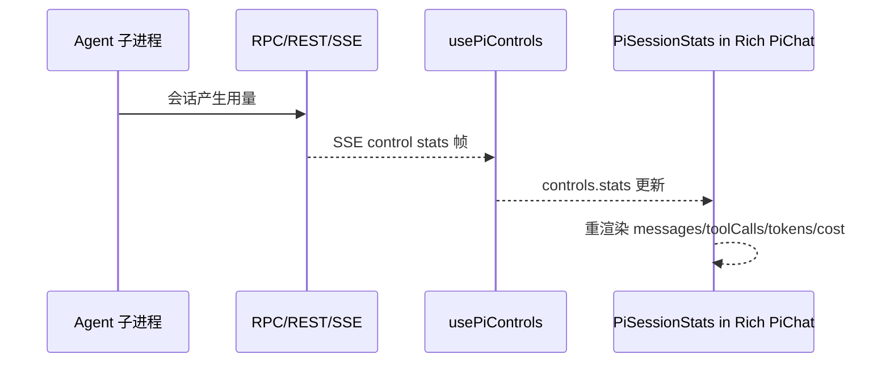

# Design Document

## Overview

**Purpose**：把现成的会话用量组件 `PiSessionStats` 接入产品实际使用的富版 `PiChat`，以**内核自有的底部状态条**展示当前会话用量（messages / tool calls / tokens / cost），让用户在对话过程中实时掌握 token 消耗与成本。

**Users**：使用 pi-web 产品界面（富版 `PiChat`，经 `components/chat-app.tsx` 进入）的开发者/用户。

**Impact**：富版 `PiChat` 当前不渲染任何用量信息。本特性新增一块内核自有状态区，复用既有 `usePiControls.stats` 数据与既有 `PiSessionStats` 组件，不改协议、不改数据源、不动 `PiChatBasic`。

### Goals
- 富版 `PiChat` 渲染用量面板（`data-pi-session-stats`），展示四项字段并随 `stats` 实时刷新。
- 与 webext `statusBar` slot 并存、互不顶替（各自独立 data 属性）。
- 提供单元/组件测试 + 浏览器 e2e 验收（隔离 build）。

### Non-Goals
- 跨会话历史用量聚合/看板（后续阶段，独立路由 `/usage`）。
- 新增用量数据源或后端聚合；修改 `SessionStatsSchema`、REST/SSE 契约。
- 修改 `ToolbarControl` 固定枚举；改动 `PiChatBasic` 行为。

## Boundary Commitments

### This Spec Owns
- 富版 `PiChat`（`packages/ui/src/chat/pi-chat.tsx`）内**内核自有用量状态区**的渲染、放置与显隐门控。
- 该状态区的对外开关 prop `showSessionStats?: boolean`（默认 `true`）。
- 本特性对应的组件测试与浏览器 e2e。

### Out of Boundary
- 用量数据的产生、聚合、持久化（由既有 RPC/REST/SSE 链路负责，现状成立）。
- webext `statusBar` / `panelRight` / `artifact` 等 slot 的渲染职责（仍归 `extension-slots.tsx` / `apply-extension.tsx`）。
- `PiSessionStats` 组件内部展示逻辑的重写（仅复用，不重构其字段）。
- `PiChatBasic` 的既有用量展示。

### Allowed Dependencies
- `usePiControls`（`@blksails/react`）→ 提供 `controls.stats`（`SessionStats`）。
- 既有组件 `PiSessionStats`（`packages/ui/src/controls/pi-session-stats.js`）。
- 既有 webext slot 机制（仅作为「并存」对照，不被本特性借用承载内核用量）。
- 依赖方向遵循 steering：`ui` 依赖 `react`/`protocol`，不反向依赖 server。

### Revalidation Triggers
- `SessionStatsSchema` 字段形状变化（影响展示字段）。
- `usePiControls` 的 `stats` 暴露方式变化。
- 富版 `PiChat` 主列 DOM 结构重构（影响状态区挂载锚点）。
- webext `statusBar` 的 data 属性（`data-pi-ext-status-bar`）变化（影响并存断言）。

## Architecture

### Existing Architecture Analysis
- 富版 `PiChat` 主列容器：`<div className="relative isolate flex min-w-0 flex-1 flex-col">`（`pi-chat.tsx:862`），垂直排列 background → header → `extensionHeader` → webext `statusBar`/`toolbar`（`ExtSlotRegion`，`:887-888`，**顶部**）→ `conversationBody`（含底部输入 dock）→ webext `artifactSurface`（`:904`）→ footer。
- webext slot 遵循 `extension-slots.tsx` 的「共存追加，绝不替换内核表面」：`ExtSlotRegion` 仅在扩展声明该 slot 时渲染容器，否则 `return null`。webext `statusBar` 容器带 `data-pi-ext-status-bar`。
- `PiSessionStats` 已存在并带 `data-pi-session-stats` 及 `data-pi-stat="messages|toolCalls|tokens|cost"`，数据取自 `controls.stats`。
- 富版 `PiChat` **无 `showControls`**，控件均按 `controls !== undefined` 条件渲染。

### Architecture Pattern & Boundary Map



**Architecture Integration**
- Selected pattern：在主列内新增一块**内核自有状态区**（底部、footer 之前），与顶部 webext `statusBar` 物理分离、各带独立 data 属性，实现「并存不顶替」。
- 新组件理由：内核用量不得借用 `ExtSlotRegion`（扩展贡献会顶替），故必须由内核直接渲染。
- 既有模式保留：webext slot 的「声明才渲染、追加不替换」语义完全不变。
- Steering 合规：仅改 `ui` 包内组件，依赖方向不反转。

### Technology Stack

| Layer | Choice / Version | Role in Feature | Notes |
|-------|------------------|-----------------|-------|
| Frontend | React 19 + shadcn/ui（既有） | 渲染内核用量状态区，复用 `PiSessionStats` | 仅 `@blksails/ui` 包内 |
| Data | `usePiControls.stats`（`@blksails/react`，既有） | 提供 `SessionStats` | 不新增数据源 |
| Test | Vitest + Testing Library（组件）、Playwright/隔离 build（e2e） | 验收 | e2e 用 `NEXT_DIST_DIR=.next-e2e` + external server |

## File Structure Plan

### Modified Files
- `packages/ui/src/chat/pi-chat.tsx` — 新增可选 prop `showSessionStats?: boolean`（默认 `true`）；在主列 `conversationBody` 与 `artifactSurface` 之间插入内核自有用量状态区：当 `showSessionStats !== false && controls !== undefined` 时渲染 `<div data-pi-session-stats-region><PiSessionStats controls={controls} /></div>`；导入 `PiSessionStats`。

> 说明：`PiSessionStats` 已带 `data-pi-session-stats`；外层包裹 `data-pi-session-stats-region` 作为内核区的稳定锚点（便于 e2e 与 webext statusBar 区分）。

### Created Files
- `packages/ui/test/chat/pi-chat-session-stats.test.tsx` — 组件测试（渲染、字段、空态、显隐门控、与 webext statusBar 并存）。
- e2e 用例文件（见 Testing Strategy；落位对齐既有 e2e 目录与隔离 build 跑法）。

## Components and Interfaces

| Component | Domain/Layer | Intent | Req Coverage | Key Dependencies (P0/P1) | Contracts |
|-----------|--------------|--------|--------------|--------------------------|-----------|
| Rich `PiChat` 用量状态区 | UI | 在富版渲染内核自有用量面板并门控显隐 | 1.1,1.2,1.3,1.4,4.1,4.2,4.3,5.3 | `usePiControls.stats`(P0), `PiSessionStats`(P0) | State |
| `PiSessionStats`（既有，复用） | UI | 展示 messages/toolCalls/tokens/cost 与空态 | 2.1,2.2,2.3,3.1,3.2 | `controls.stats`(P0) | State |

### UI

#### Rich PiChat 用量状态区（修改 `pi-chat.tsx`）

| Field | Detail |
|-------|--------|
| Intent | 在富版主列内以内核自有区渲染用量面板，并提供显隐开关 |
| Requirements | 1.1, 1.2, 1.3, 1.4, 4.1, 4.2, 4.3, 5.3 |

**Responsibilities & Constraints**
- 仅当 `showSessionStats !== false` 且 `controls !== undefined` 时渲染用量区；否则不渲染（满足 1.2、1.4 空态由 `PiSessionStats` 内部处理）。
- 用量区为内核自有 DOM，**不经 `ExtSlotRegion`**；与 webext `statusBar`（顶部，`data-pi-ext-status-bar`）位置分离、互不顶替（4.1、4.2）。
- 不渲染进 `panelRight`（4.3）。
- 不影响默认版面（无遮挡/溢出）：作为主列普通块级流式元素插入（5.3）。

**Dependencies**
- Outbound: `PiSessionStats` — 渲染用量（P0）
- Outbound: `usePiControls.stats` — 数据源（P0）

**Contracts**: State [x]

##### State Management
- State model：无新增本地 state；直接读 `controls.stats`（`SessionStats | undefined`）。
- 实时刷新：`stats` 由 SSE control `stats` 帧驱动（既有），React 重渲染自动反映（3.1）。
- 并发/一致性：纯展示，无写路径。

##### Props 增量
```typescript
// PiChatProps 增量
interface PiChatProps {
  // ...既有字段
  /** 是否展示内核自有会话用量状态区；默认 true。 */
  readonly showSessionStats?: boolean;
}
```

**Implementation Notes**
- Integration：在 `pi-chat.tsx` 主列 `conversationBody` 之后、`artifactSurface` ExtSlotRegion 之前插入；`import { PiSessionStats } from "../controls/pi-session-stats.js";`。
- Validation：`showSessionStats` 默认 `true`，缺省即渲染（产品默认可见）。
- Risks：放置点需确保不与底部输入 dock 的 `absolute bottom-0` 叠放冲突——用量区作为 `conversationBody` 的**兄弟块**（在其下方），不进入 dock 内部，避免触碰 dock 布局（与本特性「不大改布局」一致）。

#### PiSessionStats（既有，复用，summary-only）
- 既有组件，带 `data-pi-session-stats` 与 `data-pi-stat="messages|toolCalls|tokens|cost"`，`stats===undefined` 显示「No stats yet」空态。本特性不修改其内部实现，仅复用。满足 2.1/2.2/2.3、3.2。

## Requirements Traceability

| Requirement | Summary | Components | Interfaces | Flows |
|-------------|---------|------------|------------|-------|
| 1.1 | 富版渲染用量面板带 data 属性 | Rich PiChat 用量状态区 | JSX 挂载 | — |
| 1.2 | showSessionStats=false 不渲染 | Rich PiChat 用量状态区 | `showSessionStats` prop | — |
| 1.3 | 内核自有不依赖扩展 | Rich PiChat 用量状态区 | 非 ExtSlotRegion 渲染 | — |
| 1.4 | controls/stats 缺失显示空态 | PiSessionStats | `controls.stats` | — |
| 2.1 | 展示四字段 | PiSessionStats | `SessionStats` | — |
| 2.2 | 字段 data 属性 | PiSessionStats | `data-pi-stat` | — |
| 2.3 | cost 货币格式 | PiSessionStats | `fmtCost` | — |
| 3.1 | stats 更新刷新 | Rich PiChat 用量状态区 / PiSessionStats | `usePiControls.stats` | SSE stats 帧 |
| 3.2 | 无用量显示空态 | PiSessionStats | `controls.stats` | — |
| 4.1 | 与 webext statusBar 并存 | Rich PiChat 用量状态区 | `data-pi-session-stats-region` vs `data-pi-ext-status-bar` | — |
| 4.2 | 不借 ExtSlotRegion 承载 | Rich PiChat 用量状态区 | 内核直接渲染 | — |
| 4.3 | 不进 panelRight | Rich PiChat 用量状态区 | 主列底部挂载 | — |
| 5.1 | 不回归 PiChatBasic | （不改该文件） | — | — |
| 5.2 | 不改协议/数据源 | （不改 protocol/REST/SSE） | — | — |
| 5.3 | 默认版面不破坏 | Rich PiChat 用量状态区 | 块级流式插入 | — |
| 6.1-6.4 | 单元+e2e+隔离 build+证据 | 测试文件 | 见 Testing Strategy | — |

## System Flows



## Error Handling

### Error Strategy
- 纯展示组件，无写路径、无网络调用新增。
- `stats === undefined` → `PiSessionStats` 渲染空态「No stats yet」（graceful degradation，满足 1.4/3.2）。
- `controls === undefined` → 用量区整体不渲染（不抛错）。

### Monitoring
- 无新增监控；沿用既有 SSE/RPC 日志。

## Testing Strategy

### Unit / Component Tests（`packages/ui/test/chat/pi-chat-session-stats.test.tsx`）
1. 富版 `PiChat`（`controls` 提供 `stats`）渲染 `[data-pi-session-stats-region]` 与 `[data-pi-session-stats]`，且四个 `[data-pi-stat]` 值正确（1.1, 2.1, 2.2）。
2. `showSessionStats={false}` 时不渲染用量区（1.2）。
3. `stats === undefined` 时渲染空态「No stats yet」（1.4, 3.2）。
4. 传入声明了 `statusBar` slot 的 `extension` 时，`[data-pi-ext-status-bar]` 与 `[data-pi-session-stats]` **同时存在**（4.1，并存不顶替）。
5. 用量区不出现在 `[data-pi-chat-aside]`（panelRight）内（4.3）。

### E2E Tests（隔离 build：`NEXT_DIST_DIR=.next-e2e` + external server）
1. 产品界面加载富版 `PiChat` 后，`[data-pi-session-stats]` 可见且展示四项字段（6.2, 1.1, 2.1）。
2. 触发一次会话回复后，用量字段（tokens/cost/messages/toolCalls）随 `stats` 刷新为非空/更新值（3.1, 6.2）。
3. （并存）在含 webext `statusBar` 贡献的 agent 源下，`[data-pi-ext-status-bar]` 与 `[data-pi-session-stats]` 并存（4.1）。

### 验收证据
- 以实际运行输出（vitest 结果、e2e 通过日志/截图）作为新鲜证据，遵循 `kiro-verify-completion`（6.4）。
