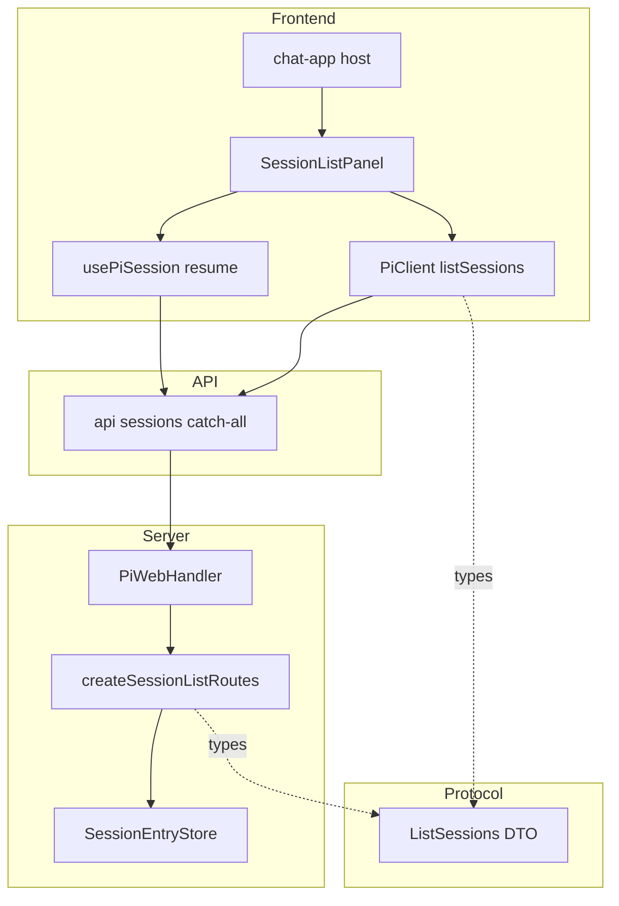
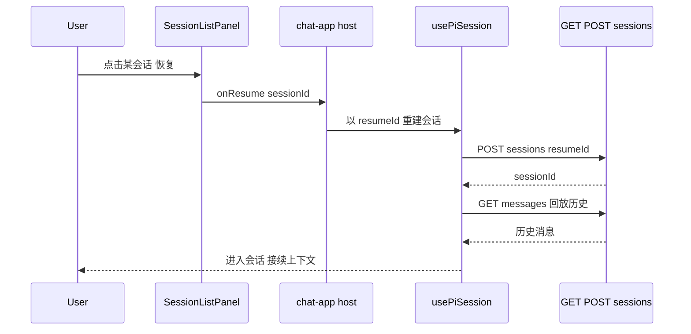

# Design Document — sessions-list

## Overview

**Purpose**：为 pi-web 提供「会话列表」能力——用户在 Web UI 内浏览历史会话并一键恢复继续对话，免去手填会话 id。
**Users**：pi-web 终端用户（找回历史工作）；部署方/集成方（控制是否暴露全机器会话、控制展示位置）。
**Impact**：在既有 HTTP 处理器上新增一个**只读列表端点**（经现有 `routes:` 注入接缝），在前端新增一个经宿主 `slots` 注入的**会话列表面板**，并复用既有的 `resumeId` 恢复链路。不改动会话运行/流式内核，不改动持久化存储 schema。

### Goals
- 暴露「当前目录会话」与「系统会话（全机器）」两类只读视图，后者默认关闭、可由部署配置开启。
- 列表仅基于轻量 header 元数据（不读会话正文），并对大规模历史分页返回。
- 从列表一键恢复任意历史会话进入对话，复用既有恢复链路。
- 展示位置不硬编码：经宿主 `slots` 优先级链注入，默认左侧栏，可由配置重定位。

### Non-Goals
- 会话删除/重命名/归档/搜索（本期不做）。
- 列表项展示消息条数、首条消息摘要等需读会话正文的重型字段。
- 跨机器/远端会话聚合；新建会话入口的重做。
- 接入 webext 的 18 个扩展 SlotKey 体系（sidebarLeft/panelRight 等）——本期用宿主 `PiChatSlots`，扩展 SlotKey 列为未来增强。
- 在 `SessionEntryStore` 层引入原生分页/索引或新增 `updatedAt` 列（sqlite/postgres schema 迁移）。

## Boundary Commitments

### This Spec Owns
- 新增只读端点 `GET /sessions`（scope/cwd/limit/cursor 语义、排序、分页、全局门控）。
- 列表响应契约：`ListSessionsResponse` / `SessionListItem`（protocol DTO）。
- 前端 `SessionListPanel` 组件及其加载/空/错误态、视图切换、恢复触发。
- 宿主接线：依据配置选择注入的 `slots` key 与全局视图可见性。

### Out of Boundary
- 会话运行、流式、消息发送、恢复后的会话生命周期——归既有 session-engine / `usePiSession`；本特性仅以 `resumeId` 触发既有恢复。
- 持久化写入与存储 schema——归既有 `SessionEntryStore` 适配器；本特性只读。
- webext 扩展 SlotKey 渲染（`ExtSlotRegion`）——不在本期。

### Allowed Dependencies
- `@pi-web/server`：`SessionEntryStore`、`createSessionEntryStore`、`sessionStoreConfigFromEnv`、`InjectedRoute`、`jsonResponse`/`errorResponse`。
- `@pi-web/protocol`：新增列表 DTO（依赖方向 `protocol ← server`、`protocol ← react/ui`，不反向）。
- `@pi-web/react`：`PiClient` 扩展 `listSessions`；既有 `usePiSession` 恢复链路。
- `@pi-web/ui`：宿主 `PiChatSlots`、`PiChat` 注入面。
- 依赖方向：`protocol → server → (装配) pi-handler`；`protocol → react → ui → chat-app`。前端不依赖 server 内部实现，仅经 HTTP 契约。

### Revalidation Triggers
- `SessionListItem`/`ListSessionsResponse` 契约形状变化。
- `SessionEntryStore.list/listAll` 签名或排序保证变化。
- 全局门控/位置配置的环境变量名或语义变化。
- `PiChatSlots` 可选 key 集合变化（影响重定位取值）。

## Architecture

### Existing Architecture Analysis
- HTTP 处理器经 `createPiWebHandler({ ..., routes })` 装配，外部能力（config/sandbox/extensions/attachment）均以 `createXxxRoutes(): InjectedRoute[]` 注入 `routes:`（`pi-handler.ts:312-332`）。**本特性照此模式新增 `createSessionListRoutes`**。
- 冷恢复读取器已用 `sessionStoreConfigFromEnv()` 惰性接持久化存储（`pi-handler.ts:303`）；列表端点复用同一配置来源，保证与恢复读到同一后端。
- 前端宿主 `slots` 有 `background` 优先级链先例（宿主 > components > extension，`pi-chat.tsx:759-775`），列表面板照此以宿主 `slots` 注入。

### Architecture Pattern & Boundary Map



**Architecture Integration**
- Selected pattern：注入式路由 + 宿主 slot 注入（与现有扩展点一致），无新框架。
- Boundaries：server 只负责「读 + 排序 + 分页 + 门控」；前端只负责「展示 + 切换 + 触发恢复」；protocol 持有共享契约。
- Steering compliance：依赖方向 `protocol ← 所有`、`server` 仅依赖 protocol、`react/ui` 与后端解耦（structure steering）。

### Technology Stack

| Layer | Choice / Version | Role in Feature | Notes |
|-------|------------------|-----------------|-------|
| Frontend | React + Next.js（既有） | SessionListPanel、宿主接线、`NEXT_PUBLIC_*` 读取 | 位置/全局开关构建期内联 |
| Backend | `@pi-web/server`（既有） | `GET /sessions` 注入路由、排序/分页/门控 | 复用 `jsonResponse/errorResponse` |
| Data | `SessionEntryStore`（fs/sqlite/postgres，既有） | 只读 `list/listAll` | 仅 header 元数据；无 schema 改动 |
| Protocol | `@pi-web/protocol` + zod（既有） | 列表 DTO | `protocol ← server/react/ui` |

## File Structure Plan

### 新增文件
```
packages/server/src/http/routes/
└── session-list-routes.ts      # createSessionListRoutes(): InjectedRoute[]；GET /sessions 的排序/分页/门控/映射

packages/ui/src/elements/
└── session-list-panel.tsx      # SessionListPanel：Tab/列表项/加载空错误态/恢复触发（展示层，无新边界）
```

### 修改文件
- `packages/protocol/src/transport/rest-dto.ts` — 新增 `ListSessionsRequestSchema`、`SessionListItemSchema`、`ListSessionsResponseSchema` 及推导类型。
- `packages/server/src/http/routes/index.ts`（或 server barrel 导出处） — 导出 `createSessionListRoutes`。
- `packages/react/src/client/pi-client.ts` — `PiClient` 新增 `listSessions(params): Promise<ListSessionsResponse>`。
- `lib/app/pi-handler.ts` — `routes:` 数组追加 `...createSessionListRoutes({ storeConfig: sessionStoreConfigFromEnv(), globalEnabled, defaultCwd: config.defaultCwd })`；`globalEnabled` 读 `process.env.NEXT_PUBLIC_PI_WEB_SESSIONS_GLOBAL`。
- `components/chat-app.tsx` — 读 `NEXT_PUBLIC_PI_WEB_SESSIONS_GLOBAL` / `NEXT_PUBLIC_PI_WEB_SESSIONS_SLOT`；构造 `<SessionListPanel>` 注入 `PiChat` 的 `slots[slotKey]`（默认 `sidebar`）；`onResume(sessionId)` 走既有 `resumeId` 恢复。
- `packages/ui/src/index.ts`（barrel） — 导出 `SessionListPanel`。

> 依赖方向：`session-list-routes.ts` 仅 import protocol DTO + server 内部工具；`session-list-panel.tsx` 仅 import protocol 类型 + UI 基元；接线集中在 `chat-app.tsx`（宿主），不在 UI 包内读 env。

## System Flows

### 恢复历史会话（R4）



- 门控决策：`scope=all` 在 `globalEnabled=false` 时由 `GET /sessions` 直接拒绝（不读存储）；前端在 `globalEnabled=false` 时不渲染「系统会话」Tab（双重保险，R2.2/R2.3）。

## Requirements Traceability

| Requirement | Summary | Components | Interfaces | Flows |
|-------------|---------|------------|------------|-------|
| 1.1, 1.2 | 列当前目录、按时间倒序 | session-list-routes | GET /sessions (scope=cwd) | — |
| 1.3 | 空态 | SessionListPanel | — | — |
| 1.4 | 跳过损坏条目 | session-list-routes（依赖 store 容错） | GET /sessions | — |
| 2.1, 2.4 | 列系统会话、分页 | session-list-routes | GET /sessions (scope=all) | — |
| 2.2 | 默认隐藏系统入口 | chat-app、SessionListPanel | `NEXT_PUBLIC_PI_WEB_SESSIONS_GLOBAL` | — |
| 2.3 | 关闭时拒绝系统请求 | session-list-routes | GET /sessions 403 | — |
| 3.1, 3.2 | 轻量列表项、不读正文 | SessionListPanel、session-list-routes | SessionListItem | — |
| 3.3, 3.4 | 分页与游标续取不重复 | session-list-routes | limit/cursor/nextCursor | — |
| 4.1, 4.2, 4.3 | 恢复进会话、回放、失败提示 | chat-app、usePiSession、SessionListPanel | resumeId 链路 | 恢复时序 |
| 5.1, 5.2, 5.3, 5.4 | 默认左栏、可重定位、追加共存 | chat-app、PiChat slots | `NEXT_PUBLIC_PI_WEB_SESSIONS_SLOT` | — |
| 6.1, 6.2, 6.3 | 视图切换、加载/错误态 | SessionListPanel | PiClient.listSessions | — |

## Components and Interfaces

| Component | Layer | Intent | Req | Key Deps (P0/P1) | Contracts |
|-----------|-------|--------|-----|------------------|-----------|
| createSessionListRoutes | Server | GET /sessions 读/排序/分页/门控 | 1,2,3 | SessionEntryStore (P0) | API, Service |
| ListSessions DTO | Protocol | 列表请求/响应契约 | 2,3 | zod (P0) | State |
| PiClient.listSessions | React | 前端调用封装 | 6 | DTO (P0) | Service |
| SessionListPanel | UI | 展示/切换/触发恢复 | 1,2,3,4,6 | PiClient (P0), DTO (P1) | State |
| chat-app 接线 | Host | 注入 slot + 全局开关 + 恢复 | 2,4,5 | PiChat slots (P0), usePiSession (P0) | — |

### Server

#### createSessionListRoutes

| Field | Detail |
|-------|--------|
| Intent | 注入 `GET /sessions`：读持久化会话、排序、分页、全局门控 |
| Requirements | 1.1, 1.2, 1.4, 2.1, 2.3, 2.4, 3.2, 3.3, 3.4 |

**Responsibilities & Constraints**
- 仅读 `SessionEntryStore.list(cwd)` / `listAll()`，不写、不读会话正文。
- 排序键 `updatedAt ?? createdAt` 倒序（跨适配器一致）。
- 分页在内存切片：按排序后序列，依 `cursor` 定位、取 `limit` 条、算 `nextCursor`。
- `limit` 默认 50，clamp 上限 200。
- `scope=all` 且 `globalEnabled=false` → 直接 403，不触达存储。
- store 惰性构造并缓存（首次请求 `await createSessionEntryStore(storeConfig)`），避免把 `buildSingleton` 改为 async。

**Dependencies**
- Inbound：PiWebHandler `routes:`（装配注入）— 挂载端点（P0）
- Outbound：`SessionEntryStore` — 只读列表（P0）
- External：`@pi-web/protocol` DTO — 响应形状（P0）

**Contracts**: Service ☑ / API ☑ / State ☐

##### Service Interface
```typescript
interface SessionListRoutesOptions {
  readonly storeConfig: SessionStoreConfig;   // sessionStoreConfigFromEnv()
  readonly globalEnabled: boolean;            // 系统会话视图是否开启
  readonly defaultCwd: string;                // scope=cwd 缺省 cwd
  readonly defaultPageSize?: number;          // 默认 50
  readonly maxPageSize?: number;              // 上限 200
}
function createSessionListRoutes(opts: SessionListRoutesOptions): InjectedRoute[];
```
- Preconditions：`storeConfig` 可解析为某一后端。
- Postconditions：返回恰含一条 `{ method:"GET", path:"/sessions", handler }`。
- Invariants：同一 `cursor` 续取不返回已返回会话（keyset 语义）。

##### API Contract
| Method | Endpoint | Request (query) | Response | Errors |
|--------|----------|-----------------|----------|--------|
| GET | /sessions | `scope=cwd\|all`(默认 cwd)、`cwd?`、`limit?`、`cursor?` | `ListSessionsResponse` | 400(参数非法)、403(scope=all 未启用)、500 |

**Implementation Notes**
- Integration：在 `pi-handler.ts` 的 `routes:` 追加；与内置 `POST /sessions`、`GET /sessions/:id/*` 共存（内置冲突优先；`GET /sessions` 无内置同名）。
- Validation：用 `ListSessionsRequestSchema` 解析 query；非法 → `errorResponse(400, "invalid_request", ...)`。
- Risks：`listAll` 全量扫桶 + 内存切片，性能随历史规模线性 → 默认关闭全局 + 分页缓解（见 research R-perf）；router 对 `/sessions` vs `/sessions/:id/*` 的区分需 e2e 验证（R-route-match）。

### Protocol

#### ListSessions DTO（rest-dto.ts 新增）
```typescript
export const ListSessionsRequestSchema = z.object({
  scope: z.enum(["cwd", "all"]).optional(),   // 默认 "cwd"
  cwd: z.string().optional(),
  limit: z.number().int().positive().optional(),
  cursor: z.string().optional(),
});
export type ListSessionsRequest = z.infer<typeof ListSessionsRequestSchema>;

export const SessionListItemSchema = z.object({
  sessionId: z.string(),
  name: z.string().optional(),
  cwd: z.string(),
  createdAt: z.string(),
  updatedAt: z.string().optional(),
});
export type SessionListItem = z.infer<typeof SessionListItemSchema>;

export const ListSessionsResponseSchema = z.object({
  sessions: z.array(SessionListItemSchema),
  nextCursor: z.string().optional(),          // 缺省表示无更多
  scope: z.enum(["cwd", "all"]),              // 回显生效 scope
  globalEnabled: z.boolean(),                 // 供前端确认系统视图可用性
});
export type ListSessionsResponse = z.infer<typeof ListSessionsResponseSchema>;
```

### React

#### PiClient.listSessions（summary-only）
- `listSessions(params: ListSessionsRequest): Promise<ListSessionsResponse>` → `get("/sessions?<query>")`，照既有 `get/post` 封装。
- Implementation Note：序列化 query；空结果返回 `{ sessions: [], scope, globalEnabled }`。

### UI

#### SessionListPanel（summary-only，展示组件）
```typescript
interface SessionListPanelProps {
  readonly currentCwd: string;
  readonly globalEnabled: boolean;            // 控制「系统会话」Tab 可见性
  readonly listSessions: (p: ListSessionsRequest) => Promise<ListSessionsResponse>;
  readonly onResume: (sessionId: string) => void;
  readonly pageSize?: number;
}
```
- Implementation Note：
  - Integration：Tab `当前目录|系统会话`（后者仅 `globalEnabled` 时渲染，R2.2/R6.1）；列表项展示 `name ?? sessionId`、时间（`updatedAt ?? createdAt`）、`cwd`；列表项**整行点击**调 `onResume`（无独立「恢复」按钮）；「加载更多」用 `nextCursor`（R3.3/R3.4）。
  - Validation：加载中显示 loading（R6.2）；空结果显示空态（R1.3）；请求失败显示可重试错误（R6.3）。
  - Risks：仅渲染 header 元数据，不请求会话正文（R3.2）。

### Host（chat-app 接线，summary-only）
- 读 `NEXT_PUBLIC_PI_WEB_SESSIONS_GLOBAL`（默认 `false`）→ `globalEnabled`；读 `NEXT_PUBLIC_PI_WEB_SESSIONS_SLOT`（默认 `sidebar`，取值限 `PiChatSlots` 子集 `sidebar|header|footer|empty`）→ 注入 key。
- 构造 `<SessionListPanel>` 传入 `slots[slotKey]`（R5.1/R5.2）；`onResume(id)` 复用既有 `usePiSession` 的 `resumeId` 路径（R4.1/R4.2），失败时不破坏当前会话（R4.3）。
- 与既有/扩展贡献的同 slot 内容按优先级链共存（R5.3/R5.4）。

## Data Models

### Cursor（不透明分页游标）
- 编码：`base64( JSON.stringify({ ts: string, id: string }) )`，`ts = updatedAt ?? createdAt`，`id = sessionId`，取自上一页**最后一项**。
- 续取语义（keyset）：在排序序列（按 `(ts desc, id desc)`）中，返回严格位于 `{ts,id}` 之后的项，保证不重复（R3.4）。
- 解码失败 → `400 invalid_request`。

## Error Handling

### Error Strategy
- 复用 `errorResponse(status, code, message, fields?)`；成功 `jsonResponse(200, payload)`。

### Error Categories and Responses
- **User Errors (4xx)**：query 非法 → `400 INVALID_REQUEST`（含字段）；`scope=all` 未启用 → `403 SESSIONS_GLOBAL_DISABLED`（明确未启用，不返回数据，R2.3）。错误码沿用代码库既有大写惯例（见 `error-map.ts` 的 `NOT_FOUND`/`INTERNAL` 等）。
- **System Errors (5xx)**：存储读取异常 → `500`，前端展示可重试错误（R6.3）。
- **容错**：单会话损坏由 store 适配器跳过（R1.4），不使整体请求失败。

### Monitoring
- 复用既有 HTTP 日志；不新增敏感数据落日志（会话 cwd 已属既有可见信息）。

## Testing Strategy

### Unit Tests
1. `createSessionListRoutes`：`scope=cwd` 返回该 cwd 会话、按 `updatedAt ?? createdAt` 倒序（1.1/1.2）。
2. 分页：给定 `limit`，返回 `nextCursor`，用其续取不重复、最终收敛（3.3/3.4）。
3. 门控：`scope=all` 且 `globalEnabled=false` → 403，且不调用 `listAll`（2.3）。
4. Cursor 解码失败 → 400（数据模型不变量）。
5. DTO：`ListSessionsResponseSchema` 校验通过/拒绝畸形负载。

### Integration Tests
1. handler 装配后 `GET /sessions?scope=cwd&cwd=<dir>` 走通 store（fs）返回真实会话。
2. `globalEnabled=true` 时 `scope=all` 分页跨多 cwd 聚合并倒序。

### E2E/UI Tests（隔离 build：`NEXT_DIST_DIR=.next-e2e` + external server）
1. **列当前目录**：面板默认 Tab 列出当前目录会话，空态可见性正确（1.1/1.3）。
2. **全局开关 on/off**：`NEXT_PUBLIC_PI_WEB_SESSIONS_GLOBAL` 关→无「系统会话」Tab；开→可切换并分页（2.2/2.4/6.1）。
3. **slot 重定位**：`NEXT_PUBLIC_PI_WEB_SESSIONS_SLOT=sidebar` vs 另一值，面板渲染于对应宿主区域且不遮挡对话区（5.1/5.2/5.3）。
4. **恢复进会话**：点击「恢复」进入该会话并回放历史消息（4.1/4.2）。

### Performance
1. `listAll` 在大量桶下分页首屏返回时间随 `limit` 有界（仅读 header）；记录基线（R-perf）。
