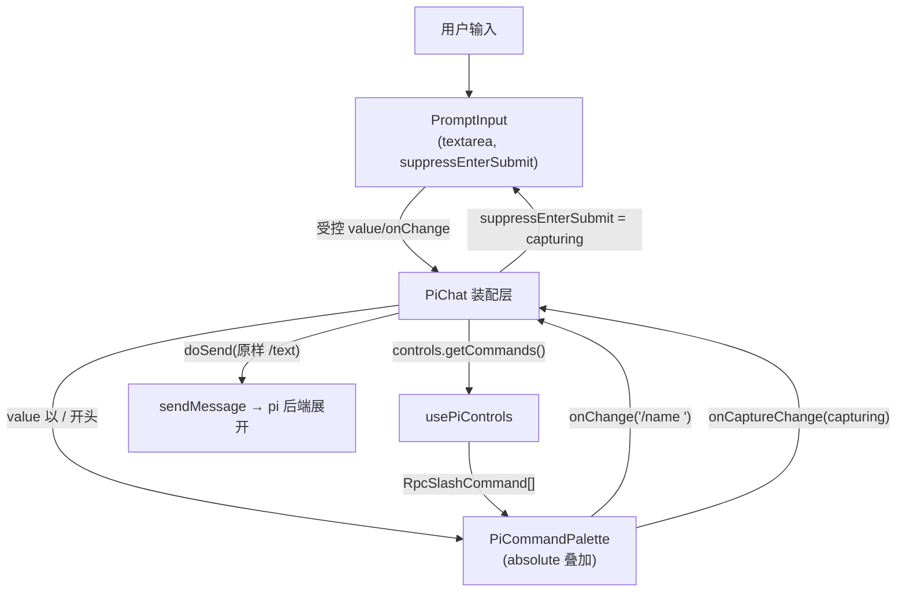
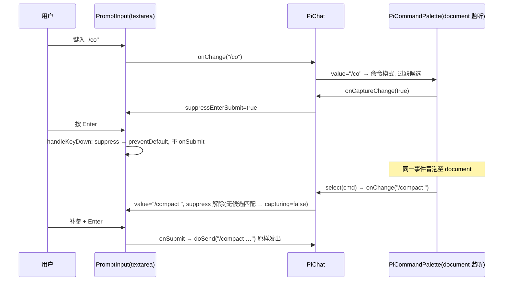

# Design Document

## Overview
**Purpose**: 把已实现但未接线的 `PiCommandPalette`("/" 斜杠命令补全浮层)接入富聊天界面 `PiChat`,让终端用户在输入框键入以 "/" 开头的内容时获得实时过滤、可键盘/鼠标导航的命令补全。
**Users**: 使用 pi-web 富聊天界面的终端用户,通过浮层快速发现并发起斜杠命令(prompt/skill/extension 三类来源)。
**Impact**: 改变 `PiChat` 会话态的建议呈现——会话进行中由浮层承担命令补全,既有"建议气泡"(方案 A)退化为仅空会话的 starter 引导;为 `PromptInput` 增加命令模式下的 Enter 让位能力。命令的解析与执行不变,仍由 pi 后端在收到 `/name …` 文本 prompt 时展开。

### Goals
- 在 `PiChat` 装配层渲染并接线 `PiCommandPalette`,命令模式下可见可操作(R1、R2)。
- 选中命令统一填充 `"/name "` 待补参确认,不直接发送(R3)。
- 命令模式下 Enter 让位浮层选中,杜绝把 `/foo` 误发出去(R4)。
- 会话态退化方案 A,空态保留 starter 引导(R5)。
- 浮层叠加不顶高输入框;controls 不可用/失败/空均降级不崩溃(R6、R7)。

### Non-Goals
- 不解析、不执行命令(web 端原样转发,pi 后端展开,R8)。
- 不改 `RpcSlashCommand` 协议、`get_commands` RPC 或 `usePiControls` 内部。
- 不做参数级补全、命令历史/收藏、模糊排序升级(沿用现有 `includes` 过滤)。

## Boundary Commitments

### This Spec Owns
- `PiChat`(`pi-chat.tsx`)装配层:浮层的渲染位置、命令模式的 Enter 让位接线、方案 A 退化的展示条件。
- `PromptInput`(`prompt-input.tsx`)新增的 `suppressEnterSubmit` 行为契约。
- `PiCommandPalette`(`pi-command-palette.tsx`)新增的 `onCaptureChange` 可选回调(报告"是否正在捕获按键 = 命令模式且有候选")。

### Out of Boundary
- 命令协议与执行语义(`RpcSlashCommand`、`get_commands`、pi 后端命令展开)。
- `usePiControls` / `useSuggestions` 的内部实现与既有契约。
- `sendMessage` 的载荷形状。

### Allowed Dependencies
- `usePiControls`:`getCommands()` 拉取、`controls.commands` 状态(语义不变)。
- `PiCommandPalette` 既有的命令模式判定、子串过滤、键盘导航与 ARIA(复用,仅加一个 additive 回调)。
- shadcn CSS 变量主题、`cn` 工具。

### Revalidation Triggers
- `RpcSlashCommand` 形状或 `get_commands` 语义变化 → 浮层候选渲染需复核。
- `PromptInput` 的 `onSubmit`/键盘契约变化 → Enter 让位接线需复核。
- 本特性使 rich-chat-ui **Req 10**(会话态建议气泡)的**会话态观感被有意取代**:会话进行中不再渲染紧凑建议气泡。任何重新引入会话态建议气泡的改动都应与本特性 R5 一并复核。

## Architecture

### Existing Architecture Analysis
- `PiChat` 是富聊天装配层:受控 `input` 状态、`doSend`/`onSubmit`、`controls?`(可选)、会话就绪后拉一次 `getCommands`(`pi-chat.tsx:260`)。
- 输入区由共享片段 `inputWithWidgets`(`pi-chat.tsx:409`)承载,空态(`:500`)与会话态(`:573`)两分支复用。
- `PromptInput` 是无状态输入外壳,自身处理 Enter 提交 / Shift+Enter 换行(`prompt-input.tsx` `handleKeyDown`)。
- `PiCommandPalette` 已完整实现"/"补全:命令模式判定、子串过滤、↑↓/Enter/Esc、listbox/option ARIA、空态/错误态;经 `document` keydown 全局监听捕获导航键。已从 `@blksails/pi-web-ui` 导出(`index.ts:53`)。

**根因(Enter 双触发)**:React 把 textarea 的 `onKeyDown` 挂在 root 容器(在 `document` 之下)。Enter 冒泡顺序为 textarea → React root(先执行 `PromptInput.onSubmit` → 发出 `/foo`)→ `document`(palette 才 `preventDefault`)。palette 的 `preventDefault` 无法撤销已执行的 React 提交。故须在 `PromptInput` 源头按 `suppressEnterSubmit` 拦截。

### Architecture Pattern & Boundary Map

- 选定模式:**装配层协调 + 受控状态单源**。`PiChat` 持有 `input` 与 `suppressEnterSubmit` 状态;浮层与输入框均受其驱动,避免双方各自判断命令模式而发散。
- 既有模式保留:`PiCommandPalette` 内部过滤/导航/ARIA 不动;`useSuggestions` 数据源不动。
- 新增理由:`onCaptureChange` 让浮层成为"是否捕获按键"的单一真相源(它已计算 `open` 与 `filtered`),装配层据此精确决定 Enter 让位,无需在 `PiChat` 重复过滤逻辑。

### Technology Stack

| Layer | Choice / Version | Role in Feature | Notes |
|-------|------------------|-----------------|-------|
| Frontend / UI | React 19 + TypeScript 5.6 | 装配与组件 | 严格类型,无 `any` |
| 样式 | Tailwind + shadcn CSS 变量 | 浮层叠加定位 | 复用 `cn`,无硬编码色 |
| 测试 | Vitest + Testing Library / Playwright | 单测 + e2e | 见 Testing Strategy |

## File Structure Plan

### Modified Files
- `packages/ui/src/elements/prompt-input.tsx` — 新增可选 prop `suppressEnterSubmit?: boolean`;`handleKeyDown` 在其为真时:Enter(非 Shift)`preventDefault` 但**不调用** `onSubmit`;Shift+Enter 仍换行(R4.1/4.2/4.4)。非命令模式行为不变(R4.3)。
- `packages/ui/src/controls/pi-command-palette.tsx` — 新增可选 prop `onCaptureChange?(capturing: boolean): void`;`capturing = open && filtered.length > 0`,以 `useEffect` 在其变化时回调。不改既有过滤/导航/ARIA(R4 精确条件 "有候选")。
- `packages/ui/src/chat/pi-chat.tsx` — 装配:
  1. 在共享 `inputWithWidgets` 外包一层 `relative` 容器,`controls !== undefined` 时渲染 `<PiCommandPalette>` 为 `absolute bottom-full` 叠加,锚定输入框上方;层级取 `z-40`(低于通知浮层的 `z-50`(`pi-chat.tsx:449`)、高于内容),保证浮层可见且可交互(R1、R6)。
  2. 持有 `suppressEnterSubmit` 状态,由 palette `onCaptureChange` 更新,透传给 `PromptInput`(R4)。
  3. palette 的 `onChange={setInput}`(填充 `"/name "`,palette 既有 `select` 行为,R3);不传 `onSubmit` → 仅填充不发送。
  4. 会话态分支移除紧凑 `<Suggestions items={suggestions.items}>` 气泡(`:564-571`);空态网格(`:491-498`)保留(R5)。`getCommands` 拉取保留(R5.3)。

> 不新增文件。`pi-command-palette.tsx` 已实现的浮层 UI/键盘/ARIA 直接复用。

## System Flows

### 命令模式下的 Enter 让位

- 关键:`suppressEnterSubmit` 只在"命令模式且有候选"为真。无候选时 `capturing=false`,Enter 恢复正常提交,`/xyz` 字面量照常发出由 pi 处理(避免死键)。

## Requirements Traceability

| Requirement | Summary | Components | 关键接线 |
|-------------|---------|------------|---------|
| 1.1–1.5 | 触发/拉取/过滤/展示 | PiChat + PiCommandPalette | `value.startsWith("/")` 渲染浮层;复用既有过滤 |
| 2.1–2.6 | 键盘/鼠标导航 + ARIA | PiCommandPalette | 复用既有 `handleKey`/listbox |
| 3.1–3.3 | 选中填充 `"/name "` 不发送 | PiChat + PiCommandPalette | `onChange` 填充,不传 `onSubmit` |
| 4.1 | suppressEnterSubmit 能力 | PromptInput | 新 prop |
| 4.2 | 命令模式 Enter 让位 | PiChat + PiCommandPalette | `onCaptureChange` → `suppressEnterSubmit` |
| 4.3–4.4 | 非命令模式/Shift+Enter 不变 | PromptInput | 条件分支 |
| 5.1–5.3 | 方案 A 退化 + 仍拉取 | PiChat | 移除会话态气泡,保留空态网格与拉取 |
| 6.1–6.3 | 叠加定位不顶高/层叠 | PiChat | `relative`+`absolute bottom-full`+`z-40`(<通知 `z-50`) |
| 7.1–7.4 | 降级不崩溃 | PiChat + PiCommandPalette | `controls===undefined` 不渲染;复用空/错误态 |
| 8.1–8.2 | 执行沿用现状 | PiChat | `doSend` 原样 `sendMessage` |

## Components and Interfaces

| Component | Layer | Intent | Req | 契约 |
|-----------|-------|--------|-----|------|
| PromptInput | elements | 输入外壳 + Enter 让位 | 4.1/4.3/4.4 | State(props) |
| PiCommandPalette | controls | "/"补全浮层 + 捕获上报 | 1,2,3,7 | State(props) |
| PiChat | chat | 装配与协调 | 全部 | 内部状态 |

#### PromptInput(新增契约)
```typescript
interface PromptInputProps {
  // …既有 props…
  /** 命令模式激活时禁用 textarea 的 Enter 提交(Enter 让位给命令浮层选中)。默认 false。 */
  readonly suppressEnterSubmit?: boolean;
}
```
- Precondition: 由装配层在"命令模式且有候选"时置真。
- Postcondition: 为真时 Enter(非 Shift)`preventDefault` 且不调用 `onSubmit`;Shift+Enter 仍换行;为假时维持既有提交逻辑。
- Invariant: 不引入 pi 接线,保持无状态。

#### PiCommandPalette(新增契约)
```typescript
interface PiCommandPaletteProps {
  // …既有 props…
  /** 捕获态变化回调:capturing = 命令模式开启且过滤后有候选项。供装配层决定 Enter 让位。 */
  readonly onCaptureChange?: (capturing: boolean) => void;
}
```
- Precondition: 可选;未提供时行为与现状一致。
- Postcondition: `(open && filtered.length>0)` 变化时回调一次最新值;关闭时回调 `false`。
- Invariant: 不改既有过滤、导航、ARIA、空/错误态。

## Error Handling
- **controls 不可用(R7.1)**: `PiChat` 在 `controls === undefined` 时不渲染浮层,聊天其余功能照常;不抛错。
- **getCommands 失败(R7.2)**: 复用 palette 既有错误态(`role="alert"`),不崩溃。
- **空/无匹配(R7.3)**: 复用 palette 既有空态("No commands"),不崩溃。
- **错误/空态下 Esc(R7.4)**: 复用 palette 既有 Esc → 清空命令模式。
- **死键防护**: 无候选时 `capturing=false` → 不抑制 Enter,字面量命令照常发出。

## Testing Strategy

### Unit Tests(Vitest + Testing Library)
- `prompt-input.test`: `suppressEnterSubmit=true` 时 Enter 不调用 `onSubmit` 且 `preventDefault`;Shift+Enter 仍换行;`false`/缺省时维持既有提交(R4.1/4.3/4.4)。
- `pi-command-palette.test`: 既有用例 + `onCaptureChange` 在有候选→true、无候选/关闭→false 的回调(R4.2 精确条件)。
- `pi-chat.integration.test`: `controls===undefined` 不渲染浮层(R7.1);会话态(messages 非空)不渲染方案 A 气泡、空态渲染网格(R5);命令模式时 `PromptInput` 收到 `suppressEnterSubmit=true`(R4.2)。

### E2E Tests(Playwright,`e2e/browser/`)
- **斜杠补全主路径(R1/R2/R3)**: 输入 "/" → 浮层出现;输入过滤;↑↓ 改高亮;Enter 选中 → 输入框为 `"/name "` 且**未发送**(消息区无新增)。
- **Enter 让位(R4)**: 命令模式有候选时按 Enter 不发送 `/foo`;补参后 Enter 正常发出完整斜杠文本。
- **Esc 关闭(R2.3/R7.4)**: 浮层显示时 Esc → 浮层消失、退出命令模式。
- **方案 A 退化(R5)**: 空态有建议网格(沿用现有 Req 10.2 用例不破);发出一条消息进入会话态后,会话态不再渲染建议气泡。
- **降级(R7)**: getCommands 无命令/空过滤 → 浮层空态,不崩溃,聊天可继续。

> e2e 沿用 `PI_WEB_STUB_AGENT` 桩与 `examples/hello-agent` 源,经 `startSession` 建会话。注意:本机 `next dev` 运行时不得跑 `next build`(污染共享 `.next`)。
