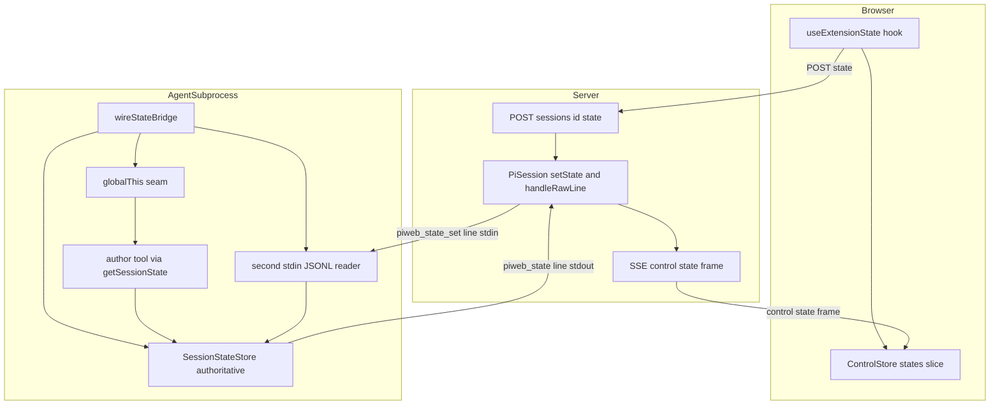
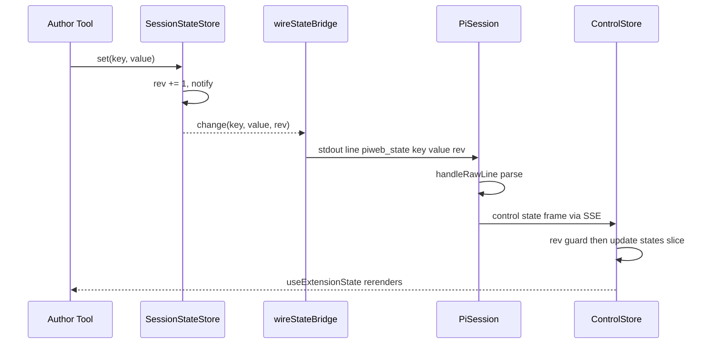
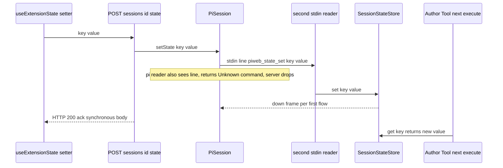

# Design Document — state-injection-bridge

> 语言：zh-CN。基于 pi `@earendil-works/pi-coding-agent@0.79.6` **真实**能力面（已逐行核对 node_modules d.ts）。本设计**不改 pi 框架源码、不改 pi 协议、不改 agent 作者业务代码**，全部经 pi-web 既有注入/传输/seam 范式实现。背景与证据见 `research.md`。

## Overview

**Purpose**：为 pi-web 增设一条**独立于 LLM 对话历史之外**的会话级共享状态路线 —— 一份既能被 agent 工具同步读写、又能被用户经 UI 实时读写的可变 KV。它把 pi-web 从「AI 对话 UI」推进为「AI 原生应用运行时」：agent 是后端大脑、webext 是前端、这份状态核是人与 AI **共同驱动**的同一份实时态（人机共驾）。

**Users**：agent 作者（工具内 `getSessionState().get/set`）、webext/前端开发者（`useExtensionState(key)`）、终端用户（在 UI 上拨动开关/填表单驱动状态）。

**Impact**：新增一条 SSE 控制帧 `control:"state"`、一个写回端点 `POST /sessions/:id/state`、一个 runner 子进程内的状态核 + 双向接线，以及前端 `ControlStore` 的 `states` 切片与 `useExtensionState` hook。对未使用该能力的会话**零行为变化**。

### Goals
- 在 agent 子进程持有**权威**、可变、可订阅的会话级 KV，工具同步零延迟读写。
- agent→UI 实时下行镜像（带单调 rev 防乱序），UI→agent 写回抵达权威 KV。
- 不改 pi、不改 agent 作者代码；失败优雅降级不崩会话。
- 双向闭环具备单测 + 真实子进程集成测试 + 离线浏览器 e2e。

### Non-Goals
- 跨会话/全局/多用户共享状态。
- 自动把状态喂进 LLM 上下文（由作者显式 opt-in）。
- 落盘/冷恢复（本期仅内存）。
- CRDT/OT 并发合并（用 rev 单调 + 后写覆盖）。
- 通用「真实 agent ui_rpc handler」（只做 state 写回约定行，不展开 webext-contrib 的搁置项）。

## Boundary Commitments

### This Spec Owns
- **状态核** `SessionStateStore`（KV + 单调 rev + subscribe），权威实例在 runner 子进程，pi-web **自建**。
- **runner 接线** `wireStateBridge`：建 KV、填 globalThis seam、订阅 KV 变更→stdout 下行帧、挂第二个 stdin reader 接 state 写回行。
- **协议** `control:"state"` 帧、`POST /sessions/:id/state` 的请求/响应契约、server↔runner 内部行 `piweb_state` / `piweb_state_set` 的 schema。
- **server** 新增 `PiSession.setState` 转发 + `handleRawLine` 的 `piweb_state` 分支 + 状态写回路由。
- **前端** `ControlStore.states` 切片 + `applyControlFrame` 的 `state` 分支 + `useExtensionState` hook + transport 写回方法。
- **webext** web-kit `host-context` 暴露状态读写。
- **作者侧 helper** `getSessionState()`（读 seam），供作者工具与（可选）示例 state agent 使用。

### Out of Boundary
- pi 框架/协议任何改动；agent 作者业务逻辑。
- 状态落盘/冷恢复、并发合并、跨会话同步。
- 通用 ui_rpc 真实 handler；既有 ambient(`ctx.ui.*`)/ui-rpc 贡献点/host 命令行为。

### Allowed Dependencies
- pi 0.79.6 真实面：`pi.registerTool`、`ctx.ui.*`、`ctx.sessionManager`(只读)、`appendEntry`。**不**依赖任何 `ctx.state`/`StateStore`/`__hostPlugins`（均不存在）。
- pi-web 既有范式：`wireAttachmentBridge`/`wireSessionTitlePersistence`(runner 装配)、globalThis seam(`attachment-tool-context`)、`forcedExtensionPaths`(`auto-session-title`)、`handleRawLine`(自定义行→control 帧)、`ControlStore`(不可变快照+`useSyncExternalStore`)、命令路由注入(`createSessionListRoutes` 同形)。
- 协议层新增须随 `protocolVersion` 承载，遵循协议包 semver。

### Revalidation Triggers
- pi 升级改动 `runRpcMode` 的 stdin 读取（`attachJsonlLineReader` 行为）→ 写回 reader 需复验。
- pi 改动 `RpcCommand` 联合或 `handleInputLine` 对未知命令的处理 → 噪声/兼容性需复验。
- `ControlPayloadSchema` / SSE 帧形状变化 → 前后端需同步。
- `protocolVersion` bump。

## Architecture

### Existing Architecture Analysis
- **进程模型**：Browser ─SSE/HTTP─ Next route handler ─JSONL─ agent 子进程（每会话一进程）。
- **方向性硬约束**（`research.md` 发现 2）：agent→server 仅 `response/extension_ui_request/event` 被分派（`pi-rpc-process.ts:473`）；server→agent 仅 pi 的封闭 `RpcCommand`（无 ui_rpc）被 `runRpcMode` 处理。
- **现成接缝**：`pi-session.ts:405 handleRawLine` 已截获自定义 `ui_rpc_response` 行→`control:"ui-rpc"` 帧（**任意结构化数据 agent→UI 的现成出口**）；`attachJsonlLineReader`(`jsonl.js:18`)仅 `on("data")` 不独占 stdin（**第二个 reader 可共存**）。
- **保留**：`ctx.ui.*` ambient 链路、ui-rpc Tier3、host 命令同步回流、就绪握手——本设计旁加一条 `state` 通道，不触碰它们。

### Architecture Pattern & Boundary Map



**选定模式**：单一权威 + 镜像视图（authoritative store in subprocess + reactive UI view）。权威 KV 在子进程（满足「工具同步读」与「context 外」），server 仅做转发/翻译，UI 是响应式只读视图 + 写回代理。

**关键决策**：
- 状态权威**必须**在子进程（方向性约束推论）。
- 下行复用 `handleRawLine` 接缝（加 `piweb_state` 分支），**不改 pi**。
- 写回经新路由 → `PiSession.setState` → `channel.send({type:"piweb_state_set"})` → runner **第二个 stdin reader** 截获 → `KV.set`。pi 的 reader 对该行回无害 Unknown-command（server 丢弃）。
- 前端切片并入既有 `ControlStore`，不另起 store。

### Technology Stack

| Layer | Choice / Version | Role in Feature | Notes |
|-------|------------------|-----------------|-------|
| Frontend | React 19 + `useSyncExternalStore` | `useExtensionState` + `ControlStore.states` 切片 | 对齐既有 `useExtensionUI` |
| Protocol | zod 3 + `@blksails/pi-web-protocol` | `control:"state"` 帧 + `/state` 请求 + 内部行 schema | 随 `protocolVersion`，semver |
| Backend | `@blksails/pi-web-server`（Next route handler, runtime nodejs） | 路由注入 + `PiSession.setState` + `handleRawLine` 分支 | 复用注入 seam |
| Runner | Node 子进程 + pi `runRpcMode` | `wireStateBridge`（KV + seam + stdin/stdout 接线） | 对齐 `wireAttachmentBridge` |
| Agent-facing | `@blksails/pi-web-tool-kit` 或 agent-kit | `getSessionState()` helper（读 seam） | 对齐 attachment-tool-context |
| Webext | `@blksails/pi-web-kit` host-context | 暴露 state 读写给 `.pi/web` | 复用 `WebExtHostContext` |

## File Structure Plan

### 新增文件
```
packages/protocol/src/
└── web-ext/
    └── state.ts                 # control:"state" 帧载荷 + StateSetRequest/Response + 内部行(piweb_state / piweb_state_set) schema + 类型

packages/server/src/
├── runner/
│   └── state-wiring.ts          # wireStateBridge:建 KV、填 seam、订阅→stdout 帧、挂第二 stdin reader 接写回；优雅降级
├── state/
│   └── session-state-store.ts   # SessionStateStore:KV + 单调 rev + subscribe(纯逻辑,可单测)
└── http/routes/
    └── state-routes.ts          # createStateRoutes:POST /sessions/:id/state → session.setState(返回同步 200 ack)

packages/react/src/
└── hooks/
    └── use-extension-state.ts   # useExtensionState(key):订阅 ControlStore.states 切片 + 写回(经 transport)

packages/tool-kit/src/
└── session-state.ts             # getSessionState():读 globalThis seam,返回作者工具用的最小 KV 视图(get/set/snapshot)

examples/
└── state-bridge-agent/          # e2e/集成示例:注册 increment/read 工具经 getSessionState 读写;含 .pi/web 用 useExtensionState
    ├── index.ts
    ├── README.md
    └── .pi/web/web.config.tsx
```

### 修改文件
- `packages/protocol/src/transport/sse-frame.ts` — `ControlPayloadSchema` 增 `control:"state"` 分支。
- `packages/protocol/src/web-ext/index.ts` — barrel 导出 `state.ts`。
- `packages/react/src/sse/control-store.ts` — `ControlSnapshot` 增 `states` 切片；`applyControlFrame` 增 `case "state"`（rev 守卫）；提供 `states` getter。
- `packages/react/src/hooks/index.ts`（或既有 barrel）— 导出 `useExtensionState`。
- `packages/react/src/...`（transport/PiClient）— 增 `setState(sessionId,key,value)` → `POST /sessions/:id/state`。
- `packages/server/src/session/pi-session.ts` — 增 `setState(key,value)`（`channel.send` 内部行）；`handleRawLine` 增 `piweb_state` 分支→`makeControlFrame({control:"state",...})`。
- `packages/server/src/http/create-handler.ts` — 注入 `createStateRoutes`（同 `createSessionListRoutes` 形）。
- `packages/server/src/runner/runner.ts` — `startRunner` 内 `runRpcMode` **之前**调 `wireStateBridge(runtime, {env, sessionId})`。
- `packages/web-kit/src/host-context.ts` — `WebExtHostContext` 暴露 state 读写（转调前端同一通道）。
- `examples/README.md` — 注册 `state-bridge-agent` 行。

> 依赖方向：`protocol ← (server, react, tool-kit, web-kit) ← app/examples`。新增文件不反向依赖。

## System Flows

### 下行（agent 工具写 → UI）


### 写回（UI 点击 → agent 工具读到）


下行 rev 守卫：`applyControlFrame` 仅当帧 `rev > states[key].rev` 才应用，否则丢弃（防乱序回退）。

## Requirements Traceability

| Requirement | Summary | Components | Interfaces / Contracts | Flows |
|-------------|---------|------------|------------------------|-------|
| 1.1 | 子进程权威可变 KV，不入历史 | SessionStateStore | `SessionStateStore` | 下行/写回 |
| 1.2 | 工具写→UI 反映 | wireStateBridge, PiSession, ControlStore | `control:"state"` | 下行 |
| 1.3 | UI 写→工具读到 | state-routes, PiSession.setState, stdin reader, KV | `POST /state` | 写回 |
| 1.4 | 默认不喂 LLM | SessionStateStore（旁路，不进消息） | — | — |
| 1.5 | 未初始化返回未定义 | SessionStateStore.get | `SessionStateStore` | — |
| 2.1 | 纯 pi-web 注入不改 pi | runner.ts wireStateBridge | — | — |
| 2.2 | 不要求作者改 index.ts | wireStateBridge（桥独立于作者） | seam | — |
| 2.3 | 无用法零副作用 | wireStateBridge（无订阅者不发帧） | — | — |
| 2.4 | 失败优雅降级 | wireStateBridge（env/seam 缺失 no-op） | — | — |
| 3.1 | 变更发 {key,value,rev} 帧 | wireStateBridge, PiSession.handleRawLine | `control:"state"` | 下行 |
| 3.2 | 帧到→视图更新 | ControlStore, useExtensionState | `states` 切片 | 下行 |
| 3.3 | rev 不增则丢弃 | ControlStore.applyControlFrame | rev 守卫 | 下行 |
| 3.4 | 独立于消息流 | sse-frame control 分支 | `control:"state"` | 下行 |
| 3.5 | 每 key rev 单调 | SessionStateStore | rev 计数 | 下行 |
| 4.1 | UI 写经命令通道达 agent | state-routes, PiSession.setState | `POST /state`, `piweb_state_set` | 写回 |
| 4.2 | 写回触发下行收敛 | KV.set→down frame | `control:"state"` | 写回→下行 |
| 4.3 | 不合契约拒绝 | state.ts schema, state-routes | `StateSetRequest` | 写回 |
| 4.4 | 同步 HTTP 响应体 | state-routes ack | `POST /state` 200 | 写回 |
| 5.1 | 下行帧契约 | protocol/web-ext/state.ts | `StateControlPayload` | — |
| 5.2 | 写回命令契约承载既有通道内 | state.ts, state-routes | `StateSetRequest` | — |
| 5.3 | 校验失败安全拒绝 | zod safeParse | schema | — |
| 5.4 | value 任意 JSON | state.ts（`z.unknown()`） | schema | — |
| 6.1 | useExtensionState(key) | use-extension-state.ts | hook 签名 | — |
| 6.2 | 帧到 React 一致重渲 | useSyncExternalStore | `states` 切片 | 下行 |
| 6.3 | setter 走写回 | use-extension-state.ts, transport | `POST /state` | 写回 |
| 6.4 | 多组件同 key 一致 | ControlStore 单一快照 | `states` 切片 | — |
| 6.5 | 对齐 ambient 惯例 | ControlStore（不可变快照） | — | — |
| 7.1 | webext 暴露 | web-kit host-context | host-context API | — |
| 7.2 | 复用同通道 | host-context→同 transport | `control:"state"` / `POST /state` | 双向 |
| 7.3 | 沿用 webext 门控 | host-context（既有信任边界） | — | — |
| 8.1 | 不改 MCP/工具 | 旁加通道 | — | — |
| 8.2 | 不改 ambient/ui-rpc | 独立 control 分支 | — | — |
| 8.3 | 不破坏握手/既有帧 | 新增枚举分支不动既有 | discriminatedUnion | — |
| 8.4 | 无用法行为一致 | wireStateBridge 惰性 | — | — |
| 9.1-9.4 | 测试与质量门 | 全组件 | — | 见测试策略 |

## Components and Interfaces

| Component | Layer | Intent | Req | Key Deps (P0/P1) | Contracts |
|-----------|-------|--------|-----|------------------|-----------|
| SessionStateStore | runner/state | 权威可变 KV + rev + subscribe | 1.1,1.5,3.5 | 无 | State |
| wireStateBridge | runner | KV↔stdin/stdout 接线 + seam + 降级 | 2.x,3.1 | SessionStateStore(P0), PiSession 行约定(P0) | Service |
| state.ts(protocol) | protocol | 帧/请求/内部行 schema | 5.x | zod(P0) | Event,API |
| PiSession.setState + handleRawLine 分支 | server | 写回转发 + 下行帧翻译 | 3.1,4.1 | state.ts(P0) | Service,Event |
| createStateRoutes | server/http | 写回端点(同步 ack) | 4.1,4.4 | PiSession(P0) | API |
| ControlStore.states | react | 前端不可变切片 + rev 守卫 | 3.2,3.3,6.4 | protocol(P0) | State |
| useExtensionState | react | 订阅 + 写回 hook | 6.x | ControlStore(P0), transport(P0) | Service |
| getSessionState | tool-kit | 作者工具读 seam | 1.2,1.3 | seam(P0) | Service |
| WebExtHostContext state | web-kit | webext 暴露 | 7.x | react transport(P1) | Service |

### runner/state 层

#### SessionStateStore
| Field | Detail |
|-------|--------|
| Intent | 子进程内权威可变 KV，单调 rev，变更通知 |
| Requirements | 1.1, 1.5, 3.5 |

**Responsibilities & Constraints**
- 持有 `Map<string, { value: unknown; rev: number }>`；每 key `rev` 从 0 起，每次 `set/delete` 自增。
- `subscribe` 供 `wireStateBridge` 镜像；核心**不**直接推 UI（宿主之责）。
- 纯进程内、同步、零落盘。

**Contracts**: State [x]

##### State Management
```typescript
export interface StateChange {
  readonly key: string;
  readonly value: unknown;      // delete 时为 undefined
  readonly rev: number;         // 该 key 单调递增
  readonly deleted: boolean;
}

export interface SessionStateStore {
  get(key: string): unknown;                       // 未初始化 → undefined (1.5)
  snapshot(): ReadonlyMap<string, { value: unknown; rev: number }>;
  set(key: string, value: unknown): number;        // 返回新 rev
  delete(key: string): boolean;
  subscribe(listener: (change: StateChange) => void): () => void;
}
export function createSessionStateStore(): SessionStateStore;
```
- Invariant：同 key 的 rev 严格单调递增，跨 set/delete 连续。

#### wireStateBridge
| Field | Detail |
|-------|--------|
| Intent | 把 KV 接到 runner 子进程的 stdin/stdout 与 globalThis seam |
| Requirements | 2.1, 2.2, 2.3, 2.4, 3.1, 4.1 |

**Responsibilities & Constraints**
- 建 `SessionStateStore`，写 globalThis seam `__piWebSessionState__`（供 `getSessionState` 与作者工具读）。
- `subscribe`→把每个 `StateChange` 写为**完整** stdout 行 `{"type":"piweb_state",key,value,rev,deleted}`。
- 在 `runRpcMode` **之前** `process.stdin.on("data", …)` 挂第二个 JSONL reader，截获 `{"type":"piweb_state_set",key,value}`/`{"type":"piweb_state_delete",key}` → `KV.set/delete`。
- **惰性**：无变更不发帧（2.3）；env/seam 不可用或挂载失败 → 记诊断、no-op 降级，不崩会话（2.4，对齐 `wireAttachmentBridge`）。

**Contracts**: Service [x]
```typescript
export interface StateBridgeWiring {
  readonly store: SessionStateStore;
  readonly installed: boolean;        // stdin reader 是否挂上
  cleanup(): void;                    // 取消订阅 + 卸 stdin reader + 清 seam
}
export function wireStateBridge(
  runtime: AgentSessionRuntime,
  input: { sessionId: string; stdout?: { write(s: string): unknown }; globalScope?: Record<string, unknown> },
): StateBridgeWiring;
```

**Implementation Notes**
- Integration：`runner.ts startRunner` 在 `wireSessionTitlePersistence` 之后、`return runRpcMode(runtime)` 之前调用。
- Validation：集成测试断言「stdin 写 piweb_state_set → seam KV 更新」「KV.set → stdout 出现 piweb_state 行」。
- Risks：双 stdin reader 噪声（pi 回 Unknown-command）→ server 丢弃（R-1）；stdout 行交织→只写完整行（R-2）。

### protocol 层

#### web-ext/state.ts
**Contracts**: Event [x] API [x]
```typescript
// SSE 下行帧载荷(并入 ControlPayloadSchema discriminatedUnion)
export const StateControlPayloadSchema = z.object({
  control: z.literal("state"),
  key: z.string().min(1),
  value: z.unknown(),            // 任意可 JSON (5.4)
  rev: z.number().int().nonnegative(),
  deleted: z.boolean().optional(),
});
// 写回请求(POST /sessions/:id/state body)
export const StateSetRequestSchema = z.object({
  key: z.string().min(1),
  value: z.unknown(),
  op: z.enum(["set", "delete"]).default("set"),
});
export const StateSetResponseSchema = z.object({ ok: z.boolean(), error: z.object({ code: z.string(), message: z.string() }).optional() });
// server↔runner 内部行
export const StateDownLineSchema = z.object({ type: z.literal("piweb_state"), key: z.string(), value: z.unknown(), rev: z.number(), deleted: z.boolean().optional() });
export const StateSetLineSchema = z.object({ type: z.enum(["piweb_state_set","piweb_state_delete"]), key: z.string(), value: z.unknown().optional() });
```

### server 层

#### PiSession 扩展
**Contracts**: Service [x] Event [x]
```typescript
// 写回:转发内部行到子进程 stdin(不等待;下行帧异步回流)
setState(key: string, value: unknown, op?: "set" | "delete"): void;
// handleRawLine 增分支:识别 piweb_state 行 → makeControlFrame({control:"state",...}) 广播
```
- Preconditions：`channel` 已连接。Postconditions：`setState` 仅发送；UI 收敛靠下行帧。
- 复用既有 `handleRawLine`（`pi-session.ts:405`）——**只加分支不改既有 `ui_rpc_response` 分支**（8.3）。

#### createStateRoutes
**Contracts**: API [x]
| Method | Endpoint | Request | Response | Errors |
|--------|----------|---------|----------|--------|
| POST | /sessions/:id/state | StateSetRequest | StateSetResponse(200) | 400(schema), 404(session) |
- safeParse 失败 → 400，不调 `setState`（4.3/5.3）。成功 → `session.setState(...)` → 200 同步 ack（4.4）。注入同 `createSessionListRoutes`。

### react 层

#### ControlStore.states（State 契约）
- `ControlSnapshot` 增 `states: Readonly<Record<string, { value: unknown; rev: number }>>`，初值 `{}`。
- `applyControlFrame` 增 `case "state"`：`deleted` → 删键；否则 rev 守卫（`frame.rev > cur?.rev` 才应用，3.3）；不变则不换引用（防抖动，对齐既有 ambient）。

#### useExtensionState（Service 契约）
```typescript
export function useExtensionState<T = unknown>(
  key: string,
): readonly [T | undefined, (value: T) => void];
// 读:useSyncExternalStore 订阅 ControlStore.states[key].value
// 写:调 transport.setState(sessionId, key, value) → POST /state
```

### web-kit 层

#### WebExtHostContext state（Service 契约，summary-only）
- `WebExtHostContext` 增 `state: { get(key): unknown; set(key, value): void; subscribe(key, cb): () => void }`，内部转调与前端同一 `ControlStore`/transport。沿用既有 webext 信任门控（7.3），不新增绕过路径。

## Data Models

### Domain Model
- 聚合根：`SessionStateStore`（每会话一实例，子进程内）。
- 实体：`StateEntry { value, rev }`，自然键 = `key`。
- 领域事件：`StateChange`（KV→镜像）。
- 不变量：每 key rev 单调；权威只在子进程；value 任意可 JSON。

### Data Contracts
- 下行：`control:"state"` 帧（随 `protocolVersion`）。
- 写回：`POST /state` body `StateSetRequest`。
- 内部：stdout `piweb_state` 行 / stdin `piweb_state_set|delete` 行。
- 兼容：`ControlPayloadSchema` 与 SSE 帧是 discriminatedUnion，新增枚举分支对旧消费者前向兼容（未知 control 命中 `default` 既有兜底）。

## Error Handling

### Strategy
- **写回校验**（4xx）：`StateSetRequest` safeParse 失败 → 400 + `{ok:false,error}`，不改权威态（4.3/5.3）。
- **下行校验**：`handleRawLine` 对 `piweb_state` 行 safeParse；失败 → 忽略该行（不广播畸形帧）。
- **降级**（系统）：`wireStateBridge` 挂载失败 → 记诊断、会话以「无状态桥」继续（2.4）。
- **rev 乱序**：前端 rev 守卫丢弃过期帧（3.3），非错误路径。
- **stdin 噪声**：pi 对 `piweb_state_set` 回 Unknown-command response（id=undefined）→ server `handleResponse` 无 pending 丢弃，不可见。

### Monitoring
- runner 经 `createLogger({namespace:"agent:…"})` 记 wiring 安装/降级；server 记写回 400 计数（既有 logger）。

## Testing Strategy

### Unit Tests
1. `SessionStateStore`：get 未初始化→undefined（1.5）；set 返回单调 rev、跨 set/delete 连续（3.5）；subscribe 收到正确 `StateChange`。
2. `state.ts` schema：合法/非法 `StateSetRequest`、`StateControlPayload`、内部行 round-trip（5.x）。
3. `ControlStore.applyControlFrame` `case "state"`：rev 守卫丢弃过期帧（3.3）、deleted 删键、引用稳定性（6.4/6.5）。
4. `useExtensionState`：订阅返回当前值、帧到重渲、setter 触发 transport.setState（6.x，对齐 `use-extension-ui` 测法）。

### Integration Tests（真实 agent 子进程）
1. 工具 `set` → stdout 出现 `piweb_state` 行 → server 合成 `control:"state"` 帧（3.1，「工具写→下行帧」）。
2. server `setState` 发 `piweb_state_set` 行 → runner 第二 reader 改 KV → seam 可见 → 工具下次 `get` 读到新值（4.1/1.3，「写回→工具读到」）。
3. 降级：无 seam/挂载失败 → 会话仍正常起 prompt（2.4）。
4. 噪声：`piweb_state_set` 不致 UI 可见副作用、不破坏既有帧（8.3，R-1）。

### E2E（离线 stub，`PI_WEB_STUB_AGENT` + 隔离 `NEXT_DIST_DIR`）
1. 双向闭环：stub 工具改状态 → `data-pi-state` 区视图更新；UI 点击 setter → 写回 → stub 工具 `get` 读到新值并回显（9.3）。
2. 无状态会话回归：未用状态的源端到端行为不变、无额外 `control:"state"` 帧（8.4）。

### 质量门
- 全工作区 `typecheck`（strict、无 `any`，9.4）；新增/受影响包 `pnpm test`。

## Open Questions / Risks
- **OQ-1（已闭合）**：webext host-context 本期已落地完整浏览器 e2e —— slot 经 prop 注入 `WebExtStateAccess`（非 React context，因 webext 为独立 bundle），example `.pi/web` 的 panelRight 面板渲染 count + 写回按钮，浏览器 e2e 验证「prompt→count=1→点击+1→2→3」双向闭环。repo 示例经构建期注册表（`webext-registry.ts`）静态 import 加载（绕过代码 webext 签名门控）。
- **R-1/2/3/4**：见 `research.md` 风险表（stdin 噪声 / stdout 交织 / 仅 state 约定 / 多 tab 后写覆盖），均有缓解，不阻塞实现。
