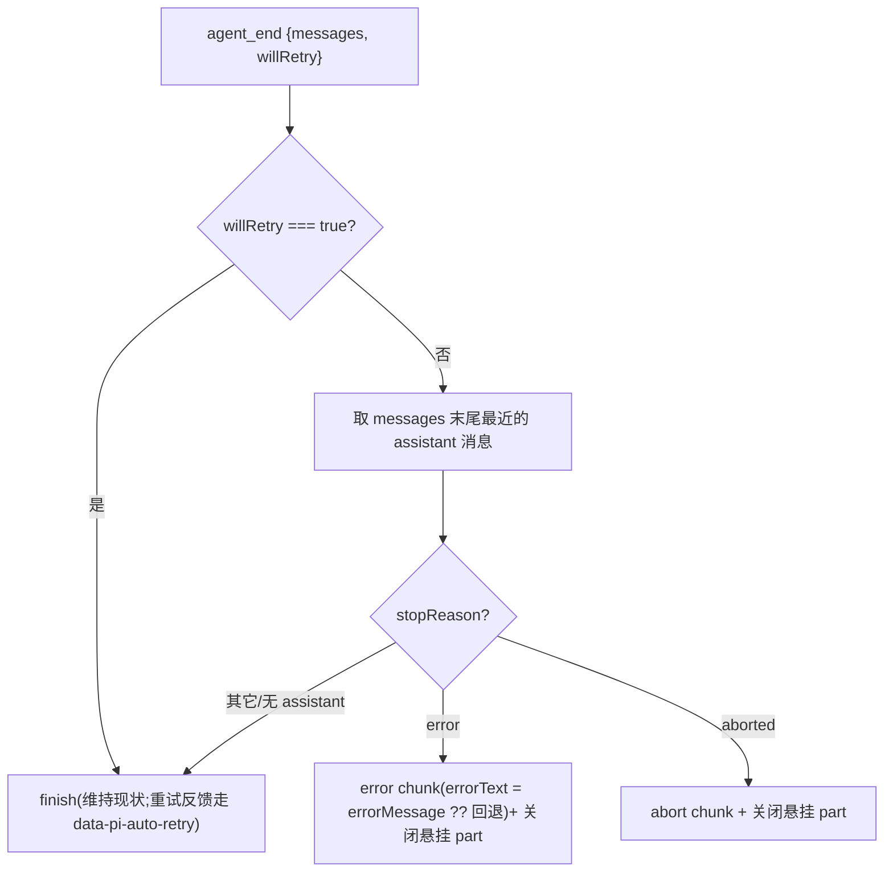

# Design Document — stream-error-surfacing

## Overview

**Purpose**:让 agent 运行时的 provider/流式错误在**重试耗尽或不可重试**时翻译为用户可见的错误并携带真实错误信息,修复 Web UI 对话失败时只显示空助手气泡、无任何提示的问题。

**Users**:Web UI 对话用户(知道"出错了而非没回应")与排障者(看到真实原因)。

**Impact**:在会话翻译层(`translate-event.ts`)补全终态错误与真实文案的翻译,并在前端 `pi-chat` 消费既有 `useChat` 错误态加以呈现。复用既有 `error`/`abort` 生命周期块与 `useChat` 错误态,不新增协议类型。

### Goals
- 终态 provider/流式错误产出用户可见错误并携带真实 `errorMessage`/`finalError`。
- 区分"重试中"(已有 `data-pi-auto-retry` 反馈)、"终态错误"、"用户中止"。
- 前端呈现错误而非空气泡;保留已流式的部分内容。
- 不破坏正常成功对话与其它事件翻译;附新鲜证据测试。

### Non-Goals
- 不改 pi SDK、重试策略、provider 选择或鉴权/网络配置。
- 不新增协议块类型(首选复用 `error`/`abort`);不做错误多语言/分类学。
- 不改工具执行错误(tool-output-error)既有路径,不重做通知系统。

## Boundary Commitments

### This Spec Owns
- `translate-event.ts` 对**错误类事件**的翻译:`agent_end` 终态错误检测、`message_update.error` 真实文案透传。
- `pi-chat` 对 `useChat` 错误态的呈现(无状态错误元件)。
- 上述行为的单元/集成测试。

### Out of Boundary
- pi SDK / 运行时事件本身、重试策略。
- 新协议块类型(除非 R-1 验证迫使降级)。
- `data-pi-auto-retry` 数据部件的产帧(已存在,不改其语义)。
- tool-output-error、notifications/toast 系统。

### Allowed Dependencies
- 既有 `error`/`abort` UiMessageChunk(protocol)与 `decode-chunk` 映射。
- AI SDK `useChat` 的 `error` / `status` 错误态。
- protocol `AssistantMessage.stopReason`/`errorMessage`、`agent_end.messages`/`willRetry`。

### Revalidation Triggers
- AI SDK `error` 块语义变化(是否保留部分消息)。
- protocol `error`/`abort` 块或 `AgentEvent`(agent_end/message_update.error)字段变化。
- `StopReason` 枚举变化。

## Architecture

### Existing Architecture Analysis
- 翻译层 `translate-event.ts` 为纯函数 Functional Core:`AgentEvent → SseFrame[]` + 推进 `TranslationContext`,产帧经 `makeUiMessageChunkFrame`,`error`/`abort` 已是 AI SDK 对齐的生命周期块。
- 现状断点:`agent_end`→恒 `finish`(忽略 `willRetry`/`stopReason`);`message_end`→`none`(丢 `errorMessage`);`message_update.error`→硬编码 `errorText`;前端 `pi-chat` 不消费 `chat.error`。

### Architecture Pattern & Boundary Map

```mermaid
flowchart LR
  ev["pi AgentEvent\n(agent_end / message_update.error)"] --> te["translate-event.ts\n(终态错误检测 + 真实文案)"]
  te -->|error chunk errorText=真实信息| df["decode-chunk.ts\n(已存在映射)"]
  te -->|abort chunk| df
  te -->|finish(成功/重试中)| df
  df --> uc["useChat\n(chat.error / status='error')"]
  uc --> pc["pi-chat.tsx\n(新增:呈现错误元件)"]
  pc --> user["用户可见错误"]
```

- **Selected pattern**:复用既有错误生命周期块 + useChat 错误态(adopt, not build);改动集中在"翻译层发射条件"与"前端呈现"两个既有 seam。
- **Preserved patterns**:翻译层纯函数、产帧 schema 约束、`data-pi-auto-retry` 重试反馈不变、成功路径 `finish` 不变。
- **Dependency direction**:protocol ← server(translate)、protocol ← ui;无新增上行依赖。

### Technology Stack

| Layer | Choice / Version | Role in Feature | Notes |
|-------|------------------|-----------------|-------|
| Backend / Services | `@blksails/pi-web-server`(TS strict) | `translate-event` 终态错误翻译 | 纯函数,禁 any |
| Frontend / UI | `@blksails/pi-web-ui`(React + shadcn) | `pi-chat` 呈现 `chat.error` | 无状态元件,destructive 变量 |
| Protocol | `@blksails/pi-web-protocol` | 复用 `error`/`abort` 块与事件字段 | 不新增类型 |
| Frontend state | AI SDK v5 `@ai-sdk/react` `useChat` | 错误态来源 | `error`/`status` |

## File Structure Plan

### Modified Files
- `packages/server/src/session/translate/translate-event.ts` — `agent_end` 增终态错误检测(error/abort/finish 三分支);`message_update.error` 透传真实 `errorMessage`;新增本文件内小工具 `lastAssistantStopReason`/`terminalSignalFrom`。
- `packages/ui/src/chat/pi-chat.tsx` — 从 `useChat` 取 `error`(及/或 `status==="error"`),装配呈现错误元件。
- `packages/server/test/session/translate-event.table.test.ts` — 新增终态错误/中止/重试/成功/真实文案用例。
- `packages/ui/test/chat/pi-chat.test.tsx`(或新增 `pi-chat-error.test.tsx`) — 验证错误态呈现。

### New Files
- `packages/ui/src/elements/chat-error.tsx` — 无状态错误提示元件(展示 `message`,destructive 配色,`role="alert"`)。与 `elements/notifications.tsx` 同模式;并在 `packages/ui/src/index.ts` 导出。

> 每文件单一职责:翻译层只产帧;`chat-error` 只展示;`pi-chat` 只装配接线。

## System Flows

终态错误判定(`agent_end`):



- `message_update.error` 分支:`reason==="aborted"` → `abort`;`reason==="error"` → `error`(errorText = `ame.error.errorMessage ?? 回退`)。
- 回退文案常量仅在确无真实信息时使用(R2.2/R2.3)。

## Requirements Traceability

| Requirement | Summary | Components | Flows |
|-------------|---------|------------|-------|
| 1.1 | 终态错误产出可见错误信号 | translate-event(agent_end) | 终态判定 |
| 1.2 | 前端呈现可见错误 | pi-chat + chat-error | — |
| 1.3 | 失败回合不呈现为正常完成 | translate-event(error 取代 finish) | 终态判定 |
| 1.4 | 流式中途失败仍收尾并可见 | translate-event(关闭悬挂 part)+ pi-chat | 终态判定 |
| 2.1 | 携带真实错误信息 | translate-event(errorMessage/finalError) | 终态判定 |
| 2.2 | 确无信息才用回退文案 | translate-event(回退常量) | — |
| 2.3 | 不用硬编码覆盖真实信息 | translate-event(message_update.error 透传) | — |
| 2.4 | 前端展示真实信息 | chat-error | — |
| 3.1 | 重试中可感知反馈 | (既有)data-pi-auto-retry | — |
| 3.2 | 重试成功不报错 | translate-event(willRetry/最终成功) | 终态判定 |
| 3.3 | 区分瞬时失败与终态错误 | translate-event(willRetry 分支) | 终态判定 |
| 4.1 | 中止翻译为 abort 非错误 | translate-event(aborted 分支) | 终态判定 |
| 4.2 | 中止不呈现错误 | pi-chat(abort 不触发 error 态) | — |
| 4.3 | 中止与错误语义独立 | translate-event | — |
| 5.1 | 成功翻译不变 | translate-event(finish 保留) | 终态判定 |
| 5.2 | 其它事件翻译不变 | translate-event(仅改错误分支) | — |
| 5.3 | 附单元/集成测试 | 两测试文件 | — |
| 5.4 | 新鲜证据 | vitest 运行输出 | — |

## Components and Interfaces

| Component | Layer | Intent | Req Coverage | Contracts |
|-----------|-------|--------|--------------|-----------|
| `translate-event`(改) | server | 终态错误/中止/真实文案翻译 | 1,2,3,4,5 | 纯函数 |
| `chat-error`(新) | ui | 无状态错误呈现 | 1.2,2.4,4.2 | Props |
| `pi-chat`(改) | ui | 装配 useChat 错误态 → chat-error | 1.2,4.2 | — |

### Server — translate-event(修改)

**Responsibilities & Constraints**
- 纯函数、禁 `any`;仅改错误相关分支,其它分支零改动。
- 末项 assistant 检测须容错:从 `messages` 末尾找最近 `role==="assistant"` 项;无则不发错误(回退 `finish`)。
- 发 `error`/`abort` 前 `closeReasoningPart(closeTextPart(ctx))` 收尾(R1.4)。

**Contracts**(草图,实现期对齐既有 `makeUiMessageChunkFrame` 与 ctx helper):
```typescript
/** 回退文案:仅当运行时确无具体错误信息时使用(Req 2.2)。 */
const FALLBACK_ERROR_TEXT = "对话失败,但运行时未提供具体错误信息。";

/** 从 agent_end.messages 末尾取最近 assistant 的终态信号(纯)。 */
type TerminalSignal =
  | { kind: "error"; errorText: string }
  | { kind: "aborted" }
  | undefined;

function terminalSignalFrom(
  messages: Extract<AgentEvent, { type: "agent_end" }>["messages"],
): TerminalSignal {
  for (let i = messages.length - 1; i >= 0; i--) {
    const m = messages[i] as { role?: string; stopReason?: string; errorMessage?: string };
    if (m.role !== "assistant") continue;
    if (m.stopReason === "error")
      return { kind: "error", errorText: m.errorMessage ?? FALLBACK_ERROR_TEXT };
    if (m.stopReason === "aborted") return { kind: "aborted" };
    return undefined; // 最近 assistant 非错误终态 → 正常 finish
  }
  return undefined;
}
```
- `agent_end` 分支:`willRetry === true` → 维持 `finish`;否则按 `terminalSignalFrom`:`error` → `error` 块(`errorText`)、`aborted` → `abort` 块、`undefined` → `finish`;均先关闭悬挂 part。
- `message_update.error` 分支:`reason==="aborted"` → `abort`(现状);`reason==="error"` → `error` 块,`errorText = ame.error.errorMessage ?? FALLBACK_ERROR_TEXT`(取代硬编码)。
- Preconditions:事件符合 `AgentEventSchema`。Postconditions:错误/中止/成功分别映射为 error/abort/finish;真实文案不被覆盖。Invariants:非错误事件翻译不变;不抛异常。

### UI — chat-error(新)

**Contracts**:
```typescript
export interface ChatErrorProps {
  /** 错误信息文本(来自 useChat 的 error.message);为空则不渲染。 */
  readonly message: string | undefined;
  readonly className?: string;
}
```
- 无状态;`message` 为空返回 `null`;非空以 destructive 配色 + `role="alert"` 展示文本(允许必要截断,不替换为无意义占位)。从 `@blksails/pi-web-ui` 导出。

### UI — pi-chat(修改)

**Responsibilities & Constraints**
- 从 `useChat` 取 `error`(及/或 `status==="error"`),把 `error?.message` 传入 `<ChatError>`,接线进既有布局。
- 中止(abort)不应进入 `error` 态(R4.2):依赖 AI SDK 对 `abort` 块与 `error` 块的不同处理(abort 不置 `chat.error`)。

## Error Handling
- 翻译层为纯映射:对缺字段/非 assistant 末项安全回退(不抛、不误报),对应 R-2。
- `error` 块即终态,不再补 `finish`;ctx 收尾保证无半开 part(R-3)。
- 回退文案仅兜底,绝不覆盖真实 `errorMessage`(R2.2/2.3)。

## Testing Strategy

### Unit Tests(server `translate-event.table.test.ts`)
- `agent_end {willRetry:false, messages:[...assistant(stopReason:"error", errorMessage:"Connection error.")]}` → 单个 `error` 块且 `errorText === "Connection error."`(Req 1.1/1.3/2.1)。
- `agent_end` 同上但 `errorMessage` 缺省 → `error` 块且 `errorText === FALLBACK_ERROR_TEXT`(Req 2.2)。
- `agent_end {willRetry:false, ...assistant(stopReason:"aborted")}` → `abort` 块,非 error(Req 4.1/4.3)。
- `agent_end {willRetry:true, ...}` → `finish`,无 error 块(Req 3.2/3.3)。
- `agent_end {...assistant(stopReason:"stop")}` 或末项为 toolResult → `finish`(Req 5.1/R-2)。
- `agent_end` 在已开启 text part 时触发 error → 先收尾(text-end/关闭)后 `error`(Req 1.4)。
- `message_update.error {reason:"error", error:{errorMessage:"X"}}` → `error` 块 `errorText==="X"`(非硬编码)(Req 2.3)。
- `message_update.error {reason:"aborted"}` → `abort`(Req 4.1)。

### Integration / Component Tests(ui `pi-chat` 测试)
- 当 `useChat` 处于错误态(mock error/status)→ 渲染 `ChatError` 且文本为 `error.message`;部分已渲染助手消息仍在(Req 1.2/1.4/2.4)。
- 无错误时不渲染 `ChatError`;中止态不渲染错误(Req 4.2/5.1)。
- `ChatError` 元件单测:`message` 空→null;非空→`role="alert"` + 文本(Req 1.2/2.4)。

### Regression
- `translate-event.table.test.ts` 既有用例(成功/文本/思考/工具/步骤/队列/压缩/auto-retry)保持全绿(Req 5.2)。
- `@blksails/pi-web-server` 与 `@blksails/pi-web-ui` 既有测试 + `tsc --noEmit` 通过(Req 5.4)。

### 验证 R-1(关键)
- 组件测试须断言:错误态出现时,先前已 append 的助手消息文本仍可见(证明 AI SDK `error` 块不丢弃部分消息);若证伪,触发 research.md R-1 降级方案(改内联 `data-pi-error` 数据部件)并回到设计修订。
