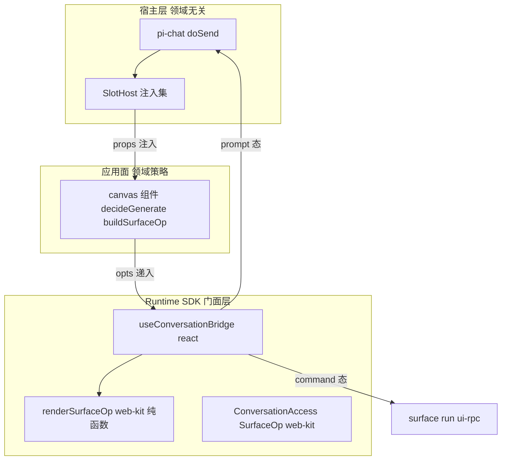
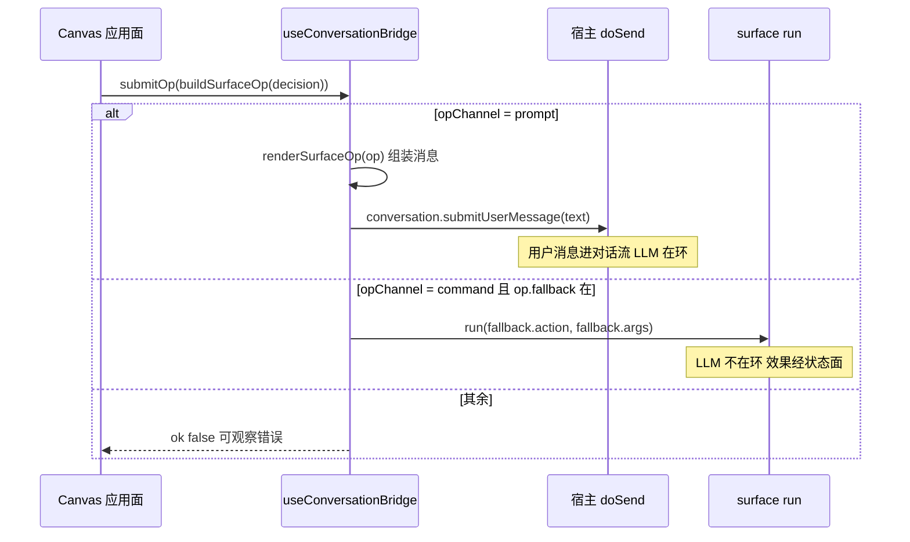

# Design Document — surface-runtime-facade

## Overview

**Purpose**: 本 feature 兑现 Surface App Runtime 契约(docs/surface-app-runtime-contract-v1.md,下称"契约")M-A 里程碑:把对话桥的三个宿主裸注入项(提交回调 `onSubmitPrompt`、轮末信号 `syncSignal`、控制面访问 `surface`)收口为应用面统一门面 `useConversationBridge`,把宿主会话提交能力从事件回调形态更名为能力对象 `conversation`,并让 canvas 作为首个消费者完成迁移验证。

**Users**: surface 应用面开发者(门面使用方)经单一 hook 获得通道探测、操作提交、上下文注入、轮末订阅四能力;宿主维护者(注入方)获得语义正确的能力对象命名;最终用户在通道降级时看到准确的三态提示。

**Impact**: 纯前端(web-kit/react/ui 三包 + canvas 组件),不改 pi 协议、不改 server 侧任何桥接、不新增 SSE 帧或端点。现有消费者经 `onSubmitPrompt` 过渡别名零破坏。

### Goals
- `useConversationBridge` 门面落地:opChannel 三态探测(契约 C3-4)、submitOp 分道、bringToConversation(C3-2)、onTurnEnd(C3-3)。
- `renderSurfaceOp` 纯函数组装器泛化 `buildToolPrompt`,fence 格式可参数化。
- 宿主注入集新增 `conversation` 能力对象,`onSubmitPrompt` 留过渡别名(deprecated,一个大版本)。
- canvas 迁移为首个门面消费者,现有单测/e2e 零改动全绿。

### Non-Goals
- 契约 §13 全部 [预定形] 条款(SurfaceAppConfig / SurfaceJob 与 livePreview 迁移 / C6 数据面 / C2-4 生命周期 / C7-3 PreviewTelemetry)。
- canvas 组件迁出宿主 ui 包(属 canvas-kit-m1 spec)。
- `decideGenerate` 动作链插件化;wireSurfaceBridge/wireStateBridge/粘性帧机制的任何改动。

## Boundary Commitments

### This Spec Owns
- 对话桥**门面层**:`ConversationAccess` 类型、`SurfaceOp`/`renderSurfaceOp`、`useConversationBridge` 及其降级语义。
- 宿主注入集的 `conversation` 成员与 `onSubmitPrompt` 别名共存策略;`doSend` 的显式 attachmentIds 扩参。
- canvas 组件内对话桥消费方式(裸 props → 门面)与降级三态呈现。

### Out of Boundary
- Prompt 通道本体(`doSend`→`sendMessage`→transport)、轮末信号生成(isBusy 边沿)、attachment 引用注入链(`body.attachmentIds`→服务端 `injectAttachmentRefs`)——本 spec 只包装既有机制,不改其语义。
- surface 命令通道(ui-rpc bus / wireSurfaceBridge / ControlStore)与 `useSurface` 本体。
- canvas 领域决策(`decideGenerate`、参数省略规则、掩码/扩图逻辑)的任何行为变更。

### Allowed Dependencies
- 依赖方向(法,违反即错误):`protocol ← web-kit ← react ← ui`;`tool-kit` 仅涉导出审计。
- 门面 hook 只依赖注入的 opts(conversation/onSubmitPrompt/surface/syncSignal/domain),不触 transport、不自开通道(契约 §4.2:应用面永远不自造通道,SDK 居中装配)。

### Revalidation Triggers
- `SlotHostProps` 注入集形状变更(下游 webext 作者与 canvas-kit-m1 需复核)。
- `SurfaceOp`/`SubmitOpResult` 形状变更(所有门面消费者)。
- `onSubmitPrompt` 别名移除(须等一个大版本,移除时全仓 grep 消费点)。
- 契约 §4/C3 条款修订。

## Architecture

### Existing Architecture Analysis
- slot 组件是独立 bundle,宿主注入走 **props 而非 React context**(`packages/web-kit/src/host-context.ts:31` 既有裁决)→ 门面 hook 采用 opts 装配形态,与 `useSurface(domain, opts)` 同构。
- 现注入集 `state/surface/upload/baseUrl/sessionId/syncSignal/onSubmitPrompt/livePreviewImage`(`packages/ui/src/web-ext/apply-extension.tsx:110-141`);`onSubmitPrompt` 由 pi-chat 以 `(text) => doSend(text)` 提供(`pi-chat.tsx:1693`)。
- 引用进 LLM 上下文的唯一既有链路:前端 `body.attachmentIds` → 服务端 `injectAttachmentRefs` 标记块;文本内嵌标记不是合法路径。
- canvas 现状:`buildToolPrompt` 组装 + 三处 `onSubmitPrompt` 调用 + 两类 `syncSignal` effect + `hasCommand("surface:canvas")` 二态横幅。

### Architecture Pattern & Boundary Map



**Architecture Integration**:
- Selected pattern: **opts 装配门面**(host 注入 props → 应用面一次性递入 hook → hook 装配为桥)。React Context 方案被否决(独立 bundle 双 React 实例断裂)、宿主直接注入组装好的 bridge 被否决(宿主被迫知道 fence/降级策略,违反契约 §4.2 分层)。评估详见 research.md。
- Domain boundaries: 宿主不知道消息内容(只搬运 text/attachmentIds);SDK 不知道领域参数(只拼接 SurfaceOp);应用面不知道通道实现(只见 opChannel)。**本表的层次分工是法(契约 §4.2)**。
- Existing patterns preserved: opts 注入范式(useSurface)、能力对象同族(WebExtSurfaceAccess/WebExtStateAccess)、prop 透传链(SlotHost)。
- Steering compliance: 依赖单向收敛;protocol 零改动。

### Technology Stack

| Layer | Choice / Version | Role in Feature | Notes |
|-------|------------------|-----------------|-------|
| 类型与纯函数 | `@blksails/pi-web-kit`(web-kit) | ConversationAccess / SurfaceOp / renderSurfaceOp 的 canonical 家 | 框架无关,webext 作者零额外依赖 |
| Hook 装配 | `@blksails/pi-web-react` | useConversationBridge | react 已依赖 web-kit(package.json:20) |
| 宿主注入 | `@blksails/pi-web-ui` | SlotHost + pi-chat doSend 扩参 | 别名共存一个大版本 |
| 测试 | vitest + testing-library;Playwright e2e | 三态单测 / golden 对照 / 降级 e2e | 既有各包测试布局 |

## File Structure Plan

### New Files
```
packages/web-kit/src/surface-op.ts            # SurfaceOp/SubmitOpResult 类型 + renderSurfaceOp 纯函数(唯一职责:op→消息文本)
packages/react/src/hooks/use-conversation-bridge.ts   # 门面 hook:探测 opChannel、装配四成员
packages/react/test/hooks/use-conversation-bridge.test.tsx  # 三态×submitOp 分道、onTurnEnd 注册/退订、降级不抛
packages/web-kit/test/surface-op.test.ts      # renderSurfaceOp 纯函数单测(仅纯函数语义;golden 对照落 ui 侧,见下)
packages/ui/test/canvas/build-surface-op-golden.test.tsx  # golden 哨兵:buildSurfaceOp∘renderSurfaceOp ≡ 迁移前 buildToolPrompt(fixture 自迁移前实现捕获;web-kit 测试导入 ui 违反依赖方向,故落 ui)
```

### Modified Files
- `packages/web-kit/src/host-context.ts` — 增 `ConversationAccess` 接口(与 WebExtSurfaceAccess 同族)。
- `packages/web-kit/src/index.ts` — 导出 ConversationAccess/SurfaceOp/SubmitOpResult/renderSurfaceOp。
- `packages/react/src/index.ts` — 导出 useConversationBridge 及 options/result 类型,re-export renderSurfaceOp(应用面单入口叙事,Req 7.1)。
- `packages/ui/src/web-ext/apply-extension.tsx` — SlotHostProps 增 `conversation?: ConversationAccess`(onSubmitPrompt 加 @deprecated JSDoc),renderContribution 透传。
- `packages/ui/src/chat/pi-chat.tsx` — `doSend` 增可选 `opts?: { attachmentIds?: readonly string[] }`(与 composer 引用合并追加);构造 `conversation` 能力对象(useMemo)注入 SlotHost;`onSubmitPrompt` 注入保留。
- `packages/ui/src/canvas/canvas-workbench.tsx` — 析出 `buildSurfaceOp(d, opts): SurfaceOp`(领域参数组装,含省略规则与注解);`buildToolPrompt` 改薄包装 `renderSurfaceOp(buildSurfaceOp(...))` 保测;三处提交点改 `bridge.submitOp`;livePreview 清除 effect 改 `bridge.onTurnEnd`;横幅升级 opChannel 三态。
- `packages/ui/src/canvas/canvas-launcher.tsx`(canvas 装配点;grep 实证 `onSubmitPrompt|syncSignal` 消费点仅 workbench 与 launcher 两文件) — 同法迁移透传与轮末订阅。
- `packages/ui/test/web-ext/apply-extension.test.tsx` — 增 conversation 注入透传断言(与既有 syncSignal 透传测试同型)。
- `examples/aigc-canvas-agent/.pi/web/web.config.tsx` — 验证/补齐 conversation 透传(函数型贡献经 renderContribution 自动获得则零改)。
- `packages/tool-kit` 导出审计 — surface 子入口(`src/surface/index.ts`)叙事核对,若 package.json exports 已覆盖则零改(Req 7)。
- e2e:降级场景(无 surface 的 agent source 下 canvas 面板 unavailable 不崩)——优先扩展既有 canvas e2e 文件,命名遵循 e2e/ 现有约定。

## System Flows



流程级决策:探测在渲染时同步求值(prompt ⇐ conversation/别名在;command ⇐ surface∧domain∧`hasCommand("surface:"+domain)`;否则 unavailable);门面不暴露任何通道指定参数(Req 2.8);canvas 生成操作不声明 fallback,故 command 态下提交即返回 `no_fallback` 错误(Req 2.6),UI 据 opChannel 预先禁用并提示。

## Requirements Traceability

| Requirement | Summary | Components | Interfaces |
|-------------|---------|------------|------------|
| 1.1–1.4 | 门面唯一入口/四成员/自动装配/降级不抛 | useConversationBridge | `UseConversationBridgeOptions`, `ConversationBridge` |
| 2.1–2.8 | 三态探测与降级次序/分道/可观察失败/不可跳级 | useConversationBridge | `opChannel`, `submitOp`, `SubmitOpResult` |
| 3.1–3.4 | 组装器纯函数/省略规则/标题行 | renderSurfaceOp | `SurfaceOp` |
| 4.1–4.4 | 上下文注入门面 | useConversationBridge + 宿主 doSend 扩参 | `bringToConversation`, `ConversationAccess` |
| 5.1–5.3 | 轮末订阅/退订/降级 | useConversationBridge | `onTurnEnd` |
| 6.1–6.5 | 能力对象化/别名零破坏/宿主领域无关 | pi-chat + SlotHost | `ConversationAccess`, `SlotHostProps` |
| 7.1–7.3 | 导出重组/内部件不外泄/兼容 | web-kit/react/tool-kit 入口 | index exports |
| 8.1–8.7 | canvas 迁移/分层/等价/三态呈现/降级 e2e | canvas-workbench/gallery | `buildSurfaceOp`, bridge 四成员 |

## Components and Interfaces

| Component | Domain/Layer | Intent | Req Coverage | Key Dependencies | Contracts |
|-----------|--------------|--------|--------------|------------------|-----------|
| ConversationAccess | web-kit 类型 | 宿主会话提交能力对象 | 4.1, 6.1–6.5 | —(类型) | Service |
| SurfaceOp + renderSurfaceOp | web-kit 纯函数 | 操作→消息文本组装 | 3.1–3.4 | —(零依赖) | Service |
| useConversationBridge | react hook | 门面装配与通道分道 | 1.*, 2.*, 4.*, 5.* | web-kit 类型(P0) | Service, State |
| 宿主注入(pi-chat/SlotHost) | ui 宿主 | conversation 注入 + doSend 扩参 + 别名 | 6.*, 4.1 | doSend 既有链(P0) | Service |
| canvas 迁移 | ui 应用面 | 首个门面消费者 + 三态呈现 | 8.* | useConversationBridge(P0) | — |
| 导出重组 | 各包入口 | 应用面入口叙事 | 7.* | — | — |

### SDK 门面层

#### ConversationAccess(web-kit)

| Field | Detail |
|-------|--------|
| Intent | 宿主会话提交能力对象:文本与显式附件引用与用户敲字同道进对话流 |
| Requirements | 4.1, 6.1, 6.2, 6.5 |

```typescript
/** 宿主会话能力(SlotHost 注入,与 upload/surface/state 同族;契约 §4.2)。 */
export interface ConversationAccess {
  /**
   * 经宿主 Prompt 通道提交一条用户消息(与用户手动输入同道)。
   * opts.attachmentIds:显式附件引用,与 composer 既有引用合并追加(bringToConversation 依此)。
   */
  submitUserMessage(text: string, opts?: { readonly attachmentIds?: readonly string[] }): void;
}
```
- Preconditions: 宿主 Prompt 通道就绪(pi-chat doSend 可用)。
- Postconditions: 消息以用户身份进入对话历史;attachmentIds 经 body 进服务端引用注入链。
- Invariants: 宿主不解析、不改写 text 内容(领域无关,6.5)。

**Implementation Notes**
- Integration: pi-chat 以 `useMemo` 构造并注入 SlotHost;`onSubmitPrompt={(text) => doSend(text)}` 保留为别名(@deprecated JSDoc,移除不早于下一个大版本,6.3);两者底层同为 doSend,别名行为恒等(6.2)。
- Validation: apply-extension 单测断言 conversation 透传;别名等价单测。
- Risks: doSend 扩参需保持无 opts 调用路径字节不变(既有消费者零破坏,6.4)。

#### SurfaceOp / renderSurfaceOp(web-kit)

| Field | Detail |
|-------|--------|
| Intent | 操作描述 → 消息文本的纯函数组装(泛化 buildToolPrompt;格式是约定 SHOULD 非协议) |
| Requirements | 3.1–3.4 |

```typescript
/** surface 操作描述(契约 §4.5 草图的实化;params 用有序对保证确定性输出)。 */
export interface SurfaceOp {
  /** 人读标题行(应用面组装,可含 emoji 与意图摘要;领域内容)。 */
  readonly title: string;
  /** 工具行内容(值可携带领域注解,原样透传)。 */
  readonly tool: string;
  /** 参数行,按序输出;值可携带领域注解。 */
  readonly params: ReadonlyArray<readonly [key: string, value: string]>;
  /** fence 语言,默认 "surface-op";canvas 传 "canvas-op" 保持既有输出。 */
  readonly fence?: string;
  /** 控制面等价命令(command 态降级依据;未声明则 command 态不可提交)。 */
  readonly fallback?: { readonly action: string; readonly args?: unknown };
}

/** 纯函数:`${title}\n\n\`\`\`${fence}\ntool: ${tool}\n${k}: ${v}…\n\`\`\``;空值参数行省略。 */
export function renderSurfaceOp(op: SurfaceOp): string;
```
- Invariants: 同输入恒同输出、无副作用(3.3);value 为空串或 undefined 的参数行不输出(3.2);`renderSurfaceOp(buildSurfaceOp(d, opts))` 与旧 `buildToolPrompt(d, opts)` 输出逐字节相等(golden 哨兵,8.3)。

#### useConversationBridge(react)

| Field | Detail |
|-------|--------|
| Intent | 应用面对对话桥的唯一入口:探测 opChannel,装配四成员 |
| Requirements | 1.1–1.4, 2.1–2.8, 4.1–4.4, 5.1–5.3 |

```typescript
export interface UseConversationBridgeOptions {
  /** 宿主会话能力(优先)。 */
  readonly conversation?: ConversationAccess;
  /** 过渡别名(conversation 缺席时兜底;二者都在时 conversation 优先)。 */
  readonly onSubmitPrompt?: (text: string) => void;
  /** 控制面访问(command 态探测与降级执行)。 */
  readonly surface?: WebExtSurfaceAccess;
  /** 轮末信号(TurnSync;值变化即一轮结束)。 */
  readonly syncSignal?: unknown;
  /** 应用面 domain(command 态探针 `surface:<domain>`;缺席则跳过 command 层)。 */
  readonly domain?: string;
}

export type SubmitOpResult =
  | { readonly ok: true; readonly channel: "prompt" }
  | { readonly ok: true; readonly channel: "command"; readonly result: SurfaceCommandResult }
  | { readonly ok: false; readonly error: { readonly code: "no_fallback" | "unavailable"; readonly message: string } };

export interface ConversationBridge {
  /** C3-4 降级次序的探测结果(UI 据此呈现降级态)。 */
  readonly opChannel: "prompt" | "command" | "unavailable";
  /** 按 opChannel 分道提交操作;不提供通道指定参数(2.8)。 */
  submitOp(op: SurfaceOp): Promise<SubmitOpResult>;
  /** C3-2 注入门面:refs+摘要经 Prompt 通道进对话;非 prompt 态返回 ok:false。 */
  bringToConversation(refs: readonly string[], summary?: string): SubmitOpResult;
  /** C3-3 订阅门面:轮末回调;返回退订函数。 */
  onTurnEnd(cb: () => void): () => void;
}

export function useConversationBridge(opts: UseConversationBridgeOptions): ConversationBridge;
```
- Preconditions: 无(全 opts 可选;全缺 → 降级门面,1.4)。
- Postconditions: `opChannel` 按 C3-4 次序求值(2.1–2.3);prompt 态 `submitOp` = `renderSurfaceOp(op)` → `submitUserMessage`(2.4);command 态有 fallback → `surface.run(fallback.action, fallback.args)`(2.5),无 fallback → `{ok:false, code:"no_fallback"}`(2.6);unavailable → `{ok:false, code:"unavailable"}`(2.7)。
- Invariants: 从不抛异常表达通道缺失(结果对象承载,1.4/2.6/2.7);`bringToConversation` 仅 prompt 态可用,默认文本在设计上定为 `"带入对话"` + refs 数量提示(具体串由实现层常量承载,可测)(4.2/4.3);`onTurnEnd` 记录 syncSignal 首见值,仅**变化**时回调,退订后不再触发,StrictMode 幂等(5.1–5.2);syncSignal 缺席 → 注册成功但永不触发(5.3)。

**Implementation Notes**
- Integration: 与 useSurface 并列导出;应用面单入口叙事(react index 一并 re-export renderSurfaceOp,7.1)。
- Validation: 三种注入组合 × submitOp 分道单测;别名兜底与 conversation 优先单测;golden 对照。
- Risks: hasCommand 为渲染时快照求值(与 canvas 现状同),commands 迟到时首帧可能短暂 unavailable→command;canvas 现状已有同型行为,不引入新状态机。

### 宿主层

#### pi-chat / SlotHost 注入(ui)

| Field | Detail |
|-------|--------|
| Intent | conversation 能力对象注入 + doSend 显式 attachmentIds 扩参 + 别名共存 |
| Requirements | 6.1–6.5, 4.1 |

- `doSend(text: string, opts?: { attachmentIds?: readonly string[] })`:显式 ids 与 composer `referenceIds()` **合并追加**(不清空用户草稿附件,无 opts 路径行为字节不变)。
- SlotHostProps 增 `conversation?: ConversationAccess`;renderContribution 组件 props 同步增;`onSubmitPrompt` JSDoc 标 @deprecated 指向 conversation。
- 宿主领域无关红线(6.5,验收 grep):pi-chat/apply-extension 不出现 fence/领域词/SurfaceOp。

### 应用面层

#### canvas 迁移(ui/canvas)

| Field | Detail |
|-------|--------|
| Intent | 首个门面消费者:组装职责移交、轮末订阅迁移、三态呈现 |
| Requirements | 8.1–8.7 |

- 析出 `buildSurfaceOp(d: GenerateDecision, opts?: { maskId?: string }): SurfaceOp`:现 buildToolPrompt 的参数组装段原样迁移(tool 行注解、mask/reference_images 注解、reframe 默认 prompt、省略规则全保留;领域决策留应用面,8.2);`fence: "canvas-op"`;**不声明 fallback**(生成无控制面等价)。
- `buildToolPrompt` 改 `renderSurfaceOp(buildSurfaceOp(d, opts))` 薄包装(export 与签名不动,既有单测零改动,8.3)。
- 三处提交点(outpaint/inpaint/其余)改 `bridge.submitOp(buildSurfaceOp(...))`;两类 syncSignal effect(workbench livePreview 清除、gallery 轮末 sync)改 `bridge.onTurnEnd`(8.1)。
- 三态呈现(8.4–8.6):prompt → 现状;command → 「操作不进入对话(LLM 不在环)」可感知横幅,生成经既有控制面旁路(`surface.run(decision.action)`,4.2 逐字保留)照常可用——**不禁用**(实现期修正:canvas 生成在控制面有等价通路,既有 3 个 command 态测试以此为基线,禁用与 8.3 零改动铁律互斥;可感知呈现即满足 8.5,且更贴合契约 C3-4 ② 降级合法性),register/delete/sync 等控制面动作照常;unavailable → 沿用现「surface 不可用,仅本地工具可用」横幅。均带 data-* 锚点供 e2e(`data-canvas-op-channel` 三值 + `data-canvas-degrade`)。
- 迁移后 canvas 组件内无 `onSubmitPrompt` 调用与裸 `syncSignal` effect(验收 grep,8.1);组件 props 仅作透传递入 hook。

## Error Handling

### Error Strategy
门面层错误一律以**结果对象**承载(discriminated union `SubmitOpResult`),不以异常表达通道缺失——降级是常态不是事故(契约 C3-4)。

### Error Categories and Responses
- **通道缺失**(unavailable/no_fallback):`{ok:false, error:{code, message}}`;UI 据 `opChannel` 预先禁用入口,结果对象兜底(不静默,2.6/2.7/4.3)。
- **控制面执行失败**:`surface.run` 既有 `SurfaceCommandResult.ok:false` 语义原样透传(channel:"command" 分支),不二次包装。
- **装配环境缺失**(测试/独立渲染):降级门面,不抛(1.4);onTurnEnd 注册成功不触发(5.3)。

### Monitoring
门面不新增日志面;canvas 迁移沿用组件既有 logger 惯例。

## Testing Strategy

### Unit Tests
1. `renderSurfaceOp`(web-kit,仅纯函数语义):标题行/fence 默认与参数化/空值省略/参数序稳定(3.1–3.3)。**golden 对照**(ui 侧,依赖方向所限):canvas 六动作 × mask/refs 组合下 `renderSurfaceOp(buildSurfaceOp(d))` ≡ **迁移前捕获的** buildToolPrompt 输出 fixture(先捕获后迁移,防薄包装自证;8.3)。
2. `useConversationBridge` 三态:{conversation}, {surface+domain+命令在}, {} 三种注入 → prompt/command/unavailable(2.1–2.3);conversation 与别名并存时 conversation 优先、仅别名时兜底(6.2)。
3. `submitOp` 分道:prompt 态产出经 submitUserMessage 的文本含 title/tool/params fence(2.4,C3-1);command 态有 fallback 走 run、无 fallback 返回 no_fallback(2.5/2.6);unavailable 返回错误(2.7)。
4. `onTurnEnd`:syncSignal 变化触发、初值不触发、退订后不触发、无 syncSignal 不抛(5.1–5.3)。
5. `bringToConversation`:prompt 态提交 refs+summary(attachmentIds 透传断言,4.1/4.2);非 prompt 态 ok:false(4.3)。

### Integration Tests
1. apply-extension:conversation 对象注入透传(与既有 syncSignal 透传测试同型,6.1)。
2. pi-chat doSend 扩参:显式 attachmentIds 与 composer 引用合并;无 opts 路径行为不变(6.4)。
3. canvas 迁移后组件测试:packages/ui/test/canvas/* **零改动全绿**(行为回归线,8.3)。

### E2E Tests
1. canvas 闭环(既有):生图走对话流 → 画廊刷新,零改动通过(8.3)。
2. 降级:无 surface 能力的 agent source 下打开 canvas 面板 → unavailable 横幅呈现、本地工具可用、无崩溃(8.6/8.7)。

### 静态验收(grep 线)
- canvas 组件内无 `onSubmitPrompt(`/`.onSubmitPrompt?.(` 调用(8.1);
- 宿主 pi-chat/apply-extension 内无 fence/领域词(6.5);
- react/web-kit 公开入口不导出门面内部装配件(7.2)。
