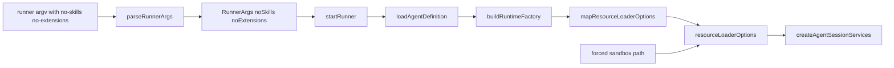
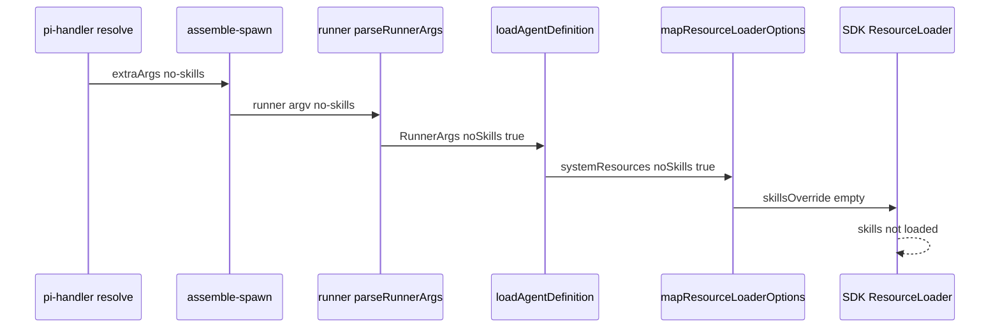

# Design Document — system-resource-toggle-fix

## Overview

**Purpose**: 修复「设置 → 扩展 → 系统资源」两个开关(「载入系统 skills」「载入系统 extensions」)在 **custom 模式 agent** 下不生效的缺陷,使关闭后新建会话真正不载入系统 skills / extensions。

**Users**: pi-web 使用者(检阅/调试 webext 示例时需要干净会话)与维护者。

**Impact**: 现状下 custom 模式开关无任何效果(`--no-skills`/`--no-extensions` 被 runner 静默丢弃)。本特性在 runner 解析与 option-mapper 之间补齐接线,使开关对 `defineAgent` 类(shape a/b)agent 生效,且不改变默认行为、CLI 模式与沙箱强制注入。

### Goals
- custom 模式关闭「载入系统 skills」→ 新建会话不载入系统/包/内置 skills(slash 面板无 `/skill:*`)。
- custom 模式关闭「载入系统 extensions」→ 新建会话不载入系统/包 extensions。
- 两开关独立;默认(开启/缺省)行为不变;CLI 模式回归不破;沙箱安全门保留。
- 单元/集成测试 + 浏览器 e2e 验收证据。

### Non-Goals
- 不改 `settings.json` 写盘与 argv 注入链路(已正确)。
- 不改 CLI 模式路径与 `assemble-spawn`(已正确)。
- 不支持既有运行中会话的运行时热切换(仅作用于新建会话)。
- 不覆盖 shape (c) branded `CreateAgentSessionRuntimeFactory`(自建 runtime,绕过 option-mapper)。

## Boundary Commitments

### This Spec Owns
- `parseRunnerArgs` 对 `--no-skills` / `--no-extensions` 的识别。
- `RunnerArgs` 新增两布尔字段及其在 `startRunner` 的透传。
- `loadAgentDefinition` / `buildRuntimeFactory` / `mapResourceLoaderOptions` 将两布尔落为 `resourceLoaderOptions.skillsOverride`(清空)与 `resourceLoaderOptions.noExtensions = true`。
- 配套单测与 e2e 验收。

### Out of Boundary
- 配置写盘、argv 注入(`system-resource-args.ts`、`pi-handler.ts`)。
- CLI 模式路径与 `assemble-spawn.ts`(不改动)。
- shape (c) branded runtime factory 的资源载入(作者自负)。
- 沙箱 enforcement 自身逻辑(仅须保证不被本特性破坏)。

### Allowed Dependencies
- SDK `@earendil-works/pi-coding-agent` 的 `ResourceLoaderOptions`(`skillsOverride` / `noExtensions` / `additionalExtensionPaths`)。
- 既有 `option-mapper` / `agent-loader` / `runner` 内部约定。
- 依赖约束:不得反向依赖 `lib/app/*`(主进程侧);runner 子进程侧自洽。

### Revalidation Triggers
- `RunnerArgs` 形状变化。
- `mapResourceLoaderOptions` 选项袋(options bag)签名变化。
- SDK `ResourceLoaderOptions` 中 skills/extensions 覆盖契约变化。
- 沙箱强制注入是否仍走 `additionalExtensionPaths` 的前提变化。

## Architecture

### Existing Architecture Analysis
注入侧(主进程)已正确:`system-resource-args.ts` 据 `settings.json` 算出 `extraArgs`,经 `pi-handler.ts:resolve()` → `AgentSourceResolver` → `assemble-spawn.ts` 拼入子进程 argv。子进程(runner)侧 `parseRunnerArgs` 是断点:它只认 `--agent/--cwd/--agent-dir/--session-id/--model/--source-meta/--trusted`,其余 flag 被丢弃。修复严格限定在 runner 子进程侧的「解析 → 透传 → 映射」三跳。

### Architecture Pattern & Boundary Map



**Architecture Integration**:
- Selected pattern:沿既有「argv → 解析 → 工厂 → resourceLoaderOptions」单向管线增补字段,无新组件、无新层。
- Dependency direction:`runner.ts`(解析)→ `agent-loader.ts`(载入)→ `option-mapper.ts`(映射)→ SDK。仅向右依赖。
- Existing patterns preserved:与 `--trusted` 的布尔 flag 解析方式一致;`forcedExtensionPaths` 经选项袋传入 `mapResourceLoaderOptions` 的既有约定。
- Steering compliance:TypeScript strict、禁 `any`;子进程隔离不变(用户代码仅在 runner 子进程经 jiti 执行)。

### Technology Stack

| Layer | Choice / Version | Role in Feature | Notes |
|-------|------------------|-----------------|-------|
| Backend / Services | TypeScript (strict),Node ≥22.19 | runner 解析 + option-mapper 映射 | 无新依赖 |
| Agent runtime | `@earendil-works/pi-coding-agent` SDK | `ResourceLoaderOptions.skillsOverride` / `noExtensions` | 既有依赖 |

## File Structure Plan

### Modified Files
- `packages/server/src/runner/runner.ts` — `parseRunnerArgs` 识别 `--no-skills` / `--no-extensions`(布尔 flag,支持 `--x` 与 `--x=true/false`);`RunnerArgs` 增 `noSkills?`/`noExtensions?`;`startRunner` 把二者透传给 `loadAgentDefinition`。
- `packages/server/src/runner/agent-loader.ts` — `loadAgentDefinition` 增可选 `systemResources: { noSkills?: boolean; noExtensions?: boolean }` 形参,转发给 `buildRuntimeFactory`(shape a/b 分支)。
- `packages/server/src/runner/option-mapper.ts` — `buildRuntimeFactory(def, trust, systemResources?)` 增形参;`mapResourceLoaderOptions(def, opts)` 的 `opts` 增 `noSkills?`/`noExtensions?`,据此设 `skillsOverride`(清空)与 `noExtensions=true`(并跳过 def.extensions 白名单分支)。

### New Files
- `packages/server/test/runner/system-resource-flags.test.ts` — 解析与映射四情形单测(关 skills / 关 extensions / 独立组合 / 默认全开)。

> e2e 验收复用既有浏览器验收手法(chrome-devtools),证据落 `.kiro/specs/system-resource-toggle-fix/evidence/`,不新增长期测试文件。

## System Flows

`--no-skills` 在 custom 模式的端到端生效路径(修复后):



门控说明:`noSkills` 时 `skillsOverride` 返回空集,优先于 `def.skills`;`noExtensions` 时设 `resourceLoaderOptions.noExtensions=true`,但 `additionalExtensionPaths`(沙箱)仍由 SDK 加载。

## Requirements Traceability

| Requirement | Summary | Components | Interfaces | Flows |
|-------------|---------|------------|------------|-------|
| 1.1, 1.2, 1.4 | custom 关 skills 不载入 / 无 `/skill:*` / 优先于 def.skills | parseRunnerArgs, mapResourceLoaderOptions | `RunnerArgs.noSkills`, `skillsOverride` | no-skills 序列 |
| 1.3 | 默认开启照常载入 skills | mapResourceLoaderOptions | `skillsOverride` 缺省 | — |
| 2.1, 2.2 | custom 关/默认 extensions | mapResourceLoaderOptions | `noExtensions` | — |
| 2.3 | 沙箱强制注入仍生效 | buildRuntimeFactory, mapResourceLoaderOptions | `forcedExtensionPaths` → `additionalExtensionPaths` | RLO 图 |
| 3.1–3.4 | 两开关独立 + 默认全开 | parseRunnerArgs, mapResourceLoaderOptions | `RunnerArgs.noSkills/noExtensions` | — |
| 4.1, 4.2 | CLI 回归 + 双模式一致 | (assemble-spawn 不改) | pi CLI 原生 flag | — |
| 5.1–5.3 | 单测 + e2e + 套件通过 | system-resource-flags.test.ts | — | e2e |

## Components and Interfaces

| Component | Layer | Intent | Req Coverage | Key Dependencies | Contracts |
|-----------|-------|--------|--------------|------------------|-----------|
| parseRunnerArgs | runner | 解析两布尔 flag | 1.1, 3.x | argv | State |
| loadAgentDefinition | runner | 透传 systemResources 至工厂 | 1.x, 2.x | buildRuntimeFactory (P0) | Service |
| mapResourceLoaderOptions | runner | 映射为 resourceLoaderOptions | 1.x, 2.x | SDK ResourceLoaderOptions (P0) | Service |

### Runner 层

#### parseRunnerArgs / RunnerArgs

| Field | Detail |
|-------|--------|
| Intent | 识别 `--no-skills` / `--no-extensions`,产出布尔字段 |
| Requirements | 1.1, 2.1, 3.1, 3.2, 3.3, 3.4 |

**Responsibilities & Constraints**
- 与 `--trusted` 同款:裸 `--no-skills` 视为 true;`--no-skills=false` 视为 false;未出现视为 undefined(默认载入)。
- 两 flag 互不影响。

**Contracts**: State [x]

```typescript
export interface RunnerArgs {
  agent: string;
  cwd: string;
  agentDir?: string;
  trusted: boolean;
  sessionId?: string;
  model?: string;
  sourceMeta?: string;
  /** --no-skills:true → 不载入系统/包/内置 skills(默认 undefined = 载入)。 */
  noSkills?: boolean;
  /** --no-extensions:true → 不载入系统/包 extensions(默认 undefined = 载入)。 */
  noExtensions?: boolean;
}
```

#### loadAgentDefinition

| Field | Detail |
|-------|--------|
| Intent | 把 systemResources 透传给 shape a/b 的 buildRuntimeFactory |
| Requirements | 1.1, 1.4, 2.1 |

**Contracts**: Service [x]

```typescript
export interface SystemResourceOverrides {
  readonly noSkills?: boolean;
  readonly noExtensions?: boolean;
}

export function loadAgentDefinition(
  agentPath: string,
  ctx: AgentContext,
  trust: ResolveProjectTrust,
  systemResources?: SystemResourceOverrides,
): Promise<NormalizedAgentRuntimeFactory>;
```
- Postconditions:shape (a)/(b) → `buildRuntimeFactory(def, trust, systemResources)`;shape (c) → 原样返回(systemResources 不适用)。

#### mapResourceLoaderOptions / buildRuntimeFactory

| Field | Detail |
|-------|--------|
| Intent | 将布尔落为 SDK 资源载入覆盖 |
| Requirements | 1.1, 1.3, 1.4, 2.1, 2.2, 2.3, 3.1–3.4 |

**Contracts**: Service [x]

```typescript
export function buildRuntimeFactory(
  def: AgentDefinition,
  trust: ResolveProjectTrust,
  systemResources?: SystemResourceOverrides,
): CreateAgentSessionRuntimeFactory;

// mapResourceLoaderOptions 的 opts 增字段
interface MapOptions {
  forcedExtensionPaths: string[];
  noSkills?: boolean;
  noExtensions?: boolean;
}
```

**Responsibilities & Constraints**
- `noSkills === true` → 在 `def.skills` 分支之后,无条件 `resourceLoaderOptions.skillsOverride = ({ diagnostics }) => ({ skills: [], diagnostics })`(覆盖 def.skills;对齐 pi CLI `--no-skills`)。
- `noExtensions === true` → `resourceLoaderOptions.noExtensions = true`,并跳过 `def.extensions` 的 `extensionsOverride` 白名单分支(白名单在「全关」下无意义);`forcedExtensionPaths` 仍写入 `additionalExtensionPaths`,SDK 在 `noExtensions` 下照常加载 → 沙箱门保留(需求 2.3)。
- 二者缺省/false → 不触碰对应字段,现状行为不变(需求 1.3, 2.2, 3.4)。

**Implementation Notes**
- Integration:`startRunner` 在 `loadAgentDefinition` 调用处传 `{ noSkills: args.noSkills, noExtensions: args.noExtensions }`。
- Validation:见 Testing Strategy。
- Risks:`noExtensions` 与既有 `def.extensions` 分支的交互——以「全关优先、保留 forced 路径」消解;shape (c) 不覆盖(边界外)。

## Testing Strategy

### Unit Tests(`packages/server/test/runner/system-resource-flags.test.ts`)
1. `parseRunnerArgs(["--no-skills"])` → `noSkills === true`;`--no-skills=false` → `false`;缺省 → `undefined`(extensions 同理)。
2. `mapResourceLoaderOptions(def, { forcedExtensionPaths: [], noSkills: true })` → `skillsOverride` 存在且返回空 skills;即使 `def.skills` 已设也被覆盖(需求 1.4)。
3. `mapResourceLoaderOptions(..., { noExtensions: true })` → `resourceLoaderOptions.noExtensions === true`,且 forced 路径仍进 `additionalExtensionPaths`(需求 2.3)。
4. 独立组合:仅 noSkills / 仅 noExtensions / 两者 / 全缺省 四矩阵,断言互不牵连(需求 3.1–3.4)。

### Integration / Regression
5. 既有 `option-mapper.test.ts` / `option-mapper-forced-inject.test.ts` 全绿(需求 5.3)。

### E2E(浏览器验收,需求 1.2 / 5.2)
6. dev 下 `settings.json` 置 `loadSystemSkills:false`,重启 dev;chrome-devtools 新建 custom 模式 webext 会话,断言首屏 slash 面板**无** `/skill:*`;对照组(开关开启)有 `/skill:*`。证据截图落 `evidence/`。

## Security Considerations
- 沙箱 enforcement 经 `additionalExtensionPaths` 强制注入,`noExtensions=true` 不绕过(SDK 契约);本特性须以测试 3 守住该不变量,避免「关 extensions」误关沙箱门。
