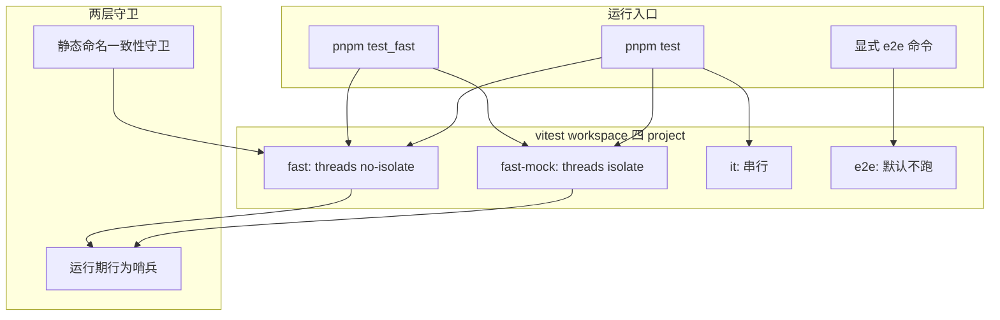
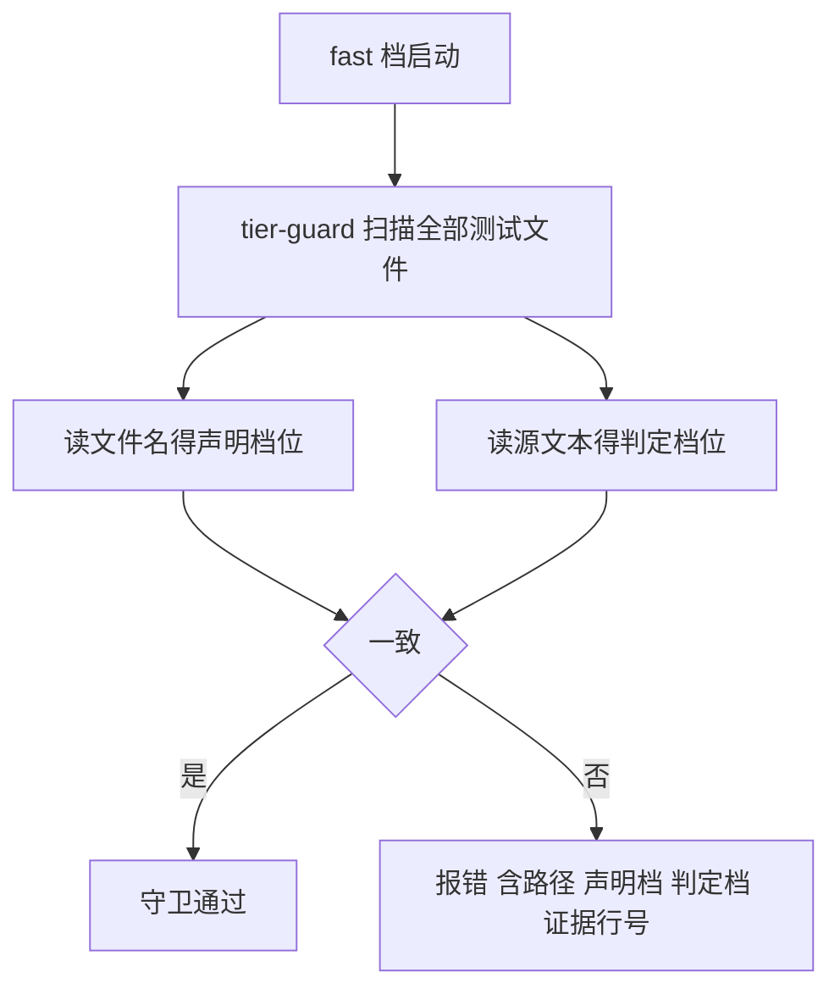
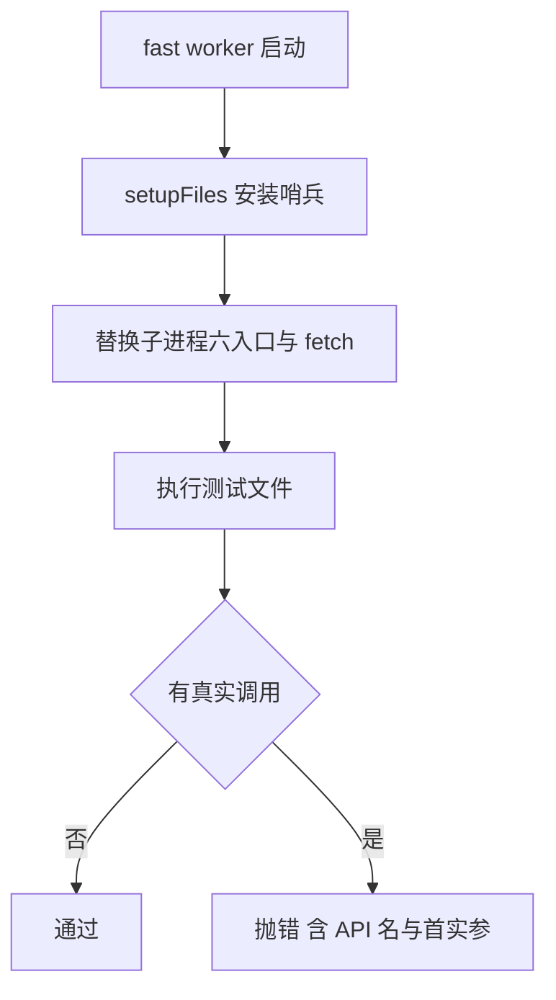
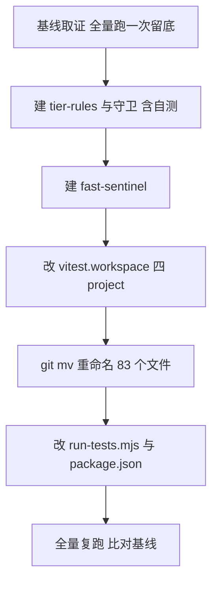

# Design Document — test-tiering-fast-lane

## Overview

**Purpose**：本特性把 `packages/server` 的 276 个测试文件按**运行代价**重新编排为 fast / it / e2e
三档，交付一条实测 **~5 秒**的快档闸门，并用两层守卫锁死分档判据，使其不再依赖注释与纪律维持。

**Users**：pi-web 开发者在日常修改中用快档取得秒级反馈；内核提取波次的后续四个 spec 用它作为
每次跨包搬迁的默认回归闸门。

**Impact**：改变的是「哪些测试在什么时候跑」，**不改变任何测试验证什么**。当前 `unit` 档
267 文件 / 2420 用例 / 86–116 秒的单一运行面，被替换为 fast（198 文件 / ~5 秒）、
it（75 文件 / 串行）、e2e（3 文件 / 手动触发）三个可独立运行的面。

### Goals

- fast 档在 10 秒内完成（实测目标 ~5 秒），且可作为纯逻辑改动的可信闸门
- 分档判据机械可校验，新增的重测试无法漂入快档
- 文件名后缀与实际档位一致，看名字即知运行代价
- 需要外部凭据的测试离开默认路径
- 全量通过面不低于基线（267 文件 / 2420 用例），且连续两次运行结果一致

### Non-Goals

- 不推广到其余 12 个子包与根 `test/`（本 spec 只在 `packages/server` 建立范式）
- 不改写任何测试断言、测试数据或产品代码
- 不修 barrel 的依赖边界（属 `kernel-boundary-decoupling` 与三个提取 spec）
- 不增删 e2e 用例本身
- 不建立 CI 作业定义（本 spec 只保证 e2e 可被显式触发，CI 接线属运维范围）

---

## Boundary Commitments

### This Spec Owns

- `packages/server` 内每个测试文件的**档位归属**与**文件命名**
- 测试档位的运行配置（project 定义、隔离策略、并行策略）
- 快档运行入口（`pnpm test:fast`）与全量运行编排
- 分档守卫（静态命名一致性 + 运行期行为哨兵）

### Out of Boundary

- 测试的断言内容、测试数据、被测产品代码 —— **一行都不改**
- 其余子包与根 `test/` 的分档
- `playwright.config.ts` 与浏览器 e2e 的编排
- barrel 的模块依赖结构
- CI 流水线定义

### Allowed Dependencies

- vitest 2.1.9 的原生能力：`projects` / `include` / `pool` / `isolate` / `setupFiles`
- Node 内建模块（`node:fs`、`node:path`、`node:child_process`）—— 仅守卫自身使用
- **不引入任何新的 npm 依赖**

### Revalidation Triggers

以下变更须让本设计的消费者重新校验：

- vitest 主版本升级（`isolate` / `pool` / project 配置语义可能变化 —— 现有 `run-tests.mjs`
  注释已记载 2.1.9 忽略 project 级 `fileParallelism` 的实测教训）
- 档位后缀命名约定变更
- 守卫的禁用依赖名册变更
- `packages/server` 拆包（内核提取波次的后三个 spec 会移动这些测试文件的物理位置）

---

## Architecture

### Existing Architecture Analysis

现状由两个文件承载，均需修改：

- `packages/server/vitest.workspace.ts` —— 定义 `unit` / `integration` 两个 project，
  **include 按目录切**（`test/integration/**` vs 其余）。
- `packages/server/scripts/run-tests.mjs` —— 先并行跑 unit，再用 CLI `--no-file-parallelism`
  串行跑 integration。★ 其注释记载了两条必须保留的实测结论：
  ① vitest 2.1.9 **忽略 project 级 `fileParallelism`**，串行只能靠 CLI 标志；
  ② `pnpm` 把 `test -- <args>` 追加到脚本串尾，故有显式参数时必须退回单次调用，
  否则破坏 `pnpm --filter … test -- --run <pattern>` 的开发者过滤用法。

本设计**保留这两条约束**，只替换分档维度（目录 → 后缀）并新增两个 project 与守卫。

### Architecture Pattern & Boundary Map



**Architecture Integration**：

- **Selected pattern**：后缀驱动的静态分档 + 双层守卫。档位在**收集期**由 include 模式决定，
  零运行期分类成本。
- **Domain boundaries**：配置层（project 定义）/ 编排层（运行脚本）/ 守卫层（两个独立机制），
  三者无共享状态，可并行实现。
- **Existing patterns preserved**：`run-tests.mjs` 的「有显式参数则退回单次调用」与
  「串行靠 CLI 标志」两条既有约束原样保留。
- **New components rationale**：静态守卫负责**声明**（名实一致）、运行期哨兵负责**行为**
  （真实调用）。两者刻意不合并 —— 失败时机不同（收集期 vs 执行期），错误信息不同，
  合并只会让报错更难懂。

### Technology Stack

| Layer | Choice / Version | Role in Feature | Notes |
|-------|------------------|-----------------|-------|
| 测试运行器 | vitest 2.1.9（既有） | project 分档、隔离策略、setupFiles | 不升级；2.1.9 的已知怪癖见 Revalidation Triggers |
| 运行时 | Node ≥22.19（既有） | 守卫脚本与哨兵 | 仅用内建模块 |
| 包管理 | pnpm 9.12（既有） | 脚本入口 | 参数追加行为见 Existing Architecture Analysis |

**不新增任何依赖。**

---

## File Structure Plan

### Directory Structure

```
packages/server/
├── vitest.workspace.ts              # 修改:两 project → 四 project(fast/fast-mock/it/e2e)
├── scripts/
│   └── run-tests.mjs                # 修改:两相 → 三相编排 + 快档专用路径
├── package.json                     # 修改:新增 test:fast 脚本
└── test/
    ├── setup/
    │   └── fast-sentinel.ts         # 新增:运行期行为哨兵(fast 与 fast-mock 的 setupFiles)
    ├── tiering/
    │   ├── tier-guard.test.ts       # 新增:静态命名一致性守卫(自身跑在 fast 档)
    │   ├── tier-rules.ts            # 新增:分档判据的单一事实来源(被守卫与其自测共用)
    │   └── fixtures/                # 新增:守卫自测用的违规样本(非 *.test.ts,不被收集)
    │       ├── violates-subprocess.sample.ts
    │       ├── violates-mock-suffix.sample.ts
    │       └── compliant.sample.ts
    └── **/*.{test,mock.test,it.test,e2e.test}.ts   # 75+5+3 个文件重命名
```

### Modified Files

- `packages/server/vitest.workspace.ts` —— 从按目录分档改为按后缀分档；新增
  `fast`（`pool:"threads"`, `isolate:false`）、`fast-mock`（`isolate:true`）、`it`、`e2e` 四个 project。
- `packages/server/scripts/run-tests.mjs` —— 全量路径改为「fast + fast-mock 并行 → it 串行」两相
  （e2e 不在其中）；新增只跑快档的分支；保留「有显式参数则单次调用」的既有行为。
- `packages/server/package.json` —— 新增 `test:fast`。
- 根 `package.json` —— 新增 `test:fast`，转发到 `packages/server`（本 spec 只覆盖该包）。
- **75 个文件** → `*.it.test.ts`（含 `test/integration/` 下 9 个、25 个真实 spawn、
  50 个 `mkdtemp` 使用者及 pi SDK 使用者的并集，去重后 75）
- **5 个文件** → `*.mock.test.ts`（使用 `vi.mock` 的 fast 档文件）
- **3 个文件** → `*.e2e.test.ts`（整文件被外部凭据门控者；其中 2 个已是 `.local*` 后缀需改名）

> `test/integration/` 目录**保留**但不再决定档位 —— 档位由后缀决定。保留目录使重命名 diff 最小。

---

## Requirements Traceability

| Requirement | Summary | Components | Interfaces | Flows |
|---|---|---|---|---|
| 1.1 | 每文件恰好归一档 | vitest.workspace 四 project | include 后缀模式 | 收集期分档 |
| 1.2 | 重依赖者不入 fast | tier-rules + 静态守卫 | `classifyTestFile()` | 守卫失败流 |
| 1.3 | fast 运行期无子进程/网络 | fast-sentinel | `installFastSentinel()` | 运行期哨兵流 |
| 1.4 | 无法判定则保守归 it | tier-rules | `classifyTestFile()` 默认分支 | — |
| 2.1 | 快档专用命令 | package.json + run-tests.mjs | `pnpm test:fast` | 快档路径 |
| 2.2 | 10 秒内完成 | fast project 的 threads+no-isolate | `pool`/`isolate` 配置 | — |
| 2.3 | 输出实测耗时与计数 | run-tests.mjs | vitest 默认摘要 | 快档路径 |
| 2.4 | 无需预构建即可跑 | fast project | 直连 `src/*.ts` | — |
| 3.1 | 档位可由文件名判定 | 后缀命名约定 | 四种后缀 | 收集期分档 |
| 3.2 | it/e2e 文件名与档位一致 | 重命名工作 | `git mv` | — |
| 3.3 | 名实不符则报红 | 静态守卫 | `tier-guard.test.ts` | 守卫失败流 |
| 3.4 | 归位后断言与通过态不变 | 重命名工作 | — | 基线比对 |
| 4.1 | 守卫随快档自动执行 | tier-guard 跑在 fast 档 | — | 快档路径 |
| 4.2 | 直接导入禁用依赖 → 红 | 静态守卫 + tier-rules | `FORBIDDEN_DIRECT_IMPORTS` | 守卫失败流 |
| 4.2.1 | 运行期实际调用 → 红 | fast-sentinel | `installFastSentinel()` | 运行期哨兵流 |
| 4.3 | 报具体文件 + 具体依赖 | 静态守卫 / 哨兵 | 错误消息契约 | 守卫失败流 |
| 4.4 | 新增违规文件被自动拦截 | 守卫全量扫描 | `classifyTestFile()` | 守卫失败流 |
| 5.1 | it 档文件间串行 | run-tests.mjs | CLI `--no-file-parallelism` | 全量路径 |
| 5.2 | 归位后 it 档全绿无随机失败 | it project | — | 基线比对 |
| 5.3 | it 档可独立运行 | it project | `--project it` | — |
| 5.4 | 全量覆盖两档再汇总 | run-tests.mjs | 退出码合并 | 全量路径 |
| 6.1 | 默认路径不含 e2e | run-tests.mjs | e2e 不在全量相内 | 全量路径 |
| 6.2 | 显式触发可跑 e2e | package.json | `--project e2e` | e2e 路径 |
| 6.3 | 无凭据机器默认命令可跑完 | e2e 判据（整文件门控） | — | — |
| 7.1 | 既有过滤用法可用 | run-tests.mjs | 显式参数分支 | — |
| 7.2 | 通过面不低于基线 | 全部 | — | 基线比对 |
| 7.3 | 不改断言/数据/产品代码 | 重命名工作 | `git mv` only | — |
| 7.4 | 完成宣称须附实测耗时 | 验收流程 | — | — |

---

## Components and Interfaces

| Component | Layer | Intent | Req Coverage | Key Dependencies | Contracts |
|---|---|---|---|---|---|
| `vitest.workspace.ts` | 配置 | 定义四档 project | 1.1, 2.2, 2.4, 3.1, 5.1, 5.3, 6.1 | vitest (P0) | State |
| `run-tests.mjs` | 编排 | 分相运行与退出码合并 | 2.1, 2.3, 5.1, 5.4, 6.1, 6.2, 7.1 | vitest CLI (P0) | Batch |
| `tier-rules.ts` | 守卫 | 分档判据的单一事实来源 | 1.2, 1.4, 4.2, 4.4 | node:fs (P0) | Service |
| `tier-guard.test.ts` | 守卫 | 静态名实一致性校验 | 3.3, 4.1, 4.3, 4.4 | tier-rules (P0) | Service |
| `fast-sentinel.ts` | 守卫 | 运行期行为拦截 | 1.3, 4.2.1, 4.3 | node:child_process (P0) | Service |

### 守卫层

#### tier-rules

| Field | Detail |
|-------|--------|
| Intent | 把「一个测试文件属于哪一档」这条判据收敛到唯一实现，供守卫与其自测共用 |
| Requirements | 1.2, 1.4, 4.2, 4.4 |

**Responsibilities & Constraints**

- 仅做**直接**导入分析：读取单个文件的源文本，不递归模块图。
  ★ 传递分析已被实测证伪（59% 误报，见 `research.md` §4.1），**不得**在此重新引入。
- 必须识别**工厂式 `vi.mock`**：`vi.mock(spec, factory)` 且 factory 不含 `importOriginal` 时，
  真实模块从不加载，该 specifier **不计入**禁用依赖。
  ★ 漏掉这条会误伤 `e2b-transport` 与 `sandbox-ws-transport` 两个合法的 fast 测试。
- 判据不确定时返回 `"it"`（保守归档，1.4）。

**Dependencies**

- Outbound: `node:fs` — 读取测试文件源文本（P0）
- Inbound: `tier-guard.test.ts` — 唯一消费者（P0）

**Contracts**: Service [x] / API [ ] / Event [ ] / Batch [ ] / State [ ]

##### Service Interface

```typescript
/** 四个档位。fast 与 fastMock 同属快档，差别只在是否需要模块隔离。 */
export type TestTier = "fast" | "fastMock" | "it" | "e2e";

/** 触发降档的具体证据，用于错误消息(4.3 要求报出「具体依赖」而非仅「存在违规」)。 */
export interface TierEvidence {
  readonly kind: "direct-import" | "temp-dir" | "module-mock" | "credential-gate";
  /** 命中的 specifier 或 API 名，例如 "e2b"、"node:child_process"、"mkdtemp"。 */
  readonly detail: string;
  /** 1-based 行号，便于开发者直接跳转。 */
  readonly line: number;
}

export interface TierClassification {
  readonly tier: TestTier;
  readonly evidence: readonly TierEvidence[];
}

/** 由源文本判定档位。纯函数,不触碰文件系统,便于用固定样本单测。 */
export function classifyTestSource(source: string): TierClassification;

/** 由文件名反推声明的档位。未知后缀视为 "fast"。 */
export function tierFromFilename(filename: string): TestTier;

/** 禁止在 fast 档直接导入的 specifier 名册(前缀匹配)。 */
export const FORBIDDEN_DIRECT_IMPORTS: readonly string[];
```

- Preconditions：`source` 是 UTF-8 TypeScript 源文本。
- Postconditions：`tier === "fast"` ⟹ `evidence` 为空数组。
- Invariants：同一 `source` 恒得同一结果（纯函数，无 IO、无随机、无时间依赖）。

**Implementation Notes**

- Integration：`classifyTestSource` 与 `tierFromFilename` 分离，是为了让守卫能报出
  「声明 X、实际 Y」这种双向信息，而不是只说「不合规」。
- Validation：`e2e` 档的「整文件被凭据门控」难以稳定静态判定，故 `classifyTestSource`
  **不推断 e2e**；e2e 成员由文件名声明，守卫只反向校验「`.e2e.test.ts` 不出现在默认路径」。
  这是刻意的能力缺口，不是遗漏。
- Risks：正则解析 TypeScript 存在理论盲区（字符串里的假 import）。接受此风险 ——
  运行期哨兵是行为兜底，静态层只需给出早期清晰信号。

#### tier-guard

| Field | Detail |
|-------|--------|
| Intent | 全量扫描测试文件，断言「文件名声明的档位」与「源文本判定的档位」一致 |
| Requirements | 3.3, 4.1, 4.3, 4.4 |

**Responsibilities & Constraints**

- 自身跑在 fast 档，故必须满足 fast 判据（不起子进程、不写真实 fs）——只读文件。
- 失败消息必须含：文件路径、声明档位、判定档位、命中证据（含行号）。
- 全量扫描 276 个文件的耗时须计入 fast 档预算（实测同类脚本 0.77 秒，含传递遍历；
  本设计只做直接分析，应更快）。

**Contracts**: Service [x] / API [ ] / Event [ ] / Batch [ ] / State [ ]

**Implementation Notes**

- Validation：守卫自身需用 `test/tiering/fixtures/` 下的样本文件单测 ——
  违规样本必须被判红、合规样本必须被判绿。★ 没有这层自测，守卫可能恒真而无人察觉
  （一个恒真的校验比没有校验更坏，它让人以为那个方向有人看着）。
- 样本文件用 `.sample.ts` 后缀，避免被任何 project 的 include 收集。

#### fast-sentinel

| Field | Detail |
|-------|--------|
| Intent | 在 fast 与 fast-mock 两相的每个 worker 内拦截真实子进程与网络调用 |
| Requirements | 1.3, 4.2.1, 4.3 |

**Contracts**: Service [x] / API [ ] / Event [ ] / Batch [ ] / State [ ]

##### Service Interface

```typescript
/**
 * 安装运行期哨兵。经 vitest `setupFiles` 在每个 worker 启动时调用一次。
 * 拦截后抛出的错误消息须含被调用的 API 名与首个实参，便于定位。
 */
export function installFastSentinel(): void;
```

- Preconditions：在任何被测模块加载**之前**执行（`setupFiles` 语义保证）。
- Postconditions：`child_process` 的 `spawn`/`spawnSync`/`exec`/`execSync`/`execFile`/`fork`
  与全局 `fetch` 均被替换为抛错桩。
- Invariants：不改变任何非拦截 API 的行为。

**Implementation Notes**

- Integration：`isolate:false` 下 setup 文件按 worker 执行一次，拦截对该 worker 内所有文件生效。
- Validation：**已实证** —— 193 个 fast 文件在哨兵下 190 passed / 3 skipped，零违规零误报
  （`research.md` §4.2）。
- Risks：本次只拦子进程与 `fetch`，**不拦真实 fs 写入**。写 fs 的文件已由 `mkdtemp` 判据归入
  it 档，故当前无缺口；若将来放宽，须同步增补哨兵。这是**已声明的能力边界**，不是疏漏。

### 配置与编排层

#### vitest.workspace（四 project）

| Field | Detail |
|-------|--------|
| Intent | 用后缀 include 模式定义四档，并为每档指定隔离与并行策略 |
| Requirements | 1.1, 2.2, 2.4, 3.1, 5.1, 5.3, 6.1 |

**Contracts**: Service [ ] / API [ ] / Event [ ] / Batch [ ] / State [x]

##### State Management

| project | include | exclude | pool | isolate | 默认路径 |
|---|---|---|---|---|---|
| `fast` | `test/**/*.test.ts` | `*.mock.test.ts`, `*.it.test.ts`, `*.e2e.test.ts` | threads | **false** | 是 |
| `fast-mock` | `test/**/*.mock.test.ts` | — | threads | true | 是 |
| `it` | `test/**/*.it.test.ts` | — | threads | true | 是 |
| `e2e` | `test/**/*.e2e.test.ts` | — | threads | true | **否** |

- ★ `it` 与 `e2e` 的**串行**不能靠此处配置 —— vitest 2.1.9 忽略 project 级 `fileParallelism`
  （既有实测：24.2 s 并发 vs 加 CLI 标志后 63.7 s 真串行）。串行由 `run-tests.mjs` 传的
  CLI 标志保证。此处不写该字段，避免再次制造「以为改这里有用」的假象。

#### run-tests（编排）

| Field | Detail |
|-------|--------|
| Intent | 分相运行、合并退出码、保留既有开发者过滤用法 |
| Requirements | 2.1, 2.3, 5.1, 5.4, 6.1, 6.2, 7.1 |

**Contracts**: Service [ ] / API [ ] / Event [ ] / Batch [x] / State [ ]

##### Batch Contract

- **Trigger**：`pnpm test`（全量）、`pnpm test:fast`（仅快档）、`pnpm test -- <args>`（过滤）
- **Input / validation**：透传 CLI 参数；有显式参数时**退回单次 vitest 调用**（保 7.1）
- **Output**：两相各自的 vitest 摘要；退出码 = `fastExit || itExit`（两相都跑完再汇总，保 5.4）
- **Idempotency & recovery**：无状态，可重复运行

| 路径 | 相 | 命令要点 |
|---|---|---|
| 全量 | 相 1 | `--project fast --project fast-mock`（并行） |
| 全量 | 相 2 | `--project it --no-file-parallelism`（串行） |
| 快档 | 单相 | `--project fast --project fast-mock` |
| e2e | 单相 | `--project e2e --no-file-parallelism`（**不在全量内**） |

---

## System Flows

### 守卫失败流（静态层）



### 运行期哨兵流



两条流刻意分离：静态层在**收集期**给出早期信号，哨兵在**执行期**兜底。
静态层有理论盲区（正则解析），哨兵有能力边界（不拦 fs）；两者的缺口不重叠。

---

## Error Handling

### Error Strategy

守卫类错误一律**快速失败**，不降级、不警告了事 —— 一个只打印警告的守卫等于没有守卫。

### Error Categories and Responses

- **分档声明错误**（名实不符）：静态守卫在 fast 档报测试失败，消息含文件路径、声明档位、
  判定档位、命中证据与行号。开发者的修复动作是改文件名或把测试拆开。
- **运行期违规**（fast 档实际起子进程/发网络）：哨兵抛错，消息含被调用 API 与首个实参。
  修复动作是把该文件改名归入 it 档。
- **档位配置错误**（某文件不被任何 project 收集）：由守卫的「全量文件数 = 四档之和」断言捕获，
  防止文件因后缀笔误而静默失踪。★ 这是最危险的失败形态 —— 测试消失比测试变红更难发现。

### Monitoring

无需额外监控设施。守卫失败即测试失败，走既有的测试输出通道。

---

## Testing Strategy

### Unit Tests

1. `classifyTestSource` 对「直接 import `node:child_process`」的源文本返回 `it` 且证据含行号
2. `classifyTestSource` 对「`vi.mock("e2b", factory)` 且不含 `importOriginal`」的源文本
   **不**把 `e2b` 计入禁用依赖（防止误伤两个合法 fast 测试）
3. `classifyTestSource` 对「`vi.mock(..., importOriginal)`」返回 `fastMock`
4. `tierFromFilename` 对四种后缀各返回对应档位，未知后缀返回 `fast`
5. `classifyTestSource` 对判据不明的源文本返回 `it`（保守归档，1.4）

### Integration Tests

1. tier-guard 对 `fixtures/violates-subprocess.sample.ts` 判红，且错误消息含该文件路径
2. tier-guard 对 `fixtures/violates-mock-suffix.sample.ts` 判红（用 `vi.mock` 却无 `.mock` 后缀）
3. tier-guard 对 `fixtures/compliant.sample.ts` 判绿
4. tier-guard 断言「测试文件总数 = 四档收集数之和」，人为制造后缀笔误时该断言转红
5. fast-sentinel 安装后调用 `child_process.spawn` 抛错，且消息含 `spawn` 与首个实参

### Performance

1. fast 档（fast + fast-mock）墙钟 **< 10 秒**（基准值 ~5 秒；实测证据见 `research.md` §3）
2. tier-guard 全量扫描 276 文件耗时 < 2 秒（不得吃掉快档预算）
3. it 档串行运行全绿，且无因并发抢占导致的随机失败（对照既有 `run-tests.mjs` 注释所述症状）
4. 全量运行（fast + fast-mock + it）通过面 ≥ 基线 267 文件 / 2420 用例,且**连续两次运行结果一致**（基线本身做不到这一点,见 `research.md` §2.3）

### 验收证据要求（7.4）

宣称完成时必须附 fast 与 it 两档的**实测运行输出（含耗时）**。
★ 既有 `run-tests.mjs` 注释已记载：「只看『跑绿了』不足以验证此类修复，必须比对耗时/并发证据，
否则会被偶然的绿骗过」。本 spec 的验收沿用该标准。

---

## Migration Strategy



- **顺序理由**：守卫先于重命名建立 —— 守卫在重命名前应当**大面积报红**（那正是它有判别力的证明），
  重命名后转绿。若守卫在重命名前就是绿的，说明它恒真，须当场排查。
- **回滚触发**：全量通过面低于基线；或 fast 档超过 10 秒且无法经配置调回。
- **校验点**：P0 的基线输出留档，P6 与之逐项比对（文件数、用例数、跳过数）。
