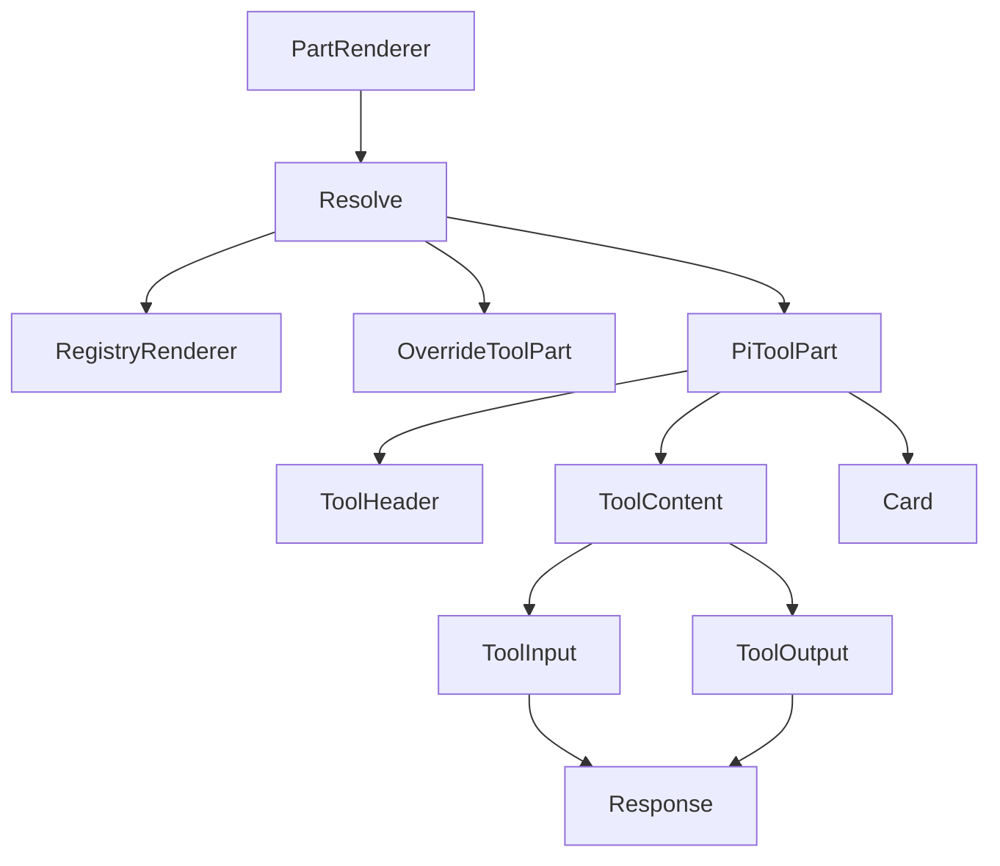
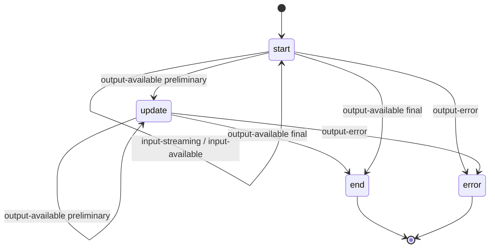

# Design Document — tool-call-ui-redesign

## Overview
**Purpose**: 将 `@blksails/ui` 的工具调用渲染 `PiToolPart` 由单体卡片复合化为一组可装配、可独立替换的子组件（`ToolHeader` / `ToolContent` / `ToolInput` / `ToolOutput`），对齐 AI SDK Elements `Tool` 的视觉与交互（状态徽章、按状态展开、输入语法高亮、输出富渲染），并为宿主新增 `ComponentOverrides.ToolPart` 整体替换入口。

**Users**: 最终用户在会话中看到更易读的工具卡；宿主应用作者可整体替换工具卡；agent source 的 `.pi/web` 扩展作者继续通过 `renderers.tools` 按工具名整卡替换。

**Impact**: 改写 `parts/pi-tool-part.tsx`（重写并拆出同文件子组件），在 `chat/part-renderer.tsx` 的工具分派中引入 `componentOverrides.ToolPart` 三级回退，在 `customization/component-overrides.ts` 新增 `ToolPart` 字段，在包根 `index.ts` 导出子组件。数据来源、协议、注册表语义均不变。

### Goals
- 复合子组件 API 并公开导出，`PiToolPart` 作为向后兼容装配壳。
- 视觉对齐参考：4 态徽章（含 pi 特有 Streaming）、按状态默认展开、input JSON 高亮、output 富渲染（复用 `Response`，零新依赖）。
- 新增宿主 `ComponentOverrides.ToolPart` 入口，明确 `registry > overrides > 默认` 优先级。
- 保留全部 data 属性、流式态、注册回退链、无障碍；单测 + 一条浏览器 e2e 验收。

### Non-Goals
- 工具数据来源改造（不引入 RPC 拉取；数据仍仅来自 message parts）。
- ~~修复 `data-pi-tool-partial` 与 `PiToolPart` 既有消费割裂。~~ **已解决(2026-06-20,后续协议/翻译层改动)**：`tool_execution_update` 的累积 `partialResult` 不再产独立 `data-pi-tool-partial` data part(此 part 已从协议移除),改翻译为 `tool-output-available` + `preliminary: true` 喂进同一工具卡(AI SDK 按 `toolCallId` 复用 part,后续帧替换前序产出),由 `PiToolPart` 的 `update` 态消费。本 UI 重构本身不含此改动,但其 phase 状态机(`output-available preliminary → update`)正是该修复的消费端。
- 改动协议层 `tool-*` chunk schema 或 `isToolPart` 判别规则。（注:上述割裂修复给 `tool-output-available` chunk 增了可选 `preliminary` 字段,属最小增量,不影响既有判别。）
- webext 子部件级注入（仅替换 `ToolOutput` 等单个子件）—— 留作后续。

## Boundary Commitments

### This Spec Owns
- `parts/pi-tool-part.tsx` 的全部内容：`PiToolPart` 装配壳 + `ToolHeader` / `ToolContent` / `ToolInput` / `ToolOutput` 子组件及其 props 类型，phase 推导（`phaseOf`）、徽章映射（`PHASE_LABEL`）、按状态展开默认值。
- `customization/component-overrides.ts` 中新增的 `ToolPart` 覆盖字段。
- `chat/part-renderer.tsx` 中**工具 part 分派**的三级渲染器解析。
- 工具卡的 data 属性契约与无障碍属性。
- 包根 `index.ts` 中工具卡相关导出。

### Out of Boundary
- message parts → UIMessage 的组装、`tool-*` chunk schema（`protocol` 包）。
- `isToolPart` / `isDataPart` 判别与 data-part 分派分支。
- `RendererRegistry` 内部实现与命名空间算法（只消费其公开 API）。
- `Response` / `streamdown` 的渲染实现（只复用）。
- webext `applyExtensionRenderers` 实现（只保证其整卡替换链路不被破坏）。

### Allowed Dependencies
- `ui/response.tsx` 的 `Response`（streamdown + 内置 shiki）。
- `ui/card.tsx` 的 `Card`、`lib/cn.ts` 的 `cn`、`lucide-react` 图标。
- `registry/renderer-registry.ts` 的 `resolveToolRenderer`（公开 API）。
- `customization` 的 `resolveComponent` 模式（与既有覆盖一致）。
- 依赖方向：`ui/*`（基元）→ `parts/*` → `chat/part-renderer` → `chat/pi-chat`；不得反向。

### Revalidation Triggers
- `ToolRenderer` 契约（`{ part, message }`）形状变化。
- `ComponentOverrides` 形状变化（新增/移除字段语义）。
- 任一 data 属性键名或 `data-pi-tool-phase` 取值集合变化。
- 工具分派优先级顺序变化。

## Architecture

### Existing Architecture Analysis
- **当前模式**：`PartRenderer` 按 `part.type` 分派；工具 part → `resolveToolRenderer(name) ?? PiToolPart`。`PiToolPart` 单体内联渲染头部、徽章、`<pre>` 明细。
- **保留的边界**：part 判别、注册表语义、data-part 分支、协议帧不变。
- **处理的技术债**：input/output 无高亮、output 不支持富节点、恒展开噪声、宿主无整体替换入口 —— 本特性针对性改善，不外溢。

### Architecture Pattern & Boundary Map
- **选型**：Compound Component（复合组件）+ 装配壳（`PiToolPart`）+ 渲染器解析链（registry → overrides → default）。
- **理由**：复合化提供可替换子件与对齐参考的结构；装配壳保证向后兼容；解析链统一定制优先级。



工具分派解析顺序：`RegistryRenderer`（按 toolName，含 webext 扩展）优先；否则 `OverrideToolPart`（宿主 `componentOverrides.ToolPart`）；否则默认 `PiToolPart`。

### Technology Stack

| Layer | Choice / Version | Role in Feature | Notes |
|-------|------------------|-----------------|-------|
| Frontend | React 18 + TypeScript | 复合组件与装配壳 | 现有栈 |
| Frontend | streamdown ^1（内置 shiki） | input JSON 高亮 / output 富渲染 | 经既有 `Response`，零新依赖 |
| Frontend | lucide-react | 图标（Wrench/Chevron/Loader2） | 现有栈 |

## File Structure Plan

### Modified Files
- `packages/ui/src/parts/pi-tool-part.tsx` — **重写**：拆出 `ToolHeader` / `ToolContent` / `ToolInput` / `ToolOutput`（同文件多导出），`PiToolPart` 改为装配这些子件；新增按状态展开默认值与子件 props 类型；保留全部 data 属性、phase 推导、无障碍。
- `packages/ui/src/customization/component-overrides.ts` — 新增可选 `ToolPart?: ComponentType<PiToolPartProps>` 字段（import 类型自 `parts/pi-tool-part.js`）。
- `packages/ui/src/chat/part-renderer.tsx` — 工具分派改为三级回退：`resolveToolRenderer(name)` → `componentOverrides?.ToolPart` → `PiToolPart`；需能拿到 `componentOverrides`（沿用既有传入路径，见 Open Questions）。
- `packages/ui/src/index.ts` — 导出 `ToolHeader` / `ToolContent` / `ToolInput` / `ToolOutput` 及其 props 类型。

### New Files
- `packages/ui/test/parts/pi-tool-part.test.tsx` — **更新**（已存在）：覆盖 4 态、按状态展开、input 高亮容器、output 富节点/错误。
- `packages/ui/test/chat/part-renderer.test.tsx` — **更新**（已存在）：覆盖三级优先级（registry > overrides > default）。
- `e2e/browser/tool-call-ui.e2e.ts` — **新增**：浏览器 e2e 覆盖工具卡状态渲染 / 展开折叠 / 自定义渲染器覆盖。

> 复合子件同置单文件：契约简单、共享 phase 与 data 属性，拆多文件回归面大收益低（见 research.md 决策 1）。

## System Flows

工具卡 phase 状态机（由 `part.state` + `preliminary` 推导）：



默认展开决策（仅当调用方未显式传 `defaultOpen`）：`end` 与 `error` 展开；`start` 与 `update` 折叠。

## Requirements Traceability

| Requirement | Summary | Components | Interfaces | Flows |
|-------------|---------|------------|------------|-------|
| 1.1 | 导出四子件 | ToolHeader/ToolContent/ToolInput/ToolOutput | 子件 props | — |
| 1.2 | PiToolPart 装配壳兼容 | PiToolPart | PiToolPartProps | — |
| 1.3 | 包根导出不破坏既有 | index.ts | 导出面 | — |
| 1.4 | 子件可独立渲染 | 四子件 | 子件 props | — |
| 2.1–2.5 | 4 态徽章 + 工具名 | ToolHeader | `phaseOf`/`PHASE_LABEL` | phase 状态机 |
| 3.1–3.4 | 按状态展开 + 切换 | PiToolPart | `defaultOpen` 推导 | 展开决策 |
| 4.1 | input JSON 高亮 | ToolInput | Response(json fence) | — |
| 4.2 | output 接受 ReactNode | ToolOutput | `ToolOutputProps.output` | — |
| 4.3 | errorText destructive | ToolOutput | `ToolOutputProps.errorText` | — |
| 4.4 | 非字符串安全序列化 | ToolOutput | `stringify` 回退 | — |
| 5.1 | 新增 ToolPart 覆盖 | ComponentOverrides | `ToolPart` 字段 | — |
| 5.2–5.4 | 三级优先级解析 | PartRenderer | 渲染器解析链 | 解析顺序 |
| 6.1–6.3 | webext 整卡替换兼容 | RendererRegistry/applyExtension | `resolveToolRenderer` | 解析顺序 |
| 7.1–7.4 | data 属性/无障碍/测试 | PiToolPart 全体 | data-* / aria-* | — |

## Components and Interfaces

| Component | Domain/Layer | Intent | Req Coverage | Key Dependencies | Contracts |
|-----------|--------------|--------|--------------|------------------|-----------|
| ToolHeader | parts/UI | 工具名 + 状态徽章 + 折叠触发器 | 2.1–2.5, 3.4, 7.1–7.3 | lucide-react (P1) | State(props) |
| ToolContent | parts/UI | 明细区容器 + 折叠可见性 + `data-pi-tool-detail` | 3.4, 7.2 | — | State(props) |
| ToolInput | parts/UI | 入参 JSON 高亮 | 4.1 | Response (P0) | State(props) |
| ToolOutput | parts/UI | 输出富渲染 / 错误渲染 | 4.2–4.4 | Response (P0) | State(props) |
| PiToolPart | parts/UI | 装配壳 + phase/展开推导 + 根 data 属性 | 1.2, 1.4, 2.x, 3.x, 7.x | 四子件 (P0) | State(props) |
| PartRenderer（改） | chat/UI | 工具渲染器三级解析 | 5.2–5.4, 6.x | registry, overrides (P0) | State |
| ComponentOverrides（改） | customization | 新增 ToolPart 覆盖位 | 5.1 | PiToolPartProps (P0) | State |

### parts/UI

#### PiToolPart（装配壳）

| Field | Detail |
|-------|--------|
| Intent | 由子件组合渲染工具卡，推导 phase 与默认展开，承载根 data 属性 |
| Requirements | 1.2, 1.4, 2.1–2.5, 3.1–3.4, 7.1–7.4 |

**Responsibilities & Constraints**
- 推导 `phase = phaseOf(part)` 与 `name = toolNameOf(part)`（沿用既有逻辑）。
- 默认展开：`const open0 = defaultOpen ?? (phase === "end" || phase === "error")`。
- 受控 `open` state，点击 `ToolHeader` 触发器切换。
- 根 `Card` 保留 `data-pi-tool` / `data-pi-tool-phase` / `data-pi-tool-name`，error 态加 destructive 边框。
- 装配时把 `part` 的 input 传 `ToolInput`、output/errorText 传 `ToolOutput`。

**Dependencies**
- Outbound: `ToolHeader`/`ToolContent`/`ToolInput`/`ToolOutput` — 子件渲染 (P0)
- Outbound: `Card`/`cn` — 容器与样式 (P1)

**Contracts**: State [x]

##### State Management
```typescript
export interface PiToolPartProps {
  readonly part: ToolPart;
  readonly message?: UIMessage;
  readonly defaultOpen?: boolean;
  readonly className?: string;
}
```
- Preconditions: `part.type` 为 `tool-*` 或 `dynamic-tool`。
- Postconditions: 渲染含全部 data 属性的工具卡；`open` 初值按状态或显式 `defaultOpen`。
- Invariants: `data-pi-tool-phase ∈ {start, update, end, error}`。

#### ToolHeader

| Field | Detail |
|-------|--------|
| Intent | 渲染折叠触发器 + 工具名 + 状态徽章（含 Streaming 旋转图标） |
| Requirements | 2.1–2.5, 3.4, 7.1, 7.3 |

**Contracts**: State [x]

```typescript
export interface ToolHeaderProps {
  readonly name: string;
  readonly phase: ToolPhase;          // "start" | "update" | "end" | "error"
  readonly open: boolean;
  readonly contentId: string;         // aria-controls 目标
  readonly onToggle: () => void;
  readonly className?: string;
}
```
- 徽章文案：`PHASE_LABEL[phase]`（Running/Streaming/Completed/Error）；`update` 态前置 `Loader2` 旋转。
- 徽章容器保留 `data-pi-tool-status`；error 态 destructive 配色。
- 触发器 `button` 带 `aria-expanded={open}`、`aria-controls={contentId}`，键盘可达。

**Implementation Notes**
- Integration: `ToolPhase` 与 `PHASE_LABEL` 自本文件导出，供子件与测试复用。
- Validation: 工具名由 `PiToolPart` 经 `toolNameOf` 传入，子件不重复解析。

#### ToolContent

| Field | Detail |
|-------|--------|
| Intent | 明细区容器，按 `open` 控制可见，承载 `data-pi-tool-detail` 与 `id`（aria-controls 目标） |
| Requirements | 3.4, 7.2 |

```typescript
export interface ToolContentProps {
  readonly id: string;
  readonly open: boolean;
  readonly isError?: boolean;
  readonly className?: string;
  readonly children?: React.ReactNode;
}
```
- `open === false` 时不渲染明细（与既有行为一致）。
- error 态文字 destructive。

#### ToolInput

| Field | Detail |
|-------|--------|
| Intent | 以 JSON 语法高亮代码块渲染入参 |
| Requirements | 4.1 |

```typescript
export interface ToolInputProps {
  readonly input: unknown;
  readonly className?: string;
}
```
- 默认实现：`stringify(input)` → `highlightJson()` 用正则把 JSON 切成 key/string/number/bool/null/punct token 并各包 `<span class="pi-json-*">`，渲染进 `<pre class="...bg-muted rounded p-2"><code class="language-json">…</code></pre>`。同步渲染、保留缩进与完整文本节点（textContent 可断言、可访问、无异步闪烁）。token 配色经 `styles.css` 的 `--pi-json-*` CSS 变量（亮/暗两套，无硬编码色）。
- 回退：`input` 为 `undefined` 渲染空；序列化失败用 `String(input)`（`highlightJson` 对非 JSON 文本不匹配 token 即原样输出）。
- **决策依据**：实测 `Response`（streamdown）对 ```` ```json ```` 代码块经 shiki **异步**渲染，jsdom 下同步 textContent 为空、异步后压缩缩进并带语言前缀 → 对工具入参不可靠（research.md R4）。且仅 `language-json` className 无配套 CSS 时为无色纯文本（视觉缺陷）。故采用轻量同步 token 高亮 + 主题色变量。

#### ToolOutput

| Field | Detail |
|-------|--------|
| Intent | 渲染输出（接受任意 ReactNode）或错误文本 |
| Requirements | 4.2, 4.3, 4.4 |

```typescript
export interface ToolOutputProps {
  readonly output?: React.ReactNode;   // 富节点直接渲染
  readonly errorText?: string;
  readonly className?: string;
}
```
- 若 `errorText` 存在：渲染错误文本，destructive 配色（4.3）。
- 否则渲染 `output`：为 `React` 节点直接渲染；`PiToolPart` 装配时按类型转默认节点传入 —— **字符串型**经 `Response` 富渲染（markdown，纯文本同步可断言），**数据型**（对象/数组）用与 `ToolInput` 一致的同步 JSON 代码块（4.2/4.4）。

### customization

#### ComponentOverrides（修改）
- 新增 `readonly ToolPart?: ComponentType<PiToolPartProps>;`。
- 语义：宿主提供时，作为工具卡默认渲染的替代（仅当未命中按工具名注册器，见 PartRenderer）。

### chat

#### PartRenderer（修改 — 工具分派）
- 工具 part 分支解析顺序（5.2–5.4, 6.x）：
  1. `const R = registry.resolveToolRenderer(name)` → 命中即用（含 webext 扩展，优先级最高，6.3）。
  2. 否则 `const O = componentOverrides?.ToolPart` → 命中即用。
  3. 否则默认 `PiToolPart`。
- 选定组件以 `{ part, message }`（注册器/默认）或 `{ part, message, ... }`（overrides 同 `PiToolPartProps`）渲染。

**Implementation Notes**
- Integration: `PartRenderer` 须能访问 `componentOverrides`。现状若工具分派未持有该引用，则沿用 `pi-chat` 已有的 customization 注入路径补齐传参（见 Open Questions）。
- Risks: 不得改动 data-part 分支与 `isToolPart` 判别。

## Error Handling

### Error Strategy
- **渲染层防御**：`stringify` 对循环/不可序列化值 try/catch 回退 `String(value)`（4.4）。
- **错误态展示**：`output-error` → `ToolOutput` 渲染 `errorText` + destructive；根卡 destructive 边框；phase=`error` 自动展开（3.1）。
- **扩展渲染隔离**：webext 自定义渲染器既有 `ExtErrorBoundary` 保护，本特性不改其隔离行为。

### Error Categories and Responses
- **User-facing 工具错误**：`output-error` 态可读错误文本，默认展开便于排查。
- **数据异常**：非法/不可序列化 input/output → 安全回退渲染，不抛错中断消息流。

## Testing Strategy

### Unit Tests（packages/ui/test）
- `pi-tool-part.test.tsx`：
  1. `start` 态 → "Running" 徽章 + 工具名 + 入参可见（折叠默认下需断言展开后或显式 `defaultOpen`）。
  2. `update`（preliminary）→ "Streaming" + `Loader2`（`animate-spin`）。
  3. `end` 态 → "Completed" + 输出渲染 + 默认展开。
  4. `error` 态 → "Error" + `errorText` + destructive + 默认展开 + `data-pi-tool-phase="error"`。
  5. data 属性齐全：`data-pi-tool` / `-phase` / `-name` / `-status` / `-detail`。
  6. 折叠交互：点击切换 `aria-expanded`，`aria-controls` 指向明细 id。
  7. 按状态默认展开：`start/update` 折叠、`end/error` 展开；显式 `defaultOpen` 覆盖。
- `part-renderer.test.tsx`：
  8. registry 命中 → 用注册渲染器（优先于 overrides）。
  9. 仅 overrides → 用 `componentOverrides.ToolPart`。
  10. 皆无 → 默认 `PiToolPart`。
- `index-exports.test.ts`：子件导出存在（`ToolHeader`/`ToolContent`/`ToolInput`/`ToolOutput`）。

### E2E/UI Tests（e2e/browser/tool-call-ui.e2e.ts）
- 关键路径：会话产生工具调用 → 工具卡渲染 → 完成态默认展开显示结果 → 折叠/展开交互 → （可注入）自定义渲染器覆盖生效。映射 Req 2/3/5。

### Regression
- 全量 `packages/ui` 单测 + `tsc --noEmit` 通过；既有依赖 data 属性/无障碍的测试不削弱断言。

## Open Questions / Risks
- **OQ1 — PartRenderer 是否已持有 componentOverrides**：实现首步须确认 `part-renderer.tsx` 与 `pi-chat.tsx` 的 customization 注入路径；若工具分派当前无该引用，按既有 customization 模式补齐传参（不新建机制）。
- **R1 展开策略变更**：既有断言「明细默认可见」的 `start` 态测试需改为显式 `defaultOpen` 或断言展开后状态 —— 同步更新，不削弱。
- **R2 e2e 工具触发**：复用 examples 中能产生工具调用的 agent（如 `ui-demo-agent` 或既有 e2e 用 agent）；若无现成最小工具，e2e 用既有 rich-chat 链路注入工具 part fixture。
