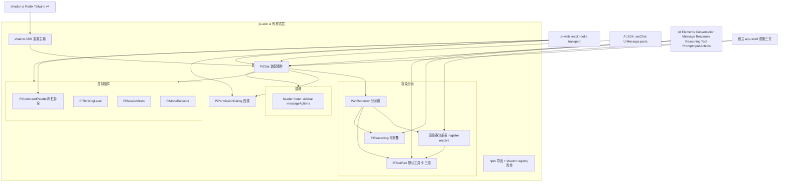
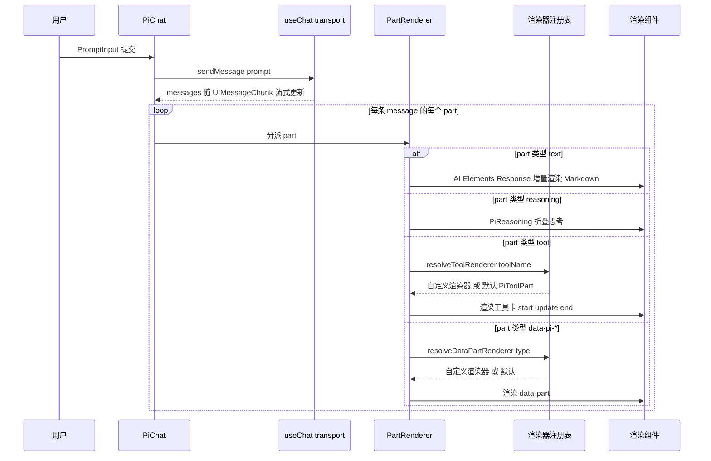
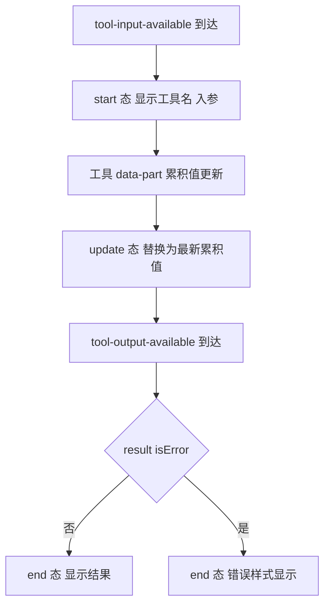
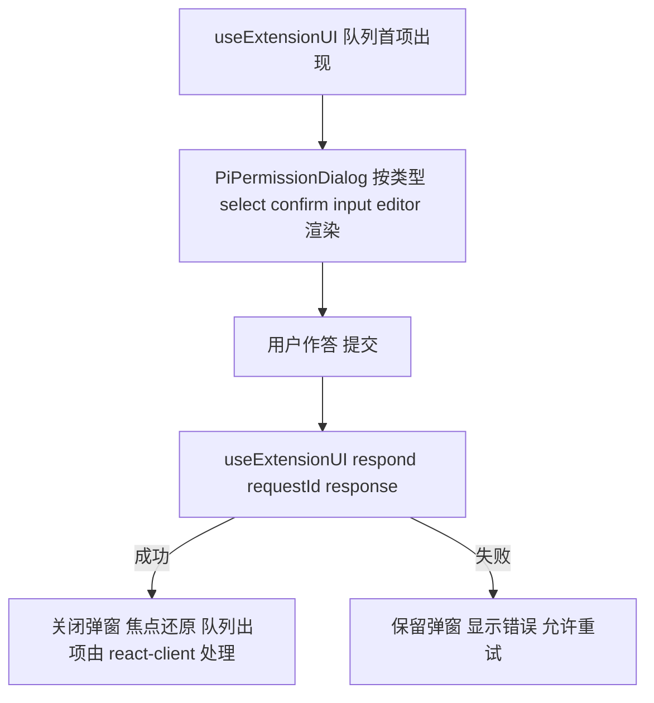

# Design Document — ui-components

## Overview

**Purpose**:本特性交付 `@blksails/ui`——pi-web 的**有样式、可主题化、可扩展**的浏览器组件层。它把 Vercel AI Elements(`Conversation/Message/Response/Reasoning/Tool/PromptInput/Actions`)与 `@blksails/react` 的 headless 层(`PiTransport`/`usePiSession`/`usePiControls`/`useExtensionUI`/`createPiClient`)装配为一个可拖入的 `<PiChat>`,并提供细粒度组件、渲染器注册表与布局插槽。

**Users**:想快速拥有成品聊天 UI 的第三方 React/Next 集成方(§13.3 方式 A),以及本项目整站 `app-shell`(消费本层闭合全链路 e2e)。

**Impact**:把 `PLAN.md` §1(AI Elements 装配)、§4(pi 事件→UIMessage 渲染映射)、§13.1(`@blksails/ui` 导出面)、§13.4③(渲染器注册表/插槽)收敛为一个边界清晰、可单测、可主题化的有样式前端层。本 spec **消费**上游契约(`@blksails/react` 的 transport/hooks、AI SDK v5 的 `useChat`/`UIMessage` part 结构、AI Elements 组件 API、shadcn/ui CSS 变量),不重定义、不触达后端。

### Goals

- `<PiChat>`:基于 AI Elements + `useChat(PiTransport)` 的拖入组件,按 part 类型分派渲染(文本/思考/工具/data-part),内嵌权限弹窗与控制面板,暴露 header/footer/sidebar/messageActions 插槽。
- 细粒度组件:`<PiToolPart>`(工具卡 start/update/end 三态)、`<PiReasoning>`(可折叠思考)、`<PiModelSelector>`、`<PiThinkingLevel>`、`<PiSessionStats>`、`<PiCommandPalette>`("/" 命令补全)、`<PiPermissionDialog>`(扩展 UI select/confirm/input/editor)。
- 渲染器注册表:`registerToolRenderer(toolName, Component)` / `registerDataPartRenderer(type, Component)`,默认渲染器回退,覆盖语义。
- 分发:npm 聚合导出 + shadcn registry 清单(`npx pi-web add chat`);主题走 shadcn CSS 变量继承宿主。
- 无障碍:键盘可达 + aria 标注基本达标。
- 满足"测试 + e2e(硬性)":每组件 `@testing-library/react` 组件测试;工具卡三态;思考折叠;权限弹窗回传 ui-response;注册表覆盖默认;e2e 以 mock 会话驱动 `<PiChat>`。

### Non-Goals

- 不实现 `PiTransport`/hooks/`createPiClient`/SSE 解码/control 帧分流(归 `react-client`,仅消费)。
- 不实现 REST/SSE 端点、SSE 编码、会话进程驻留、事件→UIMessage 翻译、子进程 spawn、鉴权落地(归 `http-api`/`session-engine`/后端引擎)。
- 不定义协议类型/zod schema/`protocolVersion`(归 `protocol-contract`,经 `react-client` 间接消费)。
- 不绑定具体后端地址/路由、不做整站页面装配/agent 源选择/全链路 e2e(归 `app-shell`)。
- 不实现 `get_commands`/扩展安装卸载后端(归 `extension-management`;仅消费 hooks 暴露的命令列表与扩展 UI 队列)。
- 不做非 React 集成(Web Component/iframe,归未来 `embed-integrations`)。

## Boundary Commitments

### This Spec Owns

- `<PiChat>` 装配组件:接收/建立 `usePiSession` 产出的 transport,用 `useChat({ transport })` 驱动;按消息 part 类型分派渲染;内嵌权限弹窗与可选控制面板;暴露四个插槽。
- 细粒度有样式组件:`<PiToolPart>`(三态 + 折叠)、`<PiReasoning>`(折叠)、`<PiModelSelector>`、`<PiThinkingLevel>`、`<PiSessionStats>`、`<PiCommandPalette>`、`<PiPermissionDialog>`(四类)。
- **渲染器注册表**:`registerToolRenderer`/`registerDataPartRenderer` 的注册存储与解析逻辑(`resolveToolRenderer`/`resolveDataPartRenderer`),默认回退与覆盖语义。
- part → 组件的**前端渲染分派**(`text`→`Response`、`reasoning`→`<PiReasoning>`、`tool`→解析后的工具渲染器、`data-pi-*`→解析后的 data-part 渲染器),以 AI SDK `UIMessage.parts` 结构为输入。
- 分发产物:`@blksails/ui` 的 npm 聚合导出面;shadcn registry 清单(`registry.json` + 组件源条目);CSS 变量主题层。
- 前端 UI 局部状态:折叠开合、命令面板开/过滤/活动项、弹窗焦点态——均为视图态,非服务端真值。
- 无障碍语义:键盘交互与 aria 角色/状态。

### Out of Boundary

- transport/hooks/`createPiClient`/SSE 解码/control 分流(`react-client`,仅消费其 API)。
- REST/SSE 端点、SSE 编码、会话驻留、事件→UIMessage 翻译、子进程、鉴权(`http-api`/`session-engine`/后端引擎)。
- 协议类型/schema/`protocolVersion` 定义(`protocol-contract`,经 `react-client` 间接消费)。
- 具体后端地址/路由绑定、整站 layout/page、agent 源选择、全链路浏览器 e2e(`app-shell`)。
- `get_commands`/扩展安装卸载后端(`extension-management`)。
- 非 React 集成(`embed-integrations`)。
- 服务端真值会话状态——本层只持视图态,消息/控制/扩展 UI 数据来自 `@blksails/react` 派生状态。

### Allowed Dependencies

- **上游 spec(运行时)**:`@blksails/react`(`usePiSession`/`usePiControls`/`useExtensionUI`/`PiTransport`/`createPiClient`/`PiProvider` 及其类型)。经它间接获得 `@blksails/protocol` 的类型(如 `ExtensionUIRequest`/`StatsResponse`/`CommandsResponse`/data-part type),本层从 `@blksails/react` re-export 的类型消费,不直接 `import @blksails/protocol` 形状定义。
- **外部运行时**:React 18+;AI SDK v5(`ai` 的 `UIMessage`/part 类型、`@ai-sdk/react` 的 `useChat`——由 `<PiChat>` 内部调用);Vercel AI Elements(`Conversation`/`Message`/`Response`/`Reasoning`/`Tool`/`PromptInput`/`Actions`);shadcn/ui(Radix primitives + Tailwind v4)。
- **依赖方向**:`react-client ← ui-components`;`ui-components ← app-shell`(下游)。禁止反向。本层**不**依赖 `@blksails/server`/`session-engine`/`http-api` 的任何运行时对象。
- **开发/测试**:`vitest`、`@testing-library/react`、`@testing-library/user-event`、`jsdom`/`happy-dom`;e2e 用 Storybook(或测试页)+ mock 会话/mock transport——不进运行时依赖。
- **约束**:不引入后端依赖、不引入非 React 集成产物;主题不得硬编码颜色,必须经 shadcn CSS 变量。

### Revalidation Triggers

- `@blksails/react` 的 hooks 签名(`usePiSession`/`usePiControls`/`useExtensionUI`)、`PiTransport` 构造或 re-export 类型(`ExtensionUIRequest`/`StatsResponse`/`CommandsResponse`/data-part type)变更。
- AI SDK `UIMessage.parts` 结构或 part 判别字段(text/reasoning/tool/data-*)变更;`useChat` 大版本签名变更。
- AI Elements 被装配组件(`Conversation`/`Message`/`Response`/`Reasoning`/`Tool`/`PromptInput`/`Actions`)的 API 变更。
- shadcn registry 清单格式或 `npx pi-web add` 约定变更;shadcn CSS 变量 token 约定变更。
- 渲染器注册表公开签名(`registerToolRenderer`/`registerDataPartRenderer`/解析函数)或 `<PiChat>` 插槽契约变更。
- 扩展 UI 请求类别集合(select/confirm/input/editor)增减。

## Architecture

### Architecture Pattern & Boundary Map

模式:**Headless 消费 + 装配组件 + part 分派渲染 + 注册表扩展点**。`<PiChat>` 是装配层:从 `usePiSession` 取 `transport` 喂 `useChat`,把 `messages[].parts` 交给 **PartRenderer 分派器**;分派器按 part 类型选择渲染——`text`→AI Elements `Response`、`reasoning`→`<PiReasoning>`、`tool`→经 `resolveToolRenderer(toolName)` 解析(命中注册表则用自定义,否则默认 `<PiToolPart>`)、`data-pi-*`→经 `resolveDataPartRenderer(type)` 解析。扩展 UI 经 `useExtensionUI` 旁路弹出 `<PiPermissionDialog>`;模型/思考/stats/commands 控制经 `usePiControls` 驱动对应控件;命令补全经 `<PiCommandPalette>` 接 `getCommands`。所有样式经 shadcn CSS 变量。注册表是模块级单例(可注入式,见下),供宿主在挂载前注册自定义渲染器。



**Architecture Integration**:

- **Selected pattern**:装配组件 + part 分派 + 注册表扩展点。理由:Req 1.4 要求按 part 类型分派;Req 7 要求工具/data-part 可被自定义渲染器覆盖(注册表是 §13.4③ 的直接落地);Req 8 要求插槽;Req 9 要求双分发(npm + shadcn registry),决定了组件必须自包含、零硬编码主题。
- **Domain/feature boundaries**:`chat`(装配 + 分派 + 插槽)、`parts`(工具/思考/data-part 默认渲染)、`controls`(模型/思考/stats/命令面板)、`dialog`(权限弹窗)、`registry`(注册表)、`theme`(CSS 变量)、`registry-dist`(shadcn 清单)分块,经类型契约衔接;无业务真值状态。
- **Dependency direction**:`react-client(+AI SDK/AI Elements/shadcn) ← ui-components ← app-shell`。`registry`/部分纯渲染组件(`<PiToolPart>`/`<PiReasoning>`)不依赖 hooks,可独立渲染测试;`<PiChat>`/控制组件/弹窗依赖 hooks。
- **New components rationale**:`<PiChat>`(单点装配)、`PartRenderer`(分派单点)、注册表(扩展点单点)、各细粒度组件(单一职责、可被宿主单独取用)、shadcn 清单(分发产物)。
- **Steering compliance**:TypeScript strict、禁 `any`;浏览器环境;有样式但主题经 shadcn CSS 变量继承宿主(structure.md/§13.4);前后端经协议解耦,本层经 `@blksails/react` 消费(roadmap/tech.md);仅依赖允许的上游(brief 约束)。

### Technology Stack

| Layer | Choice / Version | Role in Feature | Notes |
|-------|------------------|-----------------|-------|
| Frontend / CLI | TypeScript strict;React 18+ | 有样式组件 + 渲染分派 + 注册表 | 浏览器环境 |
| Backend / Services | — | 本层不含后端;经 `@blksails/react` 消费 | 不依赖后端对象 |
| Data / Storage | 无服务端状态;仅前端视图态(折叠/面板/弹窗焦点) | 组件局部 state | 真值在 `@blksails/react` 派生态 |
| Messaging / Events | 消费 `useChat` 的 `UIMessage.parts` 流式更新 + hooks 旁路态(扩展 UI/stats/commands) | part 分派渲染 + 控制呈现 | 不触达 SSE/REST |
| Infrastructure / Runtime | AI SDK v5(`ai`/`@ai-sdk/react`);Vercel AI Elements;shadcn/ui(Radix + Tailwind v4);`@blksails/react`;`vitest` + `@testing-library/react` + `@testing-library/user-event` + DOM 环境 + Storybook(e2e) | 运行与测试 | shadcn CSS 变量主题 |

## File Structure Plan

### Directory Structure

```
packages/ui/
├── package.json                  # name @blksails/ui;deps: 无后端;peerDeps: react, @blksails/react, ai, @ai-sdk/react;含 AI Elements/shadcn 生成的源(随 registry 分发);sideEffects 谨慎(注册表副作用经显式 API)
├── tsconfig.json                 # strict;DOM lib;target ES2022;jsx react-jsx
├── vitest.config.ts              # DOM 环境(jsdom/happy-dom)+ setup(testing-library/jest-dom)
├── registry.json                 # ★ shadcn registry 清单:chat 及各组件条目(npx pi-web add chat)
├── components.json               # shadcn 配置(别名/CSS 变量约定),供 add 落地
└── src/
    ├── index.ts                  # 聚合导出:PiChat, PiToolPart, PiReasoning, PiModelSelector, PiThinkingLevel, PiSessionStats, PiCommandPalette, PiPermissionDialog, registerToolRenderer, registerDataPartRenderer, 类型与插槽类型
    ├── chat/
    │   ├── pi-chat.tsx           # <PiChat>:装配 useChat(transport) + Conversation/Message/PromptInput/Actions + 插槽 + 内嵌权限弹窗/控制面板
    │   ├── part-renderer.tsx     # PartRenderer:按 UIMessage part 类型分派(text→Response / reasoning→PiReasoning / tool→resolveToolRenderer / data-pi-*→resolveDataPartRenderer)
    │   ├── slots.ts              # 插槽类型与默认(header/footer/sidebar/messageActions)
    │   └── pi-chat.context.tsx   # 可选:向子组件下传 client/connection/注册表实例(若采用注入式注册表)
    ├── parts/
    │   ├── pi-tool-part.tsx      # 默认工具卡:start/update/end 三态 + 折叠明细 + 错误样式(基于 AI Elements <Tool>)
    │   └── pi-reasoning.tsx      # 可折叠思考块(基于 AI Elements <Reasoning>)
    ├── controls/
    │   ├── pi-model-selector.tsx # 模型选择 → usePiControls.setModel;操作态
    │   ├── pi-thinking-level.tsx # 思考等级 → usePiControls.setThinking;操作态
    │   ├── pi-session-stats.tsx  # 展示 usePiControls.stats
    │   └── pi-command-palette.tsx# "/" 补全:getCommands + 过滤 + 键盘导航 + 选择填充
    ├── dialog/
    │   └── pi-permission-dialog.tsx # 扩展 UI 四类(select/confirm/input/editor)+ respond 回传 + 焦点捕获/Esc/aria
    ├── registry/
    │   └── renderer-registry.ts  # registerToolRenderer/registerDataPartRenderer + resolveToolRenderer/resolveDataPartRenderer + 默认回退 + 覆盖语义
    ├── theme/
    │   └── pi-ui.css             # 组件 CSS 变量层(全部走 shadcn token,无硬编码颜色)
    └── lib/
        └── cn.ts                 # className 合并工具(clsx/tailwind-merge),供组件复用
└── test/
    ├── parts/pi-tool-part.test.tsx        # 三态渲染 + 错误态 + 折叠 a11y(Req 2.x,10.x,11.2)
    ├── parts/pi-reasoning.test.tsx        # 折叠/展开 + 进行中 + 键盘(Req 3.x,10.x,11.3)
    ├── controls/pi-model-selector.test.tsx# 选择→setModel + 进行中/错误态(Req 4.1-4.2,4.5,11.1)
    ├── controls/pi-thinking-level.test.tsx# 选择→setThinking(Req 4.3,4.5,11.1)
    ├── controls/pi-session-stats.test.tsx # 统计展示 + 更新刷新(Req 4.4,11.1)
    ├── controls/pi-command-palette.test.tsx# 触发/过滤/选择/键盘/空态(Req 5.x,10.4,11.1)
    ├── dialog/pi-permission-dialog.test.tsx# 四类 + respond 回传 + 失败保留 + 焦点/Esc/aria(Req 6.x,10.2,11.4)
    ├── chat/part-renderer.test.tsx         # 分派:各 part 类型 → 正确组件;注册表命中覆盖默认(Req 1.4,7.3-7.5,11.5)
    ├── chat/pi-chat.test.tsx               # 组件渲染 + 插槽渲染 + 内嵌弹窗触发(Req 1.x,8.x,11.1)
    ├── registry/renderer-registry.test.ts  # 注册/解析/默认回退/覆盖语义(Req 7.1-7.6,11.5)
    └── e2e/pi-chat.e2e.test.tsx            # ★ mock 会话/mock transport 驱动 <PiChat>:断言流式文本+工具卡+思考块+权限弹窗交互(Req 11.6)
└── stories/
    ├── pi-chat.stories.tsx       # Storybook:mock 会话驱动 <PiChat>(e2e 验证页;也作可视化文档)
    ├── pi-tool-part.stories.tsx  # 三态故事
    ├── pi-reasoning.stories.tsx
    ├── controls.stories.tsx
    └── pi-permission-dialog.stories.tsx
└── test/fixtures/
    ├── mock-session.ts          # mock usePiSession/usePiControls/useExtensionUI 与 mock PiTransport(可控制推送 part / 触发扩展 UI / 提供 commands/stats)
    └── ui-message-fixtures.ts    # 各类 UIMessage parts 样本(text/reasoning/tool start-update-end/data-pi-*)
```

> 每文件单一职责。`parts/`(`<PiToolPart>`/`<PiReasoning>`)与 `registry/` 为可独立渲染/纯逻辑(不依赖 hooks),`chat/`/`controls/`/`dialog/` 为 hooks 绑定层。`registry.json`+`components.json` 是 shadcn 分发产物。

### Modified Files

- 无(greenfield 新包)。若 monorepo workspace 已存在,需将 `packages/ui` 纳入 workspace 并接入 `@blksails/react`、`react`、`ai`、`@ai-sdk/react`、AI Elements、shadcn——接线随仓库初始化处理,本 spec 创建包自身文件与测试。
- AI Elements/shadcn 组件源(`Conversation`/`Message`/`Response`/`Reasoning`/`Tool`/`PromptInput`/`Actions` 及 Radix 封装)经 `npx ai-elements add` / `npx shadcn add` 生成并纳入包内,作为本层装配的底座;它们的生成属脚手架任务(见 tasks 1.x)。

## System Flows

### 消息流 → part 分派渲染(主链路)



`<PiChat>` 不感知传输细节:它只读 `useChat` 的 `messages[].parts` 并交给 `PartRenderer`;part 的来源(SSE 解码)由 `@blksails/react` 负责。

### 工具卡三态



`partialResult` 为累积值,update 态直接替换(对齐 PLAN.md §4)。

### 扩展 UI 弹窗与回传



队列入/出与回传端点由 `@blksails/react` 拥有,本层只呈现首项并调用 `respond`。

## Requirements Traceability

| Requirement | Summary | Components | Interfaces | Flows |
|-------------|---------|------------|------------|-------|
| 1.1 | PiChat 用 useChat(transport) 驱动 | pi-chat.tsx | `PiChatProps` | 主链路 |
| 1.2 | 流式文本经 Response 渲染 | pi-chat.tsx, part-renderer.tsx | part 分派 text | 主链路 |
| 1.3 | PromptInput 提交追加用户消息 | pi-chat.tsx | `PromptInput` | 主链路 |
| 1.4 | 按 part 类型分派渲染 | part-renderer.tsx | `PartRenderer` | 主链路 |
| 1.5 | 进行中指示 + 中止 | pi-chat.tsx | `usePiControls.abort` | 主链路 |
| 1.6 | 扩展 UI 弹 PiPermissionDialog | pi-chat.tsx, pi-permission-dialog.tsx | `useExtensionUI` | 扩展 UI |
| 1.7 | 不实现传输逻辑 | pi-chat.tsx | 仅消费 react hooks | — |
| 2.1 | 工具卡 start 态 | pi-tool-part.tsx | `PiToolPartProps` | 工具三态 |
| 2.2 | 工具卡 update 态(累积替换) | pi-tool-part.tsx | `PiToolPartProps` | 工具三态 |
| 2.3 | 工具卡 end 态 + 错误样式 | pi-tool-part.tsx | `PiToolPartProps` | 工具三态 |
| 2.4 | 注册渲染器覆盖默认工具卡 | part-renderer.tsx, renderer-registry.ts | `resolveToolRenderer` | 主链路 |
| 2.5 | 折叠明细 a11y | pi-tool-part.tsx | aria | — |
| 3.1 | 思考流增量渲染 | pi-reasoning.tsx | `PiReasoningProps` | — |
| 3.2 | 默认折叠 + 切换 | pi-reasoning.tsx | 折叠态 | — |
| 3.3 | 切换即更新 + aria | pi-reasoning.tsx | aria-expanded | — |
| 3.4 | 进行中指示 | pi-reasoning.tsx | streaming 标志 | — |
| 3.5 | 键盘切换 | pi-reasoning.tsx | 键盘 | — |
| 4.1 | 模型列表 + setModel | pi-model-selector.tsx | `usePiControls.setModel` | — |
| 4.2 | 切换进行中/错误态 | pi-model-selector.tsx | 操作态 | — |
| 4.3 | 思考等级 + setThinking | pi-thinking-level.tsx | `usePiControls.setThinking` | — |
| 4.4 | 统计展示 + 刷新 | pi-session-stats.tsx | `usePiControls.stats` | — |
| 4.5 | 仅经 hooks 不入消息流 | controls/* | hooks 旁路 | — |
| 5.1 | "/" 触发命令列表 | pi-command-palette.tsx | `usePiControls.getCommands` | — |
| 5.2 | 输入过滤候选 | pi-command-palette.tsx | 过滤 | — |
| 5.3 | 选择填充/提交 | pi-command-palette.tsx | 选择 | — |
| 5.4 | 键盘导航 + aria 活动项 | pi-command-palette.tsx | 键盘/aria | — |
| 5.5 | 空态/错误态不崩溃 | pi-command-palette.tsx | 空/错误态 | — |
| 6.1 | select 类型 | pi-permission-dialog.tsx | `PiPermissionDialogProps` | 扩展 UI |
| 6.2 | confirm 类型 | pi-permission-dialog.tsx | 同上 | 扩展 UI |
| 6.3 | input 类型 | pi-permission-dialog.tsx | 同上 | 扩展 UI |
| 6.4 | editor 类型 | pi-permission-dialog.tsx | 同上 | 扩展 UI |
| 6.5 | respond 回传匹配 ui-response | pi-permission-dialog.tsx | `useExtensionUI.respond` | 扩展 UI |
| 6.6 | 回传失败保留 + 重试 | pi-permission-dialog.tsx | error 态 | 扩展 UI |
| 6.7 | 焦点捕获/Esc/aria 对话框 | pi-permission-dialog.tsx | aria-dialog | — |
| 7.1 | registerToolRenderer | renderer-registry.ts | `registerToolRenderer` | — |
| 7.2 | registerDataPartRenderer | renderer-registry.ts | `registerDataPartRenderer` | — |
| 7.3 | 工具命中用注册渲染器 | part-renderer.tsx, renderer-registry.ts | `resolveToolRenderer` | 主链路 |
| 7.4 | data-part 命中用注册渲染器 | part-renderer.tsx, renderer-registry.ts | `resolveDataPartRenderer` | 主链路 |
| 7.5 | 未注册回退默认 | renderer-registry.ts | 默认回退 | 主链路 |
| 7.6 | 重复注册覆盖语义 | renderer-registry.ts | 覆盖 | — |
| 8.1 | header 插槽 | pi-chat.tsx, slots.ts | `PiChatSlots.header` | — |
| 8.2 | footer 插槽 | pi-chat.tsx, slots.ts | `PiChatSlots.footer` | — |
| 8.3 | sidebar 插槽 | pi-chat.tsx, slots.ts | `PiChatSlots.sidebar` | — |
| 8.4 | messageActions 插槽 | pi-chat.tsx, slots.ts | `PiChatSlots.messageActions` | — |
| 8.5 | 未提供插槽合理默认 | pi-chat.tsx, slots.ts | 默认 | — |
| 9.1 | npm 聚合导出面 | index.ts | 导出 | — |
| 9.2 | shadcn registry 清单 npx pi-web add chat | registry.json, components.json | registry | — |
| 9.3 | 样式走 shadcn CSS 变量 | theme/pi-ui.css, 全部组件 | CSS 变量 | — |
| 9.4 | 仅依赖 react + shadcn/AI Elements | package.json | peerDeps | — |
| 10.1 | 交互组件键盘可达 | 全部交互组件 | 键盘 | — |
| 10.2 | 弹窗焦点捕获/Esc/还原 | pi-permission-dialog.tsx | 焦点管理 | 扩展 UI |
| 10.3 | aria 角色/状态标注 | 全部交互组件 | aria | — |
| 10.4 | 命令面板键盘/aria 活动项 | pi-command-palette.tsx | 键盘/aria | — |
| 11.1 | 每组件 testing-library 渲染测试 | test/* | vitest+RTL | — |
| 11.2 | 工具卡三态测试 | parts/pi-tool-part.test.tsx | RTL | 工具三态 |
| 11.3 | 思考折叠测试 | parts/pi-reasoning.test.tsx | RTL | — |
| 11.4 | 权限弹窗回传 ui-response 测试 | dialog/pi-permission-dialog.test.tsx | RTL + mock respond | 扩展 UI |
| 11.5 | 注册表覆盖默认测试 | registry/renderer-registry.test.ts, chat/part-renderer.test.tsx | RTL/单元 | 主链路 |
| 11.6 | e2e:mock 会话驱动 PiChat 全交互 | e2e/pi-chat.e2e.test.tsx, stories/pi-chat.stories.tsx | RTL/Storybook + mock 会话 | 全部 |
| 11.7 | 单一命令运行全部 | vitest.config.ts, package.json scripts | `vitest run` | — |

## Components and Interfaces

| Component | Layer | Intent | Req Coverage | Key Dependencies (P0/P1) | Contracts |
|-----------|-------|--------|--------------|--------------------------|-----------|
| chat/pi-chat.tsx | chat | 装配 useChat(transport) + AI Elements + 插槽 + 内嵌弹窗/控制 | 1.1-1.7,8.1-8.5 | @blksails/react (P0), @ai-sdk/react useChat (P0), AI Elements (P0), part-renderer (P0) | Service, State |
| chat/part-renderer.tsx | chat | 按 part 类型分派渲染 + 注册表解析 | 1.4,2.4,7.3-7.5 | renderer-registry (P0), parts/* (P0), AI Elements Response (P0) | Service |
| chat/slots.ts | chat | 插槽类型与默认 | 8.1-8.5 | — | State |
| parts/pi-tool-part.tsx | parts | 默认工具卡 start/update/end 三态 | 2.1-2.5 | AI Elements Tool (P0), cn (P1) | State |
| parts/pi-reasoning.tsx | parts | 可折叠思考块 | 3.1-3.5 | AI Elements Reasoning (P0) | State |
| controls/pi-model-selector.tsx | controls | 模型选择 → setModel | 4.1,4.2,4.5 | usePiControls (P0), shadcn (P0) | Service, State |
| controls/pi-thinking-level.tsx | controls | 思考等级 → setThinking | 4.3,4.5 | usePiControls (P0), shadcn (P0) | Service, State |
| controls/pi-session-stats.tsx | controls | 统计展示 | 4.4 | usePiControls (P0) | State |
| controls/pi-command-palette.tsx | controls | "/" 命令补全 | 5.1-5.5,10.4 | usePiControls.getCommands (P0), shadcn Command (P0) | Service, State |
| dialog/pi-permission-dialog.tsx | dialog | 扩展 UI 四类 + 回传 | 6.1-6.7,10.2 | useExtensionUI (P0), shadcn Dialog (P0) | Service, State |
| registry/renderer-registry.ts | registry | 注册 + 解析 + 默认回退 + 覆盖 | 7.1-7.6 | — | Service, State |
| theme/pi-ui.css | theme | CSS 变量主题层 | 9.3 | shadcn token (P0) | — |
| registry.json · components.json | dist | shadcn registry 分发清单 | 9.2 | shadcn CLI 约定 (P0) | — |
| index.ts | aggregate | npm 聚合导出面 | 9.1 | 全部 src (P0) | Service |

### chat 层

#### PiChat(chat/pi-chat.tsx)

| Field | Detail |
|-------|--------|
| Intent | 拖入聊天组件:从 `usePiSession` 取 `transport` 喂 `useChat`,渲染消息/输入/操作,内嵌权限弹窗与可选控制面板,暴露四个插槽 |
| Requirements | 1.1, 1.2, 1.3, 1.4, 1.5, 1.6, 1.7, 8.1, 8.2, 8.3, 8.4, 8.5 |

**Responsibilities & Constraints**
- 接收 `usePiSession` 产出的 `transport`(或经 `session`/`controls`/`extensionUI` 入参注入),用 `useChat({ transport })` 驱动消息流(Req 1.1)。本组件**不**实现任何 REST/SSE 传输(Req 1.7)。
- 经 AI Elements `Conversation`+`Message`+`Response` 渲染助手消息;经 `PromptInput` 提交 prompt 并追加用户消息(Req 1.2/1.3)。
- 把每条 `message.parts` 交给 `PartRenderer` 分派(Req 1.4)。
- 流式中提供进行中指示,并暴露中止入口(`usePiControls.abort`)(Req 1.5)。
- 订阅 `useExtensionUI` 队列首项,弹出 `<PiPermissionDialog>`(Req 1.6)。
- 暴露 `header`/`footer`/`sidebar`/`messageActions` 插槽;未提供时合理默认(Req 8.1-8.5)。

**Dependencies**
- Inbound: 宿主(`app-shell`/第三方)— 拖入使用 (P0)
- Outbound: `PartRenderer`(P0)、`<PiPermissionDialog>`(P0)、控制组件(P1)
- External: `@blksails/react`(`usePiSession`/`usePiControls`/`useExtensionUI`)(P0)、`@ai-sdk/react` `useChat`(P0)、AI Elements(P0)

**Contracts**: Service [x] / State [x]

##### Service Interface
```typescript
import type { ReactNode } from "react";
import type { UIMessage } from "ai";
import type {
  PiTransport, UsePiControlsResult, UseExtensionUIResult, UsePiSessionResult,
} from "@blksails/react";

export interface PiChatSlots {
  readonly header?: ReactNode;
  readonly footer?: ReactNode;
  readonly sidebar?: ReactNode;
  /** 每条消息的操作区(经 AI Elements Actions);接收消息以定制 */
  readonly messageActions?: (message: UIMessage) => ReactNode;
}

export interface PiChatProps {
  /** 来自 usePiSession;提供绑定的 transport 与连接态 */
  readonly session: UsePiSessionResult;
  /** 来自 usePiControls;驱动 abort/model/thinking/stats/commands(可选展示控制面板) */
  readonly controls?: UsePiControlsResult;
  /** 来自 useExtensionUI;驱动权限弹窗 */
  readonly extensionUI?: UseExtensionUIResult;
  readonly slots?: PiChatSlots;
  /** 是否展示内置控制面板(模型/思考/stats),默认 true */
  readonly showControls?: boolean;
  readonly className?: string;
}

export function PiChat(props: PiChatProps): JSX.Element;
```
- Preconditions:`session.transport` 已就绪(`usePiSession` 建会话完成);`controls`/`extensionUI` 若驱动相应功能则需提供。
- Postconditions:消息随 `useChat` 流式更新渲染;扩展 UI 请求弹窗并经 `respond` 回传;插槽内容就位。
- Invariants:控制/扩展 UI 操作不写入 `useChat` 消息流(经 hooks 旁路);本组件不直接触达 fetch/SSE。

**Implementation Notes**
- Integration:宿主 `const session = usePiSession(...); const controls = usePiControls(...); const ext = useExtensionUI(...); <PiChat session={session} controls={controls} extensionUI={ext} />`。
- Validation:`pi-chat.test.tsx`(mock 会话:渲染、插槽、内嵌弹窗触发);`e2e/pi-chat.e2e.test.tsx`(mock transport 全交互)。
- Risks:AI Elements/`useChat` 大版本签名变化 → Revalidation Trigger;装配集中于本组件。

#### PartRenderer(chat/part-renderer.tsx)

| Field | Detail |
|-------|--------|
| Intent | 按 `UIMessage` part 类型分派到渲染组件,工具/data-part 经注册表解析(命中用自定义,未命中回退默认) |
| Requirements | 1.4, 2.4, 7.3, 7.4, 7.5 |

**Responsibilities & Constraints**
- 输入单个 part;按类型分派:`text`→AI Elements `Response`;`reasoning`→`<PiReasoning>`;`tool`→`resolveToolRenderer(toolName) ?? PiToolPart`;`data-pi-*`→`resolveDataPartRenderer(type) ?? 默认 data-part 渲染`(Req 1.4)。
- 工具/data-part 命中注册表则用注册组件(Req 2.4/7.3/7.4);未命中回退默认(Req 7.5)。
- 纯渲染分派,不持状态、不依赖 hooks(便于单测)。

**Contracts**: Service [x]

##### Service Interface
```typescript
import type { ComponentType } from "react";
import type { UIMessage } from "ai";

type MessagePart = UIMessage["parts"][number];

export interface PartRendererProps {
  readonly part: MessagePart;
  readonly message: UIMessage;
}

export function PartRenderer(props: PartRendererProps): JSX.Element | null;
```
- Invariants:解析顺序为「注册表命中 → 默认」;同一输入解析结果可预测且与注册表当前状态一致。

**Implementation Notes**
- Integration:`<PiChat>` 对每条消息的每个 part 调用 `PartRenderer`。
- Validation:`part-renderer.test.tsx`(各 part 类型 → 正确组件;注册自定义后命中覆盖默认)。
- Risks:AI SDK part 判别字段变化 → Revalidation Trigger;判别集中于本文件。

### registry 层

#### renderer-registry.ts

| Field | Detail |
|-------|--------|
| Intent | 渲染器注册表:注册工具/data-part 自定义渲染器 + 解析 + 默认回退 + 覆盖语义 |
| Requirements | 7.1, 7.2, 7.3, 7.4, 7.5, 7.6 |

**Responsibilities & Constraints**
- `registerToolRenderer(toolName, Component)` / `registerDataPartRenderer(type, Component)` 写入注册存储(Req 7.1/7.2)。
- `resolveToolRenderer(toolName)` / `resolveDataPartRenderer(type)` 返回命中的渲染器或 `undefined`(由调用方回退默认)(Req 7.3/7.4/7.5)。
- 重复注册以最后注册为准(覆盖)(Req 7.6)。
- 默认实现为模块级单例注册表(简单直接);为可测性提供 `createRendererRegistry()` 工厂与重置入口,模块级单例委托该工厂——测试可用隔离实例,避免跨用例污染。

**Contracts**: Service [x] / State [x]

##### Service Interface
```typescript
import type { ComponentType } from "react";
import type { UIMessage } from "ai";

type ToolPart = Extract<UIMessage["parts"][number], { type: `tool-${string}` } | { toolName: string }>;
type DataPart = Extract<UIMessage["parts"][number], { type: `data-${string}` }>;

export type ToolRenderer = ComponentType<{ part: ToolPart; message: UIMessage }>;
export type DataPartRenderer = ComponentType<{ part: DataPart; message: UIMessage }>;

export interface RendererRegistry {
  registerToolRenderer(toolName: string, component: ToolRenderer): void;
  registerDataPartRenderer(type: string, component: DataPartRenderer): void;
  resolveToolRenderer(toolName: string): ToolRenderer | undefined;
  resolveDataPartRenderer(type: string): DataPartRenderer | undefined;
}

export function createRendererRegistry(): RendererRegistry;

// 模块级单例(委托默认工厂),供宿主直接调用
export function registerToolRenderer(toolName: string, component: ToolRenderer): void;
export function registerDataPartRenderer(type: string, component: DataPartRenderer): void;
```
- Postconditions:注册后 `resolve` 返回最近注册的组件;未注册返回 `undefined`。
- Invariants:覆盖语义(最后写入胜出);解析无副作用。

##### State Management
- State model:`Map<string, ToolRenderer>` + `Map<string, DataPartRenderer>`。
- Persistence & consistency:仅内存;测试用隔离实例避免跨用例污染。
- Concurrency:浏览器单线程,注册一般在挂载前完成;运行期注册后续渲染即生效。

**Implementation Notes**
- Integration:宿主在挂载 `<PiChat>` 前调用模块级 `registerToolRenderer`/`registerDataPartRenderer`;`PartRenderer` 调用 `resolve*`。
- Validation:`renderer-registry.test.ts`(注册/解析/默认回退/覆盖语义)。
- Risks:模块级单例的跨测试污染 → 用工厂隔离实例。

### parts 层

#### PiToolPart / PiReasoning

**Summary-only(有样式,基于 AI Elements)**:
- `parts/pi-tool-part.tsx`:默认工具卡。输入 tool part(含 `state`:input-available/output-available 与累积 `partialResult`/`output`)。三态:**start**(显示 `toolName`+入参)、**update**(用最新累积值替换显示)、**end**(显示结果;`isError` 时错误样式)。明细区可折叠并带键盘可达 + aria 状态。基于 AI Elements `<Tool>`。(Req 2.1-2.5)Contracts: State。
- `parts/pi-reasoning.tsx`:可折叠思考块。增量渲染 reasoning 文本;默认折叠 + 切换;切换即更新可见性并 `aria-expanded` 反映;进行中指示;键盘触发。基于 AI Elements `<Reasoning>`。(Req 3.1-3.5)Contracts: State。

##### Props(共用要点)
```typescript
import type { UIMessage } from "ai";
type ToolPart = Extract<UIMessage["parts"][number], { type: `tool-${string}` }>;
type ReasoningPart = Extract<UIMessage["parts"][number], { type: "reasoning" }>;

export interface PiToolPartProps { readonly part: ToolPart; readonly message: UIMessage; readonly className?: string; }
export interface PiReasoningProps { readonly part: ReasoningPart; readonly defaultOpen?: boolean; readonly className?: string; }
```
- Validation:`pi-tool-part.test.tsx`(三态 + 错误态 + 折叠 a11y);`pi-reasoning.test.tsx`(折叠/展开 + 进行中 + 键盘)。

### controls 层

#### PiModelSelector / PiThinkingLevel / PiSessionStats / PiCommandPalette

**Summary-only(有样式,接 `usePiControls`)**:四组件均经 `@blksails/react` 的 `usePiControls` 操作/订阅,不向 `useChat` 消息流写入(Req 4.5)。
- `pi-model-selector.tsx`:展示模型列表,选择经 `setModel` 提交;进行中态;失败显示可辨识错误不静默(Req 4.1/4.2)。基于 shadcn Select。
- `pi-thinking-level.tsx`:展示思考等级,选择经 `setThinking` 提交(Req 4.3)。
- `pi-session-stats.tsx`:展示 `usePiControls.stats`(用量/成本),更新刷新(Req 4.4)。
- `pi-command-palette.tsx`:"/" 触发,展示 `getCommands` 候选;输入过滤;选择填充/提交;方向键导航/回车确认/Esc 关闭 + aria 活动项;空态/错误态不崩溃(Req 5.1-5.5/10.4)。基于 shadcn Command。Contracts: Service, State。

##### Props(要点)
```typescript
import type { UsePiControlsResult } from "@blksails/react";
export interface PiModelSelectorProps { readonly controls: UsePiControlsResult; readonly className?: string; }
export interface PiThinkingLevelProps { readonly controls: UsePiControlsResult; readonly className?: string; }
export interface PiSessionStatsProps { readonly controls: UsePiControlsResult; readonly className?: string; }
export interface PiCommandPaletteProps {
  readonly controls: UsePiControlsResult;
  /** 当前输入值与变更回调,用于把选中命令填充回输入区 */
  readonly value: string;
  readonly onChange: (next: string) => void;
  readonly className?: string;
}
```
- Validation:各 `controls/*.test.tsx`(mock `usePiControls`:操作态、统计刷新、命令触发/过滤/键盘/空态)。

### dialog 层

#### PiPermissionDialog(dialog/pi-permission-dialog.tsx)

| Field | Detail |
|-------|--------|
| Intent | 扩展 UI 弹窗:按四类(select/confirm/input/editor)渲染,提交经 `useExtensionUI.respond` 回传与请求匹配的响应;失败保留可重试;焦点/Esc/aria 对话框语义 |
| Requirements | 6.1, 6.2, 6.3, 6.4, 6.5, 6.6, 6.7, 10.2 |

**Responsibilities & Constraints**
- 接收 `useExtensionUI` 当前请求项,按其类别渲染对应控件:`select`(可选项)/`confirm`(确认/取消)/`input`(文本)/`editor`(多行)(Req 6.1-6.4)。
- 提交时经 `respond(requestId, response)` 回传匹配响应(Req 6.5);失败保留弹窗 + 错误 + 重试(Req 6.6)。
- 焦点捕获、Esc 关闭、关闭后焦点还原至触发元素、aria 对话框语义(Req 6.7/10.2)。基于 shadcn Dialog(Radix Dialog)。

**Dependencies**
- Outbound: `useExtensionUI.respond`(P0)
- External: shadcn/Radix Dialog(P0)

**Contracts**: Service [x] / State [x]

##### Service Interface
```typescript
import type { UseExtensionUIResult } from "@blksails/react";
// ExtensionUIRequest 类型经 @blksails/react re-export(源自 @blksails/protocol)
export interface PiPermissionDialogProps {
  readonly extensionUI: UseExtensionUIResult;   // 提供 current/queue/respond/error
  readonly className?: string;
}
export function PiPermissionDialog(props: PiPermissionDialogProps): JSX.Element | null;
```
- Preconditions:`extensionUI.current` 存在时渲染弹窗,否则返回 `null`。
- Postconditions:作答提交后经 `respond` 回传;成功由 `@blksails/react` 出队后 `current` 变更关闭弹窗;失败保留。
- Invariants:回传响应的 `requestId` 与当前请求匹配;不向消息流写入。

**Implementation Notes**
- Integration:`<PiChat>` 内嵌本组件,传入 `extensionUI`;也可被宿主单独使用。
- Validation:`pi-permission-dialog.test.tsx`(四类渲染 + 提交回传 mock `respond` + 失败保留 + 焦点/Esc/aria)。
- Risks:扩展 UI 类别集合增减 → Revalidation Trigger。

### theme / dist / aggregate 层

**Summary-only**:
- `theme/pi-ui.css`:组件样式层全部以 shadcn CSS 变量(`--background`/`--foreground`/`--primary` 等)定义,无硬编码颜色,使组件继承宿主主题(Req 9.3)。
- `registry.json` + `components.json`:shadcn registry 清单,使 `npx pi-web add chat` 把 `<PiChat>` 及其依赖组件源码加入宿主项目(Req 9.2)。条目覆盖 chat 及各细粒度组件 + 其 AI Elements/shadcn 依赖声明。
- `index.ts`:npm 聚合导出 `<PiChat>`、各细粒度组件、`registerToolRenderer`/`registerDataPartRenderer`、`createRendererRegistry` 与公开类型(`PiChatProps`/`PiChatSlots`/各 Props/`ToolRenderer`/`DataPartRenderer`)(Req 9.1)。仅依赖 `@blksails/react` + shadcn/AI Elements(Req 9.4,经 peerDeps 约束)。

## Data Models

### Data Contracts & Integration

- **核心消费契约**:AI SDK `UIMessage` 与其 `parts`(text/reasoning/tool/`data-pi-*`)——由 `useChat` 提供,本层只读不重定义。扩展 UI 请求类型(`ExtensionUIRequest`)、统计(`StatsResponse`)、命令(`CommandsResponse`)经 `@blksails/react` re-export(源自 `@blksails/protocol`),本层从 `@blksails/react` 消费。
- **part → 组件映射**:集中于 `PartRenderer`;工具/data-part 的可覆盖映射集中于 `renderer-registry`。
- **前端视图态**(本层唯一持有):折叠开合、命令面板开/过滤/活动项、弹窗焦点态、控制操作进行/错误态(后者多来自 `usePiControls`,本层只呈现)——均为 UI 派生,非服务端真值。
- **主题**:shadcn CSS 变量为样式契约;组件不硬编码颜色/间距 token。
- **分发**:npm(类型 + 编译产物)与 shadcn registry(源码条目)双轨;两者导出面一致。

## Error Handling

### Error Strategy

- **控制操作失败**(Req 4.2):`usePiControls` 暴露的操作错误态由 `<PiModelSelector>` 等以可辨识错误提示呈现,不静默。
- **命令获取失败/为空**(Req 5.5):`<PiCommandPalette>` 显示空态/错误态而非崩溃。
- **扩展 UI 回传失败**(Req 6.6):`<PiPermissionDialog>` 保留弹窗 + 显示错误 + 允许重试(出/入队由 `@blksails/react` 拥有)。
- **未注册渲染器**(Req 7.5):`PartRenderer` 回退默认渲染器,不抛错。
- **未提供插槽**(Req 8.5):`<PiChat>` 用合理默认或不渲染该区域,不报错。
- **工具结果错误**(Req 2.3):`<PiToolPart>` 以错误样式呈现 `isError` 结果,而非崩溃。
- **fail soft**:本层为展示层,渲染异常应降级到默认/空态而非整页崩溃;真值错误经 hooks 的错误态呈现。

### Monitoring

- 本层不做集中监控;错误经组件的可见错误态与 hooks 暴露的错误对用户/宿主可见。

## Testing Strategy

测试项直接源自验收标准(硬性:测试 + e2e)。单一命令(`vitest run`)运行全部(Req 11.7)。

### Unit / Component Tests(`@testing-library/react`)
- **工具卡三态**(`pi-tool-part.test.tsx`):start(工具名+入参)、update(累积值替换)、end(结果;`isError` 错误样式);折叠区键盘 + aria。(2.1, 2.2, 2.3, 2.5, 11.1, 11.2)
- **思考折叠**(`pi-reasoning.test.tsx`):增量渲染、默认折叠、切换更新 + `aria-expanded`、进行中、键盘触发。(3.1-3.5, 11.1, 11.3)
- **控制组件**(`controls/*.test.tsx`,mock `usePiControls`):模型选择→`setModel` + 进行中/错误态;思考等级→`setThinking`;统计展示 + 更新刷新;不入消息流。(4.1-4.5, 11.1)
- **命令面板**(`pi-command-palette.test.tsx`):"/" 触发列表、输入过滤、选择填充、方向键/回车/Esc、aria 活动项、空态/错误态。(5.1-5.5, 10.4, 11.1)
- **权限弹窗**(`pi-permission-dialog.test.tsx`,mock `useExtensionUI`):四类(select/confirm/input/editor)渲染;提交经 `respond` 回传匹配 ui-response;回传失败保留 + 重试;焦点捕获/Esc/还原/aria 对话框。(6.1-6.7, 10.2, 11.1, 11.4)
- **渲染器注册表**(`renderer-registry.test.ts`):注册工具/data-part 渲染器、解析命中、未注册返回 `undefined`(回退)、重复注册覆盖。(7.1-7.6, 11.5)
- **part 分派**(`part-renderer.test.tsx`):各 part 类型(text/reasoning/tool/`data-pi-*`)→ 正确组件;注册自定义工具/ data-part 渲染器后命中**覆盖默认**。(1.4, 2.4, 7.3-7.5, 11.5)
- **PiChat 装配**(`pi-chat.test.tsx`,mock 会话):渲染消息区/输入区、四个插槽渲染、`extensionUI.current` 存在时内嵌弹窗弹出。(1.1-1.6, 8.1-8.5, 11.1)

### E2E Test
- **mock 会话驱动 PiChat**(`e2e/pi-chat.e2e.test.tsx`,亦经 `stories/pi-chat.stories.tsx`):用 mock `usePiSession`/`usePiControls`/`useExtensionUI` 与 mock `PiTransport`(可脚本化推送 part 与触发扩展 UI)驱动 `<PiChat>`,断言:(a) 流式文本逐步出现;(b) 工具卡 start→update→end 呈现;(c) 思考块可展开;(d) 扩展 UI 弹窗出现、作答后经 `respond` 回传并关闭。覆盖跨组件完整交互。(11.6)

### 运行约定
- 单一命令(`vitest run`)运行全部单元/组件/e2e;Storybook 故事既作可视化文档,也承载 e2e 的 mock 会话场景。(11.7)

## Security Considerations

- 本层为浏览器展示层,不持久化凭据、不实现鉴权;所有数据经 `@blksails/react` 的 hooks/transport 间接获得,本层不直接发起网络请求。
- 渲染来自 agent 的内容(Markdown/工具结果)应经 AI Elements `Response` 的安全渲染路径,避免注入;自定义渲染器的安全由注册方负责(注册表只做分派)。
- 扩展 UI 回传只携带与当前请求匹配的响应(`requestId` 匹配),避免错配。
