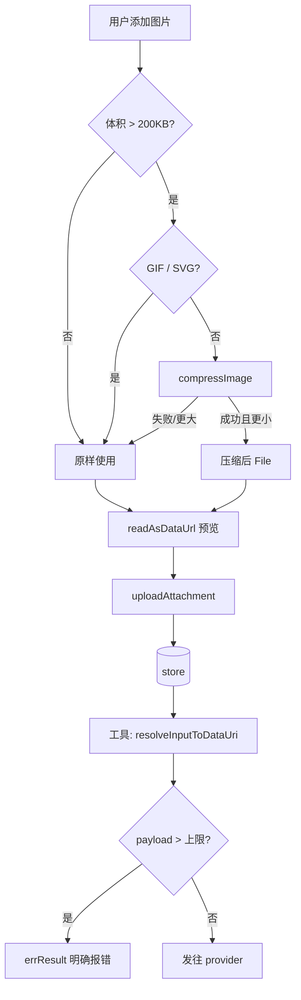
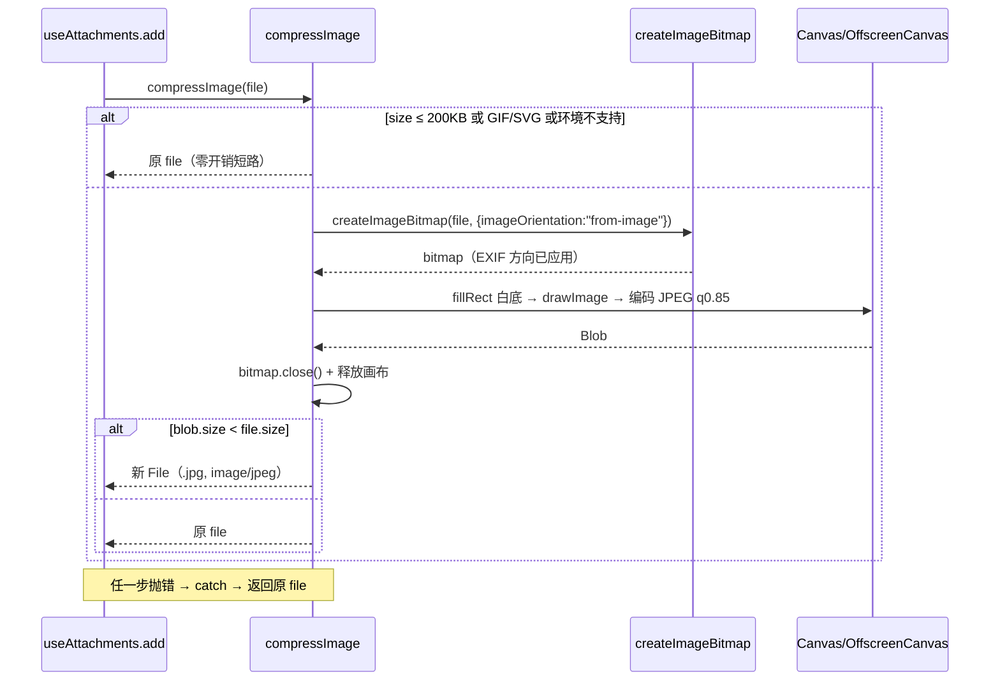

# Design Document

## Overview

在附件上传链路的**最前端**插入一层图片压缩，使进入全链（本地预览 → 上传 → 存储 → provider）的字节从源头变小；同时为该链路补上并发闸门，并在图像工具发往 provider 前加一道字节阈值拦截，让本层覆盖不到的大图**明确失败**而非无限期挂起。

设计取向由实测数据决定：**转码（PNG→JPEG）而非缩放**。同一张 764×763 的照片，仅换格式体积即 -78% 而像素未变，耗时降一个数量级。

> ⚠ 2026-07-29 更正：初稿据一次观测称大图「23 分钟无响应」，复测（同图同路径）38–128s 正常返回，故那是服务端当时的状态而非固有属性。压缩取向不变，理由改为「大幅降低耗时与失败概率」。详见 `research.md` 的更正框。

### Goals

- 用户上传的图片在进入链路前完成转码，体积大幅下降（典型照片 -70% 以上）。
- 元数据（设备型号、GPS）被清除，同时照片方向保持正确。
- 批量上传时浏览器保持流畅，不因并发解码耗尽内存。
- 无法压缩的大图在发往 provider 前被拦下并给出可读错误。

### Non-Goals

- **不**压缩工具生成的图（二创场景的真正解法，留待后续 spec）。
- **不**以缩放作为主要手段（仅极端尺寸兜底）。
- **不**改动附件存储、分发、`att_` 引用解析等既有链路语义。
- **不**再处理传输层超时与错误 cause（`b50c1fd6` 已完成，本 spec 依赖其生效）。

## Boundary Commitments

### This Spec Owns

- `packages/react` 内：上传前的图片压缩纯函数、并发闸门工具，以及 `useAttachments.add()` 中对二者的接线。
- `packages/tool-kit` 内：图像工具在派发 provider 前的 payload 字节阈值检查与错误返回。

### Out of Boundary

- 附件上传端点、存储实现、签名分发 URL（本 spec 只改变**进入**它们的字节内容，不改其行为）。
- 工具生成图的压缩（`persistPicked` 落库路径不动）。
- 传输层 dispatcher、超时、错误包装。
- 任何 UI 组件与文案（静默处理，无新增可视元素）。

### Allowed Dependencies

- 仅浏览器标准 Web API：`createImageBitmap`、`OffscreenCanvas`、`HTMLCanvasElement`、`Blob`、`File`。
- **禁止**为本 spec 引入任何新的 npm 依赖。`tool-kit` 现有依赖（undici / zod / mcp-sdk + 内部包）保持不变。

### Revalidation Triggers

以下任一发生时，本设计的结论需重新验证：

- provider 侧对大 payload 的处理能力改变（例如 NewAPI 修复了大图不响应）→ 阈值与需求 7 的必要性需重估。
- 附件链路改为「工具侧经网络下载 displayUrl」而非直接读 store → 压缩点的全链一致性假设失效。
- 决定纳入生成图压缩 → 需重新评估 Node 侧图像库与沙箱镜像体积的取舍。

## Architecture

### Existing Architecture Analysis

现有上传链路（本 spec 只在第 ② 步前插入，其余不动）：

```
① 用户选/拖/粘贴
② useAttachments.add(files) → isImage 过滤 → readAsDataUrl(预览)   ← 压缩插在此前
③ uploadAttachment → POST /sessions/:id/attachments (multipart, 字段 file)
④ store.put(origin:"upload") → { attachment, displayUrl }
⑤ LLM 传 att_xxx → resolveInputToDataUri（直接读 store，不走网络）  ← 阈值检查加在此后
⑥ data URI → buildBody → provider
```

**关键性质**：第 ⑤ 步从 store 读字节，因此第 ② 步压缩后，③④⑤⑥ 全链自动一致。

### Architecture Pattern & Boundary Map



并发闸门作用于 A→G 这一段：`mapWithLimit(accepted, 3, ...)` 取代无上限 `Promise.all`。

### Technology Stack

| 层 | 选型 | 理由 |
|---|---|---|
| 解码 | `createImageBitmap(file, { imageOrientation: "from-image" })` | 异步、不占主线程；**唯一**能自动应用 EXIF Orientation 的标准途径 |
| 编码（首选） | `OffscreenCanvas.convertToBlob` | 编码彻底移出主线程 |
| 编码（降级） | `HTMLCanvasElement.toBlob` | 环境无 OffscreenCanvas 时 |
| 输出格式 | JPEG, quality 0.85 | 实测 -78% 且无可见画质损失 |
| 并发控制 | 自写 `mapWithLimit`（约 15 行） | 避免为此引入依赖 |

## File Structure Plan

### Directory Structure

```
packages/react/src/attachments/          ← 新建目录（附件预处理，与 hooks/transport 职责分明）
├── compress-image.ts                    ← 新建：compressImage + 编码/尺寸/格式判定
└── concurrency.ts                       ← 新建：mapWithLimit
```

### New Files

| 路径 | 单一职责 |
|---|---|
| `packages/react/src/attachments/compress-image.ts` | 判定是否压缩 → 解码（应用 EXIF 方向）→ 白底重绘 → 编码 JPEG → 体积比较 → 返回 `File`（失败回退原图） |
| `packages/react/src/attachments/concurrency.ts` | `mapWithLimit<T,R>(items, limit, fn)`：限并发、保序 |
| `packages/react/test/attachments/compress-image.test.ts` | 阈值 / 跳过 / 回退 / 体积比较 / 方向与白底调用契约 |
| `packages/react/test/attachments/concurrency.test.ts` | 并发上限、保序、异常传播 |
| `packages/tool-kit/test/aigc/payload-limit.test.ts` | 超限拦截、错误文案含体积与上限、未超限放行 |

### Modified Files

| 路径 | 改动 |
|---|---|
| `packages/react/src/hooks/use-attachments.ts` | `add()` 内接入 `compressImage`（★压缩后的 File 同时用于预览与上传）；`Promise.all` → `mapWithLimit(…, 3, …)` |
| `packages/react/src/index.ts` | 导出 `compressImage` / `mapWithLimit`（供测试与外部复用） |
| `packages/tool-kit/src/aigc/run-image-tool.ts` | `resolveMediaFields` 之后插入 payload 阈值检查，超限走既有 `errResult` |

## System Flows

### 压缩决策流



## Requirements Traceability

| 需求 | 验收点 | 承载组件 |
|---|---|---|
| 1.1 / 1.2 / 1.5 | 阈值触发、转 JPEG、小图不动 | `compress-image.ts` |
| 1.3 / 1.4 | 默认不缩放、超 4096 兜底 | `compress-image.ts` |
| **1.6** | 预览与上传字节一致 | `use-attachments.ts`（★同一个压缩后 File 贯穿 entry 与上传） |
| 2.1 / 2.2 / 2.3 | 清元数据、方向保真、不依赖下游 | `compress-image.ts`（`imageOrientation:"from-image"`） |
| 3.1 | 透明 → 白底 | `compress-image.ts`（`fillRect`） |
| 3.2 / 3.3 | 跳过 GIF / SVG | `compress-image.ts` |
| 3.4 | 更大则保留原图 | `compress-image.ts` |
| 4.1 / 4.2 / 4.3 | 失败与环境缺失均静默回退 | `compress-image.ts`（catch-all） |
| 5.1 / 5.2 / 5.3 / 5.4 | 限并发、及时释放、保序、不卡顿 | `concurrency.ts` + `use-attachments.ts` |
| 6.1 / 6.2 | 无提示、呈现一致 | 无新增 UI（负向约束，由评审保证） |
| 7.1 / 7.2 / 7.3 / 7.4 | 超限中止、错误含体积、走既有降级、生成图同受检 | `run-image-tool.ts` |

## Components and Interfaces

### Attachments 预处理层（packages/react）

#### compressImage

```ts
/** 压缩配置常量（模块内，不对外暴露为可调参数以免形成隐式契约）。 */
const COMPRESS_THRESHOLD_BYTES = 200 * 1024;
const MAX_EDGE = 4096;
const JPEG_QUALITY = 0.85;
const SKIP_TYPES: ReadonlySet<string>;   // image/gif, image/svg+xml

/**
 * 上传前图片压缩。任何不适用或失败的情形一律返回**原 file**，绝不抛错。
 * @returns 压缩后的 File（type=image/jpeg，扩展名 .jpg），或原 file
 */
export async function compressImage(file: File): Promise<File>;
```

**契约**：
- 纯函数语义（无副作用、不改入参）；
- 永不 reject —— 调用方无需 try/catch（对应需求 4）；
- 返回值恒为可直接上传的 `File`。

#### mapWithLimit

```ts
/**
 * 限并发映射，保持结果顺序与输入一致。
 * @param limit 同时在飞的最大任务数（本 spec 取 3）
 */
export async function mapWithLimit<T, R>(
  items: readonly T[],
  limit: number,
  fn: (item: T, index: number) => Promise<R>,
): Promise<R[]>;
```

**契约**：
- 结果数组下标与 `items` 一一对应（需求 5.3）；
- 任一任务 reject 则整体 reject（与 `Promise.all` 语义一致，不吞错）；
- `limit <= 0` 视为 1；`items` 为空返回空数组。

### 图像工具阈值拦截（packages/tool-kit）

```ts
/** 单次调用允许的媒体 payload 上限。超出即判定 provider 无法处理。 */
const MAX_PAYLOAD_BYTES = 4 * 1024 * 1024;   // 4MiB

/**
 * 检查已解析为 data URI 的媒体字段总量。
 * @returns 超限时返回可读错误文案；未超限返回 undefined
 */
function checkPayloadLimit(
  merged: Record<string, unknown>,
  mediaFields: readonly string[],
): string | undefined;
```

**接入位置**：`run-image-tool.ts` 中 `await resolveMediaFields(...)` 之后立即执行；超限则 `return errResult(<文案>)`，复用既有失败路径（需求 7.3）。

**文案要求**（需求 7.2）：须同时含实际体积与上限，例如
`图片过大无法处理:输入图合计 6.0MB,超过上限 4.0MB。请改用更小的图片,或先压缩后再试。`

上限取 4MiB 而非更紧：**宁可放过一个慢的，不可误伤一个能成的**。gpt-image-2 单张输出实测
2.17MB，上限若定 1.5MB 会把「拿生成图二创」这一 canvas 核心场景拦死。

## Data Models

本 spec 不引入持久化数据模型。涉及的运行时结构仅为既有 `PendingAttachment`，其字段语义不变 —— 但 `name` / `mimeType` 在压缩发生时将反映**压缩后**的值（`.jpg` / `image/jpeg`），这是需求 1.6 一致性的体现，非新增字段。

## Error Handling

| 情形 | 处理 | 用户可见 |
|---|---|---|
| 解码/编码抛错 | catch → 返回原 file | 无（静默） |
| 环境无 `createImageBitmap` | 短路 → 返回原 file | 无 |
| 无 2D 上下文 | 返回原 file | 无 |
| 压缩后更大 | 返回原 file | 无 |
| payload 超上限 | `errResult` | 明确错误文案，含体积与上限 |

## Testing Strategy

测试项由需求验收标准反推，非通用模板。

### 单元测试（packages/react）

`compress-image.test.ts` —— jsdom 无 `createImageBitmap`/`OffscreenCanvas`，故按**能力注入/全局桩**方式覆盖：

1. 体积 ≤ 200KB → 原样返回，且**未触碰**解码 API（对应 1.5，用 spy 断言零调用）
2. GIF / SVG → 原样返回（3.2 / 3.3）
3. 全局缺 `createImageBitmap` → 原样返回（4.2）
4. 解码抛错 → 原样返回、不抛（4.1）
5. 编码结果不小于原图 → 保留原图（3.4）
6. 成功路径 → 返回 `image/jpeg` 且文件名以 `.jpg` 结尾（1.2）
7. **调用契约**：`createImageBitmap` 收到的第二参数含 `imageOrientation: "from-image"`（2.2，这是不可回归的硬约束）
8. **调用契约**：绘制前调用了 `fillRect`（3.1）
9. 长边 ≤ 4096 → 画布尺寸等于原尺寸（1.3）；长边 > 4096 → 等比缩放（1.4）

`concurrency.test.ts`：

1. 同时在飞数不超过 limit（用计数器峰值断言，5.1）
2. 结果保序（5.3）
3. 单任务 reject → 整体 reject（不吞错）
4. 空数组 / limit ≤ 0 边界

### 集成测试（packages/react）

`use-attachments` 现有测试基础上补：

1. **★一致性**：添加超阈值图片后，入列项的 `mimeType` 与**上传所收到的 File** 同为压缩后值（需求 1.6 —— 防「预览已压、上传仍原图」回归）
2. 批量添加保持顺序与数量（5.3）

### 单元测试（packages/tool-kit）

`payload-limit.test.ts`：

1. 合计超上限 → 返回 `ok:false`，错误文案含实际体积与上限（7.1 / 7.2）
2. 未超限 → 正常进入 provider 调用（不误伤）
3. 多字段合计（image + reference_images）参与计算（7.1）
4. 来源为生成图（`att_` 解析所得）同样受检（7.4）

### 验证命令

```
pnpm --filter @blksails/pi-web-react test
pnpm --filter @blksails/pi-web-tool-kit test
npx tsc --noEmit   # 于两包各自目录
```

### 残留风险（不在自动化测试覆盖内）

真实浏览器帧率未测。如需确证需求 5.4，建议接入后用 DevTools Performance 录制「一次拖入 10 张大图」，确认主线程无 >50ms 长任务。
