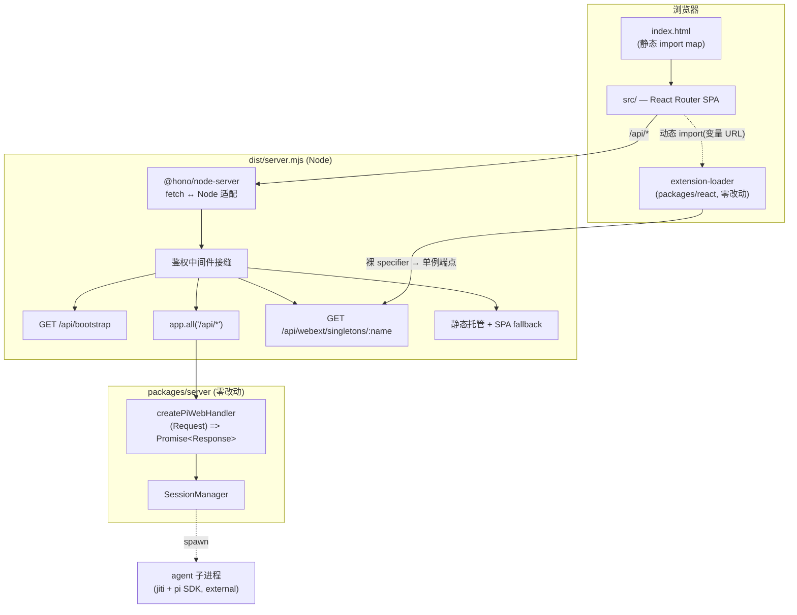

# Design Document — vite-spa-migration

## Overview

**Purpose**: 把 pi-web 的宿主层从 Next.js 换成 Vite（前端）+ 标准 Node HTTP 服务（后端）+ esbuild（打包），使框架不再约束运行时能力，并删除为修补 nft 依赖追踪而存在的 563 行打包脚本。

**Users**: pi-web 维护者（构建/调试体验）、CLI 与桌面应用的安装用户（分发模型必须无感）、pi agent 作者（`.pi/web` 扩展加载必须透明）。

**Impact**: `app/`、`middleware.ts`、`next.config.ts`、`scripts/pack-standalone.mjs` 被删除；新增 `server/`（宿主装配）、`src/`（SPA）、`index.html`、`vite.config.ts` 与两个构建脚本。`packages/*` 零改动。产物从 `.next-cli/standalone/` 变为 `dist/`，但**内部布局同构**，故 CLI 与桌面壳各只改一个路径常量。

### Goals

- `/api/*` 行为对旧宿主逐字节等价（已由 P1 的 29 帧 parity 证明）。
- 前端退化为纯 SPA，三条路由，运行时配置经 `/api/bootstrap` 注入。
- webext 五层加载在生产 CSP（禁 `unsafe-eval`）下完整工作（已由 P0 证明）。
- 产物自包含、可重定位、跨三平台；CLI 与桌面 e2e 全绿。
- 仓库不再依赖 `next`。

### Non-Goals

- 多租户认证（`middleware.ts` / `app/login/` / `lib/auth/` / Supabase）——不在 `main` 上，仅保留服务端鉴权中间件接缝。
- `packages/*` 的任何行为变更；webext 五层模型、附件系统、AIGC、状态桥的重构。
- SSR / SSG。所有页面本就 `force-dynamic`。

## Boundary Commitments

### This Spec Owns

- 宿主装配层：`server/**`（HTTP 入口、`/api/*` 转发、bootstrap 端点、静态托管、SPA fallback、鉴权中间件接缝）。
- 前端装配层：`index.html`、`src/**`（SPA 入口、客户端路由、bootstrap 消费）。
- 构建与打包：`vite.config.ts`、`scripts/build-server.mjs`、`scripts/pack-dist.mjs`。
- 产物布局契约：`dist/` 的目录结构（见 §Architecture）。
- CLI 与桌面壳的**入口路径常量**。
- 三套 e2e 的**启动方式**与 parity harness。

### Out of Boundary

- `packages/*` 的源码与行为（含 `extension-loader.ts`、`createPiWebHandler`、`runnerBootstrapPath`）。本设计**依赖**它们的既有契约，不修改。
- `bin/pi-web.mjs` 的参数解析、env 翻译、就绪探测逻辑（只改产物路径常量）。
- `desktop/src/**` 的运行模式判定、server 监管、Electron-as-Node 机制（只改产物路径常量）。
- 43 个浏览器 e2e spec 的**断言内容**（只改 webServer 启动方式）。
- 多租户登录墙的实现。

### Allowed Dependencies

- `@blksails/pi-web-server` 导出的 `createPiWebHandler`、`runnerBootstrapPath`、`resolvePiCliEntry`、`sessionStoreConfigFromEnv` 等既有 API。
- `lib/app/**` 既有模块（`pi-handler.ts`、`config.ts`、`resume-meta.ts`、`session-source-map.ts`）。
- `hono` + `@hono/node-server`（**仅作 fetch↔Node 适配器**，见决策 1）。
- `vite`、`react-router`、`esbuild`。

### Revalidation Triggers

以下变更须让下游（CLI / 桌面壳 / e2e）重新校验集成：

- `dist/` 目录布局变化（尤其入口文件位置相对产物根的层级）。
- `createPiWebHandler` 的 `(Request) => Promise<Response>` 契约或 SSE 响应体形态变化。
- `runnerBootstrapPath()` / `resolvePiCliEntry()` 的 cwd 回退语义变化。
- `/api/bootstrap` 响应契约变化。
- esbuild `external` 清单变化（影响哪些依赖需按原结构拷贝）。

## Architecture

### 决定性约束：产物入口必须位于产物根

`packages/server` 的两个路径解析器（`runner-bootstrap-path.ts`、`extensions/cli/pi-cli.ts`）都采用
「① 从 `import.meta.url` 推算 → ② 失败或不存在则回退 `process.cwd()`」。其注释明确约定
**产物以 `cwd = 产物根` 启动**。esbuild 与 webpack 一样会把 `import.meta.url` 内联为构建机绝对路径，
因此异机/异 OS 下路径 ① 必然失效，**只能依赖路径 ②**。而 `bin/pi-web.mjs` 以 `dirname(serverJs)` 作 cwd。

> 结论：入口必须是 `dist/server.mjs`（产物根），**不能**是 `dist/server/index.mjs`。
> 这是被既有契约强制的，不是风格选择。产物布局因此与 standalone 同构。

### 产物布局（`dist/`）

```
dist/                              ← cwd（bin/pi-web.mjs 以此为 cwd 启动）
├── server.mjs                     ← esbuild 单文件入口（唯一可执行入口）
├── client/                        ← vite build 产物（index.html + assets）
│   └── webext-artifact/           ← public/ 原样拷入（Tier4 iframe）
├── packages/server/
│   ├── runner-bootstrap.mjs       ← jiti 运行时加载（不进 bundle）
│   └── src/**                     ← runner 源码，jiti 读取
├── lib/app/stub-agent-process.mjs ← --stub 模式（stubAgentPath 经 cwd 解析）
└── node_modules/                  ← external 依赖，**保持原始 pnpm 结构**
    ├── @earendil-works/{pi-coding-agent,pi-ai}
    ├── jiti/
    └── pg/
```

不拍平符号链接、不 relink、不重排依赖树——这正是 `pack-standalone.mjs` 563 行的存在理由被消解的地方。

### 组件与边界



**Architecture Integration**:
- 选定模式：**适配器 + 单一转发接缝**。宿主不做路由分发，只把 `/api/*` 整面交给 `createPiWebHandler`。
- 边界分离：`server/` 只做装配与转发；所有业务路由归 `packages/server`。
- 保留的既有模式：handler 单例 pin 在 `globalThis`；SSE 流式响应体透传；单例桥经 `window.__PI_WEBEXT_SINGLETONS__` re-export。

### 决策记录

| # | 决策 | 理由 |
| --- | --- | --- |
| 1 | Hono 降级为**适配器**，仅用 `serve()` + `app.all`，不用其框架特性 | `createPiWebHandler` 是 fetch-native；`IncomingMessage ↔ Request/Response` 桥接（尤其 SSE 背压与断连）不该在宿主层重写。避免用一个框架依赖替换另一个 |
| 2 | 路由库选 **React Router** 而非 `wouter` | 仅三条路由，但 43 个 e2e 依赖导航与深链行为稳定；pi-web 是本地/自托管应用，前端体积非瓶颈 |
| 3 | 入口 `dist/server.mjs` 置于产物根 | 被 `runnerBootstrapPath()` / `resolvePiCliEntry()` 的 cwd 回退契约强制（见上） |
| 4 | `external` = pi SDK 两包 + `jiti` + `pg` | 前三者是 jiti 运行时动态加载的子进程依赖；`pg` 含可选 `require('pg-native')`，避免 esbuild 静态解析失败。`node:sqlite` 是内置，`zod` 纯 JS，均可 bundle |
| 5 | 15 个 `NEXT_PUBLIC_*` 收编进 `/api/bootstrap` | 它们在 Next 下是**构建期内联**（CLI 运行时设置实际无效）。收编后成为真正的运行时配置，顺带修掉现存缺陷 |
| 6 | 鉴权只留接缝，不实现 | 多租户 WIP 不在 `main`。Node runtime 下未来可直接 `import { isMultiTenant }`，无需像 Edge middleware 那样手写 env 判断复刻 |

## 关键接口契约

### `/api/bootstrap`

```ts
interface BootstrapPayload {
  readonly defaultSource?: string;
  readonly defaultModel?: string;
  readonly defaultCwd: string;
  readonly autoStart: boolean;
  readonly multiTenant: boolean;
  readonly hostApiVersion: string;
  readonly features: BootstrapFeatures;
  /** 仅多租户开启且配置完整时下发；anon key 本就是公开的浏览器端密钥。 */
  readonly supabase?: { readonly url: string; readonly anonKey: string };
  /** `?sessionId=` 命中且可恢复时给出；供 webext registry 冷加载重解析扩展。 */
  readonly resumeSource?: string;
}

interface BootstrapFeatures {
  readonly canvas: boolean;
  readonly sourcePicker: boolean;
  readonly launcherRail: boolean;
  readonly bashEnabled: boolean;
  readonly sessionsGlobal: boolean;
  readonly sessionsManage: boolean;
  readonly sessionsSlot: "sidebar" | "header" | "footer" | "empty";
  readonly extensionCommands: string;
  readonly extensionAllowlist: string;
  readonly extensionBaseUrl: string;
  readonly disableReadinessHandshake: boolean;
}
```

**契约**：永不返回 provider 密钥（R2.3）。`loadConfig()` 抛错时返回 env 推导的默认值，不泄漏底层错误（R2.4）。`resumeSource` 查找顺序为 `lookupSessionSource(id)` → `loadResumeMeta(id)?.source`，均失败则省略字段而非报错（R2.5、R2.6）。

### SPA bootstrap 消费

```ts
/** 配置到达前不渲染依赖门控的子树；避免以缺省值渲染出误导性界面（R3.5）。 */
type BootstrapState =
  | { readonly status: "loading" }
  | { readonly status: "ready"; readonly config: BootstrapPayload }
  | { readonly status: "error"; readonly message: string };
```

### 宿主转发接缝

```ts
/** 唯一业务接缝：整个 /api/* 面交给单例 handler，不重写 status/headers/body。 */
type ApiForward = (req: Request) => Promise<Response>;

/** 鉴权接缝：多租户关闭（默认）时必须等价于「中间件不存在」（R1.6）。 */
type AuthMiddleware = (req: Request, next: () => Promise<Response>) => Promise<Response>;
```

## File Structure Plan

### 新建

| 路径 | 职责 |
| --- | --- |
| `index.html` | SPA 入口文档；**静态注入单例 import map**（须早于任何模块加载，R4.1） |
| `vite.config.ts` | 前端构建；`build.target: "esnext"`、`modulePreload.polyfill: false`；复刻 `vitest.node-e2e.config.ts` 的 5 条 tool-kit 子路径 alias |
| `src/main.tsx` | 挂载 React 根；注入 `window.__PI_WEBEXT_SINGLETONS__` 单例桥 |
| `src/app.tsx` | `<BootstrapGate>` + `<Providers>` + `<RouterProvider>` 装配 |
| `src/bootstrap.tsx` | 拉取 `/api/bootstrap`，暴露 `BootstrapState` context 与 `useBootstrap()` |
| `src/routes/home.tsx` | `/` → `<ChatApp>`（props 取自 bootstrap） |
| `src/routes/session.tsx` | `/session/:id` → `<ChatApp resumeId resumeSource>`（`resumeSource` 取自 `bootstrap?sessionId=`，R3.3） |
| `src/routes/settings.tsx` | `/settings` → 迁移自 `app/settings/page.tsx`（本就是 client component） |
| `server/index.ts` | 宿主入口：适配器 `serve()`、鉴权接缝、`/api/bootstrap`、`app.all("/api/*")`、静态托管、SPA fallback、SIGTERM/SIGINT 优雅停机 |
| `server/bootstrap.ts` | `BootstrapPayload` 构造（读 `loadConfig()` + env + `resumeSource` 恢复） |
| `server/singletons.ts` | `GET /api/webext/singletons/:name`（迁移自 route，删两行 `export const runtime/dynamic`） |
| `server/webext-routes.ts` | 迁移 `/api/webext/{dist,resolve}`（原为 Next 专属 catch-all route） |
| `server/static.ts` | `dist/client` 静态托管 + SPA fallback（排除 `/api/*`） |
| `scripts/build-server.mjs` | esbuild bundle → `dist/server.mjs`；`external` 见决策 4 |
| `scripts/pack-dist.mjs` | 按**原始结构**拷贝 external 依赖、`packages/server/{runner-bootstrap.mjs,src}`、`lib/app/stub-agent-process.mjs`、`public/` |
| `e2e/parity/compare.mjs` | 已存在（P1）；纳入 CI，作为删除 Next 前的对等性证据（R6.5） |

### 修改

| 路径 | 改动 |
| --- | --- |
| `bin/pi-web.mjs` | `standaloneServerJs()` → `distServerJs()`：`join(PKG_ROOT, "dist", "server.mjs")`。**cwd 逻辑不动**（`dirname(serverJs)` 恰为产物根） |
| `desktop/src/resolve-artifact.ts` | 打包态 `join(resourcesPath, "standalone", "server.js")` → `join(resourcesPath, "dist", "server.mjs")` |
| `desktop/electron-builder.yml` | `extraResources` 源目录 `standalone/` → `dist/` |
| `desktop/src/bin-pi-web.d.ts` | `standaloneServerJs` → `distServerJs` |
| `playwright.config.ts` | webServer 命令 `next start` → `node dist/server.mjs`；删除 `PI_WEB_DISABLE_STANDALONE=1`（该 hack 随 Next 消失）；`NEXT_DIST_DIR` 隔离 → vite `--outDir` |
| `tailwind.config.ts` | `content` 的 `./app/**` → `./src/**` |
| `package.json` | **新增依赖**：`react-router`（决策 2）、`esbuild`（决策 4）；`hono` + `@hono/node-server` 已于 P1 装入。`dev`/`build`/`start`/`build:cli`/`e2e*` 脚本改为 vite/esbuild 调用；**最后**移除 `next` 依赖 |
| `e2e/cli/*.mjs`（4 个） | 产物根常量 `.next-cli/standalone` → `dist`；`server.js` → `server.mjs` |
| `app/globals.css` → `src/globals.css` | 移动；`@import` 链不变 |
| `vitest.node-e2e.config.ts` | 若 alias 表被抽公共模块，改为引用 |

### 删除（P4）

`next.config.ts`、`app/`（含 11 个 route + 2 个 page + layout/providers/theme-controls，后三者内容迁至 `src/`）、`middleware.ts`（`main` 上不存在，若合并后再迁）、`scripts/pack-standalone.mjs`。

## Requirements Traceability

| 需求 | 满足位置 |
| --- | --- |
| 1.1–1.5 | `server/index.ts` 的 `app.all("/api/*")` + DELETE 后 `forgetSessionSource`（整会话路径正则限定） |
| 1.6, 1.7 | `server/index.ts` 鉴权接缝（默认直通）；Node runtime |
| 1.8 | `server/index.ts` SIGTERM/SIGINT → `shutdownHandler()` |
| 2.1–2.6 | `server/bootstrap.ts` |
| 3.1, 3.2, 3.4 | `src/routes/*`、`server/static.ts` SPA fallback |
| 3.3 | `src/routes/session.tsx` 消费 `bootstrap?sessionId=` 的 `resumeSource` |
| 3.5 | `src/bootstrap.tsx` 的 `BootstrapState` 门控 |
| 3.6, 3.7 | `src/app.tsx` 迁移 `theme-controls.tsx`；`src/routes/settings.tsx` 保留条件面板登记 |
| 4.1, 4.2 | `index.html` 静态 import map；`server/singletons.ts` |
| 4.3, 4.4 | `vite.config.ts`（`esnext` + 关 polyfill）；产物静态审计；P0 已实证 |
| 4.5, 4.6 | `server/static.ts` 托管 `webext-artifact/`；门控语义不变 |
| 4.7 | `extension-loader.ts` 列入 Out of Boundary |
| 5.1, 5.2 | `scripts/build-server.mjs` + `scripts/pack-dist.mjs`（原结构拷贝） |
| 5.3, 5.4 | 入口置于产物根 → cwd 回退生效；`e2e:cli:reloc` + CI 三平台矩阵 |
| 5.5 | `bin/pi-web.mjs` 仅改路径常量 |
| 5.6, 5.7 | `desktop/src/resolve-artifact.ts` + `electron-builder.yml`；Electron-as-Node 机制不动 |
| 6.1, 6.2 | 43 个浏览器 e2e + node/cli/desktop e2e 全绿 |
| 6.3, 6.4 | 每个 harness 的 liveness 前置断言 + 反证探针 |
| 6.5 | `e2e/parity/compare.mjs` 作为删除 Next 的前置证据 |
| 6.6 | playwright `fs` / `sqlite` 双 project 保持 |
| 7.1–7.3 | P4 删除清单 + `pnpm why next` 无结果 |
| 7.4 | 新旧宿主分端口并存（P1 已如此运行） |
| 7.5 | 新 CSP 移除 `'unsafe-inline'` 脚本源 |

## Testing Strategy

### 单元 / 集成

- `server/bootstrap.ts`：`loadConfig()` 抛错时返回 env 默认值且不含密钥（R2.3、R2.4）；`resumeSource` 两级回退顺序与"均失败则省略字段"（R2.5、R2.6）。
- `server/index.ts`：整会话 DELETE 触发 `forgetSessionSource`，子资源 DELETE 不触发（R1.3、R1.4）；清理失败不改变响应（R1.5）。
- `src/bootstrap.tsx`：`loading` 态不渲染依赖门控的子树（R3.5）。

### 对等性（删除 Next 的前置门）

- `e2e/parity/compare.mjs`：会话创建、消息发送、SSE 帧序列全文、配置读取、会话删除，规范化后逐字节一致（R6.5）。
- **必须携带反证探针**（`P1_BREAK=1` 篡改 status/content-type → 期望 `MISMATCH`）与 liveness 前置断言（R6.3、R6.4）。

### 端到端

| 套件 | 关键流 | 备注 |
| --- | --- | --- |
| 浏览器 e2e（43 spec） | 选源 → prompt → 流式回复；webext 五层渲染；会话持久化 `fs` + `sqlite` 双后端 | 只改 webServer 启动方式，断言不动（R6.1、R6.6）。`aigc-image-edit.e2e.ts` 需真实网关 key，标为可选 |
| node e2e | 真实 `createPiWebHandler` over HTTP/SSE | vite alias 表须复刻，否则 handler 集成路径静默崩 |
| `e2e:cli` / `e2e:cli:real` | 产物完整性；不带 `--stub` 的真实 runner spawn（mock provider） | 验证 pi SDK 传递依赖可解析 |
| `e2e:cli:reloc` | 产物 tar 到异路径、藏起原构建目录后执行真实会话 | **R5.3 的唯一可信验收**；无 `ERR_MODULE_NOT_FOUND` |
| `e2e:desktop:*` | 未打包壳 / 无 Node 机器 / 打包 `.app` | Electron-as-Node；`resourcesPath/dist` 定位 |
| CSP 审计 | 产物 `new Function` / `eval(` / `__vitePreload` 计数为 0 | 反证：注入 `new Function` → 期望 `EvalError` |

### 分阶段验证门

| 阶段 | 出口判据 |
| --- | --- |
| P0 ✅ | webext 在生产 CSP 下加载成功（含反证）— `8ff1e23` |
| P1 ✅ | parity 29 帧逐字节一致，11/11 绿（含反证）— `5e81fc8` |
| P2 | 43 个浏览器 e2e 全绿（外部 server 指向 `dist/server.mjs`）。**前置**：esbuild 的服务端单文件入口须先产出——浏览器 e2e 跑的是真实入口，不是源码直跑。此阶段尚不需要 `pack-dist` 的自包含拷贝（源码树里 `node_modules` 已在） |
| P3 | node e2e、`e2e:cli`、`e2e:cli:real`、`e2e:cli:reloc`、`e2e:desktop:*` 全绿；CI 三平台矩阵绿。node e2e 归此阶段：它验证的是**打包产物**下的处理器集成路径 |
| P4 | `pnpm why next` 无结果；typecheck + 全量测试绿 |

每阶段可独立回滚：新旧宿主分端口并存，直到 P4 才删除 Next（R7.4）。
