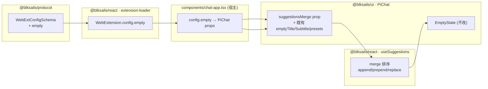
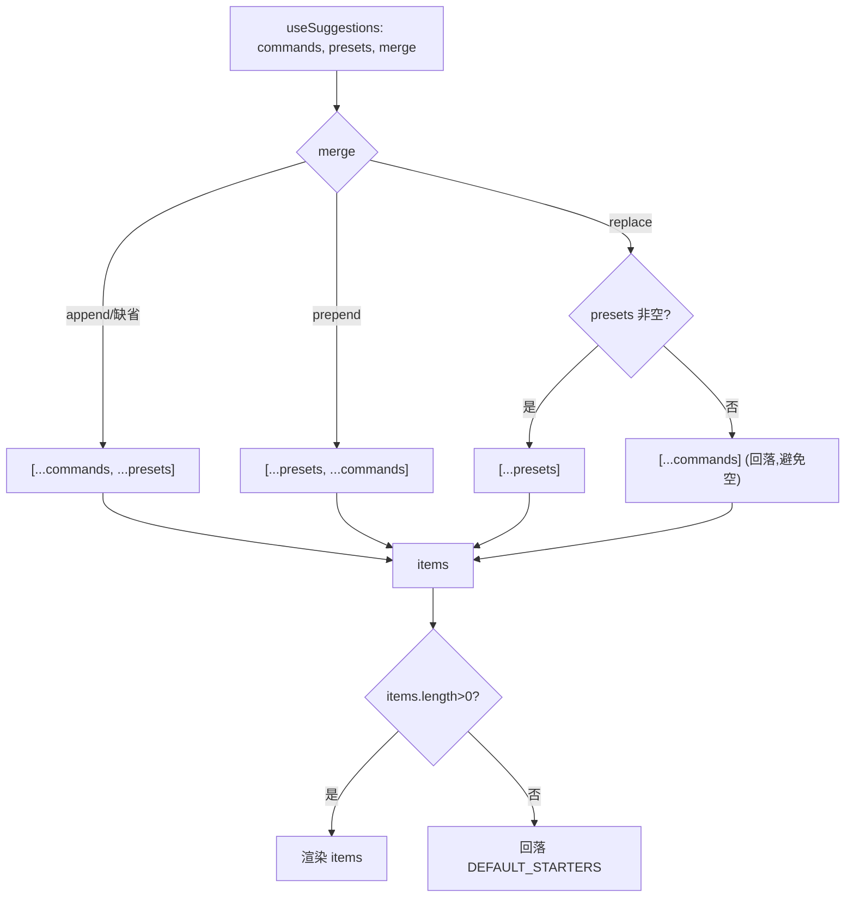

# Design Document

## Overview
本特性为聊天空状态(EmptyState)新增一条 **Tier5 声明式配置**通道:agent 作者在 `.pi/web` 的 `WebExtConfig` 中新增 `empty` 字段,即可零代码定制欢迎页的标题、副标题与建议项,并通过 `mergeCommands` 控制配置建议项与 agent slash 命令的合并顺序。

**Users**: agent 作者(配置端)与最终用户(看到定制后的空状态)。

**Impact**: 在既有的 5 层定制模型中,把空状态从"仅宿主 props / 整块 `empty` slot 可改"扩展为"agent 声明式配置也可改"。消费路径完全复用现有 `theme`/`layout` 两个 Tier5 字段的既有惯例(在宿主 `chat-app.tsx` 翻译为 `PiChat` props),不改动 `PiChat` 对 `extension.config` 的认知,不引入新的渲染组件。

### Goals
- `WebExtConfig` 新增可序列化 `empty` 配置(title/subtitle/starters/mergeCommands)。
- 加载相应扩展的会话在空状态按配置渲染标题/副标题/建议项。
- 配置建议项与 agent 命令支持 append(默认)/prepend/replace 三种合并。
- 完全向后兼容:未配置时行为与现状逐像素一致;默认 `append` 等价于现有 "命令在前、presets 在后"。

### Non-Goals
- 不改动既有 Tier1 `empty` slot(整块 React 替换)的能力与优先级。
- 不改动 agent slash 命令的来源/拉取/映射规则。
- 不改动对话进行中(非空态)的建议气泡。
- 不移除宿主通过 props 直接定制空状态的既有能力。

## Boundary Commitments

### This Spec Owns
- `WebExtConfigSchema` 中 `empty` 子 schema 的形状与校验(`packages/protocol`)。
- `useSuggestions` 的建议项**合并顺序**逻辑(新增 `merge` 入参,`packages/react`)。
- `PiChat` 的 `suggestionsMerge` 透传 prop(`packages/ui`)。
- 宿主 `chat-app.tsx` 把 `extension.config.empty` 翻译为 `PiChat` props 的映射逻辑。

### Out of Boundary
- `Suggestion` 数据结构本身(沿用 `packages/react` 既有定义)。
- `EmptyState` 渲染组件内部结构(不改)。
- 扩展加载链路 `extension-loader.ts` 把 `manifest.config` 合成 `WebExtension.config` 的机制(已存在,直接复用)。
- agent 命令拉取 `usePiControls.getCommands`(不改)。

### Allowed Dependencies
- `packages/protocol`(`WebExtConfig` 定义源)。
- `packages/react` 既有 `Suggestion` 类型与 `usePiControls` 命令状态。
- `packages/ui` 既有 `PiChat` 装配与 `EmptyState` 组件。
- 依赖方向严格单向:`protocol → react → ui → components(宿主)`,不得逆向。

### Revalidation Triggers
- `WebExtConfig` 契约形状变更(新增/改名/改类型 `empty.*`)。
- `Suggestion` 结构变更(影响 `starters` 序列化形状)。
- `useSuggestions` 合并语义变更(影响所有调用方的建议排序)。
- `PiChat` 空状态相关 props(`emptyTitle`/`emptySubtitle`/`suggestionsPresets`/`suggestionsMerge`)契约变更。

## Architecture

### Existing Architecture Analysis
- **Tier5 既有惯例**:`extension.config.theme`/`layout` 不在 `PiChat` 内消费,而是在宿主 `components/chat-app.tsx:275,290` 读出并翻译为 `PiChat` 的 `style`/`layout` prop。本特性的 `empty` 严格沿用此惯例。
- **建议项数据流**:`usePiControls.commands`(`RpcSlashCommand[]`)→ `useSuggestions` 映射为 `Suggestion` 并与 `presets` 合并(当前硬编码 `[...fromCommands, ...fromPresets]`,即天然 append)→ `PiChat` 计算 `gridItems = suggestions.items.length>0 ? suggestions.items : starters` → `EmptyState` 渲染。
- **既有定制优先级**(空状态):宿主 `slots.empty` > 宿主 `components.EmptyState` > 默认 `EmptyState`;本特性不触碰该链路,仅向 `EmptyState` 注入的 title/subtitle/items 提供新来源。
- **纯声明式加载**:`extension-loader.ts:46-52` 对无 `entry` 的扩展从 `manifest.config` 直接合成 `WebExtension.config`,`empty` 作为 `config` 子字段免费随之可用。

### Architecture Pattern & Boundary Map


- **Selected pattern**:声明式配置翻译(宿主适配层),与 `theme`/`layout` 同构。
- **Dependency direction**:`protocol → react → ui → components`,逐层单向,严禁逆向 import。
- **New components rationale**:无新组件;仅在既有 schema/hook/prop/宿主映射四点做最小增量。

### Technology Stack
| Layer | Choice / Version | Role in Feature | Notes |
|-------|------------------|-----------------|-------|
| Schema | Zod(既有) | `empty` 字段定义与校验 | 复用既有 `WebExtConfigSchema` |
| Hook | React(既有) | `useSuggestions` 合并排序 | 新增 `merge` 入参 |
| UI | React + `PiChat`(既有) | 透传 `suggestionsMerge` | 不改 `EmptyState` |
| Host | Next.js `chat-app.tsx`(既有) | `config.empty`→props 映射 | 对齐 `theme`/`layout` |

## File Structure Plan

### Modified Files
- `packages/protocol/src/web-ext/config.ts` — 新增 `EmptySuggestionSchema`、`EmptyConfigSchema`,并在 `WebExtConfigSchema` 加 `empty` 可选字段;导出对应类型。
- `packages/react/src/hooks/use-suggestions.ts` — `UseSuggestionsOptions` 增加可选 `merge`;`items` 计算按 `merge` 排序;默认 `append` 保持现状。
- `packages/ui/src/chat/pi-chat.tsx` — `PiChatProps` 增加可选 `suggestionsMerge`;在 `useSuggestions(...)` 调用处透传。
- `components/chat-app.tsx` — 读 `extension?.config?.empty`,以条件展开把 `title/subtitle/starters/mergeCommands` 映射为 `emptyTitle/emptySubtitle/suggestionsPresets/suggestionsMerge` props(仿 `theme`/`layout`)。

### New Files (测试 + 示例)
- `packages/protocol/test/web-ext/config-empty.test.ts` — `empty` schema parse/拒绝非法值。
- `packages/react/test/hooks/use-suggestions.test.ts` — 若已存在则补充 merge 用例,否则新建。
- `packages/ui/test/chat/pi-chat-suggestions-merge.test.tsx` — `suggestionsMerge` 透传与渲染顺序;`emptyTitle/Subtitle` 来自 props 的渲染。
- `examples/webext-slots-agent/.pi/web/web.config.tsx` — 在既有「全槽展示」示例上整合 `config.empty`(title/subtitle/starters + `mergeCommands: "prepend"`),不再新增独立空态示例 agent;e2e 直接复用该 source。
- `e2e/browser/webext-full.e2e.ts` — 在既有 slots-agent 验收中增补 Tier5 空态配置断言(标题/副标题/建议项 + prepend 合并)与默认回归;不单列 e2e 文件。
  - 注:`replace` 合并模式由 `useSuggestions` 单测覆盖(e2e 单 agent 单 mergeCommands,演示 `prepend` 与命令的合并)。

## System Flows

### 建议项合并与回落(核心分支)


## Requirements Traceability
| Requirement | Summary | Components | Interfaces | Flows |
|-------------|---------|------------|------------|-------|
| 1.1–1.6 | `empty` schema 与校验 | `config.ts` | `EmptyConfigSchema` | — |
| 2.1–2.5 | 标题/副标题渲染与默认 | `chat-app.tsx`,`PiChat` | `emptyTitle`/`emptySubtitle` props | — |
| 3.1–3.4 | 建议项渲染与点击行为 | `useSuggestions`,`EmptyState` | `suggestionsPresets` prop,`Suggestion` | 合并流 |
| 4.1–4.5 | 合并策略 | `useSuggestions`,`PiChat` | `merge`/`suggestionsMerge` | 合并流 |
| 5.1–5.4 | 宿主消费与优先级 | `chat-app.tsx` | 条件展开 props | — |
| 6.1–6.3 | 向后兼容 | 全部 | 默认 `append` | 合并流 |

## Components and Interfaces

| Component | Layer | Intent | Req | Contracts |
|-----------|-------|--------|-----|-----------|
| `EmptyConfigSchema` | protocol | 定义/校验 `empty` 配置 | 1 | State(config) |
| `useSuggestions(merge)` | react | 按策略合并建议项 | 3,4,6 | Service(hook) |
| `PiChat.suggestionsMerge` | ui | 透传合并策略 | 4 | State(props) |
| `chat-app` 映射 | host | config→props 翻译 | 2,5 | — |

### protocol — `EmptyConfigSchema`
```typescript
export const EmptySuggestionSchema = z.object({
  id: z.string(),
  label: z.string(),
  value: z.string(),
  mode: z.enum(["fill", "send"]),
});
export type EmptySuggestion = z.infer<typeof EmptySuggestionSchema>;

export const EmptyConfigSchema = z.object({
  title: z.string().optional(),
  subtitle: z.string().optional(),
  starters: z.array(EmptySuggestionSchema).optional(),
  mergeCommands: z.enum(["append", "prepend", "replace"]).optional(),
});
export type EmptyConfig = z.infer<typeof EmptyConfigSchema>;

// WebExtConfigSchema 增加:
//   empty: EmptyConfigSchema.optional(),
```
- Preconditions:`empty` 可省略;省略时整体校验不受影响(Req 1.6/6.3)。
- Postconditions:非法 `mode`/`mergeCommands` 触发 Zod 校验失败(Req 1.4/1.5)。
- Invariants:`EmptySuggestion` 与 `@blksails/react` 的 `Suggestion` 结构字段对齐(可直接作为 `suggestionsPresets`)。

> 注:`EmptySuggestion` 与 `Suggestion` 形状一致但定义在 protocol(不可依赖 react),为契约对齐而独立定义;宿主映射时类型相容直接透传。

### react — `useSuggestions`
```typescript
export type SuggestionMerge = "append" | "prepend" | "replace";

export interface UseSuggestionsOptions {
  readonly controls?: UsePiControlsResult;
  readonly presets?: ReadonlyArray<Suggestion>;
  readonly merge?: SuggestionMerge; // 默认 "append"
}
```
- 合并语义见 System Flows;`replace` 且 presets 空时回落 commands(Req 4.4)。
- 默认 `append` 产出 `[...fromCommands, ...fromPresets]`,与现状逐项一致(Req 6.2)。

### ui — `PiChat`
```typescript
interface PiChatProps {
  // …既有…
  readonly suggestionsMerge?: SuggestionMerge; // 透传给 useSuggestions
}
```
- `emptyTitle`/`emptySubtitle`/`suggestionsPresets` 三个 prop **已存在**,本特性不新增,仅由宿主填充。

### host — `chat-app.tsx`
```tsx
const empty = extension?.config?.empty;
<PiChat
  // …既有…
  {...(empty?.title !== undefined ? { emptyTitle: empty.title } : {})}
  {...(empty?.subtitle !== undefined ? { emptySubtitle: empty.subtitle } : {})}
  {...(empty?.starters !== undefined ? { suggestionsPresets: empty.starters } : {})}
  {...(empty?.mergeCommands !== undefined ? { suggestionsMerge: empty.mergeCommands } : {})}
/>
```
- 条件展开:未配置即不注入,保持 `PiChat` 默认(Req 5.4/6.1)。
- **优先级契约定位在 `PiChat` 边界**(Req 5.2):`PiChat` 从不读取 `extension.config.empty`,只消费显式 props,故任何显式传入的 `emptyTitle/emptySubtitle/suggestionsPresets/suggestionsMerge` 天然胜出;`chat-app` 只是把扩展配置翻译为这些 props 的默认宿主(与 `theme`/`layout` 同构)。当前 `chat-app` 自身不持有竞争性的显式空态 props,故配置值即生效;若未来 `chat-app` 需要叠加自身显式值,应将其显式属性置于这些条件展开之后以保证宿主值胜出。

## Error Handling
### Error Strategy
- **配置校验(Fail Fast)**:非法 `empty.*` 由 Zod 在加载/解析阶段拒绝(Req 1.4/1.5),错误经既有扩展加载错误通道暴露,不静默吞掉。
- **空建议保护(Graceful Degradation)**:`replace` 且 starters 空→回落 commands;commands 与 presets 均空→回落 `DEFAULT_STARTERS`,确保空状态始终有建议(Req 4.4/3.4)。
- **类型边界**:`EmptySuggestion`(protocol)与 `Suggestion`(react)字段对齐,宿主透传无 `any`、无不安全 cast。

## Testing Strategy
### Unit Tests
- `EmptyConfigSchema`:合法 `empty` parse 成功;非法 `mode`(如 `"x"`)被拒;非法 `mergeCommands` 被拒;`empty` 省略时 `WebExtConfig` 仍 parse(Req 1.x/6.3)。
- `useSuggestions`:`append`(默认)产出 `commands++presets`;`prepend` 产出 `presets++commands`;`replace`+非空 presets 仅 presets;`replace`+空 presets 回落 commands(Req 4.x/6.2)。
- `PiChat`:`emptyTitle`/`emptySubtitle` props 渲染到 `<h1>`/`<p>`;`suggestionsMerge` 透传影响 grid 顺序(Req 2.x/4.x)。

### Integration Tests
- `chat-app` 映射:给定带 `config.empty` 的 `extension`,断言 `PiChat` 收到对应 props;未配置时不注入(Req 5.x)。

### E2E/UI Tests(浏览器验收)
- 加载一个声明式 `empty` 配置 agent,空状态展示配置的 title/subtitle 与 starters 按钮。
- `mergeCommands=prepend`:配置项排在 agent 命令之前(DOM 顺序断言)。
- `mergeCommands=replace`:仅展示配置项,无 agent 命令按钮。
- 默认(无 `empty`)agent:空状态与现状一致(回归)。

> e2e 采用既有隔离 build 惯例:`NEXT_DIST_DIR=.next-e2e` + external server,不污染 dev。
