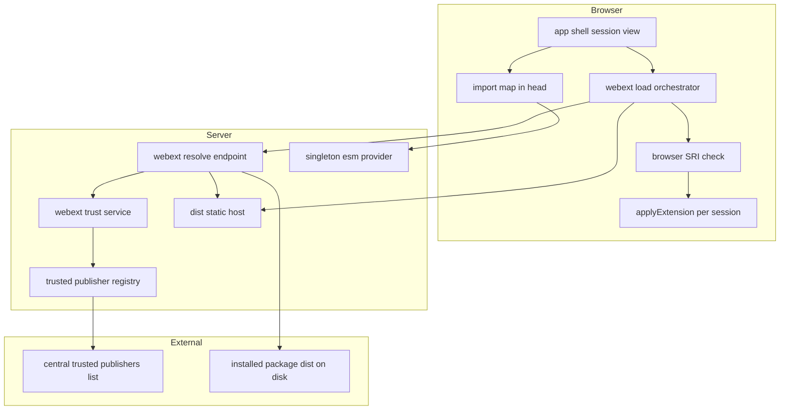
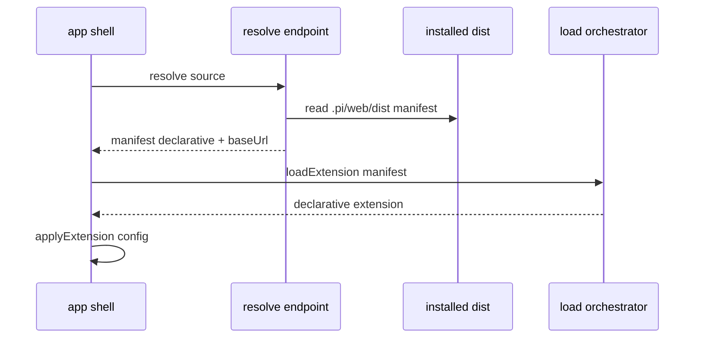
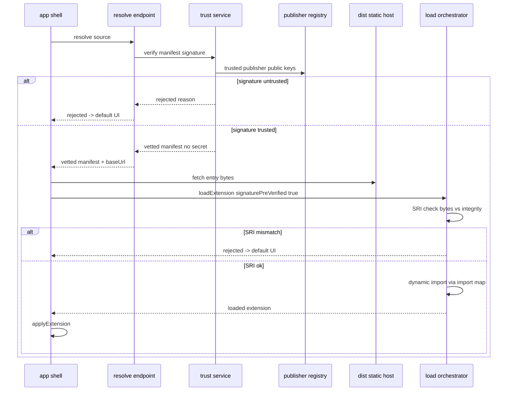
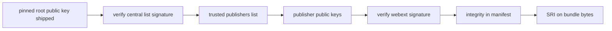

# Design Document — webext-package-install

## Overview

**Purpose**: 让已安装包中的 webext（5 层 web 扩展）能在浏览器侧动态加载生效，并定稿其信任模型，使用户安装含 webext 的包后获得其 UI 能力且来源可信。
**Users**: pi-web 的运营者（控制信任根）与终端用户（安装/使用扩展）。
**Impact**: 把既有但未接线的「运行时 import map 加载车道」接到生产宿主；引入「服务端验签 / 浏览器验 SRI」的拆分信任模型与中心化可信发布者列表；落盘复用 pi install，不新建安装器。

### Goals
- 已安装包内 webext 的自动发现、解析与浏览器侧加载（Tier5 纯声明 + Tier1-4 代码两路）。
- 可信、不可绕过的信任模型：完整性（浏览器 SRI）、发布者签名（服务端验、机密不入浏览器）、运营者控制的白名单、出厂根钉死的中心可信发布者列表。
- 安装后双路生效反馈（pi 资源 reload + webext load）。

### Non-Goals
- 安装器/落盘本身（复用 `pi install` / `extension-management`）。
- `/plugin` 命令本体（`builtin-plugin-command`）。
- marketplace / 扩展目录 / 发现推荐（Phase 2）。
- webext 协议契约、SDK、`pi-web build`、加载器/安全门**核心算法**（`agent-web-extension` 已实现，本特性复用并补强签名机制）。

## Boundary Commitments

### This Spec Owns
- **宿主侧加载接线**：会话激活/安装后触发 webext 解析与加载，并把结果 `applyExtension` 到当前会话。
- **拆分信任模型**：服务端发布者签名校验 + 浏览器 SRI 校验的编排；gate 的 `signaturePreVerified` 语义。
- **可信发布者治理**：白名单的服务端持有与分层（env/文件/admin），中心列表的获取、根验签、合并、fail-safe、离线快照。
- **发现与 baseUrl**：把已装包的 `.pi/web/dist/` 解析为 `{manifest, baseUrl}` 并静态可达。
- **import map 与单例供给**：`<head>` 注入 import map + 宿主单例 ESM 的稳定 URL 暴露。
- **签名算法迁移**：把 manifest 签名从 HMAC 迁移到 Ed25519（构建侧签 + 服务端验）。

### Out of Boundary
- `pi install` 落盘流程、`extension-management` 的安装治理（复用，不改其职责）。
- `/plugin` 命令解析与 UI（仅消费本 spec 暴露的「安装后触发加载」挂点）。
- webext 作者侧组件编写、`pi-web build` 的打包/externals/css-scope 算法（复用）。
- 中心可信发布者列表的**运营内容**（谁被收录）——本 spec 只定义格式、验签与消费机制，不维护名单内容。

### Allowed Dependencies
- `agent-web-extension`：`@blksails/pi-web-protocol`（manifest 契约）、`@blksails/pi-web-react`（`loadExtension`/`extension-gate`/`buildImportMap`/`applyExtension`）、`@blksails/pi-web-kit`（`WebExtension`）。
- `builtin-plugin-command`：提供 `/plugin install` 落盘触发与「装后生效反馈」挂点。
- pi `DefaultPackageManager`：`getInstalledPath(source, scope)` 取已装路径。
- `lib/app/session-source-map.ts`：source 解析（resume）。

### Revalidation Triggers
- `WebExtensionManifest` 契约形状变化（尤其 signature/integrity 字段语义）。
- 签名算法由 Ed25519 再变更。
- `GateOptions` 增删字段（`signaturePreVerified` 等）。
- 「安装后触发加载」挂点契约变化（影响 `builtin-plugin-command`）。
- 单例 ESM URL 约定或 import map 注入时机变化。

## Architecture

### Existing Architecture Analysis
- **已建未接线**：运行时 import map 车道（`loadExtension`/`buildImportMap`/`browserLoaderDeps`）齐备，但宿主只接了构建期静态 import 车道（`webext-registry.ts`）。
- **信任缺陷**：`loadExtension` 在浏览器调 `verifyExtension`（含签名），而签名是 **HMAC 对称密钥** → 浏览器持密钥即可伪造。必须改为服务端验签 + 浏览器仅 SRI，并迁移到非对称。
- **保留模式**：per-session in-memory registry + `applyExtension`、source 绑定解析、`session-source-map` resume、gate 的「拒绝即回退默认 UI」。

### Architecture Pattern & Boundary Map



**Architecture Integration**:
- 选定模式：**服务端信任网关 + 浏览器沙箱加载**。信任决策（签名、白名单、中心列表根验签）全在服务端；浏览器只做无需机密的 SRI 与执行。
- 边界分离：信任（Server: Trust/Registry）/ 发现与托管（Server: Resolve/Static/Singleton）/ 加载与应用（Browser: Loader/SRI/Apply）三组互不co-own。
- 保留模式：复用 `loadExtension`、`applyExtension`、gate 的 SRI 与回退语义。
- 依赖方向：`protocol（类型）→ server（信任/发现）→ client（加载/应用）→ app-shell（注入/触发）`；不得反向。

### Technology Stack

| Layer | Choice / Version | Role in Feature | Notes |
|-------|------------------|-----------------|-------|
| Frontend | React 19 + Next（既有 app-shell） | 加载触发、import map 注入、SRI、apply | 复用 `@blksails/pi-web-react` |
| Backend | Next route handlers（既有 `lib/app` 注入接缝） | resolve / 验签 / 中心列表 / 单例供给 / 静态托管 | 与既有 `createExtensionRoutes` 同款注入 |
| Crypto | Web Crypto `crypto.subtle` Ed25519 + SHA-384 | 服务端验签（Ed25519）/ 浏览器 SRI（sha384） | SRI 既有；签名由 HMAC 迁 Ed25519 |
| Data | 文件系统（`~/.pi/agent` 下）+ 内存缓存 | 已装包 dist、中心列表缓存、出厂快照 | 复用 pi 落盘位置 |

## File Structure Plan

### Directory Structure
```
packages/react/src/web-ext/
├── extension-gate.ts          # 修改: 增 signaturePreVerified 选项; 迁 Ed25519 verifySignature
└── extension-loader.ts        # 复用: 浏览器路径以 signaturePreVerified 跳过签名、仅 SRI

packages/web-kit/build/
└── manifest-emit.ts           # 修改: signManifest 由 HMAC 迁 Ed25519(私钥签)

lib/app/webext/                # 新增: 本 spec 服务端核心(注入式路由 + 信任)
├── trusted-publisher-registry.ts  # 中心列表获取/根验签/合并/fail-safe/快照; 暴露受信公钥
├── webext-trust-service.ts        # 服务端发布者签名校验 -> VettedManifest
├── webext-resolve-route.ts        # GET 解析 source -> {vetted manifest, baseUrl}
├── webext-dist-static.ts          # 已装包 .pi/web/dist 静态托管(baseUrl)
├── singleton-esm-route.ts         # 暴露 react/react-dom/web-kit 单例 ESM 稳定 URL
└── trusted-publishers.snapshot.json # 出厂快照(离线 fail-safe)

lib/app/
├── web-ext-gate-config.ts     # 修改: 白名单语义改公钥; 不再向浏览器下发验签机密
├── webext-load-client.ts      # 新增(client): 会话激活/装后触发 resolve+loadExtension+apply
└── webext-import-map.ts       # 新增: 由单例 URL 生成并注入 <head> import map

components/
└── chat-app.tsx               # 修改: 接 webext-load-client 触发点 + import map 注入
```

### Modified Files
- `extension-gate.ts` — 增 `signaturePreVerified`，签名验证迁 Ed25519（公钥验）。
- `extension-loader.ts` — 浏览器加载传入 `signaturePreVerified: true`（签名服务端已验），仅跑 SRI。
- `manifest-emit.ts` — `signManifest` 改 Ed25519 私钥签名。
- `web-ext-gate-config.ts` — `PI_WEB_EXT_WHITELIST` 语义由共享密钥改为发布者公钥；验签机密不下发浏览器。
- `chat-app.tsx` — 调用客户端加载编排 + 注入 import map。

## System Flows

### Tier5 纯声明加载（Step 1，无 crypto/无 import map）

要点：纯声明 manifest 无 entry，gate 仅校验版本；不验签、不验 SRI、不需 import map。

### Tier1-4 代码加载（Step 2，完整信任链）


### 中心可信发布者列表三级信任链

要点：根验证在服务端（列表服务端消费）；拉取失败回退缓存/出厂快照，绝不 fail-open；运营者本地决策覆盖中心列表。

## Requirements Traceability

| Requirement | Summary | Components | Interfaces | Flows |
|-------------|---------|------------|------------|-------|
| 1.1,1.3 | 按源自描述发现，无中心目录 | WebextResolveRoute, WebextDistStatic | `GET /api/webext/resolve` | Tier5/Tier1-4 |
| 1.2,1.4 | 缺/坏 manifest 回退 | WebextResolveRoute | resolve 返回 found/rejectedReason | 两路 |
| 1.5 | resume 重解析 | WebextLoadClient + session-source-map | `lookupSessionSource` | Tier5/Tier1-4 |
| 2.1-2.4 | Tier5 纯声明加载 | WebextLoadClient, extension-loader(复用) | `loadExtension` declarative | Tier5 |
| 3.1,3.5 | 代码动态加载、会话级隔离 | WebextLoadClient, applyExtension(复用) | `loadExtension` loaded | Tier1-4 |
| 3.2 | 宿主单例共享 | SingletonEsmRoute, WebextImportMap | `buildImportMap`, import map | Tier1-4 |
| 3.3 | 扩展命名空间化 | applyExtension(复用) | extId 命名空间 | Tier1-4 |
| 3.4 | CSP 不可执行安全回退 | extension-loader(复用) | `LoadOutcome.rejected` | Tier1-4 |
| 4.1-4.4 | 浏览器 SRI | extension-gate(SRI), extension-loader | `verifyIntegrity` | Tier1-4 |
| 5.1-5.5 | 服务端验签、机密不入浏览器、覆盖 integrity、生产不跳过 | WebextTrustService, extension-gate(签名) | `verifyManifest` | Tier1-4 |
| 6.1-6.5 | 白名单运营者控制、分层、admin、第一方默认 | TrustedPublisherRegistry, web-ext-gate-config, admin-policy(复用) | `publishers()` | 三级链 |
| 7.1-7.7 | 中心列表、根验签、非目录、覆盖、fail-safe、离线、吊销 | TrustedPublisherRegistry | `refresh()`, 列表 schema | 三级链 |
| 8.1-8.4 | 装后双路生效反馈 | WebextLoadClient + builtin-plugin-command 挂点 | 加载触发挂点 | 两路 |
| 9.1-9.4 | 失败回退与可观测 | extension-loader, WebextResolveRoute | `LoadOutcome`, 审计日志 | 两路 |
| 10.1-10.4 | dev 逃生门/生产强制签名 | web-ext-gate-config, WebextTrustService | `requireSignature` | Tier1-4 |

## Components and Interfaces

| Component | Layer | Intent | Req | Key Deps (P0/P1) | Contracts |
|-----------|-------|--------|-----|------------------|-----------|
| TrustedPublisherRegistry | Server | 中心列表获取/根验签/合并/fail-safe，提供受信公钥 | 6,7 | pinned root key(P0), central URL(P1) | Service/State |
| WebextTrustService | Server | 服务端验发布者签名→VettedManifest | 5,10 | Registry(P0), gate Ed25519(P0) | Service |
| WebextResolveRoute | Server | source→{vetted manifest, baseUrl} | 1,8,9 | Trust(P0), DistStatic(P0), getInstalledPath(P0) | API |
| WebextDistStatic | Server | 已装包 dist 静态托管 | 1,3 | 落盘路径(P0) | API |
| SingletonEsmRoute | Server | 暴露宿主单例 ESM 稳定 URL | 3 | Next 产物(P1) | API |
| WebextLoadClient | Client | 触发 resolve+loadExtension+apply | 1,2,3,8,9 | loadExtension(P0), applyExtension(P0) | Service |
| WebextImportMap | Client | 生成并注入 `<head>` import map | 3 | SingletonEsmRoute(P0), buildImportMap(P0) | State |
| extension-gate(改) | Shared | 增 signaturePreVerified；签名迁 Ed25519 | 4,5,10 | crypto.subtle(P0) | Service |

### Server

#### TrustedPublisherRegistry
| Field | Detail |
|-------|--------|
| Intent | 维护「当前有效的受信发布者公钥集」=（中心列表 ∩ 根验签通过）⊕ 运营者本地覆盖 |
| Requirements | 6.1,6.3,6.4,6.5,7.1-7.7 |

**Responsibilities & Constraints**
- 出厂钉死根公钥（编译进产品，不可远程改）；用其验证中心列表签名，失败则不采信。
- 合并优先级：运营者本地（吊销/追加/快照固定）> 中心列表 > 空。
- fail-safe：拉取失败 → 缓存 → 出厂快照；任何情况不得 fail-open（空集即不信任何代码扩展，而非信全部）。
- 过期/吊销条目不得进入有效集。
- 验签机密（私钥）不存在于本组件；本组件只持公钥。

**Contracts**: Service ☑ / State ☑

```typescript
interface TrustedPublisher {
  readonly id: string;
  readonly publicKey: string;     // Ed25519 公钥(base64)
  readonly revoked?: boolean;
}
interface TrustedPublishersList {
  readonly version: number;
  readonly issuedAt: string;
  readonly expiresAt?: string;
  readonly publishers: readonly TrustedPublisher[];
  readonly signature: string;     // 根私钥对规范化字节(排除 signature)签
}
type RefreshResult =
  | { readonly ok: true; readonly source: "central" | "cache" | "snapshot"; readonly count: number }
  | { readonly ok: false; readonly reason: string; readonly fellBackTo: "cache" | "snapshot" | "none" };

interface TrustedPublisherRegistry {
  publishers(): readonly TrustedPublisher[];   // 当前有效受信公钥(已去吊销/过期, 已并入本地覆盖)
  refresh(): Promise<RefreshResult>;           // 拉中心列表→根验签→合并→缓存; 失败回退
}
```
- Preconditions: 出厂根公钥存在；出厂快照存在。
- Postconditions: `publishers()` 永不返回未经根验签的中心条目；拉取失败时返回上一可信集。
- Invariants: 私钥永不出现在服务端运行态以外；空集语义=拒绝所有代码扩展。

#### WebextTrustService
| Field | Detail |
|-------|--------|
| Intent | 服务端用受信公钥验 manifest 签名，产出可安全下发浏览器的 VettedManifest |
| Requirements | 5.1-5.5,10.2 |

**Contracts**: Service ☑
```typescript
type VettedManifest = Omit<WebExtensionManifest, "signature"> & {
  readonly signaturePreVerified: true;   // 服务端已验签的断言(同源后端可信)
};
type TrustVerdict =
  | { readonly ok: true; readonly vetted: VettedManifest }
  | { readonly ok: false; readonly reason: string };

interface WebextTrustService {
  verifyManifest(manifest: WebExtensionManifest): Promise<TrustVerdict>;
}
```
- Preconditions: 代码扩展 manifest 含 `signature` 与 `integrity`。
- Postconditions: `ok` 时去除 `signature` 字段（机密无关，纯洁净）、标 `signaturePreVerified`；签名覆盖 `integrity` 故浏览器 SRI 可凭 vetted.integrity。
- Invariants: 生产模式（`requireSignature` 有效）下无签名/不受信一律 `ok:false`；验签所用公钥来自 Registry，私钥/机密永不下发。

#### WebextResolveRoute / WebextDistStatic / SingletonEsmRoute
**Contracts**: API ☑

| Method | Endpoint | Request | Response | Errors |
|--------|----------|---------|----------|--------|
| GET | `/api/webext/resolve` | `?source=<source>` | `WebextResolveResponse` | 400 非法 source |
| GET | `/api/webext/dist/*` | 已装包 dist 相对路径 | ESM/CSS 字节（含正确 MIME） | 404 |
| GET | `/api/webext/singletons/:name` | name∈{react,react-dom,pi-web-kit} | 单例 ESM | 404 |

```typescript
interface WebextResolveResponse {
  readonly found: boolean;
  readonly manifest?: VettedManifest; // 已服务端验签(代码扩展)或纯声明
  readonly baseUrl?: string;          // 指向 /api/webext/dist/... 末尾含 /
  readonly rejectedReason?: string;   // found 但被拒(坏 manifest/不受信)
}
```
- WebextDistStatic 经 `getInstalledPath(source, scope)` 定位 `<installedPath>/.pi/web/dist/`，限定只读、防目录穿越（沿用 session-source-map 同款 id/path 白名单）。
- SingletonEsmRoute 暴露宿主同一 React/web-kit 实例的 ESM，URL 稳定，供 import map 引用（解决「单例 URL 来源」缺口）。

### Client

#### WebextLoadClient
| Field | Detail |
|-------|--------|
| Intent | 会话激活或安装后，编排 resolve→loadExtension→applyExtension |
| Requirements | 1.5,2.1-2.4,3.1,3.5,8.1-8.4,9.1-9.4 |

**Contracts**: Service ☑
```typescript
interface WebextLoadClient {
  loadForSession(input: {
    readonly source: string;
    readonly registry: RendererRegistry;     // per-session, 复用
  }): Promise<LoadOutcome>;                   // 复用 extension-loader 的 LoadOutcome
}
```
- 行为：GET resolve → 若 `found && manifest` 则 `loadExtension({ manifest, baseUrl, opts: { requireSignature:false, signaturePreVerified:true, whitelist:[], hostApiVersion }, deps: browserLoaderDeps() })` → `loaded/declarative` 时 `applyExtension`；`rejected/skipped` 回退默认 UI 并上报原因。
- 装后触发：`builtin-plugin-command` 的「安装完成」事件调用本编排（R8 双路之一）。
- Implementation Notes：浏览器 opts 永不含 `whitelist` 机密；签名已服务端验。

#### WebextImportMap
**Contracts**: State ☑
- 在任何 ESM 加载前于 `<head>` 注入单张 `<script type="importmap">`，由 `buildImportMap(singletonUrls)` 生成，`singletonUrls` 指向 SingletonEsmRoute。
- 注入时机：app-shell 首屏 SSR `<head>`（早于 hydration），保证「首个 import 前唯一 import map」约束（见 Risks）。

## Data Models

### trusted-publishers.json（中心列表 + 出厂快照同 schema）
见 `TrustedPublishersList`。快照随产品发行，离线 fail-safe。`signature` 由中心根私钥对 `{version,issuedAt,expiresAt,publishers}` 规范化字节签（排除 signature 字段，固定 key 序，复用 `canonicalManifestBytes` 同款规范化思路）。

### VettedManifest（服务端→浏览器 DTO）
见上。去 `signature`、标 `signaturePreVerified`；保留 `integrity` 供浏览器 SRI。

## Error Handling

### Error Strategy
全链 fail-closed + 安全回退：任何校验/获取失败 → 拒绝该 webext、回退宿主默认 UI、记审计原因，绝不 fail-open、绝不崩页。

### Error Categories and Responses
- **发现类**：source 非法 → 400；无 dist/manifest → `found:false` → 默认 UI（非错误）。
- **信任类**：签名不受信/缺签 → `rejectedReason`；中心列表根验签失败 → 不采信该列表、回退快照（`RefreshResult.fellBackTo`）。
- **完整性类**：SRI 不符 → `LoadOutcome.rejected`，不执行字节。
- **运行类**：CSP 禁执行/import 失败 → `rejected` 回退（R3.4）；单个 webext 失败不影响宿主与其他 webext（R9.3）。

### Monitoring
- 每次拒绝/失败记 `{extId, source, stage, reason}` 审计（复用 `extension-management` 的 `audit.ts` 风格）。
- `refresh()` 记 `RefreshResult`（来源 central/cache/snapshot）。

## Testing Strategy

### Unit Tests
- `TrustedPublisherRegistry`：根验签通过/失败；过期/吊销剔除；本地覆盖优先；拉取失败回退缓存→快照→不 fail-open。
- `WebextTrustService.verifyManifest`：受信签名→vetted（去 signature、保 integrity）；缺签/不受信→拒；生产模式不跳过。
- `extension-gate`（改）：`signaturePreVerified` 跳过签名但仍验 SRI；Ed25519 验签正/负例。

### Integration Tests
- `resolve` 端点：纯声明源→declarative manifest+baseUrl；代码源（受信）→vetted manifest+baseUrl；不受信→rejectedReason；无 webext→found:false。
- 装后双路：含 pi 资源+webext 的包安装→reload 与 webext load 均触发（与 `builtin-plugin-command` 挂点联测，R8.2）。

### E2E/UI Tests（`NEXT_DIST_DIR=.next-e2e` external server）
- Tier5：安装纯声明源→主题/布局/空态可见生效（R2）。
- Tier1-4：安装受信代码源→渲染器/插槽生效，且 import map 使其用宿主单例（R3）。
- 负路径：篡改 bundle 字节→SRI 拒、回退默认 UI（R4/R9）；不受信签名→拒（R5/R6）。

## Security Considerations
- **威胁**：webext 代码浏览器同源执行=可碰 DOM/token/会话。
- **控制**：签名（Ed25519，服务端验，机密不入浏览器）+ SRI（浏览器，字节绑定）+ 白名单（运营者控制，终端用户不可改）+ 中心列表根钉死。
- **生产硬约束**：`requireSignature` 生产恒真；免签仅本地开发且显式提示（R10）。
- **fail-safe**：信任空集=拒绝所有代码扩展，绝不 fail-open。
