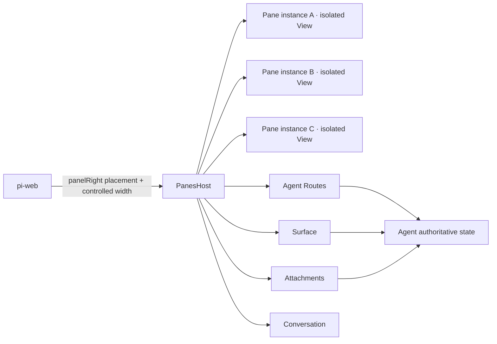
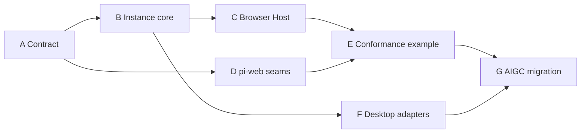

# Isolated Panes 隔离面板地基设计(Isolated Panes Foundation)

> 状态:设计定稿(2026-07-23,转写自 [`docs/isolated-panes/`](./isolated-panes/README.md) 三篇:路线图 · [实施方案](./isolated-panes/implementation-design.md) · [并行计划](./isolated-panes/parallel-work-plan.md))
> 对应 spec:`.kiro/specs/isolated-panes/`
> 定位:建立**领域中立**的 `pane` 运行地基——Agent 声明可多开的 Pane,pi-web 只提供右侧 placement、会话能力与连续宽度,每个 Pane 实例运行在独立 iframe 或 Tauri WebView 中。
> 地基不绑定 AIGC、Canvas、文件或编辑器;`examples/panes-agent` 是一致性范例,AIGC 页面迁移在地基验收后进行。

---

## 0. TL;DR

- **一个 Tab 一个 `PaneInstance` 一个独立 JS Realm**;`paneId` 标识设计、`instanceId` 标识运行实例、`epoch` 标识一次装载,授权绑定三者。同一 `PaneDefinition` 按 `allowMultiple/maxInstances` 多开。
- **Guest 只持有 `PanePort`**,不持有宿主对象、会话凭据或任意 URL 访问能力。权限默认拒绝,按 Agent Route、HTTP method、Surface key/action、附件、Conversation 分项授予。
- **数据面复用既有链路**:Surface 传小而热的镜像;正文和 mutation 走 Agent Routes;二进制走附件系统;显式进入 LLM 走 Conversation。`frame-rpc` 不是依赖——Pane 内部隔离通信用 `MessageChannel` 或原生 IPC relay。
- **双宿主一套契约**:Browser 与 Tauri 复用同一 contract、Guest SDK 和 conformance suite,只替换 View/transport adapter(Electron 壳已由 spec electron-to-tauri 移除)。
- **安全边界不在 React**:Provider/HOC 只约束作者接口,边界始终是独立 View、一次性端口、schema 与 grant。
- **LLM 可遥控标签页**:`pane_list/pane_open/pane_activate/pane_close/pane_reload` 五个基础工具经 surface domain `panes-workspace` 下发意图日志,宿主增量应用并回声实况;工作区权威仍在宿主(见 §5.5)。
- **Pane 自带 tools**:每 pane 一个 `PaneAgentModule`(元信息 + extensions + routes),`composePaneAgentModules` 一次合并、装配时校验 route 覆盖;agent 注册即用,无需逐 pane 适配(见 §5.6)。
- **地基优先**:先冻结并实现通用地基(Wave 0–4),AIGC 迁移(Wave 5)不得早于 Browser、pi-web seam 和一致性范例验收。

---

## 1. 目标与不变量

### 1.1 目标

建立领域中立的 `pane` 运行地基。Agent 声明可多开的 Pane;pi-web 只提供右侧 placement、会话能力与连续宽度;每个 Pane 实例运行在独立 iframe 或 Tauri WebView 中。

地基不绑定 AIGC、Canvas、文件或编辑器。`examples/panes-agent` 是一致性范例;AIGC 页面迁移在地基验收后进行。

### 1.2 九条不变量

1. 一个 Tab 对应一个 `PaneInstance`,一个实例对应一个独立 JS Realm。
2. `paneId` 标识设计,`instanceId` 标识运行实例,`epoch` 标识一次装载;授权绑定三者。
3. 同一 `PaneDefinition` 可按 `allowMultiple/maxInstances` 多开;关闭实例立即撤销端口。
4. Guest 只持有 `PanePort`,不持有宿主对象、会话凭据或任意 URL 访问能力。
5. 权限默认拒绝,并按 Agent Route、HTTP method、Surface key/action、附件、Conversation 分项授予。
6. Surface 传小而热的镜像;正文和 mutation 走 Agent Routes;二进制走附件系统。
7. Browser 与 Tauri 复用同一 contract、Guest SDK 和 conformance suite,只替换 View/transport adapter。
8. `frame-rpc` 不是依赖。Pane 内部隔离通信使用 `MessageChannel` 或原生 IPC relay;Agent 数据面使用现有 Agent Routes、Surface、附件与 Conversation。
9. React Provider/HOC 约束作者接口,但安全边界始终是独立 View、端口、schema 与 grant。

## 2. 三层边界



### 2.1 pi-web

- WebExt 把一个 `PanesHost` 根组件放入 `panelRight`。
- `config.panelWidth` 存在时,ChatApp 持有宽度状态并接入 PiChat 已有的 `panelWidth/onPanelWidthChange` 连续拖拽。
- 不解释 Pane、Canvas、文件或业务消息。

### 2.2 Agent

- 声明 Panes、实例上限和能力白名单。
- 持有 Agent Route handlers、Surface、附件元数据及 LLM 可见工具。
- 业务写入采用 schema 校验、revision CAS 和 change journal。

### 2.3 Pane Host / Guest

- Host 管理实例、Tab、epoch、View、端口、授权和能力代理。
- Guest 通过 `PaneGuestProvider/usePaneGuest` 使用窄接口。
- Pane 内的 Dialog、路由、局部状态和复杂布局均属于 Pane 自身。

## 3. 公开契约

### 3.1 公开入口与核心定义

公开入口:

```ts
import {
  definePanes,
  definePaneDefinition,
  connectPaneGuest,
} from "@blksails/pi-web-panes-kit";
import {
  PanesHost,
  PaneGuestProvider,
  usePaneGuest,
  withPaneGuest,
} from "@blksails/pi-web-panes-kit/react";
```

核心定义:

```ts
interface PanesDefinition {
  id: string;
  panes: PaneDefinition[];
  initialPaneIds?: string[];
  maxOpenPanes: number;
}

interface PaneDefinition {
  id: string;
  title: string;
  icon?: string;
  document:
    | { kind: "inline"; srcDoc: string }
    | { kind: "html"; src: string };
  capabilities: PaneCapabilities;
  allowMultiple: boolean;
  maxInstances: number;
  lifecycle: {
    keepAlive: boolean;
    suspendWhenHidden: boolean;
  };
}

interface PaneInstance {
  instanceId: string;
  paneId: string;
  epoch: number;
  state: "creating" | "connecting" | "ready" | "hidden" | "failed" | "disposed";
}
```

`definePanes` 负责 schema、唯一 ID、初始 Pane 和多开约束验证。默认 `allowMultiple=false`、`maxInstances=1`、`maxOpenPanes=16`。

### 3.2 实例模型

`createPaneWorkspace/reducePaneWorkspace` 是无框架纯状态机:

- `open`:若允许多开,创建新 `instanceId`;否则激活既有实例。
- `activate`:只改变可见实例,兄弟实例保持独立运行。
- `move`:只重排实例,不改变授权或 Realm。
- `reload`:`epoch++`,旧端口关闭,新 View 重新握手。
- `close`:发送 `closing`、撤销订阅和端口,再选中相邻实例。

Tab 的 key 必须是 `instanceId:epoch`,禁止用 `paneId` 作为运行实例 key。

### 3.3 消息协议

Guest 请求只有五种:

```ts
type PaneGuestRequest =
  | { type: "pane:request"; requestId: string; operation: "route.query"; route: string; query?: Record<string, string> }
  | { type: "pane:request"; requestId: string; operation: "route.mutate"; route: string; body: unknown }
  | { type: "pane:request"; requestId: string; operation: "surface.run"; domain: string; action: string; args?: unknown }
  | { type: "pane:request"; requestId: string; operation: "attachment.put"; name: string; mimeType: string; bytes: ArrayBuffer }
  | { type: "pane:request"; requestId: string; operation: "conversation.submit"; text: string; attachmentIds?: string[] };
```

Host 下行只有 `pane:connected`、`pane:result`、`pane:surface`、`pane:lifecycle`。协议不暴露 fetch、文件系统、shell、React context 或 pi-web 内部 client。

错误码:`INVALID_MESSAGE`、`STALE_INSTANCE`、`CAPABILITY_DENIED`、`PAYLOAD_TOO_LARGE`、`REVISION_CONFLICT`、`ROUTE_FAILED`、`ATTACHMENT_FAILED`、`HOST_UNAVAILABLE`、`REQUEST_TIMEOUT`。

### 3.4 授权

```ts
interface PaneCapabilities {
  routes: Array<{
    name: string;
    methods: Array<"GET" | "POST">;
    maxRequestBytes?: number;
    maxResponseBytes?: number;
  }>;
  surfaceKeys: string[];
  surfaceCommands: Array<{ domain: string; actions: string[] }>;
  attachments: "none" | "read" | "read-write";
  conversation: "none" | "submit";
}
```

Host 只使用已装载 `PaneDefinition` 的 grant。Guest 自报的 paneId、route、method、domain、action 或 attachmentId 不产生权限。Agent Route handler 必须再次做领域校验,形成两层边界。

默认限制:普通请求 256 KiB、响应 2 MiB、附件 8 MiB;定义可在安全上限内收窄或放宽 route 限额。

## 4. 宿主实现

### 4.1 Browser Host

1. iframe 使用 `sandbox="allow-scripts"`,不启用 same-origin、表单、弹窗、下载和顶层导航。
2. Guest 注册首次 window message 监听,并发送 `pane:ready`。
3. Host 以 iframe `load` 和 `pane:ready` 双触发建立一次性 `MessageChannel`;相同 epoch 幂等。
4. Guest 只接受 `event.source === parent`、协议版本匹配且 paneId 匹配的连接。
5. 后续业务只走专属 port,不走 window message。
6. reload、close、导航或销毁时关闭旧 port;旧 epoch 请求返回 `STALE_INSTANCE` 或自然失联。

opaque-origin iframe 无法依赖精确 origin,故边界由 `event.source`、sandbox、一次性 port、schema 和 grant 共同构成。

### 4.2 Desktop(Tauri)

核心只定义:

```ts
interface PanePort {
  post(message: PaneHostMessage, transfer?: readonly Transferable[]): void;
  listen(listener: (message: unknown) => void): () => void;
  close(): void;
}

interface PaneViewAdapter<TMount> {
  mount(target: TMount): Promise<PaneViewHandle> | PaneViewHandle;
}
```

Desktop 中继(panes-kit `src/adapters/`)已落地:信封 `PaneRelayEnvelope { instanceId, epoch, message }` 原样透传;宿主侧 `createRelayPanePort` 按 `instanceId+epoch` 绑定并过滤(`pane:ready` 握手前以 epoch 0 放行);Guest Realm 侧 `createPaneGuestRealmBridge` 在 Guest Realm 内重建「window 握手 + MessageChannel」,`connectPaneGuest` 零改动。Tauri adapter(`adapters/tauri.ts` + `adapters/tauri-bootstrap.ts`)经注入的 invoke/listen/createPaneWebview 原语工作,不硬依赖 @tauri-apps/api;`desktop/src-tauri/src/pane_relay.rs` 四命令(`pane_relay_bind/unbind/to_guest/to_host`)只转同一 envelope——绑定 epoch 单调、解绑须 epoch 匹配、上行按 webview 标签鉴权;`capabilities/panes.json` 把 `pane-*` webview 收窄到事件监听 + 上行中继,文档协议白名单在 mount 即拒。(Electron 壳已由 spec electron-to-tauri 移除;中继原语保持宿主中立,第三方 Electron 壳可以 preload 装 `createPaneGuestRealmBridge` 复现同一语义。)

## 5. pi-web 能力接缝

### 5.1 通道选择

| 数据 | 通道 | 例子 |
|---|---|---|
| 高频轻状态 | Surface | revision、dirty、任务进度、资产引用 |
| 冷数据和 mutation | Agent Routes | 文件正文、Diff、领域写入 |
| 二进制 | Attachments | 图片、视频、导出物 |
| 显式进入 LLM | Conversation | "解释当前 Diff" |
| View 内部隔离通信 | PanePort | Guest 请求、结果、生命周期、Surface 镜像 |

PanePort 不提供任意 URL、任意 HTTP method、任意宿主函数或远程代码执行入口。

### 5.2 Agent Routes adapter

标准地址:

```text
GET  {baseUrl}/sessions/{sessionId}/agent-routes/{route}
POST {baseUrl}/sessions/{sessionId}/agent-routes/{route}
```

adapter 必须:

- 编码 sessionId/route/query;限制 request/response 体积;只接收 JSON。
- 保留成功 body,不假定具体领域 envelope。
- 将 `SESSION_NOT_FOUND` 映射为 `HOST_UNAVAILABLE` 和「当前会话已失效,请重新打开 Agent 会话」。
- 对会话创建后、runner 声明帧到达前的 `ROUTE_NOT_FOUND` 做有界指数退避;只重试该 readiness 错误,不重放失效会话或任意 4xx。
- 将 409/`REVISION_CONFLICT` 映射为可处理冲突。
- 其余失败映射 `ROUTE_FAILED`,保留 status/retryable。

Host 不能自动把 mutation 重放到另一个会话;会话失效必须显式提示,避免跨会话误写。

### 5.3 Surface、附件与 Conversation

Host 只订阅 grant 中的 `surfaceKeys`,把最新值推到对应实例。Guest 的 Surface proxy 维护本地镜像并实现 `getState/subscribe/hasCommand/run`;`run` 仍需逐 action 授权。

附件上传由 Host 把 `ArrayBuffer` 还原为 File 后调用 pi-web 注入的 upload;Guest 只得到 `attachmentId/displayUrl`。Conversation 只有显式用户动作可调用,不用于后台同步。

### 5.4 panelRight 连续宽度

WebExt 通用配置:

```ts
config: {
  panelWidth: 760,
  minPanelWidth: 420,
  maxPanelWidth: 1280,
}
```

ChatApp 以 `panelWidth` 初始化本地状态,传给 PiChat,并把 `onPanelWidthChange` 回写同一状态。存在 `panelWidth` 时启用 PiChat 已有连续拖拽分隔条并隐藏离散比例切换器;未声明时继续使用 `panelRatio`,保证普通 WebExt 零回归。

Pane/Panes 不感知 placement 宽度,也不自行监听宿主鼠标事件。

### 5.5 LLM 工作区遥控(panes-workspace)

LLM 经基础工具操作 pane 标签页;工作区状态权威**仍在宿主**(本地 reducer,用户点击零延迟、无会话可用),不改为全 agent 权威。取「宿主权威 + agent 意图日志 + 回声」的双向 CQRS:

- **契约**:`packages/panes-kit/src/workspace-protocol.ts`(node 安全子入口 `@blksails/pi-web-panes-kit/workspace-protocol`)。surface domain `panes-workspace`;下行快照 `{revision, ops[], report?}`,`ops` 为单调 `opId` 的意图日志(窗口 32);上行 surface 命令 `report` 回声实况 `{appliedOpId, panes[](目录/配额), instances[], activeInstanceId}`。
- **宿主桥**:`PanesHost` 内置(prop `workspaceDomain`,默认 `panes-workspace`,`false` 关闭)。订阅 `surface:<domain>` 增量应用 ops;首帧取基线不重放历史,`opId` 回退(agent 重启)自动再基线;快照粘性重放天然幂等。回声内容去重、best-effort,agent 未发布该 domain 时零噪声。
- **agent 侧**:`@blksails/pi-web-tool-kit/runtime` 的 `panesWorkspaceExtension`(`makePanesWorkspaceExtension` 可配 domain/超时)。注册工具 `pane_list` / `pane_open` / `pane_activate` / `pane_close` / `pane_reload`;写工具有界等待回声(默认 5s),超时降级返回并提示用 `pane_list` 复查。`activate/close/reload` 支持 `instanceId` 精确或 `paneId` 便捷定位。

### 5.6 Pane 自带 tools(PaneAgentModule)

「pane 的工具打包进 kit,agent 注册即用」的形式受 pi 原生支持:工具以 ExtensionFactory 发布(先例 `canvasSurfaceExtension`/`aigcExtension`),agent 列进 `extensions:` 即可。补强的是**绑定与防漂移**:

- **形状**:`@blksails/pi-web-tool-kit/runtime` 的 `PaneAgentModule { pane(元信息), extensions?, routes? }` 与 `composePaneAgentModules(modules) → { extensions, routes }`。合并规则:pane capability 声明的 route 名必须被某模块提供否则装配抛错;同名 route 非同一引用即冲突;extension 恒等去重(多 pane 共享域扩展只装一次)。
- **双侧同源**:pane 元信息(id/标题/配额/capabilities)放 web-safe 文件(类型经 node 安全子入口 `@blksails/pi-web-panes-kit/contract`);web 侧展开成完整定义(注入 document/lifecycle),agent 侧交 composer 校验——agent 不引 srcDoc 产物,web 不引 pi SDK。
- **范例**:`examples/panes-agent` 的 `pane-meta.ts`(单一事实源)+ `panes-modules.ts`(每 pane 一模块;Canvas pane 自带 canvas/AIGC/vision 工具)+ 入口一次 `composePaneAgentModules`。新增 pane = 加一个 module,一行接入。
- **Wave 5 载体**:AIGC 迁移按此模式落地——每个业务域 pane(素材/画布/任务/历史)自带其 extensions 与 routes 入 kit,业务 agent 组装即用。

## 6. 包结构与范例

### 6.1 包与范例布局

```text
packages/panes-kit/
├─ src/
│  ├─ contract.ts          # descriptors, envelopes, errors
│  ├─ instances.ts         # multi-instance/epoch workspace model
│  ├─ authorization.ts     # default-deny grants and limits
│  ├─ agent-routes.ts      # typed HTTP adapter and error mapping
│  ├─ guest.ts             # framework-neutral Guest SDK
│  ├─ host-ports.ts        # MessagePort/native relay common seam
│  └─ react/
│     ├─ panes-host.tsx    # iframe host and multi-open tabs
│     └─ pane-guest.tsx    # Provider, hook, HOC
└─ test/

examples/panes-agent/
├─ index.ts                # Agent extensions, routes, LLM inspector
├─ panes-state.ts          # example domain state
├─ routes/pane-data.ts
├─ web/                    # author source
└─ .pi/web/dist/           # compiled WebExt artifact only
```

### 6.2 Canvas 复用

Canvas Pane 直接复用 `@blksails/pi-web-canvas-ui` 的 `CanvasPanel`,在自己的 iframe 中装载。Guest SDK 将 PanePort 适配为:

- `WebExtSurfaceAccess` → `surface:canvas` 与明确 action grants;
- `UploadFn` → `attachment.put`;
- `ConversationAccess` → `conversation.submit`。

Agent 同时装载现有 `canvasSurfaceExtension`、AIGC 与 vision extensions。Panes 地基不定义 Canvas schema、不复制 Canvas reducer、不绘制替代画布。

多个 Canvas Tab 是多个独立 UI/JS Realm;它们可观察同一 Agent 权威 `surface:canvas`。若业务需要每实例独立 Canvas 文档,应在 Canvas 领域增加 documentId,而不是让宿主复制领域状态。

## 7. 交付计划

### 7.1 原则与轨道

先冻结并实现通用地基,再迁移 AIGC。业务范例只用于验证公开接口,不能成为第二套 Host core。每一波必须可独立审核、测试和回滚。

| 轨道 | 产物 | 边界 |
|---|---|---|
| A Contract | schema、grants、errors、limits | 无 React、无业务词 |
| B Instance core | multi-open、epoch、lifecycle | 无 DOM、无 pi-web |
| C Browser Host | iframe、MessageChannel、React Host/Guest | 无业务 reducer |
| D pi-web seam | Agent Routes、Surface、附件、Conversation、连续宽度 | 不解释 Pane 领域 |
| E Conformance example | files/editor/diff/Canvas/artifact | 只消费公开包 |
| F Desktop | Tauri adapter + Rust relay | 不分叉 Guest API |
| G AIGC migration | 原型 UI/UX 与领域业务 | 不修改地基契约绕过审核 |



### 7.2 波次(F0–F5 / Wave 0–5)

**Wave 0 · 契约冻结(F0 契约与安全核)**

- 建立 `packages/panes-kit`;完成 descriptors、grants、envelopes、错误码、payload 上限与纯实例 reducer(多实例、active、reorder、reload/epoch、close/dispose)。
- 审核门:公开契约无 Canvas/files/AIGC 词;重复 ID、越权、过大载荷、旧 epoch、未知消息均拒绝;默认拒绝测试通过。

**Wave 1 · Browser 竖切(F1 Browser Host)**

- sandbox iframe、一实例一 `MessageChannel`、ready/load 双握手;`PanesHost` 支持多开、切换、拖排、关闭、空工作区恢复;Guest SDK + React Provider/hook/HOC。
- 审核门:同类型三个实例同时存活,端口和 Realm 不共享;关闭或 reload 后旧端口不可用。

**Wave 2 · pi-web 接缝(F2 能力与 placement)**

- Agent Routes、Surface、Attachments、Conversation adapters;`panelWidth/minPanelWidth/maxPanelWidth` 接入现有连续拖拽。
- 审核门:无 Panes 的 Agent 零行为变化;普通 WebExt 零回归;route 装配窗口有界重试,失效会话返回结构化 `HOST_UNAVAILABLE`,不显示裸 HTTP 404。

**Wave 3 · 一致性范例(F3 范例与现有能力复用)**

- `panes-agent` 删除 Agent-local Host core,只消费公开包;文件/编辑/Diff/Artifact 验证 Agent Routes;Canvas iframe 直接消费现有 Canvas UI/Surface/附件/Conversation。
- 审核门:示例构建、Agent Route、Canvas、multi-open 和布局测试通过;Canvas 无平行实现,同类型 Pane 可多开。

**Wave 4 · Desktop(F4 Desktop adapters)**

- 共用中继原语与 Guest Realm 引导;Tauri WebView adapter 与 Rust relay;双宿主(browser-iframe/tauri-webview)共用 conformance fixture。
- 审核门:同一 Guest fixture、授权和生命周期套件跨双宿主通过;生命周期、授权、错误和崩溃隔离语义一致。

**Wave 5 · AIGC 迁移(F5)**

- 按素材、Canvas、任务、历史等领域拆 Pane;恢复原型 Tab、Dialog、侧栏和工作流;HTTP 全部转 Agent Routes,媒体转附件引用,热态转 Surface。
- 审核门:视觉回归、业务闭环、双宿主隔离与 LLM 同源状态全部通过;不反向污染 Panes 地基。

### 7.3 PR 切分与合并纪律

| PR | 内容 | 审核证据 |
|---|---|---|
| Foundation-1 | Contract + instance core + security tests | 纯 package 测试 |
| Foundation-2 | Browser Host + Guest SDK | iframe conformance/e2e |
| Foundation-3 | pi-web seams + controlled width | protocol/UI/integration tests |
| Foundation-4 | panes-agent canonical examples | isolated build + route/surface tests |
| Desktop-1 | Tauri adapter + Rust relay | cargo 单测 + 双宿主 conformance |
| AIGC-* | 按业务 Pane 迁移 | 每 Pane 视觉和数据闭环 |

合并纪律:

- A 独占公开契约;其他轨道通过 fixture 提需求。
- B/C 不修改业务状态;D 不修改实例状态机;E 不复制 Host core。
- Canvas 变更归 Canvas 领域;Panes 只提供能力代理。
- Desktop 只替换 adapter,不增加 Guest 专属 API。
- AIGC migration 不得早于 Browser、pi-web seam 和一致性范例验收。

### 7.4 每波验证顺序

```text
contract/typecheck
→ instance/security tests
→ adapter conformance
→ Agent Route + Surface integration
→ webext isolated build
→ app typecheck/build
→ browser e2e
→ desktop e2e(相关波次)
```

"显示了 iframe"不构成交付;多实例、隔离、授权、错误语义、连续拖拽和数据一致性必须同时成立。

## 8. 测试门与总体验收

### 8.1 测试门

- Contract:schema、重复 ID、默认值、版本、非法 envelope。
- Instance:同类型多开、上限、activate/move/reload/close、epoch。
- Security:route/method/action 越权、体积、旧端口、跨实例结果。
- Route:成功、SESSION_NOT_FOUND、冲突、非 JSON、超大响应。
- Browser:三个同类型 iframe 同时存在且端口隔离。
- Canvas:构建产物包含 canonical Canvas UI,Surface/附件/Conversation 通过 Guest proxy。
- Layout:配置声明连续宽度后,PiChat 拖拽回调持续更新。
- Regression:无 Panes、无 panelWidth、普通 WebExt 行为不变。
- Desktop:同一 conformance fixture 在 iframe 与 Tauri adapter 通过。

### 8.2 总体验收门

- 同一类型 Pane 至少可多开三个实例;每个实例有独立 iframe/WebView、端口和 epoch。
- panelRight 可连续拖拽,宽度由宿主受控,离散比例模式保持向后兼容。
- 404 不再退化为 `Agent Route HTTP 404`;`SESSION_NOT_FOUND` 映射为明确的会话失效错误。
- Canvas 使用项目既有 Canvas UI/Surface/附件/Conversation 链路。
- 普通 Agent、普通 WebExt 和无 panelRight 页面无回归。
- 文档、类型、契约测试、示例构建和双宿主 conformance 能独立指导第三方接入。
