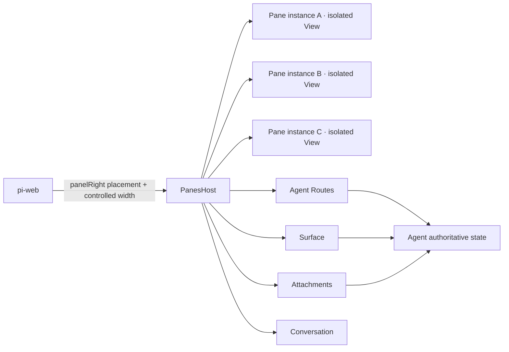

# Isolated Panes 地基路线图

## 1. 目标

建立领域中立的 `pane` 运行地基。Agent 声明可多开的 Pane；pi-web 只提供右侧 placement、会话能力与连续宽度；每个 Pane 实例运行在独立 iframe、Electron `WebContentsView` 或 Tauri WebView 中。

地基不绑定 AIGC、Canvas、文件或编辑器。`examples/panes-agent` 是一致性范例；AIGC 页面迁移在地基验收后进行。

## 2. 不变量

1. 一个 Tab 对应一个 `PaneInstance`，一个实例对应一个独立 JS Realm。
2. `paneId` 标识设计，`instanceId` 标识运行实例，`epoch` 标识一次装载；授权绑定三者。
3. 同一 `PaneDefinition` 可按 `allowMultiple/maxInstances` 多开；关闭实例立即撤销端口。
4. Guest 只持有 `PanePort`，不持有宿主对象、会话凭据或任意 URL 访问能力。
5. 权限默认拒绝，并按 Agent Route、HTTP method、Surface key/action、附件、Conversation 分项授予。
6. Surface 传小而热的镜像；正文和 mutation 走 Agent Routes；二进制走附件系统。
7. Browser、Electron、Tauri 复用同一 contract、Guest SDK 和 conformance suite，只替换 View/transport adapter。
8. `frame-rpc` 不是依赖。Pane 内部隔离通信使用 `MessageChannel` 或原生 IPC relay；Agent 数据面使用现有 Agent Routes、Surface、附件与 Conversation。
9. React Provider/HOC 约束作者接口，但安全边界始终是独立 View、端口、schema 与 grant。

## 3. 三层边界



### pi-web

- WebExt 把一个 `PanesHost` 根组件放入 `panelRight`。
- `config.panelWidth` 存在时，ChatApp 持有宽度状态并接入 PiChat 已有的 `panelWidth/onPanelWidthChange` 连续拖拽。
- 不解释 Pane、Canvas、文件或业务消息。

### Agent

- 声明 Panes、实例上限和能力白名单。
- 持有 Agent Route handlers、Surface、附件元数据及 LLM 可见工具。
- 业务写入采用 schema 校验、revision CAS 和 change journal。

### Pane Host / Guest

- Host 管理实例、Tab、epoch、View、端口、授权和能力代理。
- Guest 通过 `PaneGuestProvider/usePaneGuest` 使用窄接口。
- Pane 内的 Dialog、路由、局部状态和复杂布局均属于 Pane 自身。

## 4. 包与范例

```text
packages/panes-kit/
├─ src/
│  ├─ contract.ts          # descriptors, envelopes, errors
│  ├─ instances.ts         # multi-instance/epoch workspace model
│  ├─ authorization.ts     # default-deny grants and limits
│  ├─ agent-routes.ts      # typed HTTP adapter and error mapping
│  ├─ guest.ts             # framework-neutral Guest SDK
│  ├─ host-ports.ts        # MessagePort/native relay common seam
│  └─ react/
│     ├─ panes-host.tsx    # iframe host and multi-open tabs
│     └─ pane-guest.tsx    # Provider, hook, HOC
└─ test/

examples/panes-agent/
├─ index.ts                # Agent extensions, routes, LLM inspector
├─ panes-state.ts          # example domain state
├─ routes/pane-data.ts
├─ web/                    # author source
└─ .pi/web/dist/           # compiled WebExt artifact only
```

Canvas Pane 直接复用 `@blksails/pi-web-canvas-ui` 的 `CanvasPanel`，并在自己的 iframe 内通过 Guest SDK 代理现有 Canvas Surface、附件和 Conversation；不在 Panes 地基重做 Canvas。

## 5. 通道选择

| 数据 | 通道 | 例子 |
|---|---|---|
| 高频轻状态 | Surface | revision、dirty、任务进度、资产引用 |
| 冷数据和 mutation | Agent Routes | 文件正文、Diff、领域写入 |
| 二进制 | Attachments | 图片、视频、导出物 |
| 显式进入 LLM | Conversation | “解释当前 Diff” |
| View 内部隔离通信 | PanePort | Guest 请求、结果、生命周期、Surface 镜像 |

PanePort 不提供任意 URL、任意 HTTP method、任意宿主函数或远程代码执行入口。

## 6. 交付顺序

### F0 · 契约与安全核

- descriptors、grants、envelopes、错误码、payload 上限。
- 多实例、active、reorder、reload/epoch、close/dispose 纯状态模型。
- 验收：重复 ID、越权、过大载荷、旧 epoch、未知消息均拒绝。

### F1 · Browser Host

- sandbox iframe、一实例一 `MessageChannel`、ready/load 双握手。
- 多开、切换、拖排、关闭、空工作区恢复。
- 验收：同类型三个实例同时存活，端口和 Realm 不共享。

### F2 · pi-web 能力与 placement

- Agent Routes、Surface、Attachments、Conversation adapters。
- `panelWidth/minPanelWidth/maxPanelWidth` 接入现有连续拖拽。
- 验收：无 Panes 的 Agent 零行为变化；route 装配窗口有界重试，失效会话返回结构化 `HOST_UNAVAILABLE`。

### F3 · 范例与现有能力复用

- `panes-agent` 只消费公开包。
- 文件/编辑/Diff/Artifact 验证 Agent Routes；Canvas 验证现有 Canvas Surface 与 UI。
- 验收：Canvas 无平行实现，同类型 Pane 可多开。

### F4 · Desktop adapters

- Electron `WebContentsView` 与 Tauri WebView 实现 `PaneViewAdapter` 和原生 relay。
- 验收：同一 Guest fixture、授权和生命周期套件跨三宿主通过。

### F5 · AIGC 迁移

- 按原型拆分业务 Pane，恢复侧栏、Tab、Dialog 和工作流。
- HTTP 全部转 Agent Routes，媒体转附件引用，热态转 Surface。
- 验收：UI/UX 与业务闭环恢复，同时不反向污染 Panes 地基。

## 7. 总体验收门

- 同一类型 Pane 至少可多开三个实例；每个实例有独立 iframe/WebView、端口和 epoch。
- panelRight 可连续拖拽，宽度由宿主受控，离散比例模式保持向后兼容。
- 404 不再退化为 `Agent Route HTTP 404`；`SESSION_NOT_FOUND` 映射为明确的会话失效错误。
- Canvas 使用项目既有 Canvas UI/Surface/附件/Conversation 链路。
- 普通 Agent、普通 WebExt 和无 panelRight 页面无回归。
- 文档、类型、契约测试、示例构建和三宿主 conformance 能独立指导第三方接入。
