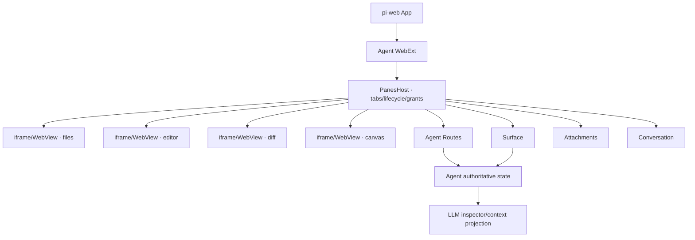

# Panes 强隔离面板完整实施方案

## 1. 设计边界

Panes 是 Agent 提供的面板化工作区。它在首版固定显示于页面右侧，但位置只属于 placement adapter，不进入面板协议。核心协议只描述面板、实例、能力和生命周期。

Panes 不替代 WebExt、Surface、Agent Routes、附件和 Conversation。它只把这些已有能力收窄后交给独立 Guest。

## 2. 运行架构



Host 不解析面板正文。它只验证 envelope、当前实例、grant、method、载荷大小和会话绑定，然后调用已有能力。

## 3. 文件组织

### 3.1 可运行范例

```text
examples/panes-agent/
├─ index.ts
│  ├─ defineAgent
│  ├─ panesSurfaceExtension
│  ├─ inspect_panes tool
│  └─ routes
├─ panes-state.ts
│  ├─ authoritative state
│  ├─ revision / change journal
│  └─ read/mutate projections
├─ panes-extension.ts
├─ routes/
│  ├─ index.ts
│  └─ pane-data.ts
├─ build.ts
├─ package.json
├─ README.md
├─ web/                        # 作者源码
│  ├─ web.config.tsx           # config.panes.interactionMode
│  ├─ panes-host.tsx
│  ├─ pane-types.ts
│  └─ panes/
│     ├─ index.ts
│     ├─ files.tsx
│     ├─ editor.tsx
│     ├─ diff.tsx
│     ├─ canvas.tsx
│     └─ artifact.tsx
└─ .pi/web/dist/               # 仅编译产物
   ├─ manifest.json
   └─ web-extension.mjs
```

### 3.2 地基包目标结构

```text
packages/panes-kit/
├─ src/
│  ├─ contract.ts              # descriptors, grants, envelopes, errors
│  ├─ host-controller.ts       # framework-neutral lifecycle
│  ├─ grant-evaluator.ts       # default-deny authorization
│  ├─ payload-limits.ts
│  ├─ guest.ts                 # Guest SDK
│  ├─ react/
│  │  ├─ panes-host.tsx
│  │  └─ define-pane.ts
│  └─ adapters/
│     ├─ iframe.ts
│     ├─ electron.ts
│     └─ tauri.ts
└─ test/
   ├─ contract.test.ts
   ├─ security.test.ts
   └─ conformance.ts
```

范例先以 Agent-local 代码证明边界；稳定后将领域无关部分原样提升到 `panes-kit`。

## 4. 面板契约

### 4.0 交互模式配置

`web.config.tsx` 的 Agent-local `config.panes.interactionMode` 取 `"standard" | "advanced"`。它只改变 PanesHost 与 Guest 的交互密度，不改变授权、隔离、Agent Routes 或 Surface 语义。高级模式可增加拖拽、菜单、快捷键和复杂布局，但不得扩大 Pane grants。

```ts
export interface PaneDefinition {
  readonly id: string;
  readonly title: string;
  readonly icon?: string;
  readonly document: PaneDocument;
  readonly capabilities: PaneCapabilities;
  readonly lifecycle?: {
    readonly keepAlive?: boolean;
    readonly suspendWhenHidden?: boolean;
  };
}

export interface PaneInstance {
  readonly instanceId: string;
  readonly paneId: string;
  readonly epoch: number;
  readonly state: "creating" | "connecting" | "ready" | "hidden" | "failed" | "disposed";
}
```

`paneId` 标识设计，`instanceId` 标识一次运行实例，`epoch` 标识一次装载。授权绑定三者；导航、重载或崩溃后必须创建新 epoch，旧端口立即失效。

## 5. 消息契约

首版只有六类消息：

```ts
type GuestToHost =
  | { type: "ready"; protocol: 1 }
  | { type: "query"; id: string; route: string; query?: Record<string, string> }
  | { type: "mutate"; id: string; route: string; body: unknown; expectedRevision?: number }
  | { type: "attachment.put"; id: string; name: string; mimeType: string; bytes: ArrayBuffer }
  | { type: "conversation.submit"; id: string; text: string; attachmentIds?: string[] };

type HostToGuest =
  | { type: "connected"; instanceId: string; grants: EffectiveGrants }
  | { type: "result"; id: string; ok: true; data: unknown }
  | { type: "result"; id: string; ok: false; error: PaneError }
  | { type: "surface"; key: string; revision: number; value: unknown }
  | { type: "lifecycle"; state: "visible" | "hidden" | "closing" };
```

实现可把 `query`/`mutate`归并成一个内部 request envelope，但公开语义保持显式，不提供任意 method、任意 URL 或任意宿主函数调用。

### 错误码

`INVALID_MESSAGE`、`STALE_INSTANCE`、`CAPABILITY_DENIED`、`PAYLOAD_TOO_LARGE`、`REVISION_CONFLICT`、`ROUTE_FAILED`、`ATTACHMENT_FAILED`、`HOST_UNAVAILABLE`。

## 6. 握手与生命周期

### Browser

1. Host 创建 `sandbox="allow-scripts"` iframe，不启用 same-origin、表单、弹窗、下载和顶层导航。
2. Host 创建一次性 `MessageChannel`，把 `port2` 转交给当前 iframe。
3. Host 只监听自己的 `port1`，不在 window 上接收后续业务消息。
4. Guest 只接受 `event.source === parent` 的首次连接并取得端口。
5. iframe `load`、导航、崩溃或销毁时关闭旧端口并增加 epoch。

opaque-origin iframe 初始化时不能使用精确 origin，因此安全性来自 `event.source`、一次性端口、sandbox 和无 window 业务监听，而不是伪造精确 `targetOrigin`。

### Electron

- 使用 `WebContentsView`；每个面板独占一个 `webContents`。
- `contextIsolation: true`、`sandbox: true`、`nodeIntegration: false`。
- preload 只暴露 `PanePort`，主进程按 instanceId/epoch 做 relay。
- 拒绝新窗口、任意导航、权限请求和未声明协议。

### Tauri

- 每个面板独占一个 WebView。
- Rust command/event 只承载同一 envelope，scope 绑定 instanceId/epoch。
- allowlist/CSP 仅开放面板需要的资源；Guest 不直接获得文件系统或 shell 能力。

## 7. 授权模型

```ts
export interface RouteGrant {
  readonly name: string;
  readonly methods: readonly ("GET" | "POST")[];
  readonly maxRequestBytes?: number;
  readonly maxResponseBytes?: number;
}

export interface EffectiveGrants {
  readonly routes: readonly RouteGrant[];
  readonly surfaceKeys: readonly string[];
  readonly attachments: "none" | "read" | "read-write";
  readonly conversation: "none" | "submit";
}
```

Host 依据已验签 WebExt、当前 Agent 定义、面板描述符和宿主策略求交集。Guest 自报信息不参与授权。所有未声明能力均拒绝。

## 8. 数据面

### 8.1 Surface：热投影

Surface 快照必须小、可覆盖、可重放：

```ts
interface PanesSnapshot {
  revision: number;
  files: Array<{ path: string; version: number }>;
  dirtyPanes: string[];
  activeJobs: Array<{ id: string; state: string; progress?: number }>;
  recentChanges: Array<{ revision: number; paneId: string; summary: string }>;
}
```

禁止放文件正文、完整 Diff、图片字节、无限日志或编辑器局部光标历史。

### 8.2 Agent Routes：冷读与写入

推荐每个聚合根一个 route，而不是每个 UI 动作一个 route：

```text
GET  pane-data?pane=files
GET  pane-data?pane=editor&path=src/main.ts
GET  pane-data?pane=diff
GET  pane-data?pane=canvas
POST pane-data
```

POST body：

```ts
interface MutationRequest {
  paneId: string;
  operation: string;
  expectedRevision: number;
  payload: unknown;
}
```

handler 必须：

1. 校验 body schema、字符串长度、数组数量和业务权限。
2. 校验 paneId 与 operation 的固定映射。
3. 以 `expectedRevision` 做乐观并发控制。
4. 原子修改权威态，`revision++`，追加 change journal。
5. 发布新的 Surface 摘要。
6. 返回最小 mutation result，不回传整个工作区。

### 8.3 Attachments：二进制

Guest 把 `ArrayBuffer + name + mimeType` 交给 Host。Host 校验面板 grant、大小和 MIME 后调用现有上传能力，向 Guest 返回 `attachmentId`。Agent 权威态只存：

```ts
{ attachmentId: "att_...", role: "canvas-background", name: "draft.png" }
```

读取使用附件系统的会话级 URL/句柄；不得把 base64 写入 Surface、Agent Route JSON 或 change journal。

### 8.4 Conversation：显式进入 LLM

只有用户主动点击“交给 LLM”“解释 Diff”等动作时才使用 Conversation。静默保存不能伪造成聊天消息。

### 8.5 LLM 一致性

Agent 必须提供至少一种同源可见面：

- `inspect_panes` 工具读取权威状态；或
- 每轮开始时注入有上限的 change journal 与 revision。

工具读取优先用于正文；自动上下文只放 revision、变更摘要和附件引用。系统提示要求 LLM 在回答工作区事实前先读取最新 revision。

## 9. 场景映射

| 面板 | Surface | Agent Route GET | Agent Route POST | Attachments |
|---|---|---|---|---|
| 文件管理器 | 文件版本、dirty | 目录分页、元数据 | 新建、重命名、删除 | 可选导入/导出 |
| Code Editor | 当前文档版本、诊断摘要 | 文件正文、symbols | 保存、格式化、patch | 大文件可转附件 |
| Git Diff | 仓库 revision、变更数 | diff 分页、单文件 hunk | 默认无；可显式 stage | patch 导出可用附件 |
| Canvas | 资产计数、选中项、作业进度 | 文档、图层、血缘 | 图层命令、保存、生成任务 | 图片/视频只存 `att_` |

## 10. React 作者接口

```ts
export function definePanes(definition: PanesDefinition): PanesDefinition;

export function definePaneDefinition(pane: PaneDefinition): PaneDefinition;

export function withPanesGuest<T>(App: React.ComponentType<T>): React.ComponentType<T>;
```

HOC 负责连接态、错误边界、主题 token、生命周期和 Guest SDK 注入。它不能绕过 iframe/WebView，也不能把 React component 直接挂入宿主树。

## 11. 安全基线

- 默认拒绝；权限是 route/method/surface-key/attachment/conversation 的显式白名单。
- 每实例独立端口、独立 epoch、独立速率限制和独立错误预算。
- 消息 schema 在 Host 边界校验；未知字段不产生额外能力。
- request/response、附件、日志分别设大小上限；大载荷使用引用。
- Agent Route handler 再做领域权限校验，Host grant 不是唯一防线。
- CSP、sandbox、导航、下载、弹窗、剪贴板、摄像头等按最小权限开启。
- 面板崩溃只替换对应 View；Host 和聊天保持可用。
- 隐藏面板默认继续运行；资源治理策略可按面板声明 suspend/reload。

## 12. 测试矩阵

### Contract

- schema 正反例、协议版本、未知消息、错误归一化。
- instanceId/epoch 重放、重复 request id、端口关闭。

### Security

- 面板越权 route/method/surface key。
- 只读面板发 POST。
- 超大 JSON/ArrayBuffer、伪造 attachmentId、导航后旧端口复用。
- A 面板尝试读取 B 面板结果。

### Consistency

- POST 成功后 route result、Surface revision、LLM inspector 三者一致。
- stale revision 不修改状态。
- Surface 重连回放不携带大正文。

### Adapter conformance

同一 fixture 对 iframe、Electron、Tauri 验证 create/connect/show/hide/reload/crash/dispose 与 grant 行为。

### End-to-end

1. 打开范例 Agent。
2. 四个面板各自加载。
3. 编辑器保存文件。
4. Diff 自动更新。
5. Surface revision 增长。
6. 下一轮 LLM 调用 inspector 并读到新内容。
7. Canvas 上传图片后状态只出现 `att_` 引用。

## 13. 完成定义

- 第三方只看契约、范例和文档即可新增一个独立面板。
- 面板无需知道 pi-web 内部组件、会话 transport 或存储实现。
- Host 不含业务词和业务 reducer。
- 面板写入、其他面板、Surface 和 LLM 最终收敛到同一 revision。
- 浏览器与桌面宿主只替换 adapter，不修改 Guest。
