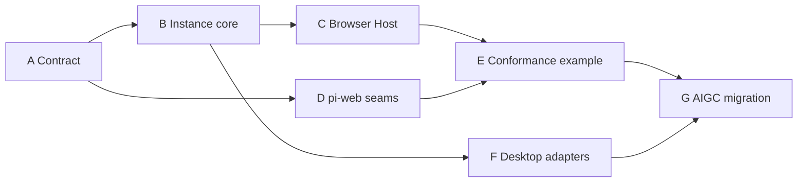

# Isolated Panes 地基优先实施计划

## 1. 原则

先冻结并实现通用地基，再迁移 AIGC。业务范例只用于验证公开接口，不能成为第二套 Host core。每一波必须可独立审核、测试和回滚。

## 2. 轨道

| 轨道 | 产物 | 边界 |
|---|---|---|
| A Contract | schema、grants、errors、limits | 无 React、无业务词 |
| B Instance core | multi-open、epoch、lifecycle | 无 DOM、无 pi-web |
| C Browser Host | iframe、MessageChannel、React Host/Guest | 无业务 reducer |
| D pi-web seam | Agent Routes、Surface、附件、Conversation、连续宽度 | 不解释 Pane 领域 |
| E Conformance example | files/editor/diff/Canvas/artifact | 只消费公开包 |
| F Desktop | Electron/Tauri adapters | 不分叉 Guest API |
| G AIGC migration | 原型 UI/UX 与领域业务 | 不修改地基契约绕过审核 |

## 3. 依赖关系



## 4. 波次

### Wave 0：契约冻结

- 建立 `packages/panes-kit`。
- 完成定义、消息、错误、grant、大小限制和纯实例 reducer。
- 审核门：公开契约无 Canvas/files/AIGC 词；默认拒绝测试通过。

### Wave 1：Browser 竖切

- `PanesHost` 支持同类多开、关闭、拖排、切换、空态。
- 每实例独立 iframe、MessageChannel 和 epoch。
- Guest SDK + React Provider/hook/HOC。
- 审核门：同类型三个实例并存；关闭或 reload 后旧端口不可用。

### Wave 2：pi-web 接缝

- Agent Route adapter 与结构化错误。
- Surface key/action、附件、Conversation 代理。
- WebExt `panelWidth/min/max` → ChatApp 受控状态 → PiChat 现有连续拖拽。
- 审核门：普通 WebExt 零回归；失效 session 不显示裸 HTTP 404。

### Wave 3：一致性范例

- `panes-agent` 删除 Agent-local Host core，改用包。
- 文件/编辑/Diff/Artifact 走 Agent Routes 和 Surface。
- Canvas iframe 直接消费现有 Canvas UI/Surface/附件/Conversation。
- 审核门：示例构建、Agent Route、Canvas、multi-open 和布局测试通过。

### Wave 4：Desktop

- Electron `WebContentsView` adapter 与 preload relay。
- Tauri WebView adapter 与 Rust relay。
- 三宿主共用 conformance fixture。
- 审核门：生命周期、授权、错误和崩溃隔离语义一致。

### Wave 5：AIGC 迁移

- 按素材、Canvas、任务、历史等领域拆 Pane。
- 恢复原型 Tab、Dialog、侧栏和工作流。
- HTTP 改 Agent Routes，媒体改附件引用，热态改 Surface。
- 审核门：视觉回归、业务闭环、三宿主隔离与 LLM 同源状态全部通过。

## 5. PR 切分

| PR | 内容 | 审核证据 |
|---|---|---|
| Foundation-1 | Contract + instance core + security tests | 纯 package 测试 |
| Foundation-2 | Browser Host + Guest SDK | iframe conformance/e2e |
| Foundation-3 | pi-web seams + controlled width | protocol/UI/integration tests |
| Foundation-4 | panes-agent canonical examples | isolated build + route/surface tests |
| Desktop-1 | Electron/Tauri adapters | native conformance |
| AIGC-* | 按业务 Pane 迁移 | 每 Pane 视觉和数据闭环 |

## 6. 合并纪律

- A 独占公开契约；其他轨道通过 fixture 提需求。
- B/C 不修改业务状态；D 不修改实例状态机；E 不复制 Host core。
- Canvas 变更归 Canvas 领域；Panes 只提供能力代理。
- Desktop 只替换 adapter，不增加 Guest 专属 API。
- AIGC migration 不得早于 Browser、pi-web seam 和一致性范例验收。

## 7. 每波验证顺序

```text
contract/typecheck
→ instance/security tests
→ adapter conformance
→ Agent Route + Surface integration
→ webext isolated build
→ app typecheck/build
→ browser e2e
→ desktop e2e（相关波次）
```

“显示了 iframe”不构成交付；多实例、隔离、授权、错误语义、连续拖拽和数据一致性必须同时成立。
