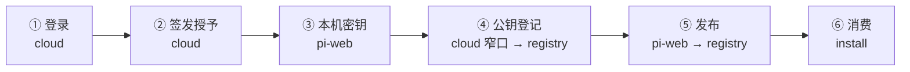

# 真机验证清单 —— 发布链路（P0 + P1 + 密钥 + P2）

> 目的：把「登录 → 拿授予 → 本机签名 → 公钥登记 → 发布 → 消费方装得到」这条链在真实环境跑通一次。
> 每步都写了**该看到什么**与**失败时怎么判别是哪一环** —— 这条链有 6 个环节，
> 不预先分好诊，一旦失败会很难定位（多数失败是**静默降级**，不报错）。

**本清单里的端点、env 名、错误码、失败位置全部经源码核实**，不是凭印象写的。

---

## ⚠️ 动手前必须知道的三件事

### 1. 发布是不可逆的

版本一经登记即**不可改、不可删**（DB 触发器 `registry_version_no_delete` 强制），只能 yank。
**一次失败的登记也会占住那个版本号** —— `registerVersion` 失败会落一条 `failed` 记录。

→ **用一个丢得起的包**，例如 `blksails/smoke-test`，且**每次重试都提版本号**。

### 2. 但不是每种失败都烧版本号

| 失败在哪 | 烧版本号？ | 依据 |
|---|---|---|
| 五道本地前置（kind / org / 密钥 / 公钥登记 / 授予） | ❌ 否 | 零外部写，`createPort` 都没被调用 |
| `uploadBundle` | ❌ 否 | OSS 未配时在此抛 `ValidationError`，**先于** registerVersion |
| `registerVersion` | ✅ **是** | `persistFailed` 落 failed 记录并占住该版本号 |
| `setChannel` | ❌ 否（版本已登记，重试只需移通道） | — |

结果卡片会**如实区分**这两类：登记失败说「请提版本号」，上传失败说「可用同一版本号重试」。

### 3. 只有黑帆科技能发

生产库里只有**黑帆科技**的 `org_name_status = 'configured'`（org = `blksails`），
其余 30 家是 `auto` 占位。未 configured 的企业**拿不到发布授予**，
这是 P0 的刻意门控（占位 org 会永久写进已发布包的标识）。

---

## 第 0 步 · 准备一个丢得起的包

```bash
mkdir -p /tmp/smoke && cd /tmp/smoke
cat > pi-web.json <<'JSON'
{
  "id": "blksails/smoke-test",
  "version": "0.0.1",
  "kind": "plugin",
  "displayName": "Smoke Test",
  "description": "真机验证用，可随时 yank",
  "files": ["index.ts"]
}
JSON
echo '// smoke' > index.ts
```

**id 的前缀必须是 `blksails`** —— 命名空间由企业身份决定，写别的会在本地就被
`PUBLISH_ORG_MISMATCH` 拦下（这是好事，它没花掉任何东西）。

---

## 第 1 步 · 配 env

### apps/registry（dokku app `pi-registry`）

| env | 必需？ | 说明 |
|---|---|---|
| `PI_CLOUDS_REGISTRY_PUBLISH_TOKEN_SECRET` | ✅ **本次新增** | **必须与 apps/cloud 同值** |
| `PI_CLOUDS_REGISTRY_OSS_BUCKET` + `_ACCESS_KEY_ID` + `_ACCESS_KEY_SECRET` + (`_REGION` **或** `_ENDPOINT`) | ✅ | **不是五项全要**：region 与 endpoint **二选一**（公有云给 region，私有 OSS/MinIO 给 endpoint）。条件不满足则整体禁用（不半开），会在 uploadBundle 失败（**不烧版本号**）。启动日志会明说 `[registry] OSS disabled (...)` |
| `PI_CLOUDS_DATABASE_URL` | ✅ | 既有 |
| `PI_CLOUDS_REGISTRY_CONSUME_TOKEN_SECRET` | 既有 | 消费面，与本次无关但别动掉 |

### apps/cloud（dokku app `pi-cloud`）

| env | 必需？ | 说明 |
|---|---|---|
| `PI_CLOUDS_REGISTRY_PUBLISH_TOKEN_SECRET` | ✅ **本次新增** | 与 registry **同值** |
| `PI_CLOUDS_REGISTRY_HTTP_BASE_URL` | ✅ | 必须指向**真实 registry**，**不是** cloud 自己的 `/api/registry` 只读代理面 |
| `PI_CLOUDS_DATABASE_URL` | ✅ | 既有 |

> **两侧不同值会怎样**：cloud 签得出 token、registry 验不过 → 发布返回
> `PUBLISH_REGISTER_FAILED(FORBIDDEN)`。**这一步会烧版本号**，所以第 2 步先单独验它。
>
> **cloud 侧缺 secret 会怎样**：能力快照**省略** `publish` 字段（不抛），
> 于是 `/agent publish` 回到 `PUBLISH_NOT_AVAILABLE` —— 看起来像「没接入」，
> 而不是「配错了」。这是刻意的诚实降级，但排查时要知道。

### 生产现状（2026-07-28 实测，只读 `config:keys`，未打印任何值）

| 项 | pi-registry | pi-cloud |
|---|---|---|
| `PI_CLOUDS_REGISTRY_PUBLISH_TOKEN_SECRET` | ✅ 已配（本次新增） | ✅ 已配（本次新增，**与 registry 同值**，经 sha256 比对确认） |
| OSS | ✅ BUCKET + AK/SK + REGION（满足条件） | — |
| `PI_CLOUDS_REGISTRY_HTTP_BASE_URL` | — | ✅ `https://pi-registry.apps.blksails.cn`（真实 registry，非 cloud 代理面） |

secret 用 `config:set --no-restart` 写入，**尚未生效** —— 下一次部署时随新容器加载。

### ⚠️ 部署拓扑（2026-07-28 实测，踩过才知道）

**别假设"两个应用都从 `main` 部署"。实测三条线各不相同：**

| | dokku deploy branch | 实际推的是什么 |
|---|---|---|
| `pi-registry` | `main` | 本地 `main`（本次推成 `dfb0fd9`，fast-forward，成功） |
| `pi-cloud` | `main` | ★ **`chore/npm-mirror-scope-split` 的某个点** —— 有人把该分支推成了远端的 `main` 引用 |

后果：`git push dokku-cloud main:main` 会被拒（non-fast-forward），**这是对的** ——
强推会抹掉线上 13 个提交。遇到这个拒绝**不要 `--force`**，先查：

```bash
git ls-remote dokku-cloud                       # 远端各 ref 指向
git merge-base --is-ancestor <线上rev> main     # ★ 必须验祖先,不能只 rev-list --count
```

**★ 更根本的一条：本地 `main` 不是团队的集成分支。**
真正的集成点是 GitHub 的 `origin/main`（提交带 PR 编号 `(#NN)`）。
本地 `main` 是一条陈旧分支，上面的东西在 origin 上多已以 squash PR 的形式合过（同内容不同 hash）。
**改动要上线，走 `origin/main` 的 PR，而不是往本地 `main` 合。**

判别方法：

```bash
git rev-list --left-right --count origin/main...main   # 两边都非零 = 已分叉
git log --oneline -1 origin/main                       # 带 (#NN) 的才是集成分支
```

### 部署

```bash
cd ~/Projects/BlackSail/agents/pi-clouds
# ★ 剥代理（走代理会慢到撑爆超时并留下部署锁）
env -u http_proxy -u https_proxy -u ALL_PROXY git push dokku-registry main:main
env -u http_proxy -u https_proxy -u ALL_PROXY git push dokku-cloud     main:main
```

- 部署分支是 **`main`**；推 `main:master` 只更新引用**不触发构建**。
- 构建常 >10 分钟，**放后台跑**。
- ★ `git push` 后面**不要**接 `&& echo ok` —— 会覆盖退出码，失败看不出来。

---

## 第 2 步 · 先单独验「registry 认不认 publish token」

**这一步不经 pi-web，也不发任何包** —— 目的是把「registry 认不认」与「cloud 签得对不对」
拆开。这正是上一轮发现的那个缺口所在的位置（校验器造好了但没接进装配）。

```bash
cd ~/Projects/BlackSail/agents/pi-clouds
# 用与生产同值的 secret 自己签一枚
PI_CLOUDS_REGISTRY_PUBLISH_TOKEN_SECRET='<同 registry 的值>' \
node --experimental-strip-types -e '
import("./packages/registry-client/src/ports/publish-token.ts").then(m => {
  console.log(m.signPublishToken(
    { companyId: "1", publisherId: "pub-1", org: "blksails" }, {}, process.env));
});'
```

拿到 token 后打一个**需要发布身份**的只读端点最省事 —— 直接看 registry 日志更快：

**✅ 该看到**：registry 启动日志里有这一行

```
[registry] HMAC publish token verification enabled (falls back to static publish tokens)
```

**❌ 没有这一行** = `PI_CLOUDS_REGISTRY_PUBLISH_TOKEN_SECRET` 没配到 registry 上。
**这是本轮修掉的那个缺口的直接体征** —— 在此之前，配了也没用（校验器根本没接进装配）。

---

## 第 3 步 · 桌面登录，确认拿到 publish 授予

在 pi-web 桌面版登录（黑帆科技的账号）。

**✅ 该看到**：能力快照里有 `publish` 字段（含 `baseUrl` / `publisherId` / `org` / `expiresAt`）。

怎么确认：`/agent publish /tmp/smoke --dry-run` 能出预览卡片，说明命令通；
真正确认授予存在要看下一步 —— 因为**预览路径不需要授予**。

**❌ 判别**：如果第 5 步返回 `PUBLISH_NOT_AVAILABLE`，成因有三，按可能性排序：

1. cloud 侧没配 `PI_CLOUDS_REGISTRY_PUBLISH_TOKEN_SECRET` → 签发时抛 → 字段被省略；
2. 该企业 `org_name_status != 'configured'`（登错账号了）；
3. `PI_CLOUDS_REGISTRY_HTTP_BASE_URL` 没配 → cloud 侧 503（这个会更早暴露）。

三者**在客户端看起来一模一样**，只能看 cloud 日志区分。

---

## 第 4 步 · 公钥自动登记

```
/agent publish /tmp/smoke --dry-run
```

预览会照常输出（登记是 best-effort，失败不影响预览），但它**顺带**做了两件事：

1. 本机生成密钥（首次）→ `~/.pi-web/keys/publish.json`，权限应为 `-rw-------`；
2. 公钥上报到 `POST /api/desktop/publish/keys`，登记到 `pub-1` 名下。

**✅ 验证**（公钥分发端点是**公开可读**的）：

> ★ **路径无 `/v1` 前缀**（实测更正）：只有 `/v1/admin/*` 与 `/v1/bakes*` 在 `/v1` 下，
> `sources` / `publishers` 这些**公开面在根路径**。打 `/v1/sources` 会得到 404 而不是 401,
> 很容易误判成"服务没起来"。

```bash
curl -s "$REGISTRY_BASE/publishers/pub-1/keys" | jq   # ★ 无 /v1 前缀
```

该看到一把 `status: "enabled"` 的公钥，且带 `createdAt` 与 `label`（默认是你的主机名）。
指纹应与本机一致：

```bash
jq -r .publicKey ~/.pi-web/keys/publish.json   # 与上面返回的 publicKey 比对
```

**❌ 端点返回空数组**：
- 没登录 / 没授予 → 登记路径直接跳过（静默，符合设计）；
- 企业 org 未 configured → 路由返回 403；
- 这把公钥已属**别的** publisher → 409 `KEY_CONFLICT`（跨 publisher 唯一性，刻意不放宽）。

本地回执在 `~/.pi-web/keys/registered.json`。**想重试登记就删掉它** —— 它只是省一次网络往返，
服务端本身是幂等的。

---

## 第 5 步 · 真发布（先发 beta 通道）

```
/plugin publish /tmp/smoke --channel beta
```

> 用 `beta` 而不是 `stable`：即便成功，也不会有人不小心装到它。

**✅ 成功该看到**：卡片状态为「已发布」，含

- `blksails/smoke-test@0.0.1`
- 发布者 `pub-1`，命名空间 `blksails`
- 通道 `beta` 已指向该版本
- **一条不可更改提示**

**❌ 失败分诊表**（错误码 → 卡在哪一环 → 版本号烧了没）：

| 卡片错误码 | 卡在哪 | 烧版本号 | 怎么修 |
|---|---|---|---|
| `PUBLISH_NOT_AVAILABLE` | 没拿到授予 | 否 | 见第 3 步三条成因 |
| `PUBLISH_ORG_MISMATCH` | 本地前置 | 否 | 包 id 前缀改成 `blksails/` |
| `PUBLISH_KIND_MISMATCH` | 本地前置 | 否 | 用 `/agent` 还是 `/plugin` 搞反了 |
| `KEY_MALFORMED` | 本地前置 | 否 | 密钥文件坏了。**别删** —— 先看第 4 步 |
| `PUBLISH_KEY_NOT_REGISTERED` | 本地前置 | 否 | 回到第 4 步 |
| `PUBLISH_UPLOAD_FAILED` | 上传 | **否** | 多半是 registry 的 **OSS 未满足条件**（看启动日志 `[registry] OSS disabled`）。可用同一版本号重试 |
| `PUBLISH_REGISTER_FAILED` | 登记 | ✅ **是** | 见下 |
| 卡片说「已登记，但通道未移」 | 移通道 | 否（版本已登记） | **别改版本号**，重试只需移通道 |

`PUBLISH_REGISTER_FAILED` 的常见成因（要看 registry 日志才能进一步区分）：

- **签名验不过** → 公钥没登记，或登记的不是这台机器的（回第 4 步）；
- **回源失败** → registry 的 OSS **读**侧没配（写成功了读不回来）；
- **integrity 不符** → 打包与清单不一致（少见）；
- **FORBIDDEN** → ★ **两侧 secret 不同值**，或 org 与 token 里的不符。

无论哪种，**该版本号已经废了**，改 `version` 再来。

---

## 第 6 步 · 消费面闭环

换一台机器（或同机另一个 source 根）：

```
/plugin install blksails/smoke-test@beta
```

**✅ 该看到**：装成功，落点在 `~/.pi/agent/registry-plugins/`。
这一步验的是「发出去的东西真的能被装回来」—— 前 5 步全绿但这步失败，
说明 bundle 写进去了但消费面取不回（多半是 OSS 读侧或可见性）。

**可见性提醒**：自动建的 source 缺省是 `org` —— **只有同企业**看得见。
用外部账号装是装不到的，那是正确行为，不是 bug。
（口语里的 "private" 对应 registry 的 `org`；registry 的 `private` 是**只有自己**可见。）

---

## 第 7 步 · 收尾

验证完把 smoke 包 yank 掉（版本删不掉，但可以标记为不可用）：

```bash
curl -X POST "$REGISTRY_BASE/sources/blksails%2Fsmoke-test/versions/0.0.1/yank" \
  -H "authorization: Bearer <publish token>"
```

---

## 附：这条链的 6 个环节与各自的失败特征



| 环节 | 失败特征 | 为什么难查 |
|---|---|---|
| ② | `/agent publish` 说「未接入发布身份」 | 三种成因客户端**看起来完全一样**，必须看 cloud 日志 |
| ④ | 什么都不说 | best-effort，静默 —— 靠 `GET /publishers/pub-1/keys` 才看得见 |
| ⑤ | 有明确错误码 | 这一环是唯一**有阶段化诊断**的，照上面的表走 |
| ⑥ | 装不到 | 先分清是「取不回」还是「看不见」（可见性 `org`） |

② 和 ④ 都是**静默降级**，这是刻意的设计（发布是可选能力，不该拖垮整份能力快照），
但代价就是排查时得主动去看。这份清单存在的意义正在于此。

---

# 真机验证结果（2026-07-29，全链通过）

生产环境 `pi-cloud` / `pi-registry` 上跑通了完整六环。**以下每条都是独立核实的，不是照抄卡片。**

| 环节 | 证据 |
|---|---|
| ① 登录 | `/api/auth/me` → `companyId: "1"`（黑帆科技） |
| ② 签发授予 | 用 keychain 凭据直打 capabilities → `publish{publisherId: pub-1, org: blksails, baseUrl: 真实 registry}` |
| ③ 本机密钥 | `~/.pi-web/keys/publish.json`，`-rw-------`，指纹 `ed25519:D_XKwji6…` |
| ④ 公钥登记 | `GET /publishers/pub-1/keys` 指纹与本机一致 **+** 客户端回执 `registered.json` |
| ⑤ 真发布 | `resolve?channel=beta` → `0.0.1` / `origin: oss bundles/923bd736…tgz` / **`publisherFingerprint` 与本机公钥一致** |
| ⑥ 消费闭环 | 装回 `~/.pi/agent/registry-plugins/blksails_smoke-test`，**文件字节与发布原文逐字一致** |

★ **source 是自动建的** —— 全程没调过 `createSource`。归属由指纹反查 publisher +
该 publisher 自己的公钥验签确立，`org` 段由认证身份派生。P0「声明变成证明」在真机成立。

## ★ 真机揪出三个缺口（单测全绿，全都只有真机能抓）

三个同族：**组件写对了、接线没接**，而单测的边界恰好停在接线之前。

| # | 缺口 | 组件状态 | 断在哪 |
|---|---|---|---|
| 1 | `HmacPublishTokenVerifier` 没接进 `buildTokenVerifier()` | ✅ 17 条单测 | registry 拒收 cloud 签的 token |
| 2 | capabilities 路由没算 `publishIdentity` | ✅ 8 条单测 | 快照永远没有 `publish` 字段 |
| 3 | `loadStatic()` 漏解析 `publish` | ✅ 类型 + 读取都有 | `getPublishGrant()` 恒 `undefined` |

**#3 最隐蔽**：类型加了、`getPublishGrant()` 写了、测试也"有"——但测试只用 stub 直接喂
返回值，从没用**真实 HTTP 响应体**走过解析。而隔壁 `sources` 恰恰是照正确方式测的。

> **教训：测一个取数方法，要从它真正的输入（响应体）喂起，而不是从它的返回值假设起。**

## 四层 fail-soft 叠加 = 全程零报错

这条链上每一环单看都该 fail-soft（发布是可选能力，不该拖垮整份能力快照）：

| 环节 | 缺了它的表现 |
|---|---|
| 路由没算 publishIdentity | 快照**省略** publish 字段（不报错） |
| `getPublishGrant()` | 返回 `undefined`（不抛） |
| `ensurePublishKeyRegistered()` | 返回 `"skipped"`（**连日志都没有**） |
| 发布预览卡片 | **照常输出**（登记是 best-effort） |

叠在一起就是「登录了也发不出去，且什么都不说」。
**判据最后靠的是回执文件与 registry 端点，不是任何一条错误消息。**

## 排查时踩的坑（工具层面，与产品无关）

| 用错的判据 | 错在哪 |
|---|---|
| `pkill -f "target/debug/pi-web"` | 相对路径片段跨仓误伤了主仓实例，其 node 变孤儿占住端口 |
| `lsof -ti tcp:31415` | 把 WebKit 的**客户端连接**当成服务端 → 该加 `-sTCP:LISTEN` |
| `curl http://127.0.0.1:…` | 走了系统代理返回假 502 → 本机一律 `--noproxy '*'` |
| `PI_WEB_LOG_FILE` | **主服务进程的日志没落进去**（只有 runner 子进程的），开了等于没开 |

前三条同一个毛病：**没验证"我量的到底是不是我以为的那个东西"**。

## 遗留

- `PI_WEB_LOG_FILE` 收不到主服务进程日志 —— 排查发布链时完全看不见，值得单独修。
- `tauri dev` 起不来（导航守卫按打包态写，dev 的 `127.0.0.1:1430` 被自己拦掉）。
  正确跑法：`pnpm build:dist` + **`cargo build`**（不是 `tauri dev`）+ 直接跑壳二进制。
