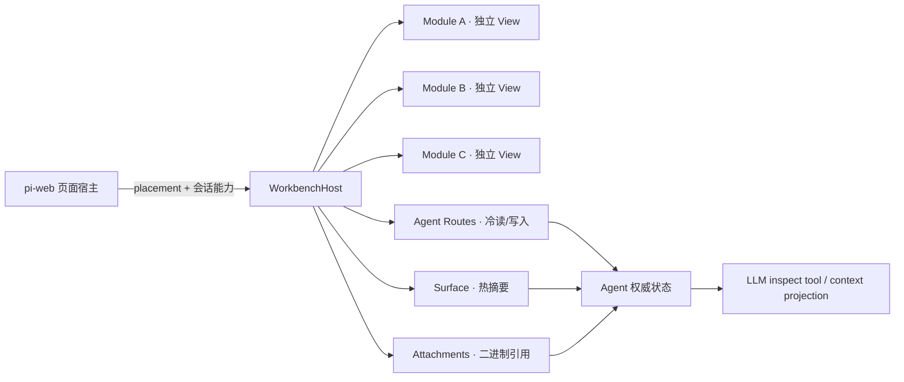
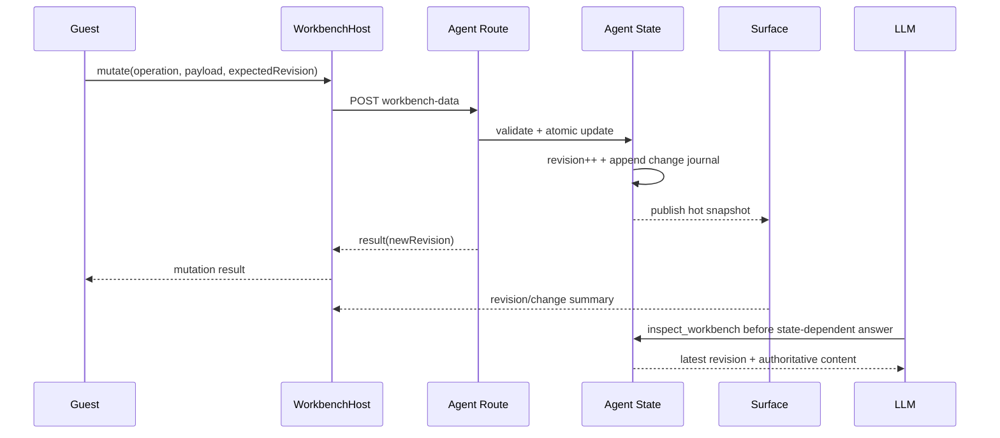

# Workbench 独立模块地基路线图

## 1. 目标

建立一套领域中立的 Workbench 范式，使 Agent 可以声明一组强隔离模块，并由页面宿主把它们放在固定右侧区域。首版只实现右侧 placement，但模块契约不包含“右侧”“面板”等视觉位置词，因此同一模块以后可进入全屏、独立窗口、Electron 或 Tauri WebView。

首个参考实现位于 `examples/workbench-modules-agent`，包含文件管理器、代码编辑器、Diff 查看器和 Canvas 四个模块。

## 2. 术语

| 名称 | 含义 |
|---|---|
| `Workbench` | 一组可切换的工作模块及其编排策略 |
| `WorkbenchModule` | 可独立装载、独立授权、独立销毁的 UI 单元 |
| `WorkbenchHost` | 管理模块实例、Tab、placement 与能力代理的薄宿主 |
| `Guest` | 运行在 iframe / WebView 内的模块应用 |
| `ModulePort` | Guest 与 Host 间的最小消息端口 |
| `Surface` | Agent 权威的热状态摘要与实时通知面 |
| `Agent Route` | 会话内按需读取或修改领域数据的 HTTP 面 |

## 3. 核心约束

1. 每个 Tab 对应一个独立 iframe、Electron `WebContentsView` 或 Tauri WebView；禁止多个模块共享 JS Realm。
2. Workbench 只负责编排，不解释文件、编辑器、Diff、Canvas 等领域数据。
3. Guest 不持有会话凭据、内部对象、Surface 句柄或附件后端；全部能力由 Host 按模块声明代理。
4. Surface 只承载小而热的快照；正文、分页、搜索和写入走 Agent Routes；二进制走附件系统。
5. 每次写入必须产生单调递增 revision 和简短 change journal，使 UI 与 LLM 可从同一权威态收敛。
6. Agent Routes 允许 GET 和 POST；POST 必须校验输入、模块权限与 `expectedRevision`。
7. React HOC/组件只用于作者体验与生命周期约束，不作为安全边界。
8. Browser、Electron、Tauri 使用同一模块契约与一致性测试，只有 transport adapter 不同。
9. 首版不创建通用远程调用框架；浏览器使用标准 `MessageChannel`，桌面使用原生 IPC relay。

## 4. 分层



### pi-web 层

- 提供 WebExt 装载、Surface、Agent Routes、附件、会话和受控 placement。
- 不包含 Workbench 领域模型，不解析模块消息，不维护 Tab 业务状态。
- 首版只需允许 Agent WebExt 把一个 Workbench 根组件放入固定右侧区域。

### Agent 层

- 声明模块清单与能力白名单。
- 持有领域权威状态、Agent Route handlers、Surface 投影和 LLM 可见工具。
- 决定哪些模块可写、可上传、可提交对话。

### Workbench 层

- 创建、切换、隐藏、销毁独立 View。
- 建立一实例一端口的通信通道。
- 把 Guest 请求收窄并代理到 Agent Routes、Surface、附件或 Conversation。
- 不持有领域正文，不在浏览器复制持久化真相。

### Module 层

- 只依赖 `ModulePort`。
- 按需查询、提交 mutation、上传附件、监听 Surface 摘要。
- 自己负责内部 UI、路由、局部草稿和错误展示。

## 5. 最小公开契约

```ts
export interface WorkbenchDefinition {
  readonly id: string;
  readonly initialModuleId: string;
  readonly modules: readonly WorkbenchModule[];
  readonly placement: "right";
}

export interface WorkbenchModule {
  readonly id: string;
  readonly title: string;
  readonly icon?: string;
  readonly document: ModuleDocument;
  readonly capabilities: ModuleCapabilities;
}

export type ModuleDocument =
  | { readonly kind: "html"; readonly src: string }
  | { readonly kind: "inline"; readonly srcDoc: string };

export interface ModuleCapabilities {
  readonly routes?: readonly RouteGrant[];
  readonly surfaceKeys?: readonly string[];
  readonly attachments?: "none" | "read" | "read-write";
  readonly conversation?: "none" | "submit";
}
```

能力默认拒绝。Host 必须从当前模块实例的声明生成有效 grant；Guest 消息中的 moduleId、route、method 或 attachmentId 不能扩大授权。

## 6. 数据面规则

| 数据 | 通道 | 形态 | 示例 |
|---|---|---|---|
| 高频状态 | Surface | 小快照、单调 revision | dirty、文件版本、选中项、进度、变更摘要 |
| 冷数据 | Agent Route GET | 分页/按 id 拉取 | 文件正文、目录、Diff、Canvas 文档 |
| 领域写入 | Agent Route POST | schema + expectedRevision | 保存文件、重命名、提交 Canvas 操作 |
| 二进制 | Attachments | `att_` 引用 | 图片、音视频、导出文件 |
| LLM 可见性 | Agent 工具/上下文投影 | 当前权威态 + change journal | `inspect_workbench` |
| 主动对话 | Conversation | 显式用户动作 | “把当前 Diff 交给 LLM 分析” |

Surface 不承载大正文，Agent Route 不传 base64，附件元数据不复制领域全文，Conversation 不用于静默同步。

## 7. 写入与 LLM 收敛



冲突返回结构化错误和当前 revision。Guest 必须重新拉取并让用户决定覆盖或合并；Host 不做隐式 last-write-wins。

## 8. 交付波次

### F0 · 契约与 fixture

- 固化 `WorkbenchDefinition`、`WorkbenchModule`、grant、消息信封与错误码。
- 建立内存 transport 和恶意输入 fixture。
- 验收：未知消息、越权 route、过大载荷、重复握手、过期 revision 均被拒绝。

### F1 · Browser Host

- 独立 sandbox iframe、一实例一 `MessageChannel`。
- Tab 切换只改变可见性，不共享运行时。
- 验收：四模块同时存活、端口互不可见、重载立即撤销旧端口。

### F2 · pi-web 能力适配

- 接入 WebExt、Surface、Agent Routes、附件和 Conversation。
- 首版固定右侧 placement，宽度由页面宿主受控。
- 验收：无 Workbench 的 Agent 行为零变化；有 Workbench 的 Agent 不需修改 pi-web 领域代码。

### F3 · 数据一致性

- Agent Route GET/POST、revision CAS、change journal、Surface 热投影。
- 提供 LLM 同源查询工具或上下文投影。
- 验收：模块写入后，其他模块和下一轮 LLM 均读取相同 revision。

### F4 · Desktop adapters

- Electron `WebContentsView` 和 Tauri WebView 通过原生 IPC relay 实现 `ModulePort`。
- 验收：同一 Guest fixture 无改动运行，生命周期与授权一致性测试全通过。

### F5 · 业务迁移

- 将 AIGC 页面拆成独立 Workbench modules。
- 媒体正文改为附件引用，热状态改为 Surface，HTTP 改为 Agent Routes。
- 验收：原型的侧栏、Tab、对话框和工作台行为完整恢复，且模块可单独替换。

## 9. 总体验收门

- 一 Tab 一独立 View，任何模块崩溃不影响聊天与兄弟模块。
- 所有能力默认拒绝并按模块白名单授权。
- POST 写入具备 schema、体积、revision 和领域权限校验。
- 大载荷不进入 Surface 或消息信封。
- 模块写入对其他 UI 和 LLM 可观测。
- iframe、Electron、Tauri 通过同一 conformance suite。
- 示例目录、架构图、运行说明和失败语义均可独立指导第三方 Agent 接入。
