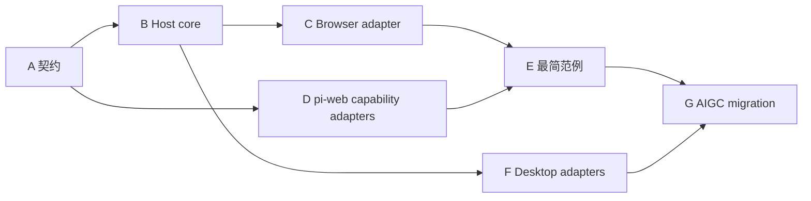

# Workbench 地基与完整实施并行工作规划

## 1. 工作流

| 轨道 | 范围 | 主要产物 | 不得承担 |
|---|---|---|---|
| A 契约 | descriptors、grants、envelopes、errors | `contract.ts`、schema、契约测试 | React、领域状态 |
| B Host core | 实例、epoch、生命周期、授权 | `host-controller.ts` | iframe DOM、Agent 业务 |
| C Browser | sandbox iframe、MessageChannel | `adapters/iframe.ts`、恶意 Guest e2e | 桌面 IPC |
| D pi-web adapter | WebExt、Surface、Routes、附件、Conversation | placement 与 capability adapters | 领域 reducer |
| E Agent example | files/editor/diff/canvas | `examples/workbench-modules-agent` | pi-web 内核改造 |
| F Desktop | Electron/Tauri relay | 两个 native adapters | Guest 业务分叉 |
| G AIGC migration | 原型 UI/UX 与业务模块 | AIGC Workbench modules | 反向污染地基 |

## 2. 依赖图



## 3. 交付波次

### Wave 0：冻结接口

并行：

- A 定义 `WorkbenchModule`、grant、envelope、错误码与版本协商。
- D 明确五个已有能力 adapter 的输入输出。
- E 用范例场景反推最小需求，不添加通用接口。

合并门：schema 测试覆盖所有正反例；核心契约不出现 files/canvas/AIGC 领域词。

### Wave 1：Browser 竖切

并行：

- B 实现实例状态机、epoch、dispose、grant evaluator。
- C 实现 iframe + MessageChannel。
- E 保持 Agent-local Host，完成四模块 UI 与目录组织。

合并门：每 Tab 独立 iframe；隐藏/重载/崩溃不泄漏端口；只读模块写入被拒绝。

### Wave 2：最小数据面

并行：

- D 接入 Surface 热摘要与 Agent Route GET/POST。
- E 实现 revision CAS、change journal、Diff 派生和 LLM inspector。
- C 增加消息大小、速率和超时限制。

合并门：编辑器保存后 Diff、Surface 与 LLM inspector 读取同一 revision；冲突写入不改变状态。

### Wave 3：附件与对话

并行：

- D 接入附件上传和 Conversation 显式提交。
- E 让 Canvas 只保存 `att_` 引用。
- A 补齐 attachment/conversation grants。

合并门：二进制不进入 Surface/Route JSON；未授权模块不能上传或提交对话。

### Wave 4：地基提取

并行：

- A/B/C 将范例中领域无关实现提升到 `packages/workbench-kit`。
- E 改为只消费公开包，行为保持。
- D 增加无 Workbench Agent 的回归测试。

合并门：范例不复制 Host core；包依赖单向；普通聊天与普通 WebExt 零行为变化。

### Wave 5：Desktop 一致性

并行：

- F-Electron 实现 `WebContentsView` relay。
- F-Tauri 实现 WebView relay。
- A 维护 adapter conformance suite。

合并门：同一 Guest fixture 在三类宿主上通过相同生命周期、授权和错误测试。

### Wave 6：AIGC 迁移

并行拆分：

- 素材/文件模块。
- Canvas 编辑模块。
- 生成任务与历史模块。
- Dialog/全屏等模块内 UI。
- Agent Routes、Surface、Attachments 数据迁移。

合并门：原型 UI/UX、侧栏、Tab、对话框和核心工作流完整；所有模块仍满足地基契约。

## 4. PR 切分

| PR | 内容 | 可独立审核证据 |
|---|---|---|
| PR-A | 契约、schema、错误码 | 纯单测，无运行时改动 |
| PR-B | Host core + iframe adapter | conformance + malicious Guest e2e |
| PR-C | pi-web capability adapters | Surface/Routes/Attachments/Conversation 集成测试 |
| PR-D | `workbench-modules-agent` | webext build、route unit、浏览器 e2e |
| PR-E | `workbench-kit` 提取 | 范例零行为 diff、包边界测试 |
| PR-F | Electron/Tauri | native conformance/e2e |
| PR-G* | AIGC 模块按领域拆分 | 每模块视觉与数据闭环 |

## 5. 并行冲突规约

- A 独占契约文件；其他轨道只能通过 fixture 提需求。
- B 不修改 pi-web UI；D 不修改 Host 状态机；E 不创建通用 package API。
- Surface schema 与 Agent Route response schema 由 Agent example/业务域拥有。
- Desktop adapter 只实现 `ModulePort`，不得新增桌面专属 Guest API。
- AIGC 迁移不得先于 Browser 范例与一致性闭环。

## 6. 每波验证

```text
contract tests
→ host/controller tests
→ adapter conformance
→ Agent Route + Surface consistency tests
→ webext isolated build
→ app typecheck
→ browser e2e
→ desktop e2e（相关波次）
```

任何波次不得以“能显示 iframe”代替数据一致性、安全边界和 LLM 可见性验证。
