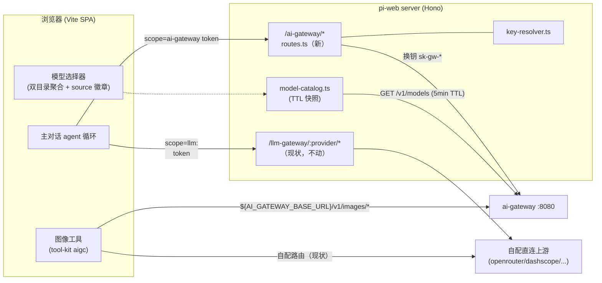
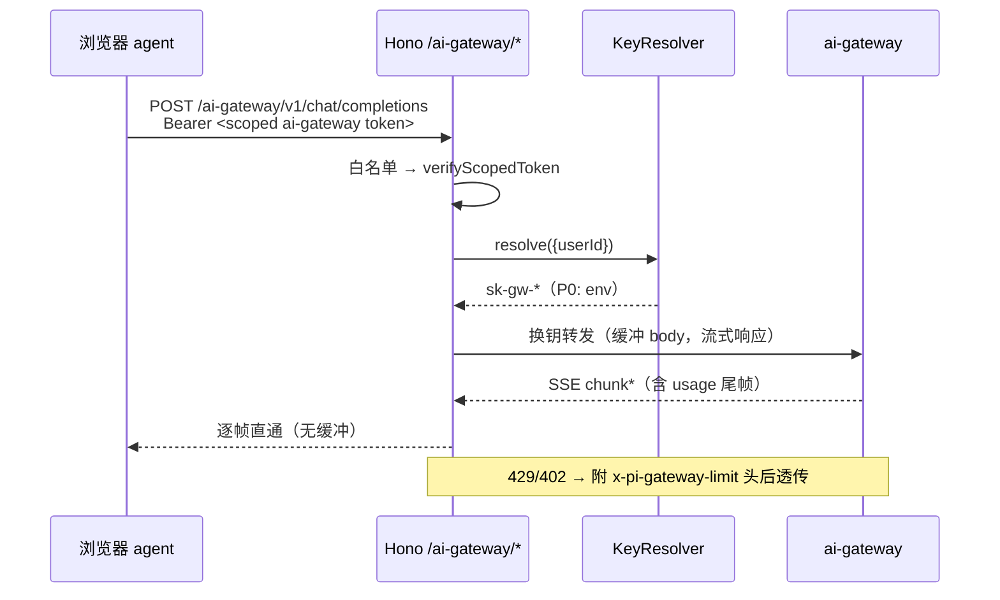

# Design: ai-gateway-providers（ai-gateway 专属 provider 套件）

> 依据：`specs/ai-gateway-providers/requirements.md`（6 Story / 27 EARS）；
> 上位大纲：`~/Projects/BlackSail/agents/ai-gateway/docs/pi-web-integration.md`。
> 本文只讲 pi-web 侧如何落地；网关侧协议/计费/池化能力视为既成事实。

## 1. 总体架构



两条铁律贯穿：**未配置 `AI_GATEWAY_BASE_URL` → 新增部件一个都不注册**（Req 1.2）；
**llm-gateway 与四家 AIGC 工厂零 diff**（Req 1.3）。

## 2. 服务端模块 `packages/server/src/ai-gateway/`

镜像 `llm-gateway/` 的文件组织（同层平行目录），文件与职责：

### 2.1 `config.ts`

```ts
export interface AiGatewayConfig {
  /** 网关 base URL（不含尾斜杠），来自 AI_GATEWAY_BASE_URL。 */
  readonly baseUrl: string;
  /** 请求超时毫秒；默认 120_000（长 SSE 由流式空闲控制，不设整体断）。 */
  readonly timeoutMs?: number;
  /** 模型目录 TTL 毫秒；默认 300_000。 */
  readonly catalogTtlMs: number;
  /** 同名模型优先级；默认 "gateway"。env PI_WEB_AI_GATEWAY_MODEL_PRECEDENCE。 */
  readonly modelPrecedence: "gateway" | "self";
}
/** 装配期解析；未配置 AI_GATEWAY_BASE_URL 返回 undefined（= 套件整体不注册）。
 *  配置存在但非法（URL 解析失败等）→ 抛 AiGatewayConfigError（fail-fast，Req 1.4）。 */
export function resolveAiGatewayConfig(env: NodeJS.ProcessEnv): AiGatewayConfig | undefined;
```

### 2.2 `key-resolver.ts`（Req Story 3）

```ts
export interface KeyResolveInput {
  /** 会话用户（Supabase uuid）；匿名/未启用多租户时为 undefined。 */
  readonly userId?: string;
}
export interface KeyResolver {
  /** 解析该请求应使用的 sk-gw key；undefined = 无凭据（路由层 → 502）。 */
  resolve(input: KeyResolveInput): Promise<string | undefined>;
}
/** P0：请求期即时读 env AI_GATEWAY_API_KEY（不缓存，换 key 即时生效）。 */
export class EnvKeyResolver implements KeyResolver { … }
/** P1 占位：per-user key（构造入参预留 store 接口，本期 resolve 直接抛
 *  NotImplemented——装配处不接线，仅保证接口形状被类型检查覆盖）。 */
export class PerUserKeyResolver implements KeyResolver { … }
```

### 2.3 `routes.ts`（Req Story 2）

产出 `InjectedRoute[]`，与 `createLlmGatewayRoutes` 同构挂载；差异点全部列举：

| 关注点 | 设计 |
|---|---|
| 路径模板 | `/ai-gateway/*`（单段通配，无 `:provider`） |
| 子路径白名单 | 常量表 `ALLOWED_PATHS`：前缀匹配 `/v1/chat/completions`、`/v1/messages`、`/v1/models`、`/v1/images/`、`/dashscope/api/v1/tasks/`；未命中 → 404，零上游请求（Req 2.2） |
| token scope | `verifyScopedToken({ expectedScope: "ai-gateway" })`；401/403 语义与 llm-gateway 相同（Req 2.3） |
| 换钥 | 剔除 `host/authorization/content-length` + 逐跳头；`Authorization: Bearer <KeyResolver.resolve()>`；解析失败 → 502（Req 3.3） |
| 转发 | body `arrayBuffer()` 缓冲（不手动设 content-length——fetch-bridge 血泪教训沿用）；响应 `new Response(upstream.body, …)` 非缓冲流式直通（Req 2.4） |
| abort | `AbortSignal.any([ctx.req.signal, timeout])`（Req 2.6） |
| 限额标注 | 上游 429/402 时读 `X-RateLimit-Scope`/`X-RateLimit-Period`，在响应头附加 `x-pi-gateway-limit: scope=<s>;period=<p>`（状态码与 body 原样透传，Req 2.5）；UI 层据此渲染可读提示 |
| 日志 | `server:ai-gateway` logger，`{sessionId, path, model, status, durationMs}`；model 从请求体浅解析（失败记 "-"），绝不落 key/token（Req 2.7） |

### 2.4 `model-catalog.ts`（Req Story 4）

```ts
export interface GatewayModelEntry {
  readonly model: string;        // /v1/models 的 id
  readonly ownedBy: string;      // owned_by → UI 徽章分组
  readonly source: "ai-gateway";
}
export class GatewayModelCatalog {
  /** 惰性 + TTL：get() 命中过期即后台刷新，返回现有快照（stale-while-revalidate）。
   *  拉取失败沿用上次快照；从未成功 → 空集（fail-soft，Req 4.4）。 */
  get(): readonly GatewayModelEntry[];
  refresh(): Promise<void>;
}
```

聚合点：现有 model-options 下发链路（`packages/server/src/config/model-options-filter.ts`
一带）增加合并步骤——`merge(selfEntries, gatewayEntries, precedence)`，输出条目统一带
`source: "ai-gateway" | "self"`（Req 4.2/4.3）。**纯函数**，单测覆盖三种冲突场景。

路由决策（Req 4.5）：前端发起主对话时按选中条目的 `source` 取 token scope 与路径——
`ai-gateway` → `/ai-gateway/v1/chat/completions`（Claude 系模型 → `/ai-gateway/v1/messages`，
判定规则：`owned_by === "anthropic"`）；`self` → 现状 `/llm-gateway/:provider/*` 不变。

### 2.5 装配（server 入口）

在挂载 `createLlmGatewayRoutes` 的同一装配点（`server/index.ts` 注入 InjectedRoute 处）：

```ts
const aiGwConfig = resolveAiGatewayConfig(process.env);   // undefined = 不启用
if (aiGwConfig) {
  routes.push(...createAiGatewayRoutes({ config: aiGwConfig, keyResolver: new EnvKeyResolver(), … }));
  catalogSources.push(new GatewayModelCatalog(aiGwConfig));
}
```

## 3. tool-kit 侧 `providers/ai-gateway.ts`（Req Story 5）

与 newapi/sufy 同构的 openai-compat 薄封装，**零 quirks**：

```ts
// types.ts：ImageProviderId 联合追加 "ai-gateway"
const AI_GATEWAY_CONFIG: OpenAiCompatConfig = {
  baseUrl: "${AI_GATEWAY_BASE_URL:-http://127.0.0.1:8080}/v1",  // 占位符，模块顶层不读 env（Req 6.2）
  apiKeyVar: "AI_GATEWAY_API_KEY",
  provider: "ai-gateway",
};
export const createAiGatewayImage     = (args, extras?) => createOpenAiCompatImage(AI_GATEWAY_CONFIG, args, extras);
export const createAiGatewayImageEdit = (args, extras?) => createOpenAiCompatImageEdit(AI_GATEWAY_CONFIG, args, extras);
```

路由注册（Req 5.2/5.3）：`tools/image-generation.ts` / `image-edit.ts` 增加
`AI_GATEWAY_IMAGE_ROUTES` 常量组（第一期静态：gpt-image-1 / gpt-image-2 / qwen-image 等
网关已配模型）；**装配期条件注册**在 runtime 层做（`extension.ts` 聚合路由处按
`process.env.AI_GATEWAY_BASE_URL` 存在与否决定并入与否——runtime 层允许读 env，
浏览器 bundle 只见类型，不违双入口边界）。`filterRoutes`/`disabledModels` 无需改动
（对新路由天然生效，Req 5.4）。

失败呈现（Req 5.5）：复用 openai-compat 的 detectError；工具 result 错误文案追加
「可在设置中改选其他 provider 的同类模型」引导；不实现跨套件重试。

## 4. 关键序列（主对话流式）



## 5. 测试策略（Req 6.3/6.4）

| 层 | 用例 |
|---|---|
| routes 单测（vitest） | 门控矩阵：白名单外 404 零上游 / 缺 token 401 / scope 不符 403 / 无凭据 502；换钥后 Authorization 断言；SSE 流式逐帧转发（ReadableStream mock）；429 头标注 |
| config 单测 | env 缺省 → undefined；非法 URL → 抛错含字段名 |
| catalog 单测 | TTL 过期刷新、失败沿用快照、merge 三种冲突（gateway 优先/self 反转/无冲突） |
| 工厂单测 | 产出 route 形态（url/占位符/provider 徽章）；ImageProviderId 类型联合编译期校验 |
| e2e 冒烟 | 本地 `make seed` 网关：一次流式主对话（qwen/doubao 任一）+ 一次图像生成；未配置 env 的对照组断言模型目录与今天一致 |

## 6. 交付边界（明确不做）

- PerUserKeyResolver 只留接口与占位实现（P1 单独 spec）
- AIGC 路由动态化（model-catalog 驱动图像路由）留二期
- BYOK 设置页、用量页（网关 /admin/usage 代理）不在本 spec
- 不改 llm-gateway / 四家 AIGC 工厂的任何行为（回归以对照组 e2e 兜底）
